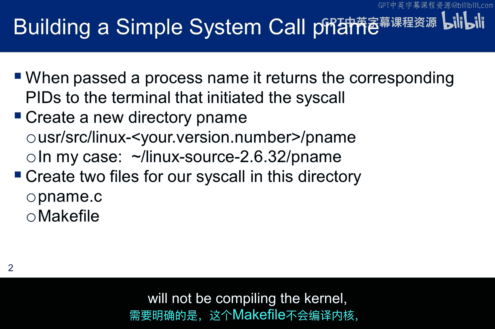
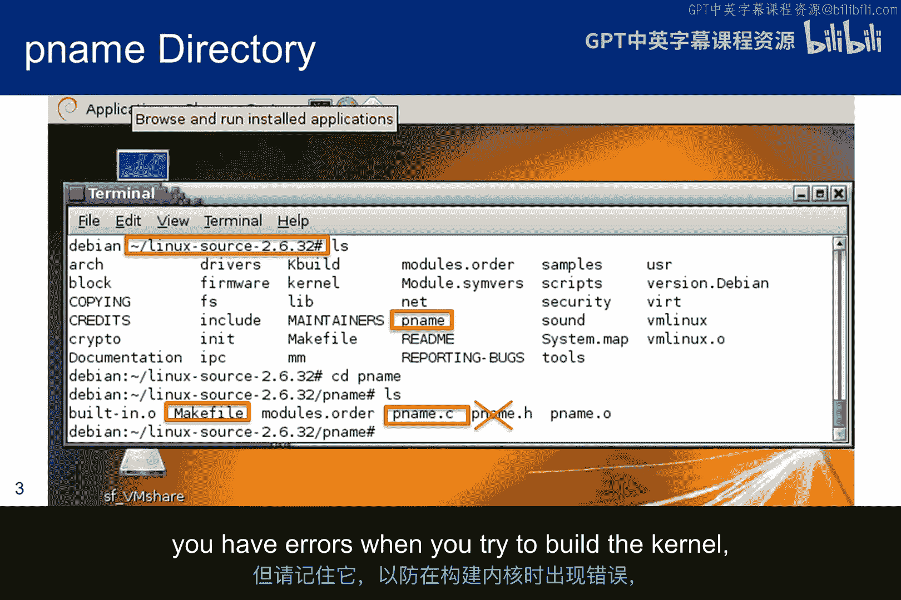
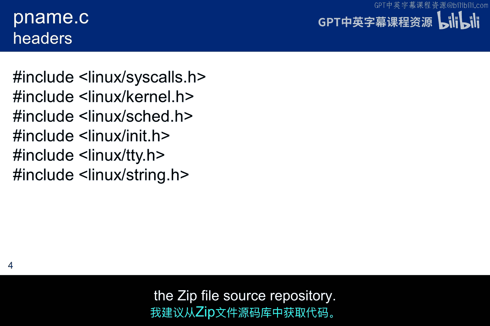
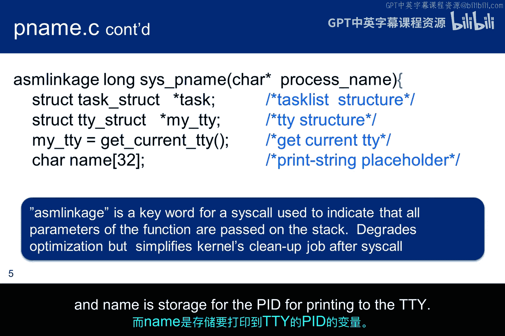
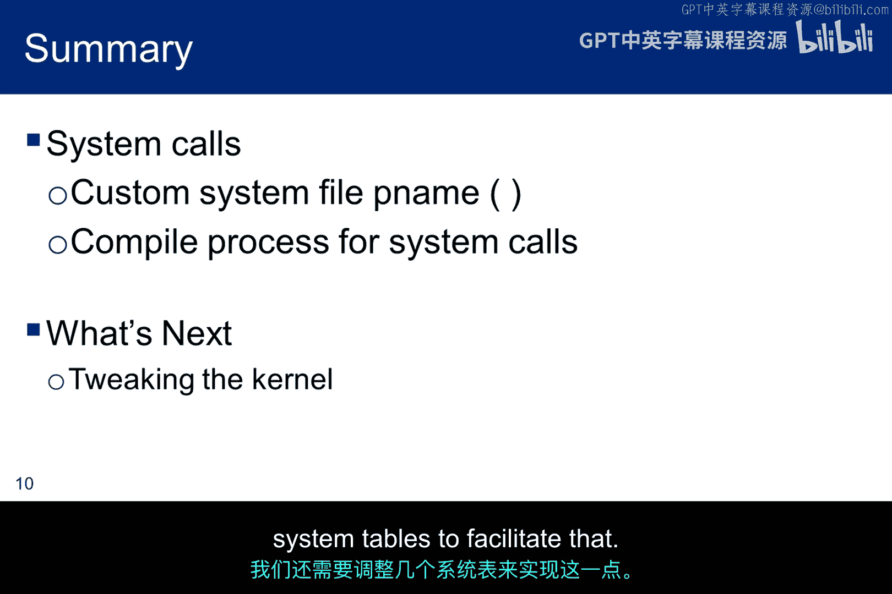

# 056：系统调用机制 🛠️

在本节课中，我们将学习如何向Linux内核添加一个自定义的系统调用，并重新编译内核。我们将创建一个名为 `pname` 的简单系统调用，它能够根据传入的进程名称，在终端上输出对应的进程ID（PID）。

## 概述

我们将分步完成以下任务：首先为自定义程序创建目录和文件，然后编写系统调用的C语言代码，接着配置编译环境，最后修改系统表以使新系统调用生效。整个过程将展示内核模块开发的基本流程。

## 创建程序目录与文件

首先，我们需要在Linux内核源代码树中为我们的程序创建一个新的目录。由于程序名为 `pname`，因此我们创建一个同名的子目录。该目录下将包含两个核心文件：程序源文件 `pname.c` 和用于编译该程序的 `Makefile` 文件。

需要明确的是，此处的 `Makefile` 仅用于编译我们的C程序，而非编译整个内核。

上图展示了 `pname` 的源代码目录，其中包含 `pname.c` 和 `Makefile` 文件。请暂时忽略 `pname.h` 文件，它在原始论文中可能是一个干扰项，在编译 `pname` 时并非必需。但请将其记在心中，以防在构建内核（该过程会运行 `Makefile` 来编译 `pname`）时遇到错误。

以上是 `pname.c` 源文件中需要包含的头文件。请注意，由于PowerPoint或Adobe Reader可能使用特殊格式的字符，直接复制粘贴代码时需格外小心。建议从提供的ZIP文件源代码仓库中直接获取代码。

## 编写系统调用程序

上一节我们创建了程序文件，本节中我们来看看 `pname` 系统调用的具体实现代码。

这是程序的第一部分。`asmlinkage` 是用于系统调用的一个关键字，它定义了参数传递的方式。请注意，系统调用的名称以 `sys_` 开头，这对于跟踪系统调用非常重要。此外，本幻灯片上的开括号并未闭合，它将在下一张幻灯片程序结束时闭合。

如果你对C语言不太熟悉，这里简单解释一下：这些结构体用于管理数据。`task_struct` 包含正在运行的进程信息，`tty_struct` 用于跟踪终端以便输出PID，而 `name` 则用于存储要输出到终端的PID。

这里是将进程名称转换为PID并将结果发送到屏幕的核心部分。系统调用从调用程序接收一个进程名，并将其与正在运行的进程列表进行比较。

因此，系统会查看进程调度器，将正在运行的进程名称与传入的名称进行比对。如果找到匹配项，它就将PID打印到用户的终端。

图中绿色括号内的循环遍历所有正在运行的进程，红色括号内的命令则在找到名称匹配时打印PID。

在 `sprintf` 语句中，`%ld` 格式符用于长整型十进制数，这正是内核任务结构体中存储PID的格式。`sprintf` 在格式语句方面的行为类似于 `printf`，但在此处，它将“PID=”字符串放入由 `name` 指向的字符串缓冲区中，并在字符串结束时自动追加一个空字符。

最后，它使用 `write` 命令将字符串写入屏幕。但由于是内核在进行写入操作，它需要确定用户的TTY，以确保输出到正确的位置。

这只是我虚拟机上的源代码截图。`Makefile` 是一个简单的单行文件。它位于源代码下的一个子目录中，并将由内核构建程序的父级 `Makefile` 调用。

## 内核编译过程

我们已经介绍了自定义系统调用的工作原理，现在从高层视角描述一下重新编译的过程。`kbuild` 系统按以下方式重新编译内核：它遍历所有源代码子目录，首先找到所有的 `.o` 目标文件，然后将每个源文件编译成一个目标文件。一旦全部编译完成，一个加载程序会将各个目标文件合并成一个名为 `built-in.o` 的单一目标文件（注意，这不是一个可加载文件）。最后，`built-in.o` 通过内核的 `Makefile` 被链接到 `vmlinux` 中。

然而，在目前这个阶段，当我们重新编译内核时，`pname` 还不会被构建。我们仍然需要修改几个系统表来促成此事。

## 修改系统表

以下是需要修改的关键系统表文件及其作用：

*   **`arch/x86/entry/syscalls/syscall_64.tbl`**：在此文件中添加新的系统调用号与名称的映射关系。
*   **`include/linux/syscalls.h`**：在此文件中声明新系统调用的函数原型。
*   **相应架构的 `syscall` 入口文件**：确保系统调用表被正确更新以包含新的调用。

## 总结

本节课中，我们一起学习了如何向Linux内核添加一个自定义系统调用。我们从创建目录和编写 `pname.c` 源文件开始，了解了系统调用如何接收参数、遍历进程列表并输出结果。接着，我们探讨了内核的编译流程（`kbuild`），并指出了要使新系统调用生效，必须修改相关的系统表（如系统调用表、头文件声明等）。这个过程是理解内核模块开发和系统调用机制的重要实践。