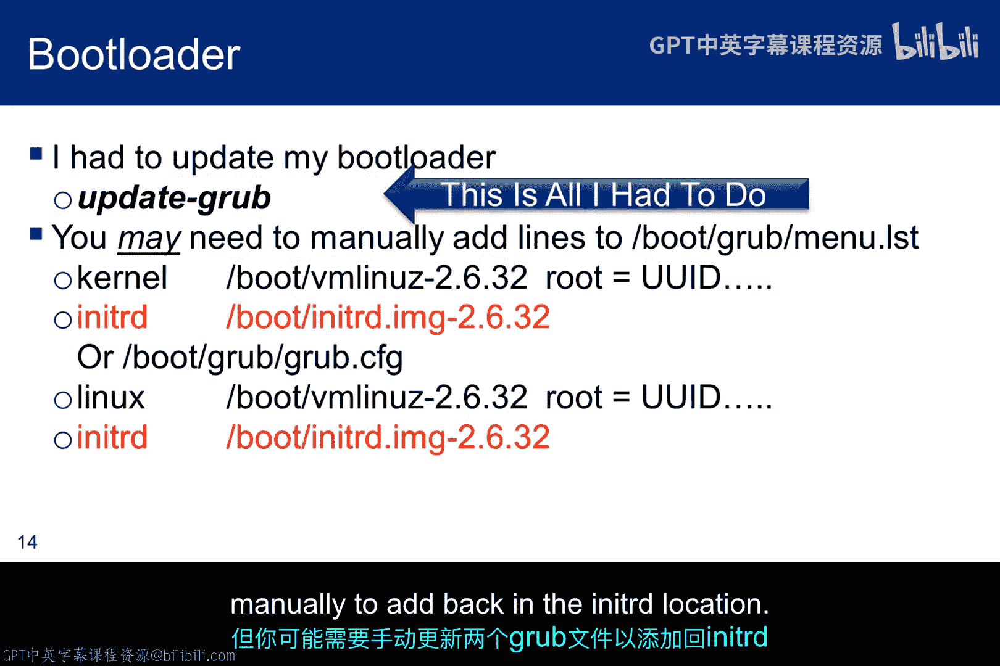
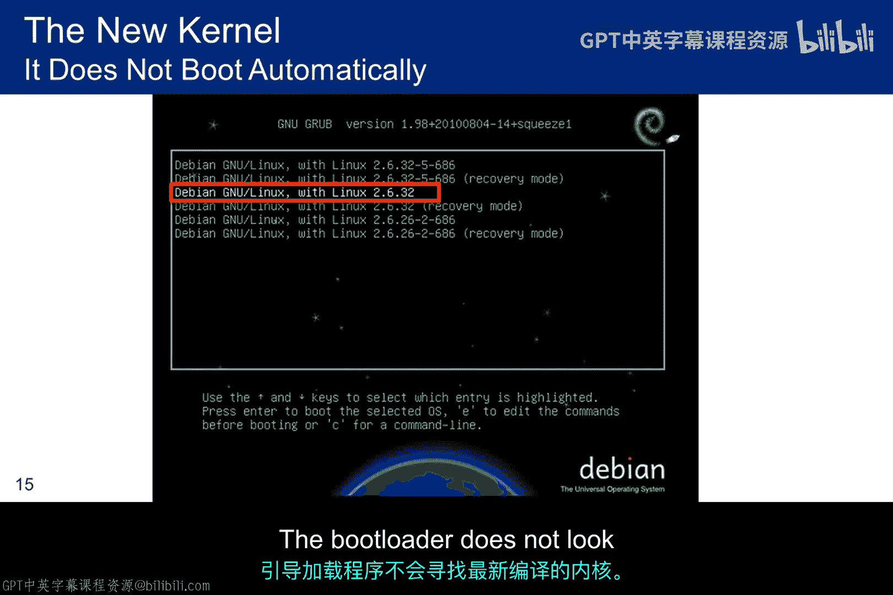
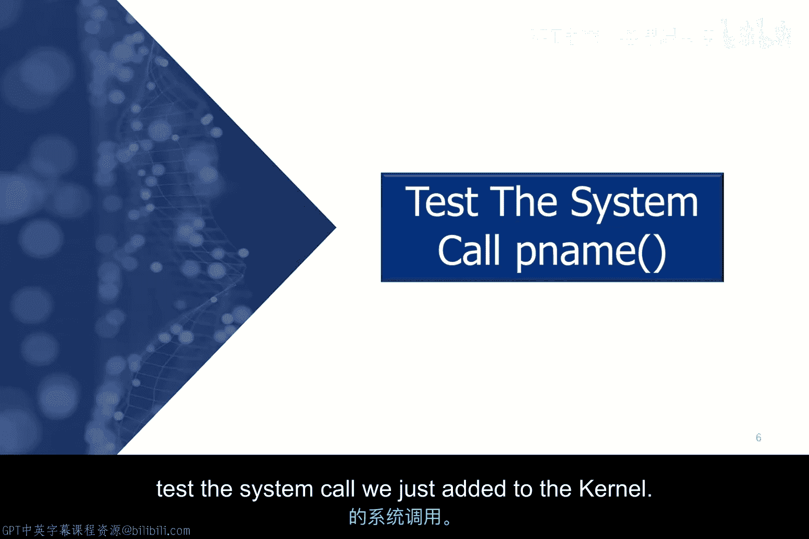
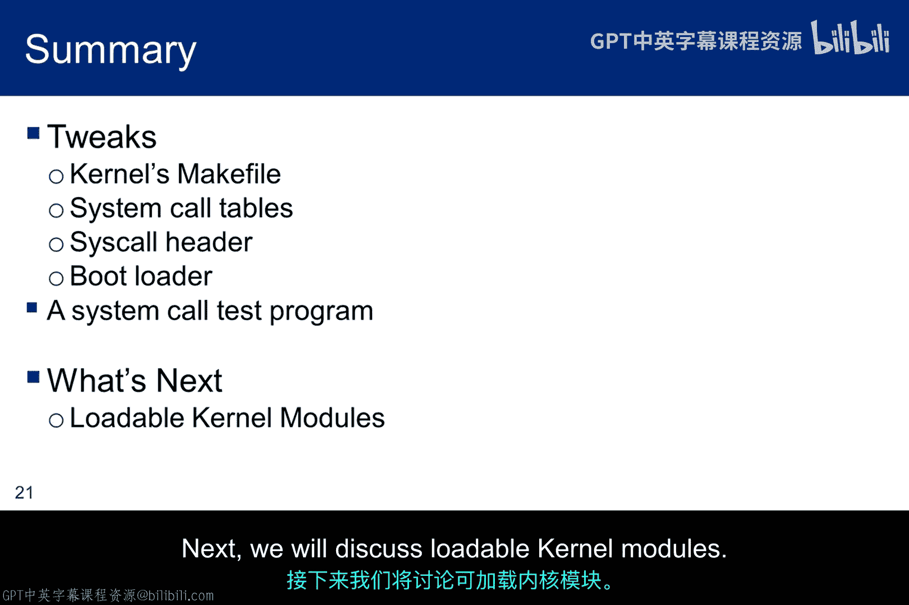

# 057：内核参数调优

在本节课中，我们将学习如何将一个自定义的系统调用集成到Linux内核中。这个过程涉及修改内核源代码、配置编译选项以及解决可能出现的构建问题。

我们已经创建了自定义的系统调用，但要让它与内核一起成功编译，还有许多工作要做。需要将系统调用添加到系统表中，并且内核的Makefile也需要包含这个新程序。这些调整是构建包含新系统调用`P_name`的自定义内核所必需的。

## 修改内核构建文件

上一节我们介绍了创建自定义系统调用的基本概念，本节中我们来看看如何修改内核的构建配置以包含它。

第一步、第三步和第四步相对直接，但第二步会比较复杂，因为你的内核构建版本处理系统调用的方式可能与我的不同，也可能与参考论文中讨论的版本不同。这意味着你需要进行一些批判性思考，分析内核表结构以使调用正常工作。

以下是需要完成的步骤列表：

1.  **修改顶层Makefile**：首先，需要定位位于源代码树顶层的内核Makefile。根据Debian网站的建议，不要使用`/usr/src`目录，因此可以将其放在root用户的主目录下。找到该文件后，编辑它并做出一项修改：添加`P_name/`。你可以搜索`core-y`来快速找到对应行，然后将`P_name/`添加到该行的末尾。这告诉编译器在`P_name`目录中查找子Makefile。
    *   **代码示例**：在`Makefile`中找到类似`core-y += kernel/ mm/ fs/ ipc/ security/ crypto/ block/`的行，并在末尾添加`P_name/`。

2.  **添加系统调用到系统调用表**：接下来，必须将`P_name`添加到系统调用表中，以便它获得一个调用号。这是整个过程中最棘手的部分，因为不同内核版本的结构差异很大。

## 针对不同内核版本的调整

上一节我们概述了修改系统调用表的需求，本节中我们来看看针对两个不同内核版本的具体操作。

*   **对于 Linux 3.16.36**：系统调用表通常位于源代码树顶层的`arch/x86/syscalls/`目录下，文件名为`syscall_64.tbl`。你需要找到表中的最后一个调用号，然后为`P_name`系统调用将其加一。例如，如果最后一个系统调用编号是319，那么新条目将包含三个元素：系统调用号、C程序名以及在汇编链接调用原型中给出的系统名。因此，对于3.16.36构建，条目将是：`320 common p_name sys_p_name`。

*   **对于 Linux 2.6.32（或其他旧版本）**：情况可能更复杂。系统调用表的位置和文件名可能不同（例如，可能是`syscall_table_32.S`）。此外，调用号的定义可能分散在多个文件中。例如，原型名进入系统调用表，但调用号可能定义在一个名为`unistd_32.h`的头文件中。这就需要同时修改两个文件：在系统调用表中添加新条目，并在头文件中递增`NR_syscalls`的值。找到这两个文件之间的关联可能是一个挑战。

**核心概念**：系统调用号是内核用于标识和路由调用的唯一整数，其定义遵循特定模式，例如在头文件中定义为`#define __NR_p_name 320`。

## 添加函数原型并配置内核

在成功将系统调用添加到表格后，我们需要确保编译器知道如何调用它。

第三个任务是将我们的系统调用原型名称添加到`syscalls.h`文件中。幸运的是，对于许多版本，`syscalls.h`的位置是固定的。修改很简单：只需将`P_name`源代码中的函数原型添加到该头文件中。这基本上告诉编译器这个系统调用如何传递参数。

**代码示例**：在`syscalls.h`中添加类似`asmlinkage long sys_p_name(const char __user *process_name);`的原型。

然而，在编译内核之前，我们必须运行`make menuconfig`。这是一个用于配置Linux源代码的工具，是编译源代码的必要步骤，允许用户选择要编译的Linux功能和选项。在我们的案例中，当`make menuconfig`提示时，通常只需接受默认配置即可。

## 编译、安装与测试

配置完成后，我们就可以开始实际的内核编译和测试了。

现在，你可以通过在找到内核Makefile的目录（很可能是顶级源代码目录）中键入`make`来开始内核重新编译。构建过程需要一段时间，因此请留意是否有立即报错，然后可以稍作等待。内核构建完成后，需要使用命令`make install && make modules_install`来安装新版本。安装完成后，重启系统（键入`reboot`）。

根据你的系统加载方式，可能需要更新引导加载程序。例如，运行`update-grub`可能就足够了，但也可能需要手动更新GRUB配置文件以添加`initrd`文件的位置。最后，你很可能需要从引导加载程序菜单中选择新内核，因为系统通常会默认引导上次使用的内核。

现在，我们需要创建一个简单的C程序来测试刚刚添加到内核中的系统调用。

这是一个简单的程序，它提示用户输入一个进程名，读取用户输入，解析字符串并创建令牌。然后通过我们添加到系统调用表中的编号进行系统调用，并将进程名传递给它。系统调用会打印出PID，然后将状态传回给测试程序。

使用GCC编译器编译这个简单程序。然后打开两个终端：在第一个终端中，运行`test_p_name`，并在提示时输入你正在运行的shell的名称（如`bash`）；在第二个终端中，列出正在运行的进程并用`grep`过滤该shell名称。你应该看到`test_p_name`显示的PID与`ps`命令显示的相同。如果不是，说明存在问题，需要重新检查上述所有步骤。

## 总结与下节预告

本节课中我们一起学习了将自定义系统调用集成到Linux内核的完整流程。我们经历了修改Makefile、更新系统调用表（可能涉及多个文件）、添加函数原型、配置内核选项、编译安装内核以及最终编写测试程序进行验证的各个步骤。这个过程可能会因内核版本不同而遇到各种挑战，需要耐心分析和调试。

一旦内核拥有了新的系统调用，我们就能够创建一个简单的程序来调用它。接下来，我们将讨论可加载内核模块。