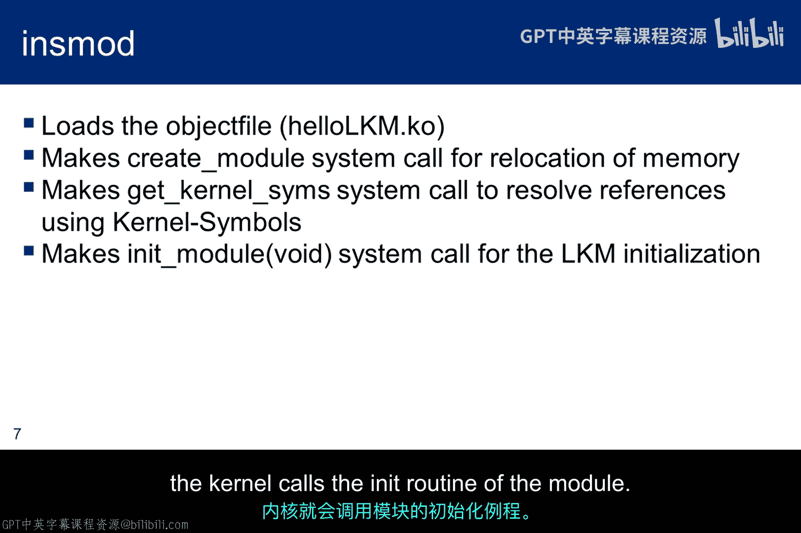
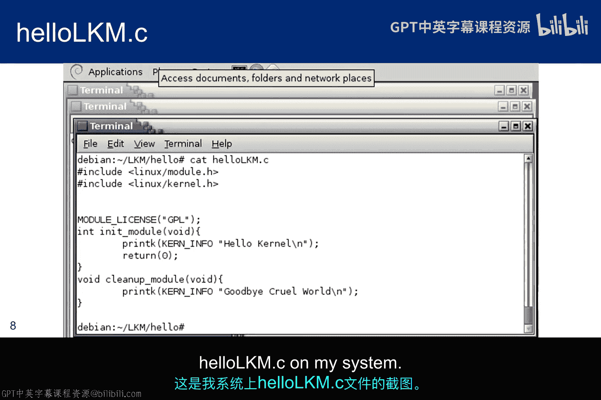
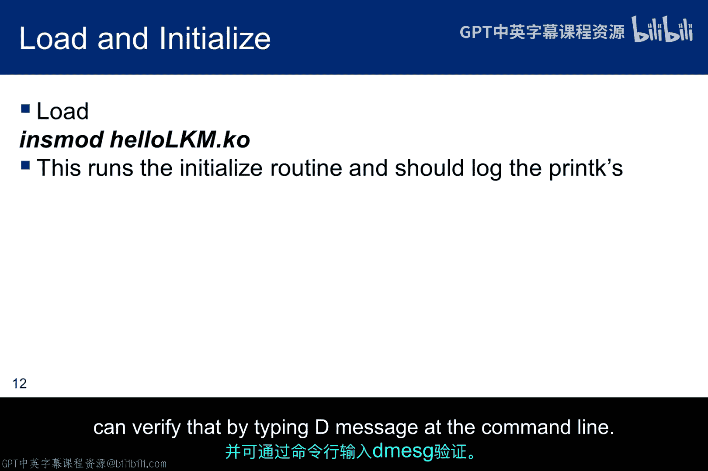
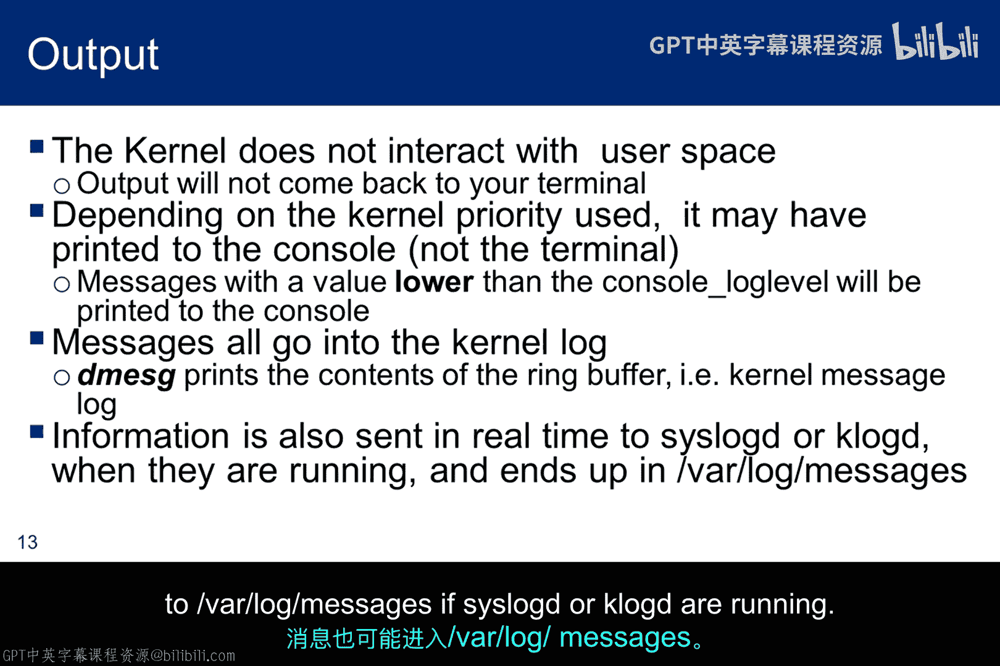
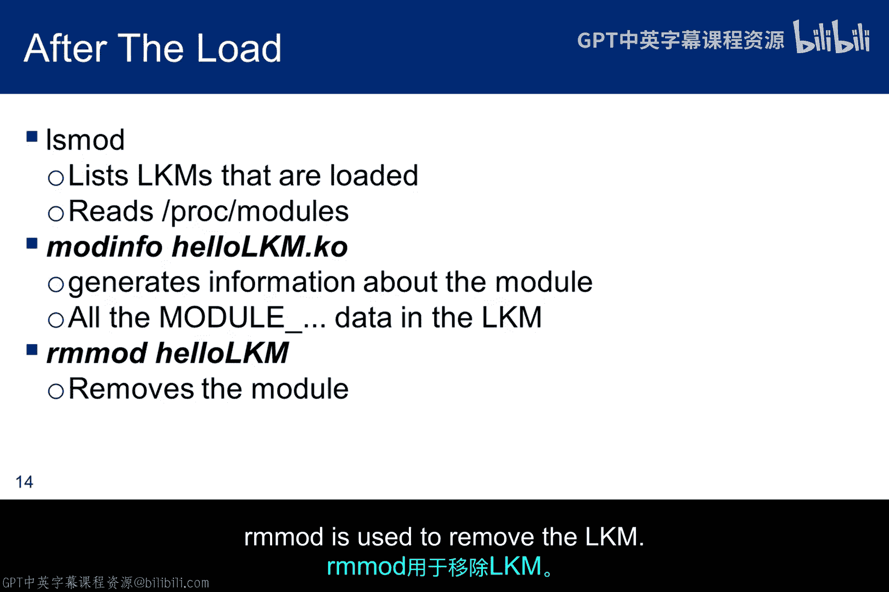
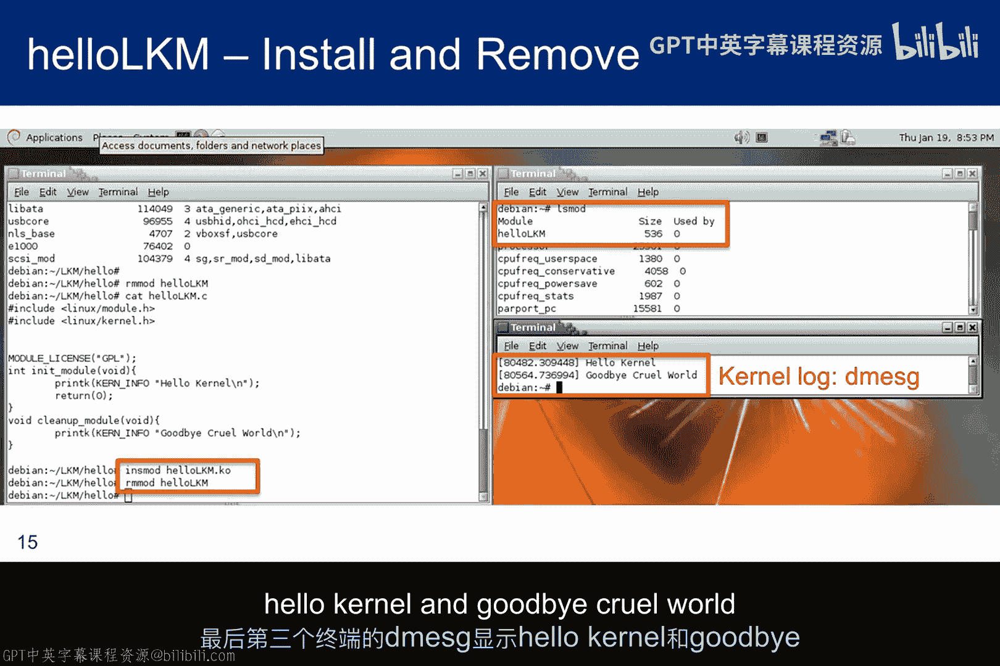
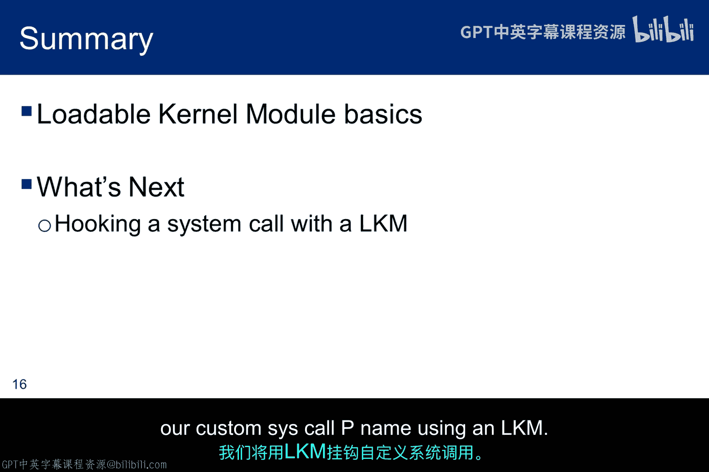

# 058：Linux内核模块(LKM) 🐧

在本节课中，我们将要学习Linux内核模块的基础知识。LKM是扩展Linux内核功能的关键机制，理解其工作原理对于后续学习如何利用它构建工具至关重要。

## 概述

可加载内核模块类似于Windows的动态链接库，它们是包含代码的目标文件，用于扩展正在运行的内核。LKM有时会添加设备驱动程序功能以支持新硬件或文件系统，有时则会添加系统调用。当不再需要时，可以卸载LKM以释放内存。本子模块的关键在于它们能够扩展内核，我们将利用这一点来构建一个rootkit。

## LKM的特性

以下是LKM的一些核心特性列表。

*   **无需重新编译内核**：能够在不重新编译内核的情况下扩展其功能，这在Windows中是不可能的。如果没有这种能力，灵活性将非常有限，并且很大程度上受限于微软提供的内容。Linux是开源的，问题不大，但与仅仅编写一个LKM相比，重新编译内核的风险加倍。
*   **潜在风险**：当然，如果处理不当，LKM本身也存在风险。例如，在开发过程中，一个指针错误就可能擦除整个文件系统。
*   **运行在内核空间**：最重要的特性是LKM运行在内核空间。因此，它们拥有用户程序所没有的访问权限。如果恶意攻击者拥有root权限，就有可能加载一个LKM并在内核空间中运行代码。

## 一个简单的LKM示例：Hello LKM

上一节我们介绍了LKM的基本概念，本节中我们来看看一个具体的LKM示例。

我将讨论一个名为 `hello_lkm.c` 的可加载内核模块。任何LKM都必须包含几个强制组件才能成为可加载模块。

*   **包含头文件**：首先，必须包含模块头文件，以便在编译时解析所有内容。在我们的示例中，还需要内核头文件，但这仅仅是因为我们需要内核 `printk` 函数宏扩展的支持。
*   **许可证声明**：`MODULE_LICENSE` 行也是必需的，以避免模块加载时“污染”内核。这并非关键问题，但当内核被“污染”时，意味着带有该LKM的内核配置不受社区支持，你将无法获得内核开发者的任何支持。
*   **初始化和退出函数**：LKM还需要一个初始化部分和一个退出部分。`init_module` 函数要么向内核注册一个处理程序，要么用自定义代码替换一个内核函数，然后在许多情况下，通过调用原始内核函数来完成初始化。最后，`cleanup_module` 函数应该撤销 `init_module` 所做的任何更改，以便安全地卸载模块。
*   **执行时机提醒**：需要提醒的是，你并不直接“运行”一个LKM。组成这些函数的代码在模块加载和卸载时执行。

这是一个非常简单的LKM。它包含了刚才提到的所有强制部分。初始化函数只是一个打印语句，由于它在初始化时没有做任何其他事情，因此退出函数也无需清理任何内容，所以我们只添加另一个打印语句。

不过有两点需要注意：
1.  打印语句是 `printk`，它仅对内核可用。它接受一个像 `printf` 一样的格式字符串，指定如何将各种数据类型参数渲染成字符串，然后将该字符串打印到内核日志中。
2.  要注意的是 `KERN_INFO`，它是一个用于指定发送到日志的消息类型的关键字。在这里，它只是表示一些信息。共有8个日志级别，我稍后会讨论。目前只需知道，我们只是将信息打印到日志中。如果我们不在 `printk` 语句中指定内核级别，它将默认为内核警告。注意语法：内核级别和我们要打印的内容之间**没有**标点符号。

如果我们加载这个LKM，可以通过在命令行输入 `dmesg` 在内核日志中看到“Hello kernel”。

## 编译LKM

一旦准备好编译内核模块，Makefile看起来会是这样的。然而，这不是一个传统的Makefile，因为可加载模块更像内核本身，而不太像用户程序。这意味着内核构建系统处理了部分模块的构建过程。

以下是Makefile的关键部分解析：

```makefile
obj-m := hello_lkm.o
```
第一行声明要从目标文件 `hello_lkm.o` 构建一个模块。虽然在Makefile中没有明确标识，但构建完成后生成的模块将被命名为 `hello_lkm.ko`。

```makefile
KDIR := /lib/modules/$(shell uname -r)/build
all:
    $(MAKE) -C $(KDIR) M=$(PWD) modules
```
当编译开始时，`-C` 选项将目录切换到内核源码树，因为构建系统需要找到内核的顶层Makefile。然后，`M=` 选项使Makefile在尝试构建模块目标之前，移回模块源代码目录。这个目标反过来引用 `obj-m` 变量中找到的模块，即 `hello_lkm.o`。

如果你以前没见过或者不常使用它，可能会觉得相当困惑。但如果你有兴趣并想了解更多细节，内核源码树中 `Documentation/kbuild` 目录下的文件应该会有所帮助。

## 加载和卸载LKM

以下是加载和卸载LKM的命令，请注意我们加载的是 `.ko` 内核对象文件，而不是 `.o` 目标文件。





*   **`insmod`**：`insmod` 被认为是一个相当简单的程序，它不处理依赖关系，也不打印太多有用的错误信息，但它确实能将内核模块从用户空间加载到内核地址空间。
*   **`modprobe`**：`modprobe` 被认为是更好的工具，但对于我们的目的来说，`insmod` 已经足够好。`insmod` 尝试通过从内核的导出符号表中解析所有符号，将模块链接到运行中的内核。如果内核没有足够的连续物理内存来容纳模块中的所有内容，它还会重新定位内存。一旦相关部分加载到内存中，内核就会调用模块的 `init` 例程。

## 自定义函数名与日志级别

上一节我们使用了标准的函数名，但实际上你并不局限于使用 `init_module` 和 `cleanup_module` 这样的名称作为初始化和清理函数。你可以随意命名它们，只需要提供模块定义来标识哪个函数用于初始化，哪个用于清理。最后两行代码做的就是这件事。

这只是对 `printk` 的一个简短介绍，`printk` 是打印到内核日志的内核实用程序。日志级别在 `linux/kernel.h` 中定义，而哪些日志级别会被打印则由位于 `/proc/sys/kernel/printk` 的文件 `sysctl` 配置。

关于日志级别需要注意的是，有些级别除了记录到日志外，还会打印到控制台，而有些则只记录到日志。将日志级别提高到 `KERN_ALERT` 可以确保它写入控制台。如果你不指定优先级级别，则使用默认的消息日志级别，它只写入内核日志。

以下是日志级别列表及其预期用途。正如我刚才提到的，你必须将日志级别设置为 `KERN_ALERT` 以确保它显示在控制台上，通知用户。否则，根据你的TTY设置，它可能只会进入日志。



## 实践：加载、查看与卸载

当 `hello_lkm` 被加载和初始化时，几乎不会发生什么。控制台上不会显示任何内容。LKM基本上被加载到内核内存中，等待系统调用。但在加载时，初始化例程确实会运行。因此，`printk` 应该会写入内核日志。这意味着一旦它加载，即使没有其他事情发生，我们也应该在日志中看到“Hello world”，并且可以通过在命令行输入 `dmesg` 来验证。

如前所述，`printk` 不与用户空间交互。所以终端上不会显示任何内容。如果你将 `printk` 语句更改为以内核级别1（`KERN_ALERT`）发送警报，它将被打印到控制台，但不会打印到终端。实际上，值低于控制台日志级别的消息将被打印到控制台。你可以通过输入 `cat /proc/sys/kernel/printk` 来确定当前的控制台日志级别，将返回四个整数。第一个整数显示你当前的控制台日志级别，而第二个显示默认日志级别。要更改当前控制台日志级别，你只需在root级别的命令行中 `echo 8 > /proc/sys/kernel/printk`，这样每个内核消息都会出现在控制台上。另一种更改控制台日志级别的方法是使用带 `-n` 参数的 `dmesg` 命令。

消息会进入内核日志，你可以用 `dmesg` 查看它们，但如果 `syslogd` 或 `klogd` 正在运行，它们也可能进入 `/var/log/messages`。



一旦LKM被加载，就可以使用 `lsmod` 命令查看它以及任何其他已加载的LKM。另外两个有趣的命令是 `modinfo`，它从LKM中的模块关键字生成信息（例如，作者、描述、许可证、版本和信息都可以通过模块关键字提供），以及 `rmmod`，用于移除LKM。

这张截图显示了四件事。首先，我运行了 `insmod` 命令，然后在另一个终端中运行了 `lsmod` 命令，显示 `hello_lkm` 已与其它几个LKM一起加载。接下来，我运行 `rmmod` 来卸载 `hello_lkm`。最后，在第三个终端中的 `dmesg` 命令显示，“Hello kernel”和“Goodbye cruel world”都已被记录到内核日志中。



## 总结

本节课中我们一起学习了Linux内核模块的基础。LKM是扩展内核功能的强大工具，运行在内核空间，拥有高权限。我们了解了LKM的基本结构、编译方法、加载卸载命令以及内核日志系统 `printk` 的使用。这是一个简单的“Hello World”示例，为后续更复杂的应用打下了基础。





在下一个子模块中，我们将使用LKM来挂钩一个系统调用，将其指向我们自定义的 `sys_call` 函数。