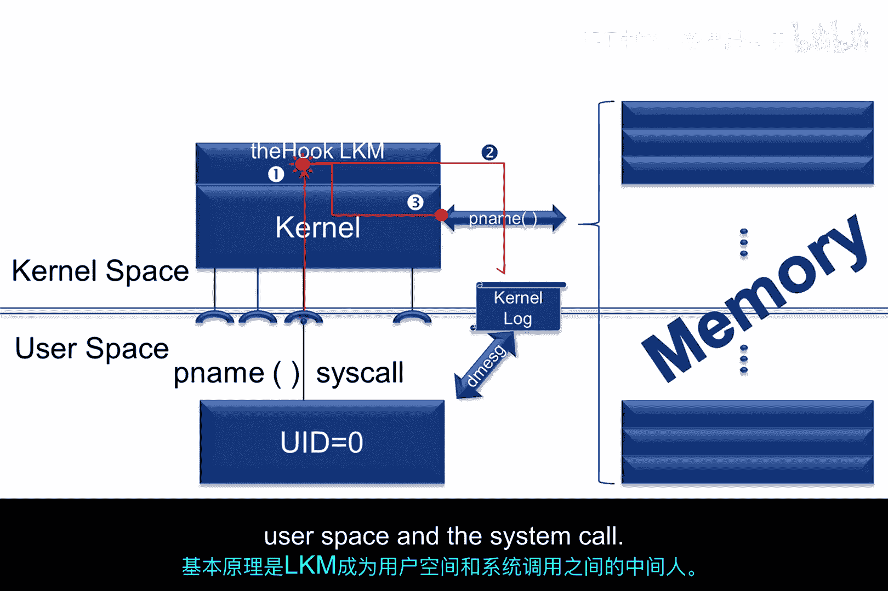
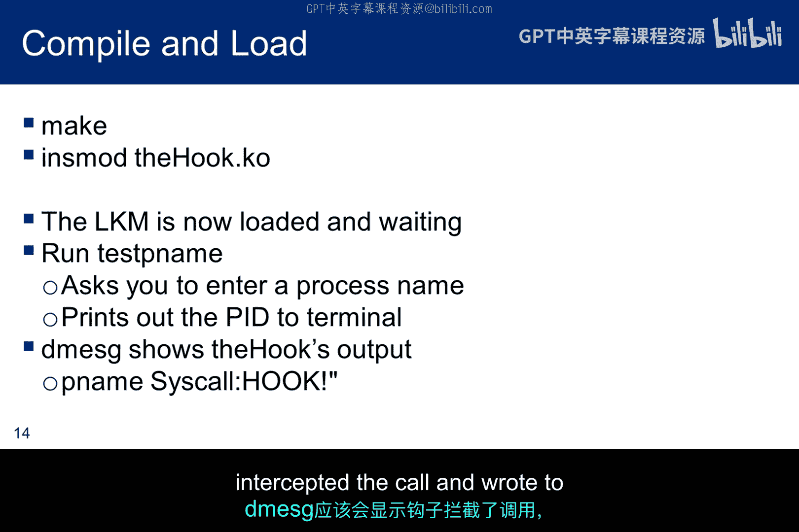
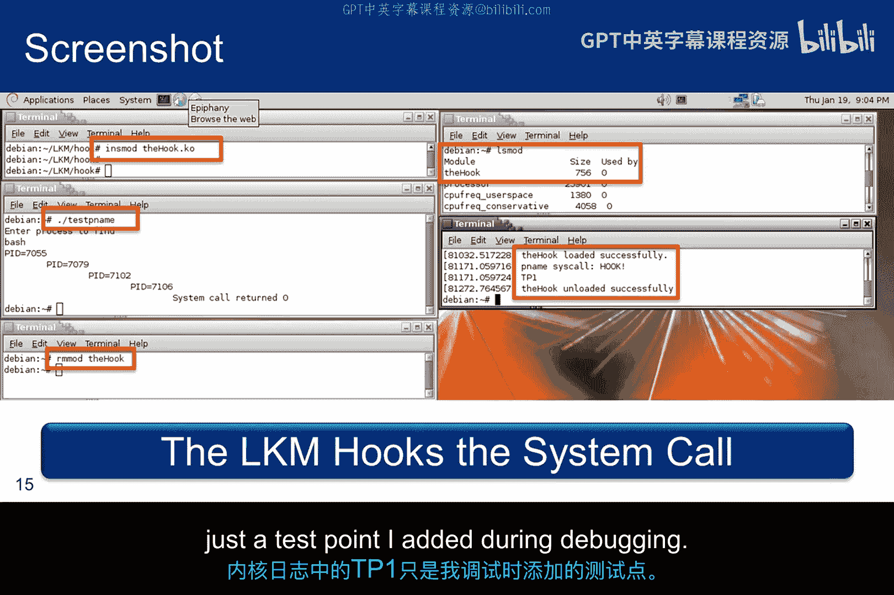
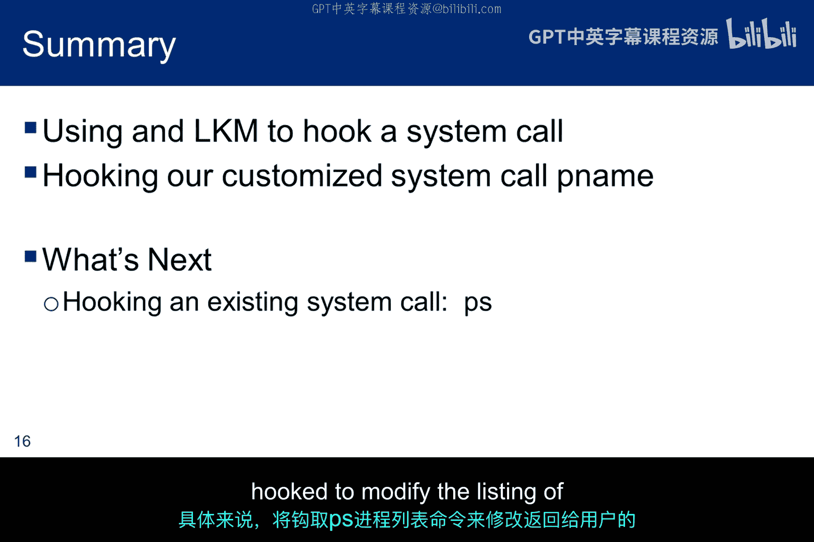

# 059：利用LKM实现钩子技术

在本节课中，我们将学习如何构建一个Linux内核模块（LKM），用于钩住一个自定义的系统调用 `pname`。我们的最终目标是掌握这种方法，以便能够钩住内核提供的任何系统调用。

## 概述与原理

上一节我们介绍了如何创建自定义系统调用。本节中，我们来看看如何通过LKM来拦截和修改系统调用的行为。

你之前见过这张图，但我添加了两个部分。首先，我展示了 `pname`，这是我们拥有的、可以访问所有内核空间和整个机器内存的内核系统调用。其次，我添加了内核日志，所有内核消息都将写入其中，用户可以使用 `dmesg` 命令读取。请注意，我们可以像调用内核公开的任何其他系统调用一样，从用户空间调用 `pname`。

扩展这张图，我添加了我们想在这个子模块中构建的恶意LKM。它将在内核空间中运行，并钩住所有从用户空间对 `pname` 的调用。同样，它将在内核空间中运行。因此，我们需要root权限来安装这个LKM。



它的工作原理如下。首先，LKM被加载，它只是在那里等待对 `pname` 的调用。当从用户空间调用 `pname` 时，LKM会拦截该调用并执行一些恶意活动。在我们的例子中，它只是简单地写入内核日志以演示钩子功能。然后，LKM按照用户空间最初的请求，调用原始的 `pname` 系统调用。因此，基本概念是LKM成为用户空间和系统调用之间的中间人。


## 构建钩子LKM

那么，我们如何创建一个可以拦截系统调用的LKM呢？以下是关键步骤。

第一步是在LKM中保存 `pname` 的原始地址，以便在钩子执行完毕后，我们可以调用原始的 `pname` 并将预期的响应返回给用户。我们使用一个变量 `custom_sys_call` 来保存我们创建的系统调用的名称。然后，我们修改系统调用表，使其指向我们LKM内部的钩子函数，而不是原始的系统调用。这意味着当用户调用 `pname` 时，调用将被重定向到钩子函数。当钩子函数完成其恶意活动后，它知道从哪里获取原始系统调用的地址，因为它存储在 `custom_sys_call` 中。一旦调用序列被修改，LKM就等待用户调用 `pname`。

首先，我们需要获取系统调用表的地址，以便LKM可以修改对 `pname` 的调用。为了简单起见，我们将把这个地址硬编码到LKM中。但通过一些增强，LKM可以被修改为动态确定地址。在我的32位Debian系统中，这个地址是十六进制的 `0x126A280`。你的地址会不同。

## LKM代码解析

以下是 `hook.c` LKM代码的第一部分，它将拦截我们的系统调用 `pname`。

```c
#include <linux/module.h>
#include <linux/kernel.h>
#include <linux/syscalls.h>
#include <linux/kallsyms.h>
#include <linux/version.h>
```

这是LKM的第二部分。它包含了模块信息。有一个注释标识了硬编码的系统调用表地址，但目前该变量仅声明为一个未初始化的指针。我们还为钩子执行完毕后想要调用的、用户请求的系统调用标识了原型。

```c
MODULE_LICENSE("GPL");
MODULE_AUTHOR("Ethical Hacker");
MODULE_DESCRIPTION("A simple syscall hooking LKM");
MODULE_VERSION("0.1");

static unsigned long *sys_call_table; // 系统调用表地址
static asmlinkage long (*custom_sys_call)(const char __user *proc_name); // 原始系统调用函数指针
```

第三段代码是对恶意软件函数的调用。出于我们的目的，它只是打印到内核日志，以便我们可以验证对 `pname` 的调用被钩住了，但该程序本可以执行任何它想要的代码。钩子执行后，LKM进行原始调用。因此用户对钩子一无所知。

```c
asmlinkage long hook_pname(const char __user *proc_name) {
    printk(KERN_INFO "Hook: pname called for process: %s\n", proc_name);
    // 执行恶意活动后，调用原始系统调用
    return custom_sys_call(proc_name);
}
```

LKM的这一部分有点棘手，因为我们要修改内核系统调用表的权限。你需要了解页表条目结构的细节才能弄清楚如何操作。好吧，你们中不太可能有人是系统程序员。根据代码，很容易看出函数 `make_rw` 接收系统调用表的地址，并将权限更改为读写。

```c
static void make_rw(void *addr) {
    unsigned int level;
    pte_t *pte = lookup_address((u64)addr, &level);
    if (pte->pte & ~_PAGE_RW) {
        pte->pte |= _PAGE_RW;
    }
}

static void make_ro(void *addr) {
    unsigned int level;
    pte_t *pte = lookup_address((u64)addr, &level);
    pte->pte &= ~_PAGE_RW;
}
```

这段代码只是反转了上一张幻灯片上的代码，并在我们完成后将系统调用表返回到写保护状态。

## LKM的初始化与卸载

初始化代码在LKM初始化时打印到日志，然后设置硬编码的系统调用表地址以匹配我们从系统映射中确定的十六进制值。接下来，我们将 `pname` 的调用表信息保存在 `custom_sys_call` 中。最后，我们禁用页面保护，并替换系统调用表中 `pname` 的条目，允许我们执行此LKM中定义的钩子原型。我们实际上是用LKM中定义的恶意系统调用替换了构建内核时定义的自定义系统调用。一旦我们做出这个更改，LKM就等待 `pname` 调用进来。当调用发生时，由于调用表的更改，调用被拦截，用户空间运行 `pname` 的请求被转移到钩子恶意软件部分的末尾。钩子函数做的第一件事是向内核日志打印一条消息，这告诉我们钩子函数运行了。钩子函数打印到内核日志后，它调用 `pname`，从而将系统调用的请求输出返回给用户。

这是退出代码。因此，它在LKM被卸载时运行。首先，它向内核日志打印一条通知，表明它已被卸载。然后，它将系统调用表恢复到其原始的写保护状态。

```c
static int __init hook_init(void) {
    printk(KERN_INFO "Hook LKM loaded\n");
    sys_call_table = (unsigned long *)0x126A280; // 你的系统调用表地址
    custom_sys_call = (void *)sys_call_table[__NR_pname]; // 保存原始调用

    make_rw(sys_call_table);
    sys_call_table[__NR_pname] = (unsigned long)hook_pname; // 替换为钩子
    make_ro(sys_call_table);

    return 0;
}

static void __exit hook_exit(void) {
    printk(KERN_INFO "Hook LKM unloaded\n");
    make_rw(sys_call_table);
    sys_call_table[__NR_pname] = (unsigned long)custom_sys_call; // 恢复原始调用
    make_ro(sys_call_table);
}

module_init(hook_init);
module_exit(hook_exit);
```

代码可能看起来很复杂，但你不必理解每一个细节。另一方面，优秀的道德黑客必须能够卷起袖子，在必要时深入挖掘以理解细节。如果有必要，值得将代码复习几遍，因为你找不到比这更简单的内核钩子代码示例了。

## 编译与测试

这是钩子的Makefile。它与Hello LKM的Makefile完全相同，所以我就不再赘述了。

```makefile
obj-m += hook.o
all:
    make -C /lib/modules/$(shell uname -r)/build M=$(PWD) modules
clean:
    make -C /lib/modules/$(shell uname -r)/build M=$(PWD) clean
```

下一步是测试它是否有效。首先，使用前面的Makefile编译LKM，并将LKM加载到内核中。`dmesg` 会告诉你它是否加载成功。现在，钩子LKM已加载并等待对 `pname` 的调用。让我们进行一个调用，运行 `test_pname` 并输入一个进程名，你应该在终端中取回PID。但在加载之后，`dmesg` 应该显示钩子在调用 `pname` 之前拦截了调用并写入了内核日志。




这是一个成功的LKM钩子的截图。它没有显示编译步骤，但显示了在左上角终端中加载LKM。右上角的终端显示内核识别到内存中的LKM。左边的第二个终端显示了 `test_pname` 的执行以及预期结果打印到屏幕。左下角显示LKM被卸载，右下角是查看内核日志，确认LKM已加载、钩住了系统调用 `pname` 并成功卸载。内核日志中的 `TP1` 只是我在调试期间添加的一个测试点。



## 扩展到标准系统调用

关于如何构建LKM来钩住系统调用的讨论到此结束。在本例中，我们修改了添加到内核中的自定义系统调用。现在，我们希望使用相同的技术来钩住一个标准系统调用。具体来说，我们将钩住进程列表调用 `ps`，以修改返回给用户的运行进程列表。




## 总结


本节课中，我们一起学习了如何利用Linux内核模块（LKM）实现系统调用钩子技术。我们从钩住自定义系统调用 `pname` 开始，理解了其作为中间人（MITM）的基本原理。我们详细分析了钩子LKM的代码结构，包括如何定位系统调用表、保存原始调用地址、修改调用表条目以及执行恶意代码后恢复原始调用。最后，我们探讨了将这种技术应用于标准系统调用（如 `ps`）的可能性。掌握这项技术是理解更高级内核级攻击和防御的基础。