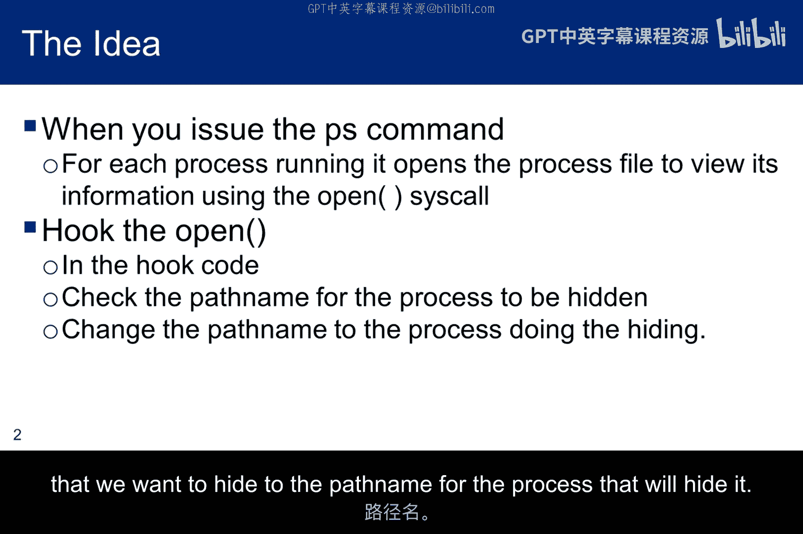
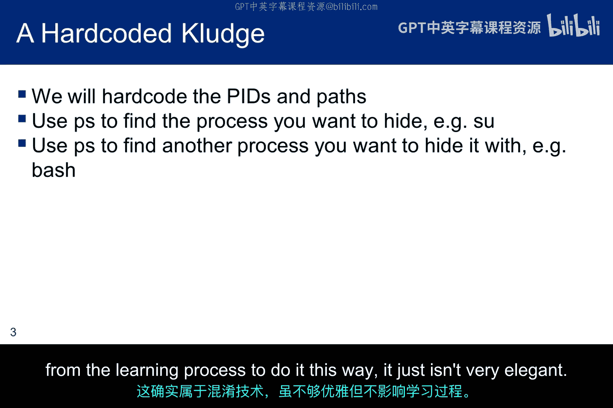
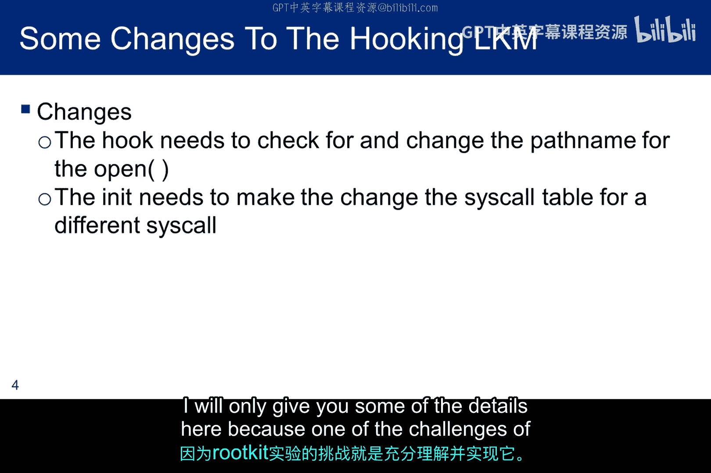
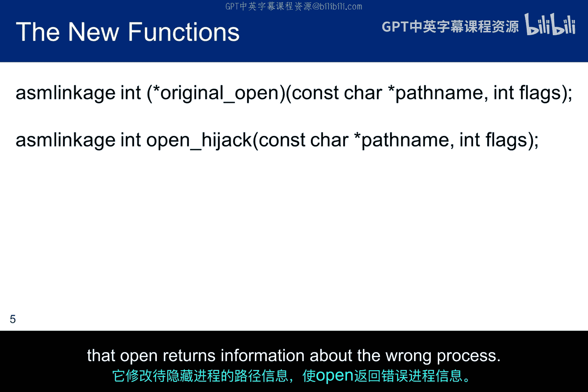
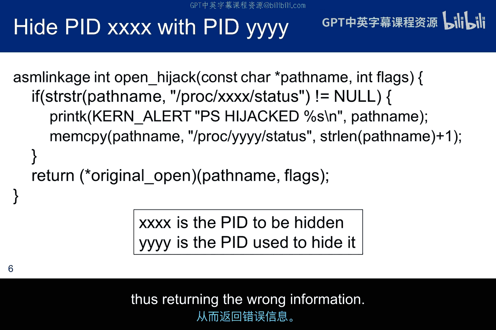
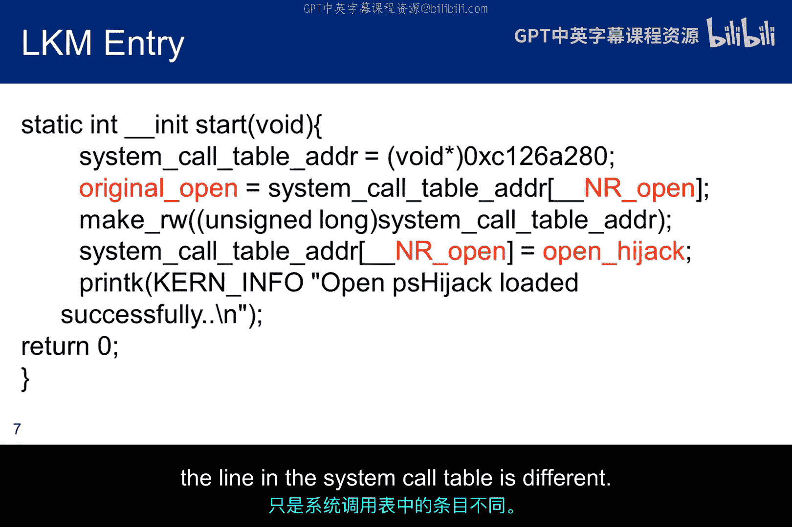
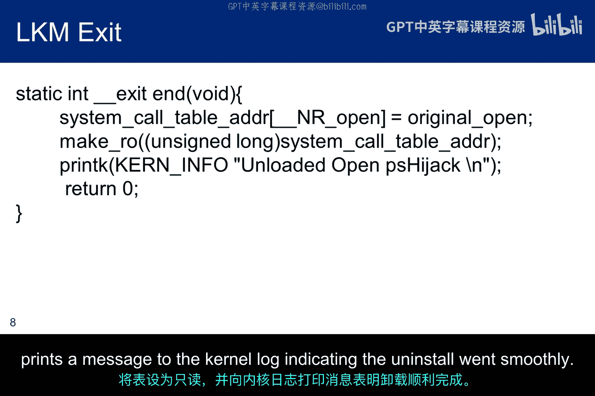
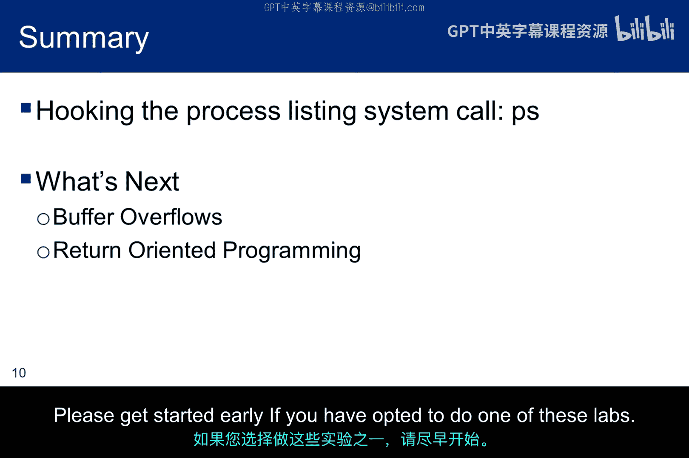

# 060：真实Rootkit案例研究 🔍

在本节课中，我们将学习如何修改之前子模块中的钩子程序，以拦截用户对进程列表的请求，并返回一个经过轻微修改的列表，从而使目标进程（例如 `su`）看起来像是另一个普通的 `bash` 进程。为了简化，我们将把相关的进程ID硬编码到LKM中，但通过一些系统级编程，也可以实现动态确定。

## 概述



上一节我们介绍了系统调用钩子的基本概念。本节中，我们将看看如何应用这一技术来隐藏特定进程。核心思路是：使用一个钩子LKM来拦截对 `open` 系统调用的请求。当 `ps` 命令需要打开内核维护的进程文件以获取运行进程信息时，我们的LKM会将被隐藏进程的路径名替换为用于隐藏它的进程的路径名，从而返回错误的信息。

## 修改钩子程序



以下是使钩子程序实现进程隐藏功能所需进行的修改。这项任务的复杂程度取决于你对前一个子模块的理解。如果之前的内容不够清晰，建议你返回复习。如果不理解钩子的原理，将很难理解我们为这个新LKM所做的修改。

首先，我们需要修改 `open` 命令用于收集进程信息的路径名。其次，需要修改LKM的初始化和退出例程，以更改系统调用表中不同的系统调用（`open` 而非 `pname`）。因此，这个LKM与我们之前讨论的并没有本质上的不同。

## 核心函数定义

以下是LKM中定义的新内核级函数原型。



```c
asmlinkage int (*original_open)(const char __user *filename, int flags, umode_t mode);
asmlinkage int hijack_open(const char __user *filename, int flags, umode_t mode);
```

*   **`original_open`**：保存原始 `open` 调用的信息。钩子组件在执行完进程隐藏例程后，需要返回到这个调用。
*   **`hijack_open`**：这是我们的钩子函数。它会向内核日志打印信息以验证钩子生效，并执行恶意操作：找到并替换要隐藏进程的路径名。



`hijack_open` 函数基本上取代了之前简单的钩子。它仍然会打印内核日志以供验证，但核心功能是：在传递给 `open` 的路径名中，找到要隐藏的进程路径，并将其替换为我们想用来隐藏它的进程（例如 `bash`）的路径。这样，`open` 返回的将是错误进程的信息。

## LKM初始化与退出例程



这是LKM的初始化例程，重要的修改已用红色高亮标出。

```c
static int __init lkm_init(void) {
    // 1. 保存原始open系统调用的地址
    original_open = (void *)sys_call_table[__NR_open];
    // 2. 将系统调用表中的open项重定向到我们的hijack_open函数
    sys_call_table[__NR_open] = (unsigned long *)hijack_open;
    printk(KERN_INFO "LKM: open syscall hijacked.\n");
    return 0;
}
```



第一个关键修改是保存原始 `open` 例程的调用地址，以便后续使用。第二个修改是将系统调用表中的 `open` 系统调用重定向到LKM中定义的 `hijack_open` 函数。其技术与重定向 `pname` 时完全相同，只是系统调用表中的行不同。



退出例程则负责恢复原始的系统调用。

```c
static void __exit lkm_exit(void) {
    // 恢复原始的open系统调用
    sys_call_table[__NR_open] = (unsigned long *)original_open;
    printk(KERN_INFO "LKM: open syscall restored. Module unloaded.\n");
}
```

它恢复原始的 `open` 系统调用，并将系统调用表恢复为只读（如果之前修改了权限），同时向内核日志打印一条消息，指示卸载过程顺利。

## 运行结果与总结

许多实现细节留给了读者，但核心原理已阐明。成功劫持进程列表信息的结果如下图所示：在加载恶意LKM之前，`ps` 命令会显示 `bash` 和 `su` 的进程ID。在LKM中，我们将这些PID硬编码以隐藏 `su` 进程。修改路径名后，传递给 `open` 命令的是 `bash` 的PID而非 `su` 的PID，因此返回给用户的是错误信息。

加载恶意LKM后再次运行 `ps`，`su` 进程消失了，取而代之的是另一个 `bash` 进程。由于我们的字符串操作不够巧妙，同一个PID被列出了两次，这会引起用户怀疑，但我们可以通过调整来呈现不同的PID。对我们而言，重要的不是PID的具体值，而是我们能够通过LKM钩住 `open` 系统调用来修改返回给用户的 `ps` 结果。

本节课中，我们一起学习并开发了一个能够修改运行进程列表的Rootkit。虽然呈现给用户的结果可以进一步优化，但关于通过钩住系统调用来进行修改的基本思想应该已经清晰。LKM和动态链接库（DLL）可以表现出恶意行为，而我们甚至可能无法察觉它们的存在。



接下来，我将讨论缓冲区溢出和面向返回的编程（ROP），这实际上是两到三节课的内容压缩而成，因此涉及的时间和复杂度可能比往常更高。如果你选择进行相关实验，请尽早开始。