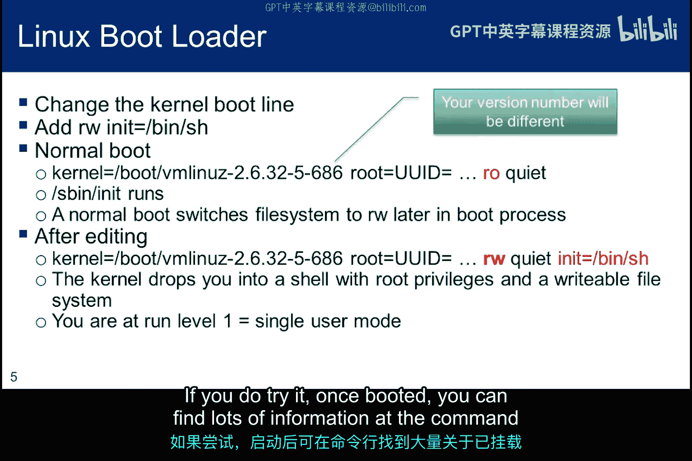
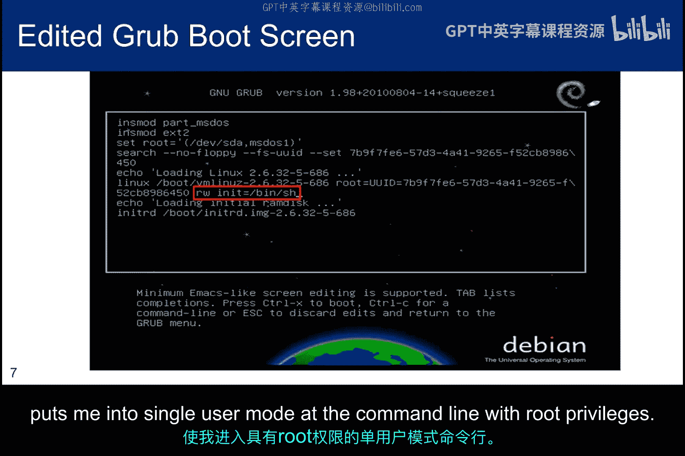
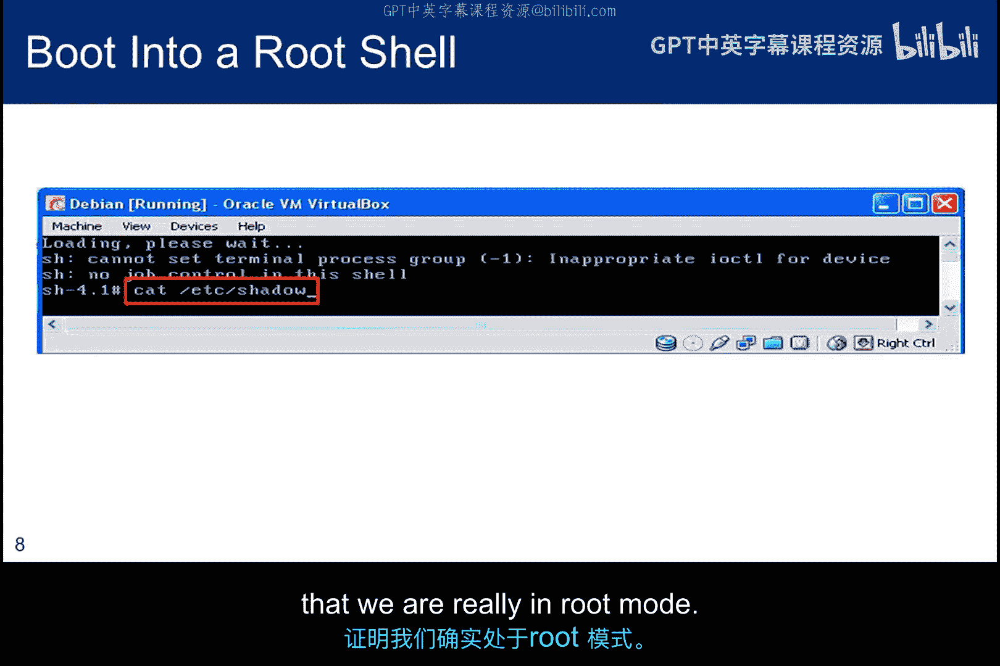
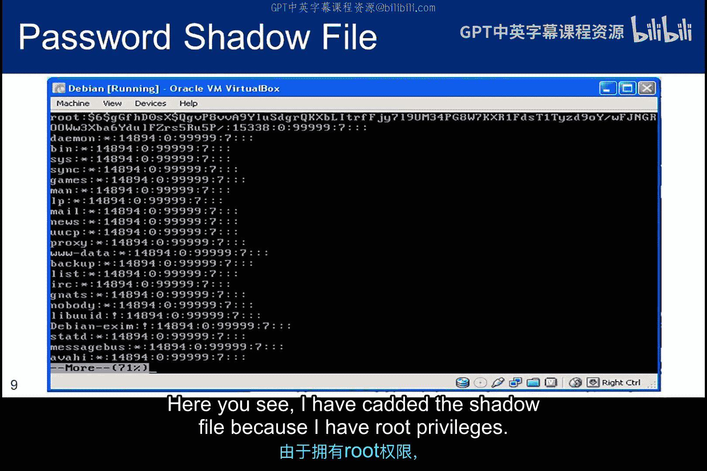
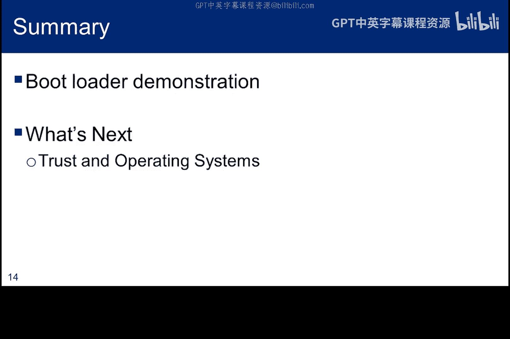

# 061：操作系统安全概述与引导程序漏洞

在本节课中，我们将要学习操作系统安全的基础知识。本模块将首先从高层次介绍一些著名的操作系统漏洞，然后通过动手实践来探索与`setuid`相关的问题。后续模块将重点讨论缓冲区溢出、缓解措施以及漏洞利用的扩展，并探讨一些当前的安全方法。

## 引导程序漏洞演示

上一节我们介绍了课程概述，本节中我们来看看一个具体的操作系统安全概念：引导程序漏洞。这个演示并非利用一个传统意义上的“漏洞”，而是利用了所有操作系统以某种形式内置的功能。如果你能物理接触到计算机，这个功能就可能被利用。

对于Linux系统，当计算机启动时，它会运行一个名为`init`的程序，通常位于`/bin`或`/sbin`目录下。这个程序负责系统启动并创建可用的计算环境。然而，我们可以改变这一点，指定一个不同于`init`的程序来启动。例如，指定`init=/bin/bash`会告诉内核运行`bash`而不是`init`。同时，如果我们将文件系统的权限从只读（`ro`）改为读写（`rw`），我们就是在强制内核以读写模式而非只读模式启动文件系统。传统上，内核以只读模式启动磁盘，稍后一个进程会在切换到读写模式前检查磁盘的完整性。

当你用`/bin/bash`初始化时，通常由`init`启动的服务不会运行，因为shell不会启动任何这些操作系统服务。在某些情况下，基于`/etc/fstab`条目的正常文件系统挂载会被绕过，`/etc/inittab`中列出的任何选项（包括系统的默认运行级别、要启动的进程以及系统进入新运行级别时要采取的操作）也不会被处理。如果`inittab`未被处理，单用户模式可能就不安全。

运行级别决定了进入该级别时运行哪些程序。以下是Linux系统中的六个运行级别：
*   **0**：停机
*   **1**：单用户模式
*   **2**：多用户模式（无网络服务）
*   **3**：完全多用户模式（有网络服务）
*   **4**：用户自定义
*   **5**：图形界面模式
*   **6**：重启

级别0、1、2和6是相当标准的，但级别3、4和5可能因系统而异。标识哪些程序将运行的文件位于`/etc`目录下。对于每个运行级别，都有一个名为`rcX.d`的文件，其中`X`是运行级别。因此，要查看正常启动到运行级别2时执行哪些程序，可以查看`/etc/rc2.d`。

这张幻灯片展示了使用未受保护的GRUB引导加载程序获取root shell的步骤。如前所述，由于`/bin/init`没有运行，你将处于运行级别1，并非所有服务都已启动。在某些情况下，可能只挂载了根文件系统，这意味着你可能需要根据目标挂载文件系统的其他部分。例如，你可能需要挂载`/proc`。如果你没有更改权限并以只读方式挂载文件系统，你还需要通过键入`mount -o remount,rw /`使根目录可编辑。

如果你尝试先执行`umount`，再执行`mount -rw /`，你会在第一个命令下把自己踢出去。如果你在互联网上阅读关于此功能的信息，你会发现许多参考资料提到文件系统是以`ro`（只读）模式挂载的。但正如你在下一屏将看到的，在某些Linux版本中这是可编辑的。如果你在任何虚拟机中安装了GRUB或LILO，你应该尝试一下。一旦启动，你可以在命令行找到大量关于已挂载文件系统的信息。

这是GRUB通常呈现启动行的方式。注意你的文件系统以只读（`ro`）模式启动，并且打印到标准输出的信息很少，由`quiet`命令表示。如果不使用`quiet`，将打印更多信息。编辑启动脚本的说明在屏幕底部。在我的实例中，按`E`键进入编辑模式，我可以编辑脚本。在这个屏幕中，我已将`ro`改为`rw`，删除了`quiet`，并添加了`init=/bin/sh`作为初始化程序。你也可以将`init`设置为`/bin/bash`。但我已将`bash`符号链接到`sh`，所以效果是一样的。按`Ctrl+X`继续启动过程，并将我置于具有root权限的命令行单用户模式中。

此图像显示了一个读取`shadow`文件的请求，以证明我们确实处于root模式。

在这里你可以看到，我已经用`cat`命令查看了`shadow`文件，因为我拥有root权限。

通常，`/bin/init`根据需要执行脚本，并且随着运行级别的变化，这些脚本会设置所有非操作系统服务以创建用户环境。我们强制运行`/bin/sh`而不是`init`，这使我们处于运行级别1，但`rw`条目将文件系统挂载为可读写。现在，我们只需键入`passwd`就可以将root密码更改为我们喜欢的任何内容。当我们重启并以root身份登录时，我们就拥有了正常的root访问权限。对于我的Debian实例，`/proc`也已挂载。但如果你的实例中没有挂载，你可能需要自己用`mount /proc`命令挂载它。

## 理解 `/proc` 目录

什么是`/proc`目录，为什么它很重要？`/proc`非常特殊，因为它也是一个虚拟文件系统。它有时被称为进程信息伪文件系统，根目录在`/proc`。它不包含真实的文件，而是包含内核的系统运行时信息，可以说是内核的控制和信息中心。许多系统实用程序只是对此目录中文件的调用。因为`proc`文件系统仅作为内存中内核数据结构的反映而存在，它显示`/proc`内的大多数文件和目录大小为0字节。

以下是确定已挂载文件系统的选项总结，但它们的行为略有不同，提供的信息也不同：
*   `/etc/fstab`：由`init`读取并由系统管理员维护。由于在我们的引导加载程序示例中`init`没有运行，此文件的内容不太有用。但是，如果系统正常启动，它提供了系统启动时应已挂载的所有文件系统的列表。
*   `/etc/mtab`：显示实际挂载了哪些文件，并由`mount`和`umount`命令更新。
*   `/proc/mounts`：也列出了所有已挂载的文件系统，但它由内核控制，应该是真正的权威来源。你应该期望`mtab`和`mounts`一致，但它们很容易与`fstab`不同。

## 单用户模式的重要性与风险

这里有一个例子说明为什么单用户模式会很有帮助。我当时正在将`/bin/sh`的符号链接从`bash`切换到`zsh`（我们将在后续关于`setuid`的子模块中讨论）。但当我这样做时，我把自己弄糟了，我本想删除符号链接`sh`，却误删了`su`。我很幸运，我的磁盘主目录中有一个`su`的副本。但我没有更改所有权或将其移动到`/bin`的权限。单用户模式给了我root权限，从而解决了问题。因此，没有密码的引导加载程序可以提供一个攻击向量，前提是你能物理接触到机器。

每个操作系统都有类似于单用户模式的东西，但行为和配置略有不同。
*   在**macOS**上，单用户模式允许你更改密码，还让你可以访问磁盘修复工具和用于离线破解的密码哈希。这意味着你不必采取任何可能提醒管理员的行动，比如在macOS中更改root密码。这个单用户模式功能可以用密码保护。
*   你已经看到了如何可能滥用Linux单用户模式的例子，但你可以通过设置引导加载程序密码来防范。一旦设置了密码，如果不输入密码，就无法编辑任何GRUB条目或从GRUB命令行向内核传递参数。
*   对于我正在运行的**Debian Sarge**，引导加载程序密码解决方案使用MD5加密来保证机密性，并需要编辑`/boot/grub/menu.lst`文件。希望更新版本的Debian使用更强的哈希函数。
*   在**Windows**中，使用恢复控制台的管理员对所有卷（引导卷除外）具有只读访问权限。即使在引导卷上，他也只能对根目录和Windows系统目录进行写访问。GRUB配置位于`/boot/grub/menu.lst`中，并且已经包含了如何设置密码的文档。

## 总结

本节课中我们一起学习了操作系统安全的一个重要方面：单用户模式的安全。这个子模块展示了保护对单用户模式访问的重要性，因为它包含了root级别的权限。该功能很重要，因为它为多用户环境提供了一种维护模式，其中一些管理任务需要访问共享资源。由于网络服务不运行，此模式消除了任何可能的远程网络访问，至少暂时提供了一些增强的安全性。然而，通过物理访问，你可以使用此机制来恢复或更改root密码。有时我们需要单用户功能，但与此同时，它也引入了安全漏洞。在下一个子模块中，我们将讨论操作系统中的信任问题。