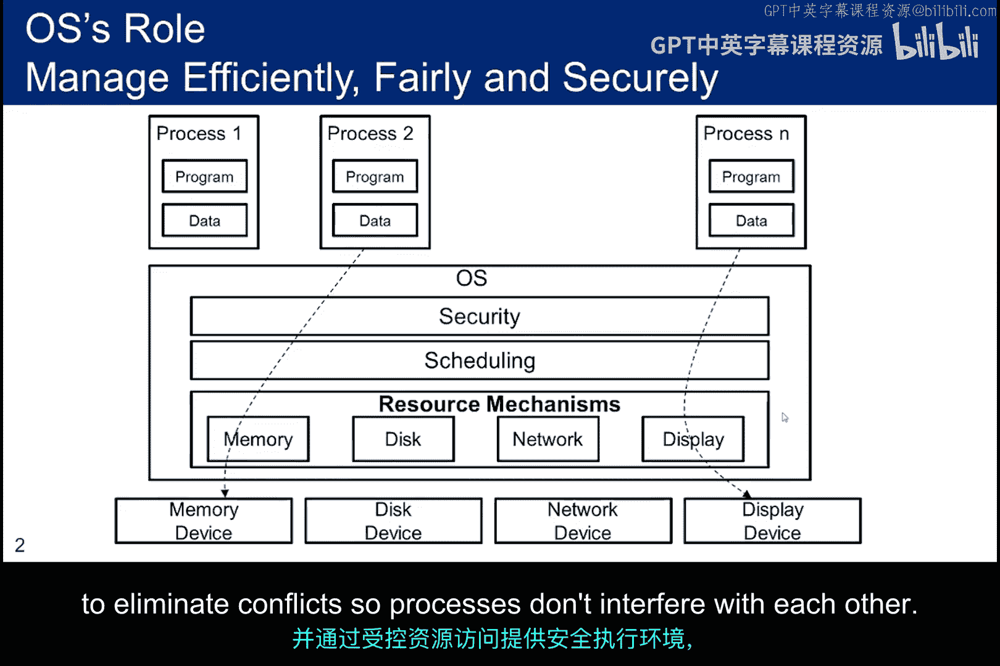
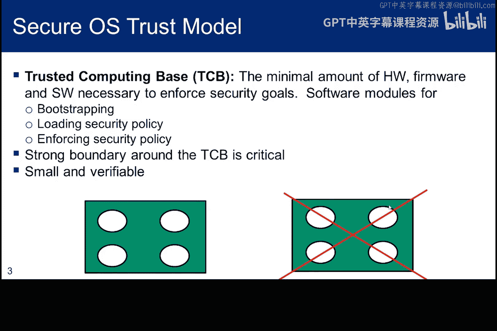
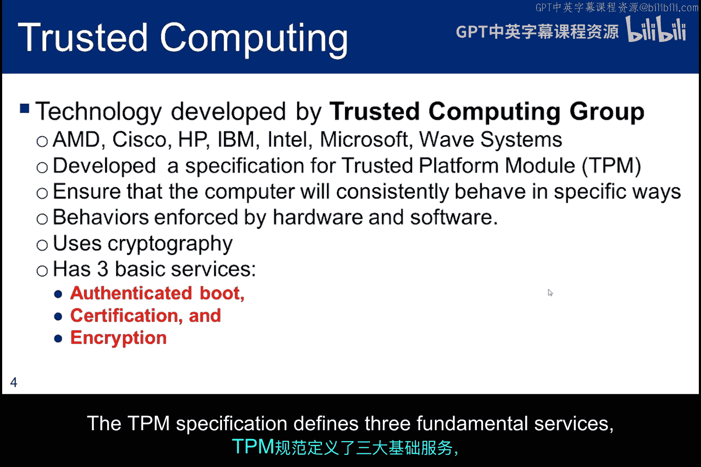
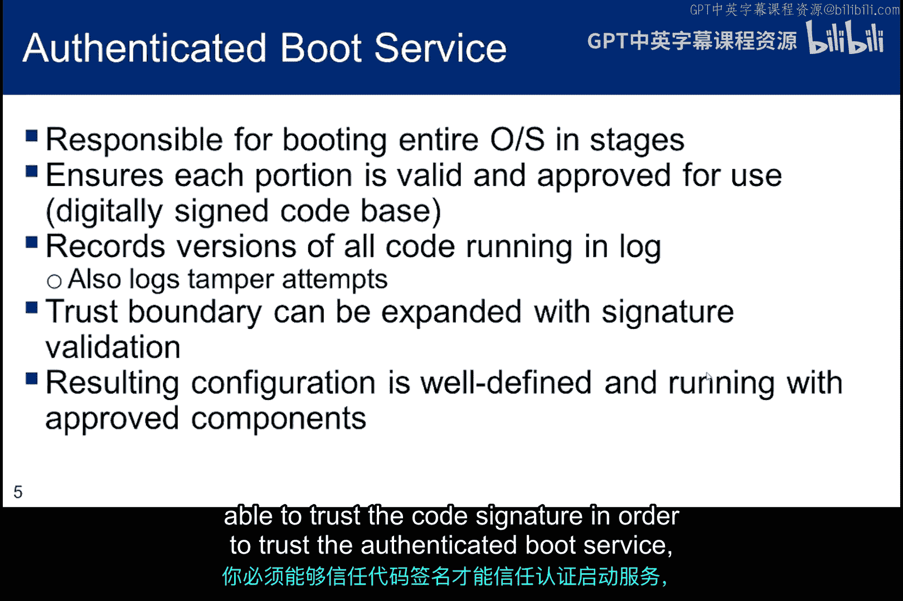
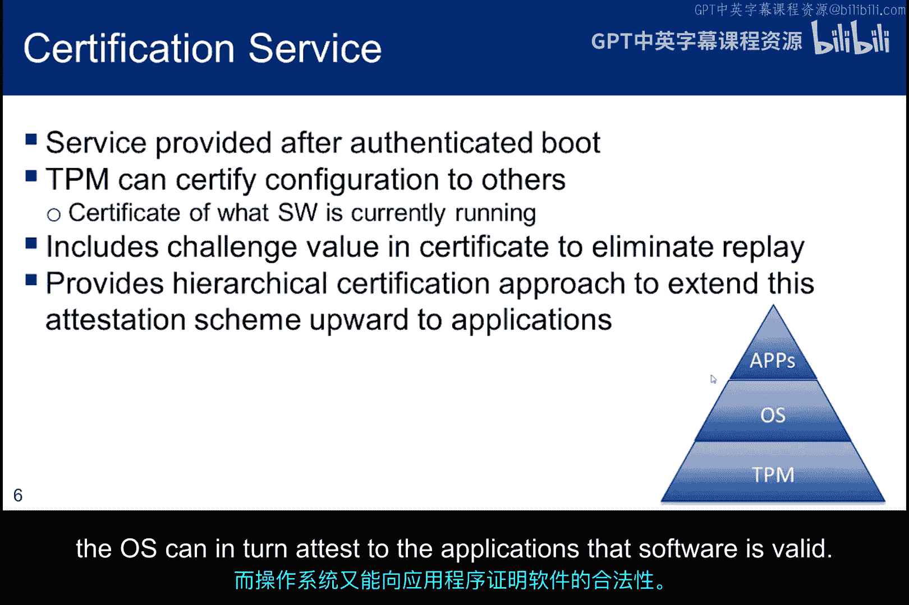
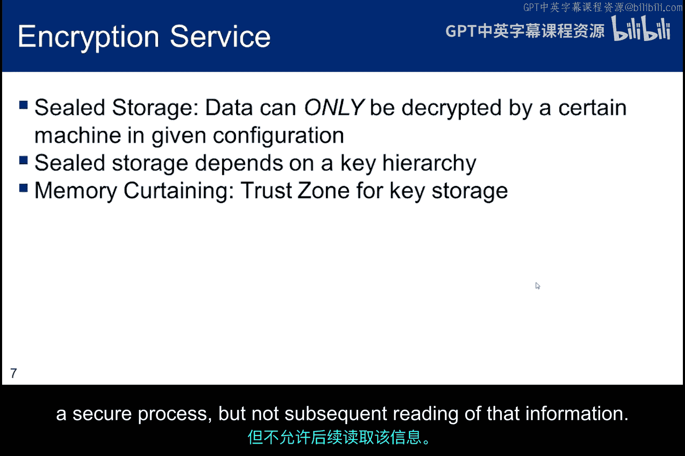
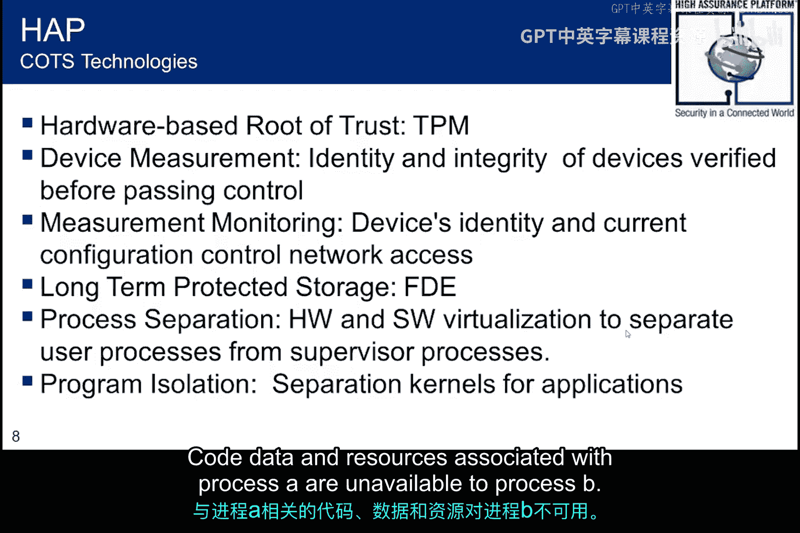
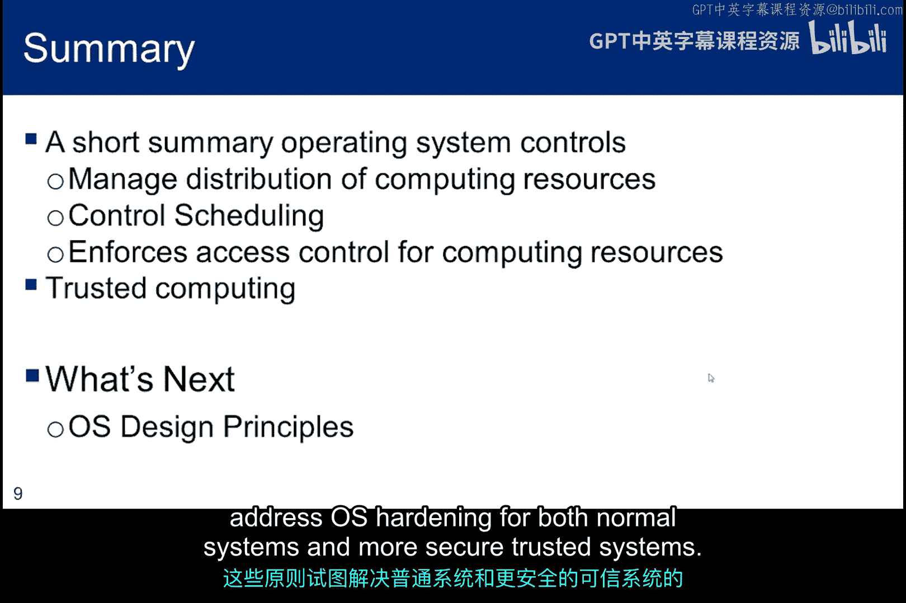

# 062：系统可信机制 🔐

在本节中，我们将探讨操作系统中的“信任”概念。我们将了解操作系统如何管理资源和执行安全策略，并深入讨论“可信计算”这一现代安全框架，它通过硬件和软件的结合来确保系统从启动到运行的完整性。

---

上一节我们介绍了操作系统的基本保护机制，本节中我们来看看“可信计算”的具体实现。

## 可信计算基

“可信计算基”是一个经典概念，它指的是计算机系统内所有保护机制的总和，包括硬件、固件和软件。这些机制共同负责执行安全策略。

**TCB = 硬件 + 固件 + 软件**

TCB必须能够保护自身，其边界内的所有代码都必须是可信的。一旦TCB内的任何代码被破坏，整个TCB的可信度就会受损。

## 可信平台模块

现代的可信计算理念基于“可信计算组”联盟提出的规范，其核心是**可信平台模块**。TPM是一个基于硬件的信任根，旨在确保计算机安全启动并在启动后保持安全状态。

TPM规范定义了三个基本服务，接下来我们将逐一讨论。

### 1. 认证启动服务

该服务通过对代码库进行数字签名，确保所有代码都来自拥有有效证书的合法软件供应商。它还会记录任何试图篡改配置或替换加载模块的行为。

信任边界只有在新增代码也拥有经过验证的签名时才能扩展。这里的关键是，我们必须能够信任代码签名本身，才能信任整个认证启动服务。

### 2. 认证服务

当您信任一段代码时，这种信任可以传递给他人。认证服务提供**远程证明**，目标是确保系统上只运行经过授权的代码。

其工作原理是，由硬件生成一个证书，标识当前正在运行的软件，并将该信息安全地存储在TPM中。计算机可以向远程方出示此证书，以证明当前正在执行的是未经篡改的软件。

例如，在数字版权管理中，音乐播放软件只有在能证明自己运行的是安全副本时，才被允许向音频子系统发送歌曲。

### 3. 受保护存储与内存隔离

以下是TPM提供的另外两项关键功能：

*   **密封存储**：存储的数据只能由特定的软硬件组合打开。例如，一首歌曲会被一个与TPM绑定的密钥安全加密，只有授权计算机上未经修改的音乐播放器才能解密和播放它。
*   **内存隔离**：该技术扩展了常见的内存保护方法，为内存中的敏感区域（如存储加密密钥的位置）提供完全隔离。即使是操作系统也无法完全访问这些被“隔离”的内存。

## 高保障平台

高保障平台是美国国家安全局发起的一项倡议，旨在提供可信计算的商业实例。它整合了多项技术：

*   **TPM**：作为基于硬件的信任根。
*   **设备度量**：在启动时和运行时度量和验证每个软硬件组件的身份与完整性。
*   **受保护的长期存储**：基于硬件的全盘加密。
*   **进程与域隔离**：基于硬件和软件的安全虚拟化技术，将用户进程与监管进程分离，并确保不同安全域之间没有意外的交互。

---

本节课中，我们一起学习了操作系统如何通过可信计算基来管理资源和执行安全策略。我们深入探讨了现代的可信计算框架，特别是可信平台模块提供的认证启动、远程证明、密封存储和内存隔离等核心服务。这些机制共同作用，旨在确保系统从硬件启动到软件运行的整个链条都是可信且未被篡改的。

在下一节中，我们将讨论一些旨在强化操作系统安全性的设计原则，无论是对于普通系统还是更安全的可信系统。