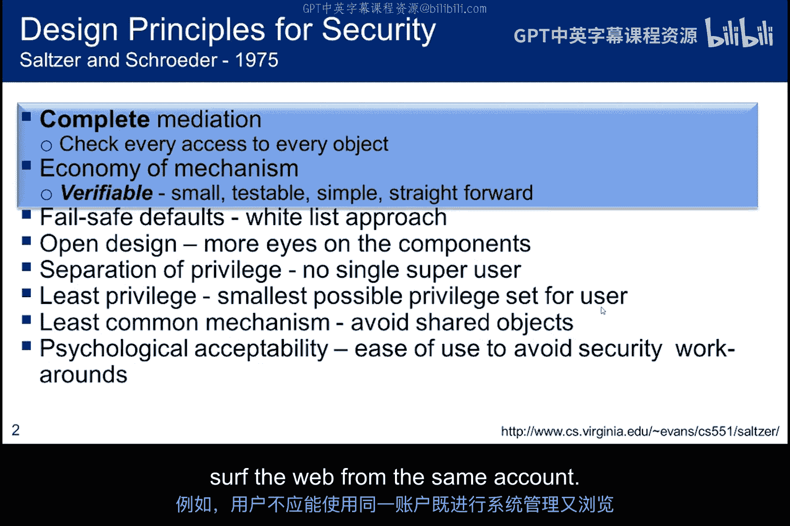
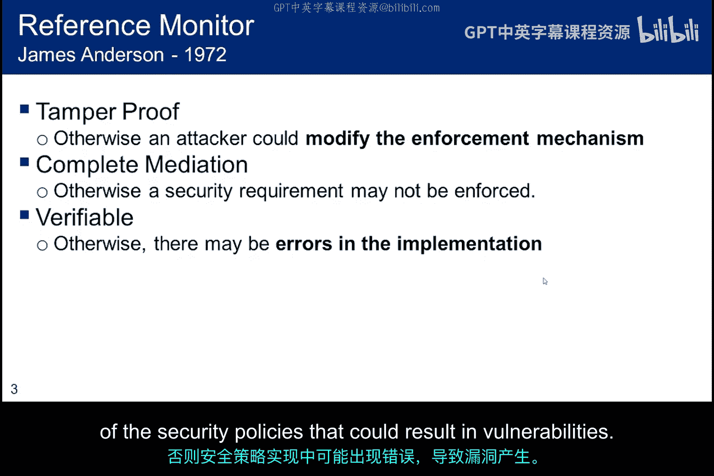
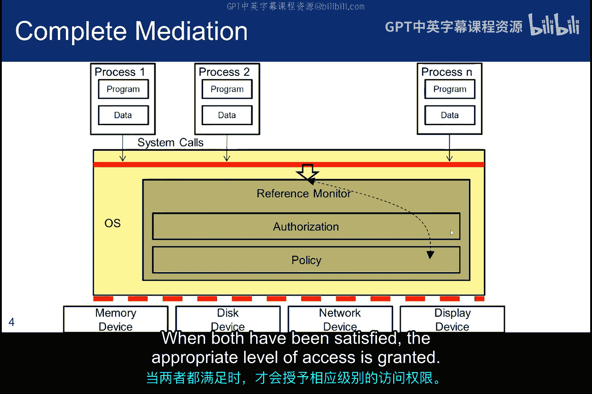
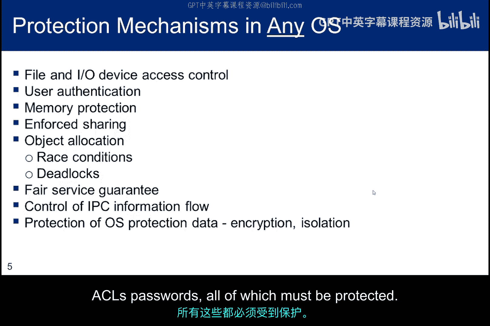
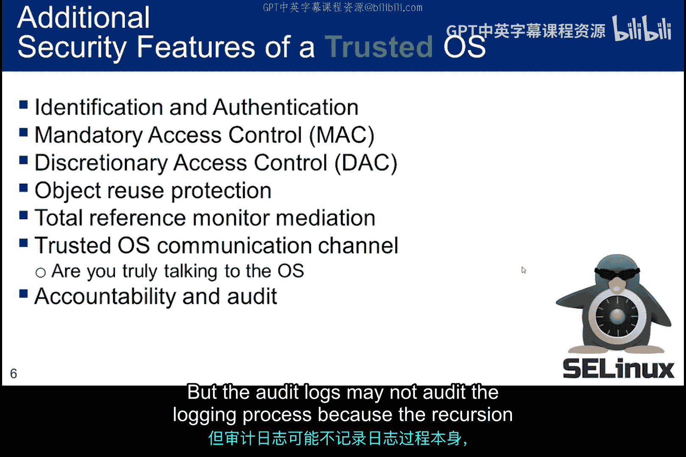
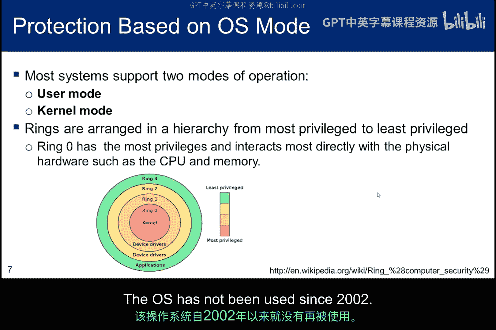
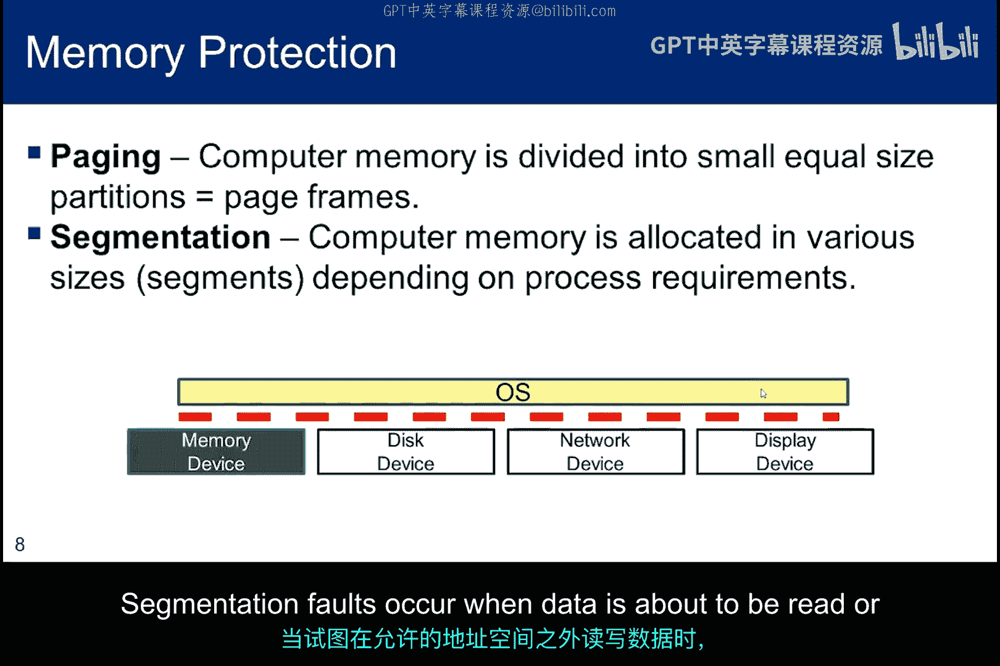
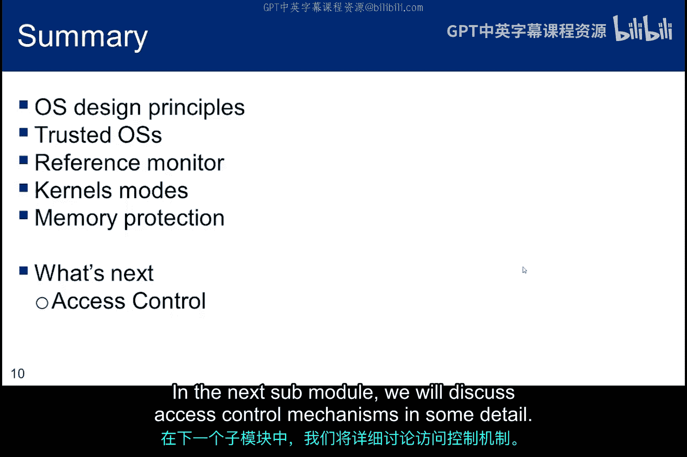

# 063：操作系统设计原理 🔐

在本节课中，我们将学习操作系统（OS）的设计原理。首先，我们会探讨普通操作系统的核心设计原则，然后在此基础上，了解可信操作系统（Trusted OS）所附加的额外安全要求。我们将定义“引用监视器”，简要讨论用于保护内核的系统模式（或环），以及一些内存保护的要求。

## 引用监视器：安全系统的基石

上一节我们介绍了课程概述，本节中我们来看看操作系统安全设计的核心概念——引用监视器。Saltzer和Schroeder在1975年对安全设计原则进行了开创性研究，其原则至今仍然适用。引用监视器的概念便是这些基础原则之一。

实际上，引用监视器的概念最早由James Anderson于1972年在美国空军的计算机安全技术规划研究中提出。在该论文中，他将引用监视器定义为一种访问控制机制，它必须满足以下三个要求：

1.  **防篡改**：`tamper-proof`
2.  **始终被调用且完整**：`always invoked and complete`
3.  **足够小以进行验证**：`small enough to be validated`

**防篡改**要求内核本身是防篡改的。如果内核可以被篡改，攻击者就能修改系统的执行机制，从而绕过其安全防护。

**始终被调用且完整**要求引用监视器必须对所有安全敏感操作提供完整的仲裁。如果某些操作未被仲裁，则安全要求可能无法执行。例如，秘密信息可能被泄露，或者可信数据可能被不可信进程修改。当然，仲裁必须被持续调用，否则在其不活动时可能被绕过。

**足够小以进行验证**要求引用监视器必须足够小，以便验证其是否正确执行了系统的安全目标。否则，实现或安全策略中的错误可能导致设计漏洞。

Saltzer和Schroeder的研究包含了其中两个属性（完整性和可验证性），但未明确包含防篡改性，尽管他们花了大量时间讨论防止篡改的访问控制列表。

引用监视器的概念定义了安全操作系统中访问控制的必要且充分的条件。然而，随着网络基础设施的发展，满足这些属性变得越来越困难。随着插槽数量和功能的增长，复杂性已成为引用监视器的敌人。我们计算环境的分布式特性，包括向云计算的过渡，也可能使完整性属性更难满足，因为访问点通常遍布整个企业，难以确保每次访问都被检查。数据包在计算基础设施中传输时，会经过包过滤器、IDS、IPS和防病毒系统的评估，甚至可能需要通过数字签名验证机制，这些都是完整性的敌人。

## 操作系统通用保护机制

理解了引用监视器后，我们来看看任何操作系统（不一定是可信操作系统）中通常存在的保护机制列表。其中一些不一定是专门的安全机制，但它们共同作用，确保操作系统按预期运行，不会产生拒绝服务条件。

以下是典型的操作系统保护机制：

*   **认证**：所有操作系统都需要认证机制来识别用户并控制访问。
*   **访问控制**：后续子模块将详细讨论访问控制，包括访问控制列表（ACL）。虚拟内存的访问控制更为关键，因为它是共享资源。
*   **强制共享**：确保所有进程都能访问资源，目标是保证数据完整性和一致性。
*   **对象分配**：包括并发性和同步性。要理解并发性，可以想想线程。这是指多个计算同时执行并可能相互交互的系统特性。同步性是指协调同时运行的线程或进程，以正确的运行时顺序完成任务，避免意外的竞态条件。
*   **公平服务**：确保没有CPU请求或I/O请求被忽略，从而造成饥饿情况。
*   **进程间通信（IPC）控制**：进程有时需要与其他进程通信或同步访问共享资源。发生这种情况时，操作系统需要控制IPC信息流。这种仲裁通常通过访问控制机制来管理。
*   **操作系统保护数据**：包括审计数据、密码文件等项目，所有这些都必须受到保护。

## 可信操作系统的额外要求

上一节我们介绍了通用操作系统的保护机制，本节中我们聚焦于可信操作系统，看看其设计中必须内置的额外安全要求。

如果我们将焦点缩小到可信操作系统，会看到设计中必须内置的额外安全要求：

*   **细粒度访问控制**：所有对象都与更细粒度的对象访问控制机制紧密耦合，这与一旦用户访问操作系统就授予其对大多数对象访问权限的方法相反。
*   **强制访问控制（MAC）**：下一个子模块将更详细地讨论MAC和自主访问控制（DAC）。关键区别在于，自主访问由对象所有者管理，而强制访问基于分配给对象的安全级别和安全分类。
*   **对象重用保护**：这最容易从内存角度理解。当一个用户访问内存中的一个对象后，下一个用户绝不能访问第一个用户的任何内容或元数据。所有内容都必须被清除。
*   **完全引用仲裁**：意味着每一笔交易都必须由引用监视器处理。
*   **可信路径**：确保用户正在与操作系统通信，并且中间人攻击向量已被消除。
*   **问责与审计**：要求可信系统对所有已采取的安全相关操作保存审计日志，但审计日志可能不审计登录过程，因为递归会导致日志快速增长。

## 系统模式（环）与内存保护

了解了可信系统的特殊要求后，我们回到更基础的设计层面：系统运行模式和内存保护。

大多数现代系统都有内核模式和用户模式。内核模式保护操作系统和关键表（如进程控制块）免受用户程序的干扰。然而，某些系统可能实现了额外的模式。例如，OS/2使用了三个环：R0用于内核代码和设备驱动程序，R2用于特权代码（如具有I/O访问权限的用户程序），R3用于非特权代码（这是几乎所有用户程序的模式）。最初的Multics系统有八个环。它是一个分时操作系统，开发于1965年，一直使用到2000年。

操作系统中两种常见的虚拟内存方案是分页和分段。操作系统必须管理进程对内存的访问。对于可信操作系统，还需要在进程使用完毕后清除内存。

*   **分页**：操作系统创建大小相等的页框，进程被划分为页，然后加载到这些框中。这对程序员是透明的。
*   **分段**：内存块大小可变。段表条目包括长度和基地址，用于在内存中定位。程序员（尤其是在汇编级别）必须管理内存，尽管现代高级语言为程序员做了大量的内存管理工作。

当数据即将在允许的地址空间之外被读取或写入时，会发生分段错误。无论是分页还是分段系统，以下是关键的内存保护要求：

*   必须控制进程对内存的访问。例如，操作系统必须确保当两个进程同时运行时，它们来自两个不同进程的不同虚拟地址不会指向同一个物理地址。
*   允许进程间共享内存，但不能同时共享。如果两个进程都处于活动状态，必须使用不同的物理位置，否则一个进程可能会破坏另一个进程正在使用的内存区域。

## 总结与下节预告

本节课中，我们一起学习了操作系统设计中可能提供攻击向量的属性（如果未正确实现的话）。即使正确实现，普通操作系统也无法提供可信操作系统的所有保护。

我们讨论的核心思想包括：
*   引用监视器应具备**完整性**、**持续性**、**可验证性**和**防篡改性**。
*   操作系统至少需要两种模式：**用户模式**和用于保护操作系统及其表的**内核模式**。
*   **内存保护**必须独立于虚拟内存方案。

在下一个子模块中，我们将更详细地讨论访问控制机制。