# 064：访问控制机制 🔐

在本节课中，我们将要学习信息安全领域的核心概念之一：访问控制。访问控制是操作系统用于授予或限制资源可用性的管理机制。我们将详细探讨三种最常见的访问控制模型：自主访问控制、强制访问控制和基于角色的访问控制，并理解它们如何保护系统资源。

---

## 访问控制基础

在信息安全领域，访问控制是操作系统授予或限制资源可用性及使用的管理机制。

授权是由访问控制机制强制执行、允许访问资源的权限。

本小节将涵盖当今系统中常见的访问控制机制。虽然你可能在其他课程中讨论过这些内容，但由于它们与操作系统紧密耦合，这里将进行快速回顾。

操作系统管理所有系统资源的使用，其访问控制机制为系统中的所有对象提供保护。通常，我们认为文件是需要被管理的对象，但也应将进程和用户归入此类。读、写和执行权限需要被控制。当然，操作系统还必须管理写入操作发生时的冲突和一致性问题。例如，当一个对象被修改时，操作系统必须锁定它，只允许单个主体访问，以消除竞态条件并确保一致性。

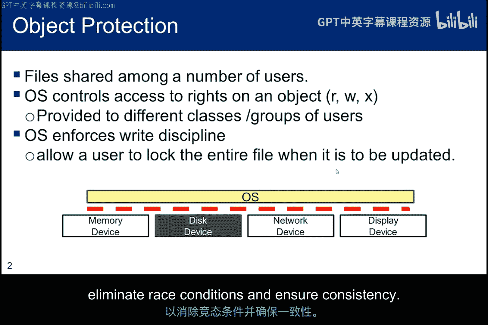

---

## 身份验证与授权

身份识别是确保主体是其声称身份的过程或机制。这一步有时需要提供带照片的身份证件，以获得向系统进行身份验证所需的凭证。

身份验证是实际确认凭证有效并信任该凭证已与身份紧密关联的机制。例如，要获得政府个人身份验证卡，你必须有一份由政府官员签署的表格，证明背景调查已完成，并且还必须出示两张带照片的身份证件，以证明你是表格上标识的人。

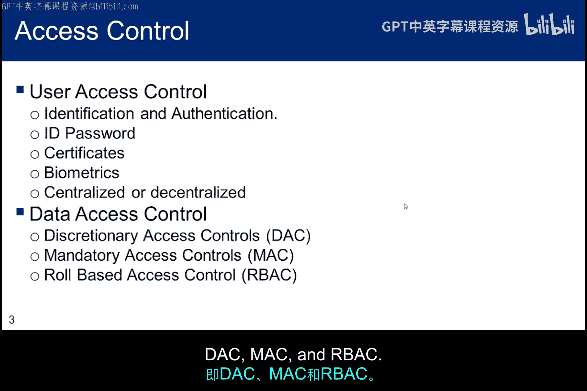

PIV卡是一种智能卡，包含非对称凭证，通过个人PIN码访问以进行身份验证。你将卡插入读卡器，系统会请求你的PIN码。如果PIN码正确，卡上的凭证（如你的身份验证证书和关联的私钥）就可以用来向请求身份验证的机制保证你的身份。

一旦你的身份被确认，就可以授予你对系统资源的访问权限。

请在脑海中区分“身份验证”和“授权”这两个词。身份验证机制验证你的身份。一旦你的身份被确认，授权机制会根据你的身份控制你对系统资源的访问。

---

## 三种常见访问控制机制

下一小节将讨论三种最常见的访问控制机制：DAC、MAC和RBAC。

---

### 自主访问控制

对于自主访问控制，每个对象都有一个唯一的所有者（可能是对象的创建者），该所有者被允许向其他用户授予访问该对象的权限。

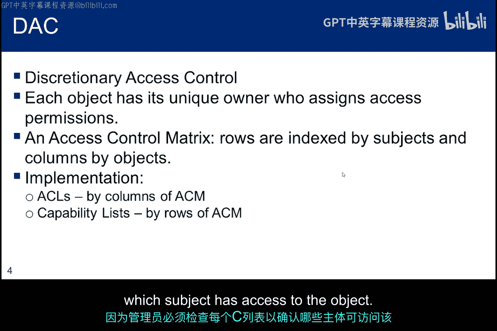

该机制可以被视为一个矩阵，尽管从未以这种方式实现。矩阵的行是想要访问对象的主体，矩阵的列是正在管理访问权限的对象。因此，想象矩阵单元格中的一个“R”，该行的主体被所有者授予了对该列对象的读取权限。

DAC通常通过访问控制列表实现。ACL本质上是矩阵的单个列，它标识了所有者授予访问权限的所有主体。DAC也可以通过能力列表实现，这是面向主体的，可以看作是给定主体的矩阵行，标识了各个所有者授予的对所有对象的所有权限。

由于能力列表可能分散在系统中，它们比ACL带来更大的安全问题。因此，操作系统通常在用户无法访问的内存区域中代表用户保存所有能力列表，以防止用户编辑自己的能力列表。

这两种实现方式带来了不同的管理挑战。当对象的权限发生变化时，ACL易于管理。当主体从系统中删除或其权限发生变化时，必须修改所有ACL以检查该主体。能力列表则相反，当主体的权限发生变化时易于管理，但从对象的角度来看则不那么容易，因为管理员必须检查每个能力列表，以查看哪些主体有权访问该对象。

---

### 访问控制矩阵模型

这张幻灯片展示了一个访问控制矩阵模型，其中来自集合S的主体被分配到行，来自集合O的对象被分配到列。单元格中的条目授予主体访问对象的权限。

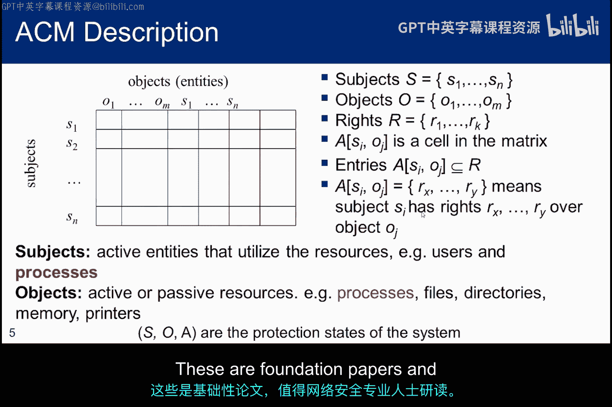

请注意，被控制的对象集合也包括来自主体集合的活动进程。因此，一个进程可以被授予对对象的权限。同时，另一个主体可以被授予访问该进程的权限。换句话说，集合S中的一些主体也是集合O中的对象。同样，单元格包含授予主体对对象的权限，但许多单元格将是空的，表示主体对对象没有权限。

由于空单元格普遍存在，访问控制矩阵从未在操作系统中实现。相反，使用像ACL这样的压缩版本。但访问控制矩阵为理解DAC的含义和工作原理提供了一个有用的模型。

Butler Lampson在其1971年发表的题为《保护》的开创性论文中首次提出了这个模型，后来由Denning和Graham在《保护、原理与实践》中进行了完善。这些是基础论文，值得网络安全专业人士阅读。

---

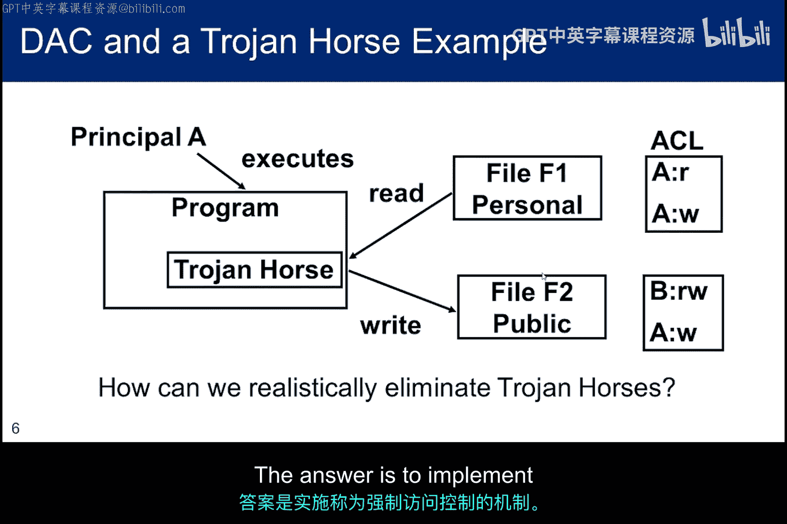

### DAC的弱点与特洛伊木马

自主访问控制的一个弱点是，它无法防止被设计为滥用访问权限的特洛伊木马程序。

在本幻灯片的示例中，我们展示了两个文件。文件F1包含用户A的个人身份信息，由A拥有。文件F2包含公共信息，由用户B拥有。作为文件F1的所有者，A可以读取和写入该文件，但A没有将这些权限授予任何其他人。

作为文件F2的所有者，B可以读取和写入该文件，但在这种情况下，B还授予了A写入该文件的权限。

现在，假设用户A运行一个程序来编辑她的个人文件F1，并假设该程序包含一个特洛伊木马，该木马也以A的权限运行。特洛伊木马将能够读取文件F1，并将其内容写入文件F2，因为A对B有写入权限。特洛伊木马使B能够访问A的个人信息。

如果文件F1是机密的，而文件F2是非机密的，那么这个特洛伊木马就是在创建一个隐蔽通道来窃取机密信息。问题是，如何修改访问控制机制以防止此类问题？答案是实施一种称为强制访问控制的机制。

---

### 强制访问控制

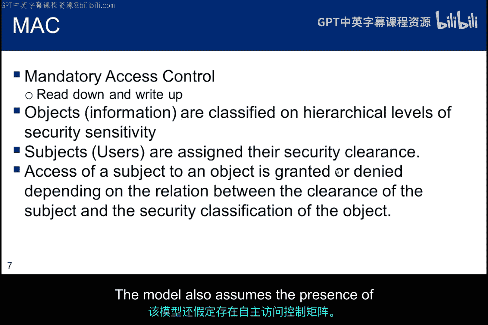

这张幻灯片简要回顾了MAC模型的特性。顺便说一下，强制访问控制有时被称为基于格的访问控制，因为一个称为格的数学对象在其中扮演重要角色。

MAC具有你在先前课程中学到的两个特性。强制执行涉及比较用户会话的安全许可级别和对象的分类级别。这些通常是全序集合：非机密、机密、秘密和绝密。然而，该模型足够健壮，可以使用嵌入在格中的偏序数学关系来处理分隔区。

该模型有两个基本属性。第一个属性是，不允许读取分类级别高于你授权会话级别的文档。例如，你可能拥有绝密许可，但如果你的会话是秘密级别，你将不被允许访问绝密材料。

第二个属性是，不允许写入分类级别低于你授权会话级别的文档。通常假设你的会话是在你的许可级别启动的。当然，你可能能够在不同级别启动会话。

我们经常将Bell和LaPadula开发的这个形式化模型描述为约束你“不能向上读，不能向下写”，但可以做相反的操作。“不能向上读”通常被称为简单安全属性，“不能向下写”被称为星属性。严格的星属性意味着你只能在自己的级别写入，不允许向上或向下写入。该模型还假设存在一个自主访问控制矩阵。

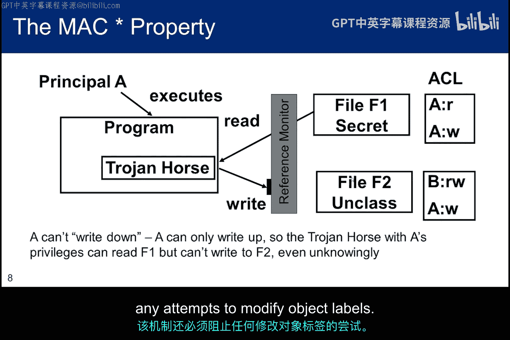

---

### MAC如何防御特洛伊木马

让我们回到特洛伊木马的例子。但这里我们将从关注个人身份信息转向关注机密数据的泄露。A仍然对F2拥有自主写入权限。但由于A的会话是在比F2分类级别更高的安全级别启动的，因此MAC阻止A向F2写入任何信息，从而保护了机密信息。

这种控制是由之前讨论的引用监视器提供的，现在你可以看到完全仲裁对于确保没有访问尝试能够绕过引用监视器的重要性。

成功实施MAC的关键之一是不可修改对象的标签。如果可以修改，特洛伊木马可能会将F2切换到更高的分类级别，将机密数据写入其中，然后将其改回原始分类级别。因此，除了实施MAC模型外，该机制还必须阻止任何修改对象标签的尝试。

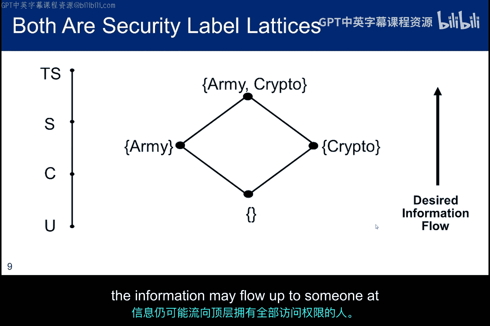

---

### MAC的数学视角

这是MAC的另一种视角。很容易理解标准的安全级别：机密、秘密和绝密。从数学角度来看，这种线性关系代表了一个全序集合，每个级别都可以与另一个级别比较。

然而，强制访问控制的模型基于一个更通用的涉及偏序集合的数学模型。右侧显示了一个示例。在这两种情况下，我们都希望信息向上流动，但对于偏序，集合中的单个元素存在多条路径。例如，“陆军”和“密码”不一定可比。这对于可能彼此无关的安全分隔区来说是一个非常重要的概念，并且单个分隔区的成员不一定需要了解其他分隔区的信息。然而，即使分隔区不在同一层级，信息也可能向上流动到可以访问一切的顶层人员那里。

---

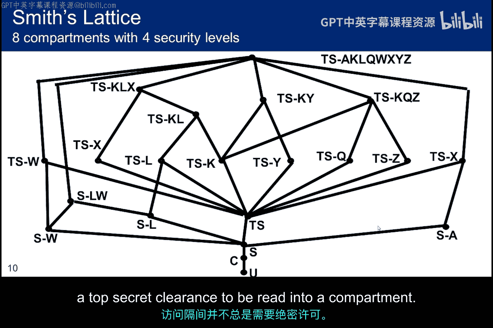

### 格与访问控制

使用偏序集合产生的关联关系称为格。这里展示的格是为一个大学课程项目开发的，它基于标准的全序集合，结合了描述国防部部分安全分隔区的偏序集合。图表显示标识符U、C、S和TS没有被混淆，但分隔区名称被混淆了，可能是出于安全原因。这在我的课上没有做，所以我不知道很多细节。我知道这个图表现在非常古老了，我怀疑它不再适用，但它是展示MAC模型可以多么复杂的一个有趣视角。

许多人没有想到的一个重要想法是，在秘密级别可能存在需要知道的分隔区。读取分隔区信息并不总是需要绝密许可。

---

### 基于角色的访问控制

我们将讨论的第三种访问控制模型是基于角色的访问控制。第一篇描述RBAC的论文写于1992年，GMU的Sandhu在1995年提出了一个RBAC框架，以整合关于会话和角色层次结构的思想。

关键思想是对组织业务逻辑的部分进行建模。他们如何使用组织中人员的角色进行日常操作？因此，我们让处于特定角色的主体执行特定工作，他们需要特定的权限来完成该工作。这是一个简单的图景。用户和角色之间存在关系，权限和角色之间也存在关系。两种关系都是多对多的，用户和权限之间没有直接联系。

这简化了管理，这是其动机之一。如果雇佣了新员工，系统管理员只需给她分配适当的角色，而不必担心分配给她一大组单独的权限。

你还可以将授予用户分配和授予权限分配的行为分离开来，交给不同的系统管理员和/或在不同的时间范围内进行。它允许组织在不担心员工的情况下定制应用程序和业务逻辑。事实上，这是实现职责分离的好方法。在将用户分配给角色时，所涉及的应用程序不影响分配。然而，分配给这些角色的权限性质确实取决于实现。例如，操作系统需要分配读写权限，关系数据库管理系统需要分配选择和更新权限，而交易应用程序可能需要分配贷记和借记权限。

假设一个用户被分配了教授角色。他应该只能看到他班上学生的成绩。但你如何区分所有拥有相同角色的教授呢？这种复杂性通过框架的扩展来解决，增加了对权限约束的概念。它允许创建上下文敏感的权限。因此，所有用户的权限和角色是相同的，但实际查看的对象可能不同。

会话的概念是，一个用户可能被分配到多个角色，但并非所有角色都在用户登录时激活。这取决于会话的配置文件。会话有一个与之关联的身份，并且可以从会话的配置文件中添加或删除角色。

---

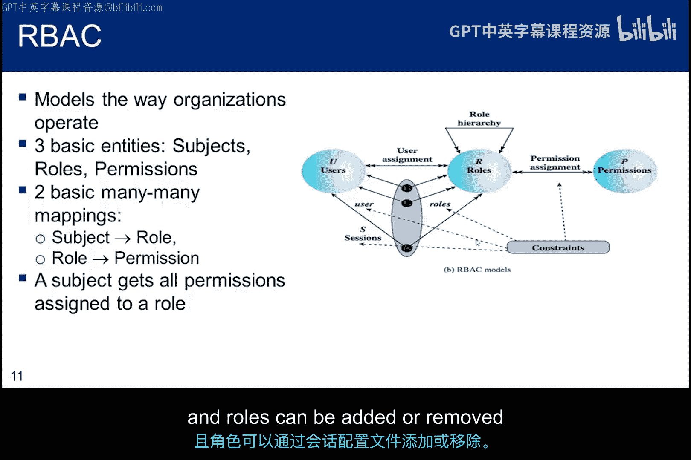

### RBAC的重要特性

这张幻灯片展示了RBAC的重要特性。用户的权限由角色决定，而不是由经过身份验证的身份或许可决定。RBAC的扩展允许角色编码任意属性，从而创建基于属性的访问控制机制。

策略中立意味着RBAC机制可以重新配置以建模和支持DAC和MAC。然而，如果RBAC不包含会话的抽象，你就无法使用它来实现MAC。用户-角色关系和角色-权限关系都是多对多的。

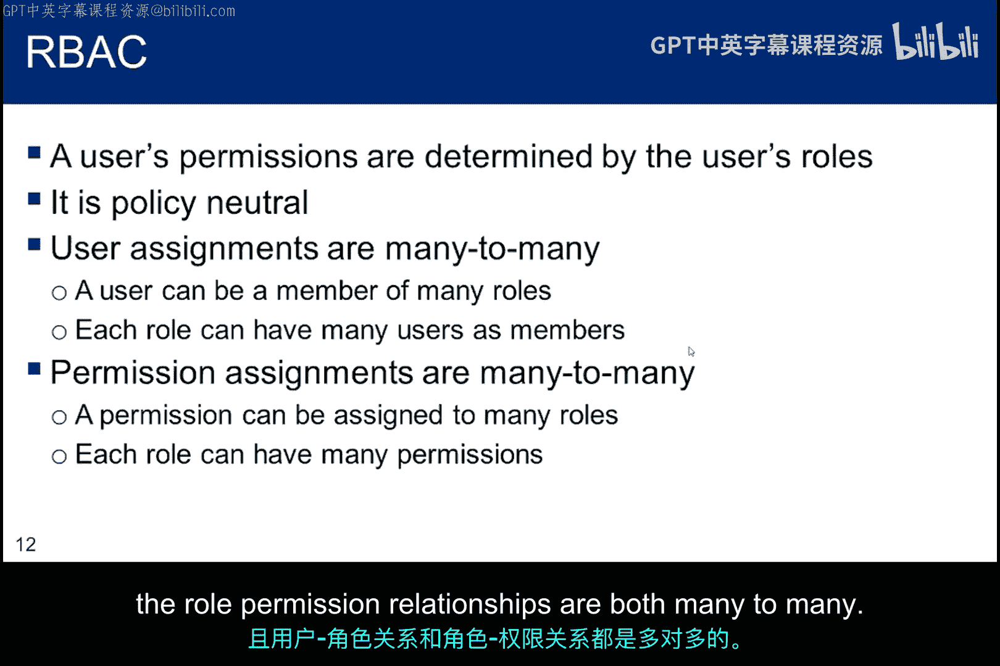

---

## 总结

本节课中我们一起学习了三种最常见的访问控制机制：自主访问控制、强制访问控制和基于角色的访问控制。DAC是基于身份的，对象的所有者管理权限。MAC基于为用户和对象分配的安全或隐私级别。RBAC基于分配给用户角色的权限。

它们是截然不同的模型，代表了我们对安全需求理解的演变。每种模型都有其优点，但它们具有不同的安全态势。通常，我们会看到包含DAC和MAC的混合模型，而RBAC机制可以被修改以模拟其中任何一种。

“需要知道”的约束通常通过在其他机制上叠加DAC来强制执行。最后，如果需要额外的访问控制复杂性，可以扩展RBAC以提供ABAC。

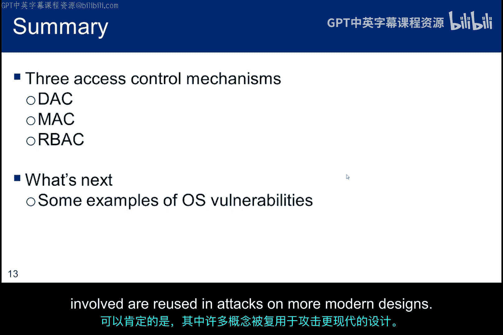

在下一个子模块中，我将讨论一些利用了操作系统实现中漏洞的攻击。在很大程度上，这些攻击已被充分理解，攻击者不再能够利用，但它们并未被完全消除。可以肯定的是，其中涉及的许多概念在现代设计的攻击中被重复使用。