# 065：操作系统漏洞分析 🔍

在本节课中，我们将学习操作系统层面的历史攻击案例。这些攻击之所以成功，往往源于操作系统自身存在的弱点。我们将重点探讨一种反复出现的关键攻击思想——缓冲区溢出。尽管现代系统已实施了许多改进来应对此类问题，但它至今仍是一种常见且有效的攻击手段。理解这一概念至关重要，我们将对其进行深入剖析。

以下是本小节将要回顾的攻击类型列表，其中许多例子取自Trent Yeager的《操作系统安全》一书。

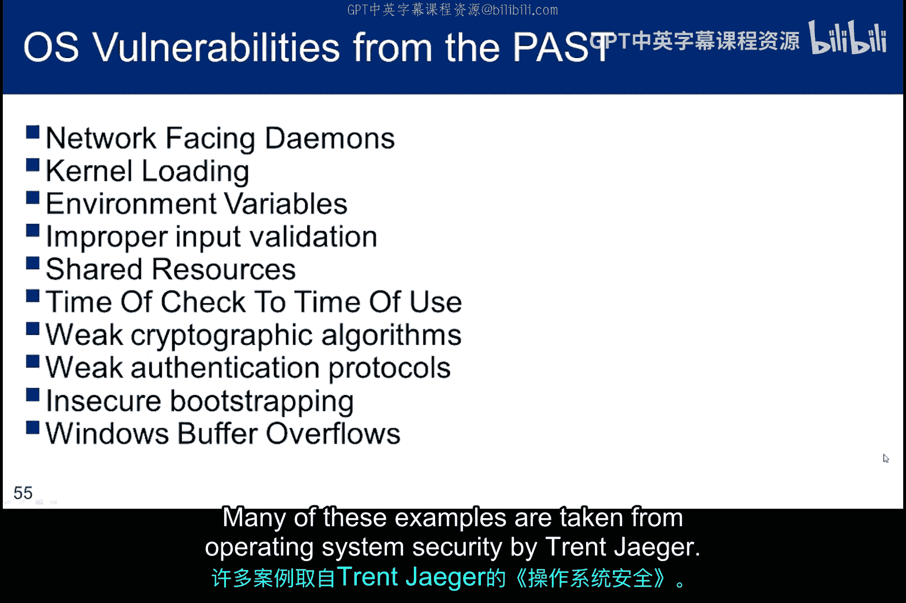

## 网络守护进程攻击 🌐

上一节我们概述了多种攻击类型，本节中我们首先来看看针对网络守护进程的攻击。在Linux系统中，面向网络提供访问服务的守护进程（daemons）示例包括SSHD、FTPD和sendmail。如果这些进程通过网络可访问，且未对远程输入进行充分防护，就极易遭受远程攻击，特别是缓冲区溢出攻击。

以下是历史上一些过于“轻信”的远程登录守护进程：
*   Rsh
*   Rlogin
*   FTPD
*   NFS

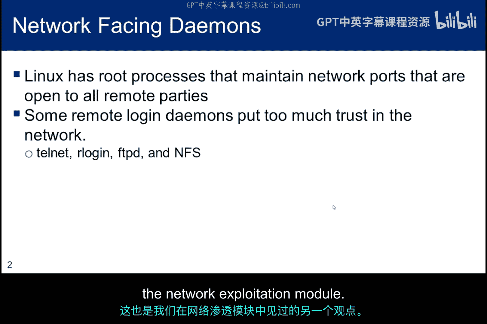

“过度信任”的一个例子是早期不安全的FTPD版本，它以明文形式发送密码。另一个例子是不安全的NFS版本，它会接受来自远程文件系统的任何响应，并将其视为来自合法服务器。

从这些漏洞中，我们可以得出一个推论：**仔细检查远程输入至关重要**。当然，这并非新观点。我们在之前的Web漏洞利用模块中已经见过，尤其是在防止SQL注入攻击时。第二个启示是：**不要信任网络**。攻击者可能正在嗅探数据包或伪装成合法的网络节点。这个观点在网络漏洞利用模块中也曾提及。

## 内核扩展攻击 ⚙️

了解了网络服务的风险后，我们来看看更深层的系统组件。操作系统内核的扩展也可能成为攻击目标。Windows将内核扩展称为“内核模式驱动程序”，而Linux则称之为“可加载内核模块”（LKM）。LKM是包含代码的目标文件，可以在不重新编译操作系统的情况下，动态扩展正在运行的内核。如果没有LKM，操作系统就必须将所有未来可能的功能都编译进基础内核中，其中许多功能不会被使用，却会消耗资源和内存。

LKM通常用于添加对新硬件或文件系统的支持，但也可用于添加系统调用。当不再需要时，可以卸载它们以释放内存和其他资源。这两种类型的内核扩展都可能允许攻击者以内核权限执行代码，因为攻击者利用了拥有内核访问权限的、属于root用户的进程。

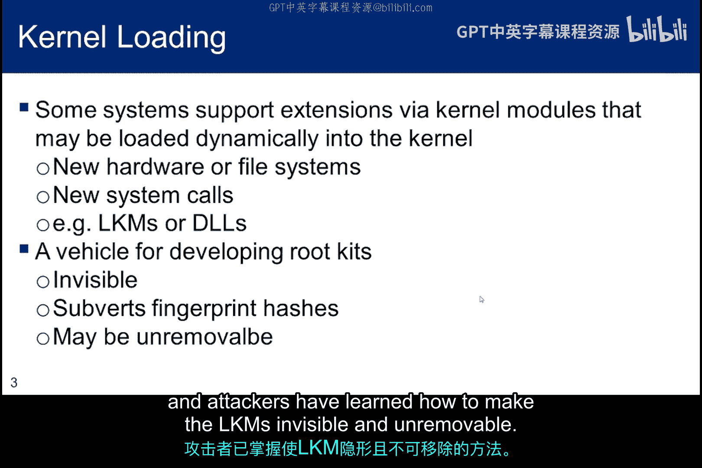

当然，内核模块并非任何人都能加载。只有具有root权限的用户或内核本身才能加载或卸载内核模块。这意味着在获取root权限之前，攻击者无法利用此点。但一旦获得root权限，使用可加载内核模块来加载后门和rootkit就非常有用。攻击者无需向系统功能中注入木马，而是可以在内核级别颠覆功能，且不留痕迹。这种方法还能颠覆生成系统指纹哈希的工具。攻击者已经学会了如何使LKM隐形且无法移除。

## 环境变量攻击 🔧

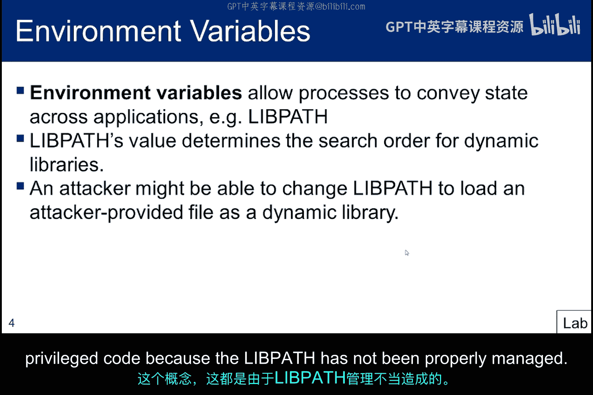

除了内核扩展，进程间传递信息的机制也可能被滥用。环境变量允许进程传递状态信息。我们将在后续讲座中探讨的缓冲区溢出示例就会利用这一点，通过创建一个新的环境变量来传递状态，而传递的信息将包含shell代码。

攻击者使用环境变量的另一种方式是更改`$PATH`变量，使操作系统寻找并运行恶意代码，而非预期的代码。换句话说，一个受信任的进程可能因为`$PATH`管理不当，而调用子模块中的恶意代码。在后续关于`setuid`的小节中，你将通过让一个临时以root身份运行的普通进程执行特权代码来探索这个想法。

## 输入验证问题 🚫

我们已经多次讨论过输入验证的重要性，但值得再次强调，因为它代表了系统中的一个关键攻击向量，那些没有充分进行检查的系统尤其危险。

以下是输入验证不当可能引发的问题：
*   需要控制的关键要素之一是库和主机路径的位置。如果未进行验证，就可能存在目录遍历漏洞。这可能为攻击者创建获取对受限目录和文件进行未授权访问的途径。
*   这些输入验证问题通常是Web服务器或应用程序代码中的漏洞，允许攻击者利用系统来读取或写入本不应被访问的文件。
*   在某些情况下，攻击者可能能够执行任意代码或系统命令。
*   列表中的最后一点也很关键，因为它可以防止缓冲区溢出。其核心思想是始终确保应用程序接收到的任何类型的输入，其长度永远不会超过它本应放入的缓冲区。

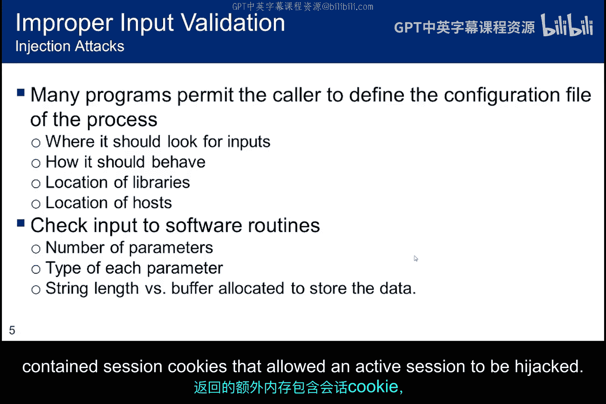

OpenSSL中的“心脏滴血”漏洞是弱输入验证的一个很好的例子，尽管它严格来说并非缓冲区溢出攻击。在TLS保持连接握手期间，攻击者能够请求额外的63KB内存，因为协议假设会被正确使用，并且没有对作为有效载荷返回的字符串长度进行验证。在某些情况下，返回的额外内存中包含会话cookie，使得活跃会话可以被劫持。

## 临时文件竞争条件 ⏱️

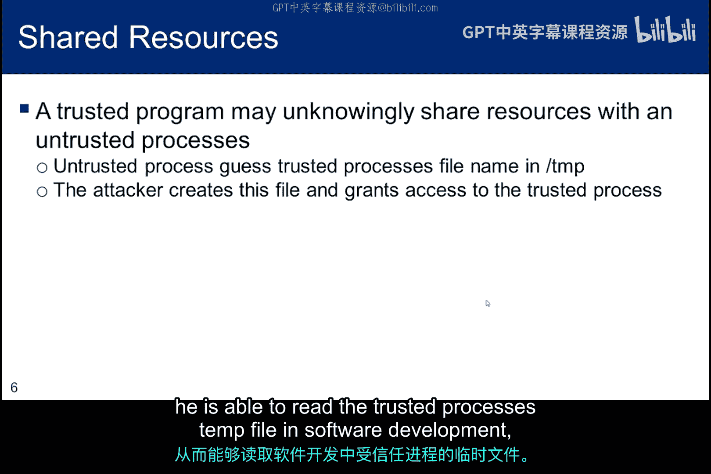

输入验证之外，文件系统的使用也可能引入风险。假设一个不受信任的进程猜中了某个受信任进程将在`/tmp`目录中使用的临时文件名。

由于任何进程（无论是否受信任）都可以在`/tmp`中创建文件，攻击者便在那里使用刚刚猜中的名字创建自己的文件。然后，攻击者授予受信任进程访问他这个不受信任的临时文件的权限。这样一来，当受信任进程去创建临时文件时，该文件已经存在，并且由于是攻击者创建的，他就能读取受信任进程的临时文件。

## TOCTOU攻击 🔄

在软件开发中，“检查时间到使用时间”（TOCTOU）是一类软件缺陷，由系统在检查某个条件（如安全凭证）与使用该检查结果之间发生变化所引起。这是一种竞态条件。

inode存储了关于常规文件、目录或其他文件系统对象的所有信息，但它与文件名是松散耦合的，这就创建了一个攻击向量。当攻击者请求访问一个临时文件时，他将文件名传递给受信任进程以进行访问控制决策。例如，他可能说想访问他的临时文件`/tmp/X`，这会被允许。对`access()`函数的调用按预期进行，并授予程序访问该文件所需的权限。

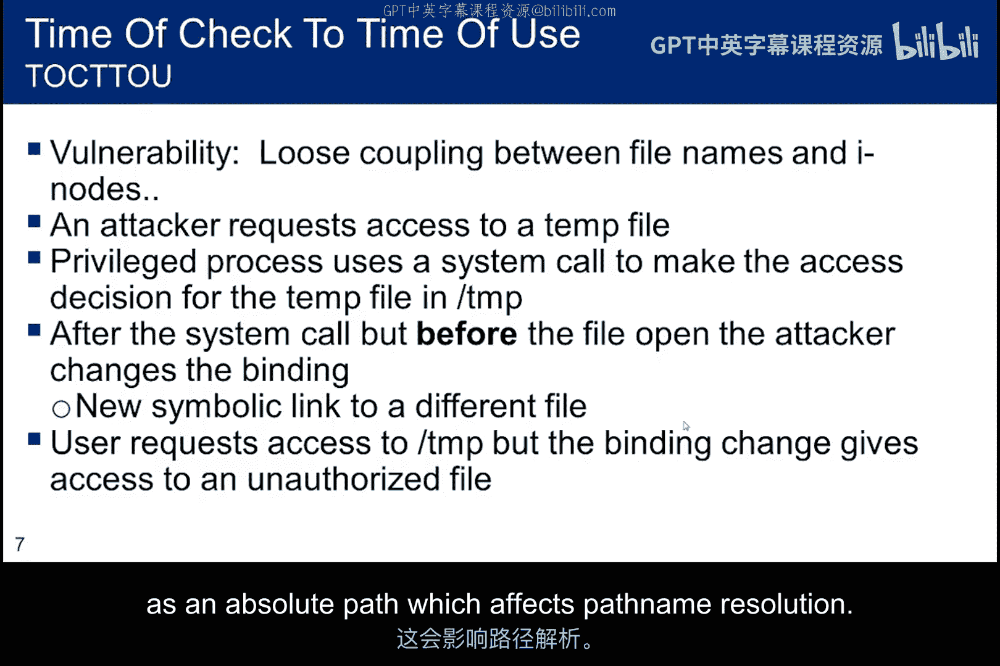

然而，`access()`和`fopen()`这两个函数都是基于文件名而非文件句柄进行操作。这意味着无法保证当文件名传递给`fopen()`时，它所指的磁盘上的文件与传递给`access()`函数时是同一个。

如果攻击者在调用`access()`函数之后、调用`fopen()`之前，将`/tmp/X`替换成一个指向其他文件的符号链接，那么受信任进程将打开该文件，即使这个文件是攻击者原本无法访问的。

提醒一下，符号链接是对另一个文件的引用（作为绝对路径），它会影响路径名解析。

## 密码与加密弱点 🔐

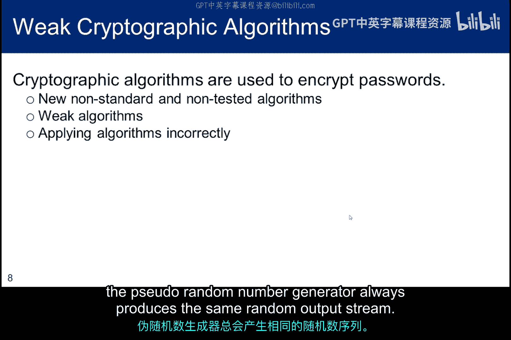

文件访问存在风险，保护数据的密码和加密机制本身也可能有弱点。密码并非以明文存储，通常会在写入shadow文件之前进行加盐和哈希处理。然而，并不能保证加密机制不会被攻击。

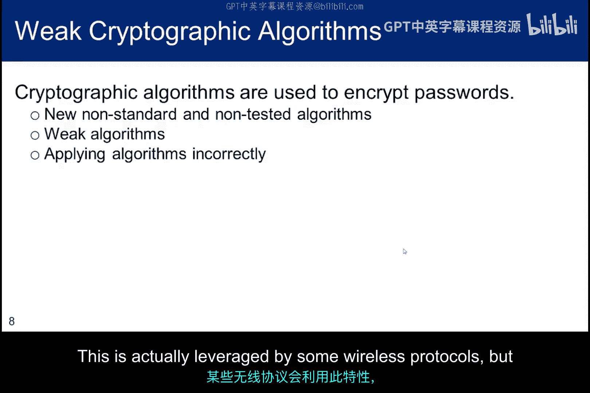

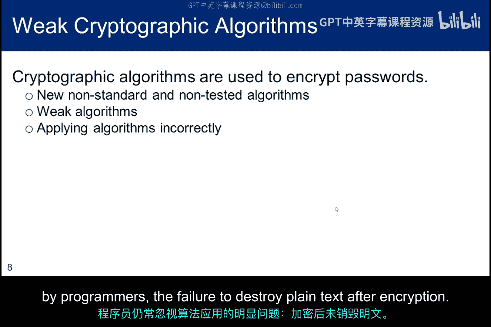

以下是一些常见的密码与加密弱点：
*   非标准且未经审查的算法是危险的，绝不应使用。例如，使用专有的加密算法可能被逆向工程，如果算法因未经适当审查而存在弱点，就会提供一个攻击点。
*   同样，对哈希函数进行的任何旨在加速的修改都可能产生漏洞。
*   我们知道MD5是一种弱哈希函数，Flame病毒就利用这一点创建了欺诈性证书，对某些恶意软件进行数字签名，使其看起来像是源自微软。这种攻击被称为“选择前缀碰撞攻击”，即创建一个新的伪造证书，使得两个不同证书（一个好的，一个坏的）的哈希值在签名验证时产生相同的结果。
*   应用算法时的一个重要点是，给定相同的种子，伪随机数生成器总是产生相同的随机输出流。这实际上被一些无线协议所利用，但也意味着使用相同种子的两个应用程序容易受到密码分析。

在应用算法时，一个明显的问题有时仍会被程序员忽视：**加密后未能销毁明文**。

## 特定协议与实现的弱点 🎯

加密算法之外，具体的认证协议实现也可能存在设计缺陷。LanManager是微软开发的一种网络操作系统，但其身份验证协议存在多个问题：
*   密码不区分大小写，因此在生成哈希值之前，所有密码都会转换为大写。
*   密码字符仅限于ASCII字符集的一个子集。
*   这两个问题都显著减少了攻击面。
*   密码长度限制为最多14个字符，但一个14字符的密码会被分成两半，每半7个字符，并分别计算哈希值。因此，攻击者只需要对7个字符进行两次暴力破解，而不是17个字符。这使得密码的有效强度仅相当于两个7字符密码的强度，复杂度大大降低。
*   如果密码等于或少于7个字符，则哈希值的后半部分将始终产生相同的常量值。因此，如果密码长度小于或等于7个字符，其强度几乎可以直观判断。
*   哈希值不加盐就发送到网络服务器，使其容易受到中间人攻击，例如重放哈希。

WiFi保护设置（WPS）之所以脆弱，是因为规范没有要求设置超时来消除暴力攻击。有些供应商实现了超时，有些则没有。此外，WPS有一个与LanManager类似的弱点，加速了暴力攻击。PIN码只有8位数字，其中一位是校验和，将暴力攻击减少到7位数字。PIN码中的7位数字串被分成4位和3位的子串进行验证，将攻击面从10^7（1000万次尝试）减少到10^4 + 10^3（11000次尝试）。

BXWorks使用默认的弱哈希算法，容易发生碰撞。因此，任何产生相同哈希的字符串都足以通过身份验证。例如，字符串`Y[[[[[KS`的哈希值与`password`相同。结果是，攻击者可以通过猜测一个产生相同哈希的字符串来暴力破解正确密码，从而访问相关服务。这同样减少了攻击面。

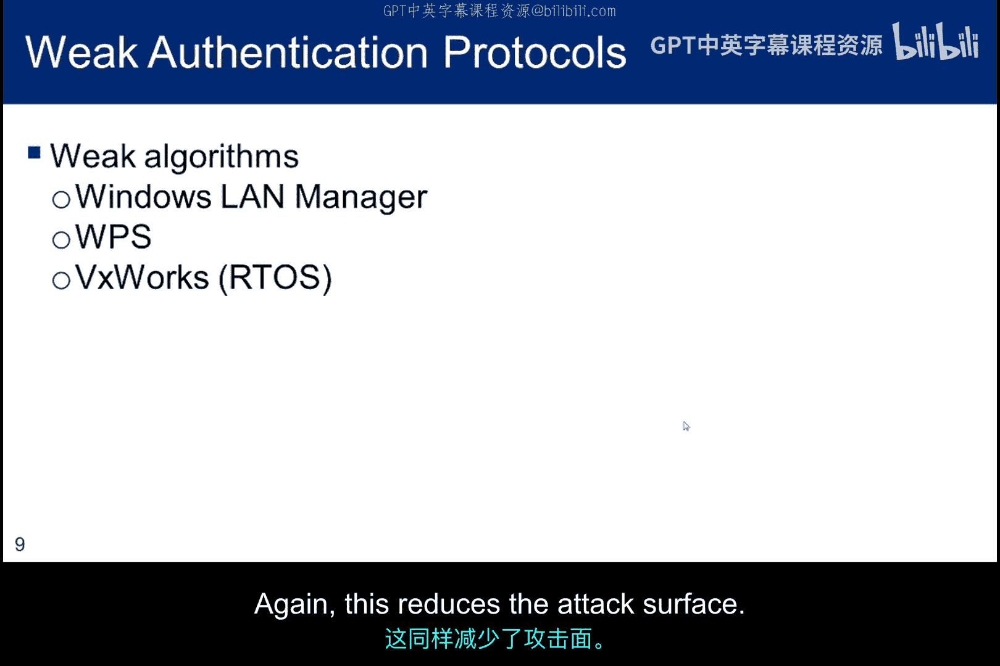

## 引导过程攻击 💾

协议层面的弱点可能被远程利用，而物理访问则带来另一类风险。我在第一个子模块中演示了引导加载程序的漏洞，但尚未讨论另外两个引导问题。

以下是引导过程中可能存在的安全问题：
*   Sun OS允许引导进入单用户模式。在获得系统上的权限后，有可能将这些权限扩展到整个服务器网络。
*   如果你有物理访问权限，有时可以从Live CD或USB设备启动，从而访问系统磁盘。
*   在PC上运行的Windows系统通常可以用其他操作系统（如Linux）重新启动。一旦启动其他系统，NTFS卷就可以被挂载和访问，因为攻击者已经绕过了Windows内的访问控制机制。这是窃取Windows密码文件的好方法。

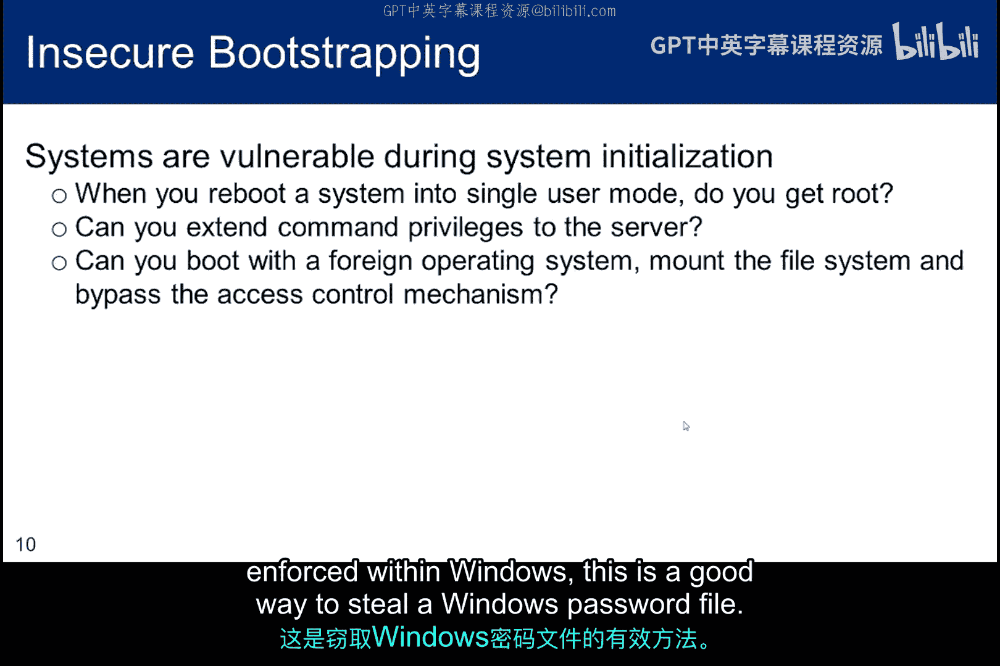

## 安全配置与STIG 📋

为了防御上述各种攻击，严格的安全配置至关重要。在美国国防部，安全需求指南为制定安全技术实施指南（STIG）提供了指导方针，STIG包含系统锁定信息。由产品供应商开发的STIG记录了适用于特定技术产品的国防部政策和安全要求，以及最佳实践和配置指南。

国防信息系统局（DISA）正在通过制定国防部对国家信息保障伙伴关系保护配置文件的附录来取代SRG流程，尽管对产品特定STIG的需求仍然存在。NAP通用标准评估的结果将用于制定STIG。

STIG将以XCCDF格式发布，以便自动化工具使用，通过添加OVAL代码，既可以评估合规性，也可以进行配置修复。可以使用基于主机的安全系统和安全内容自动化协议（SCAP）合规检查器，在整个企业范围内评估STIG合规性。

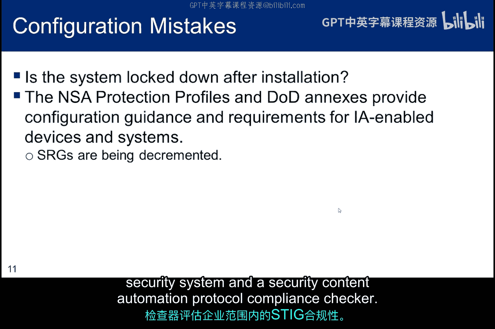

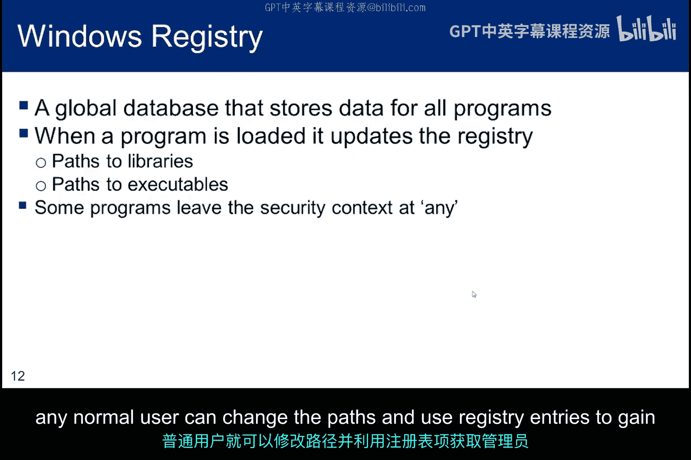

## Windows注册表与权限问题 🪟

在Windows中，注册表项可能具有安全上下文。不幸的是，有些程序将安全上下文留空。当发生这种情况时，任何普通用户都可以更改路径并使用注册表项来获取管理员权限并危害系统。

## 用户权限与历史漏洞案例 📜

Windows用户可能拥有管理员权限，但可能不了解这些权限的重要性。账户经常被这样配置，以便软件能够正确安装和运行。这意味着缺乏知识或粗心的用户只需单击一下即可轻松安装恶意软件。

Bit9是一种提供工具来控制软件安装的产品，但有时配置得过于严格，导致用户在工作中感到非常沮丧。在用户拥有管理员权限的情况下，危害任何用户账户都会给攻击者带来root权限。

为了激发我们对缓冲区溢出的深入探讨，这里有几个涉及Windows IIS Web服务器的古老但著名的例子：
*   “红色代码”溢出漏洞的影响之所以被放大，是因为索引服务在IIS中默认是启用的。同样，SQL Server也默认启用，即使它可能没有运行。
*   “红色代码”蠕虫利用了索引服务器中的缓冲区溢出漏洞，该漏洞允许执行指令以产生蠕虫行为。基本上，IIS错误地处理了HTTP请求，并以完全权限执行了数据包中包含的代码。
*   有趣的是，在该蠕虫出现前大约一个月，微软已经为IIS发布了补丁。那些已经打补丁的系统没有受到影响。这发生在2001年，当时管理员对安装补丁还不够警惕。事实上，微软未能给自己的更新服务器打补丁，导致一些用户在尝试打补丁时被感染。
*   几年后，“Slammer”蠕虫利用了SQL Server中的缓冲区溢出漏洞，SQL Server与IIS捆绑在一起，并且初始配置为启用。一个副作用是拒绝服务，因为蠕虫传播速度太快，堵塞了路由器并导致许多站点关闭。同样，补丁在六个月前就已经发布。

## 总结 📝

在本小节中，我们讨论了几种操作系统攻击向量。这些攻击方式都已被充分理解了一段时间。但当编写新软件时，其中一些问题又会重新出现。因此，无论是作为渗透测试者、系统防御者还是道德黑客技能的使用者，我们都需要思考这些问题。我们可以利用我们的知识来帮助改进系统防御。

如果你在观看本讲座的当天访问国家漏洞数据库，并搜索“缓冲区溢出”，你很可能会发现至少一个在你搜索日期前七天内被识别的缓冲区溢出漏洞。

在开始深入探讨缓冲区溢出之前，我们将花一些时间学习`setuid`，这是操作系统一个必要但有时脆弱的功能。

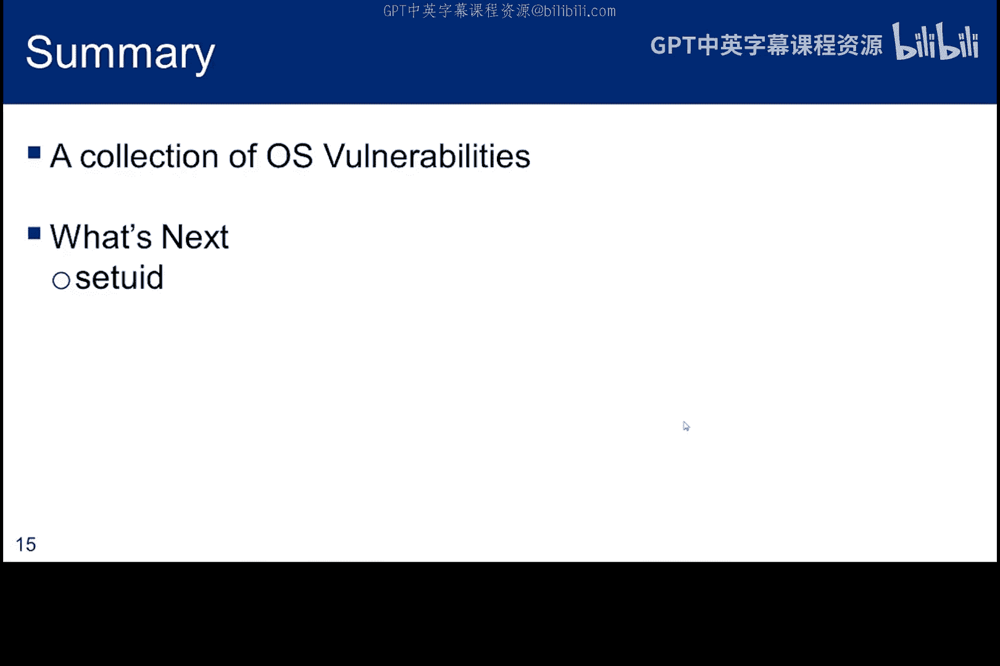

