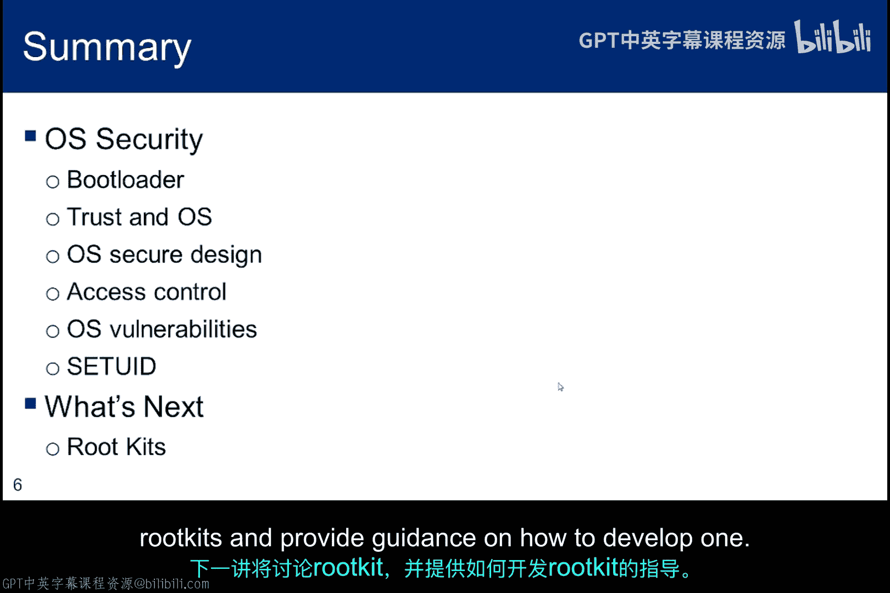
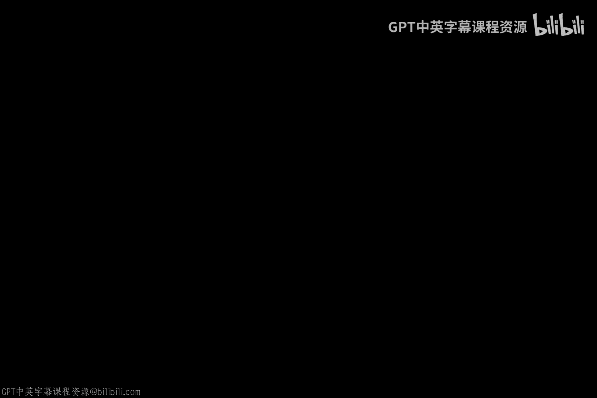

# 066：Setuid权限机制 🔓

在本节课中，我们将要学习Setuid权限机制。这是一种允许用户以临时提升的权限运行程序以执行特定任务的对象标志。如果能在拥有提升权限时脱离预定任务，就可能访问到本不该访问的对象。本小节将探讨一些Setuid漏洞的实例。

## Setuid标志概述

Setuid是一个可以使用`chmod`命令修改的标志。如前所述，它允许用户以临时提升的权限运行程序以执行特定任务。这对于需要比普通用户更高权限的任务是必要的，例如更改登录密码。当更改密码时，用户会暂时拥有root权限。

以下是一个例子：如果在`/usr/bin`目录下执行`ls -la`命令，你可能会看到`sudo`程序。仔细观察其权限，你会发现该可执行文件上设置了setuid权限位。某些Linux版本使用颜色编码来标识setuid程序。例如，在我的Debian系统上，setuid程序以红色高亮显示。

这个位指示内核，该程序应始终以文件所有者的用户ID（UID）来执行。对于`sudo`程序，所有者就是root。一旦`sudo`以root身份运行，它就可以执行必要的身份验证，并在调用请求的命令之前，通过`fork`和`setuid`系统调用来切换权限。

## 内部字段分隔符漏洞

内部字段分隔符（IFS）漏洞是过去滥用setuid的一个典型例子。攻击思路是，一个拥有临时root权限的程序可以被诱骗去执行用户提供的代码。

为了理解这一点，假设你将IFS环境变量设置为正斜杠`/`，而不是默认的空格。接下来，在当前目录中创建一个名为`bin`的恶意代码文件。

当程序执行系统调用运行`system("/bin/ls")`函数时，程序不会去遍历目录路径寻找`/bin/ls`这个二进制文件，而是会从当前目录运行名为`bin`的程序，并且该程序将以root权限运行。

这个漏洞已经通过确保shell不继承IFS变量得到了修复。

## 修改文件权限

`chmod`命令用于修改文件权限。其参数通常由几位数字组成：
*   第一位数字（可选）用于设置特殊属性：setuid值为**4**，setgid值为**2**，粘滞位值为**1**。
*   第二位数字设置文件所有者的权限：读为**4**，写为**2**，执行为**1**。
*   第三位数字设置文件所属组内其他用户的权限。
*   第四位数字设置既非所有者也非组内其他用户的权限。

例如，命令 `chmod 4755 filename` 会为文件设置setuid位，并赋予所有者读、写、执行权限，赋予组和其他用户读和执行权限。

## 实验环境准备

为了探索setuid，你需要构建一个虚拟机，可以使用Debian、Ubuntu或其他你选择的Linux版本。具体选择哪个发行版并不重要，但Kali Linux不适用，因为在该系统中你通常始终以root身份运行。

确保虚拟机运行后，检查是否安装了`zsh`，可以通过尝试运行它或查找`/bin/zsh`可执行文件来确认。如果未安装，请安装它。你还需要编译一些简单的C代码，因此请检查是否安装了GCC编译器。你可以直接输入`gcc`（不带文件名），看它是否尝试运行；它通常位于`/usr/bin`目录下。如果虚拟机上没有，请安装它。

## 动手实验

本小节要求完成一个动手实验，旨在探索setuid标志，以了解不良编程实践如何制造漏洞。事实上，由于潜在的安全问题，许多操作系统会忽略应用于可执行shell脚本的setuid属性。

实验包含四个部分，我已提供详细的实验指导，为你具体说明需要完成和用截图记录的内容。

前两部分涉及比较二进制文件在设置和未设置setuid位时的行为差异。

后两部分要求你编译我提供的C程序。一个程序将探究在设置setuid位时，使用相对路径可能带来的漏洞；另一个程序将演示，即使是一个编写良好的程序，在以临时root权限运行时也可能被利用。

## 课程总结

本节课中我们一起学习了操作系统安全的几个方面，包括重要的设计方法和有助于保护操作系统的访问控制机制。我们还探讨了不安全的引导加载程序和setuid编程错误作为可能的攻击向量。这些问题大多已存在很长时间，我们已理解它们，并且我们的系统正在不断改进，但仍有常规被发现的技术可以危害操作系统。下一讲将关于rootkit，并提供如何开发一个rootkit的指导。

