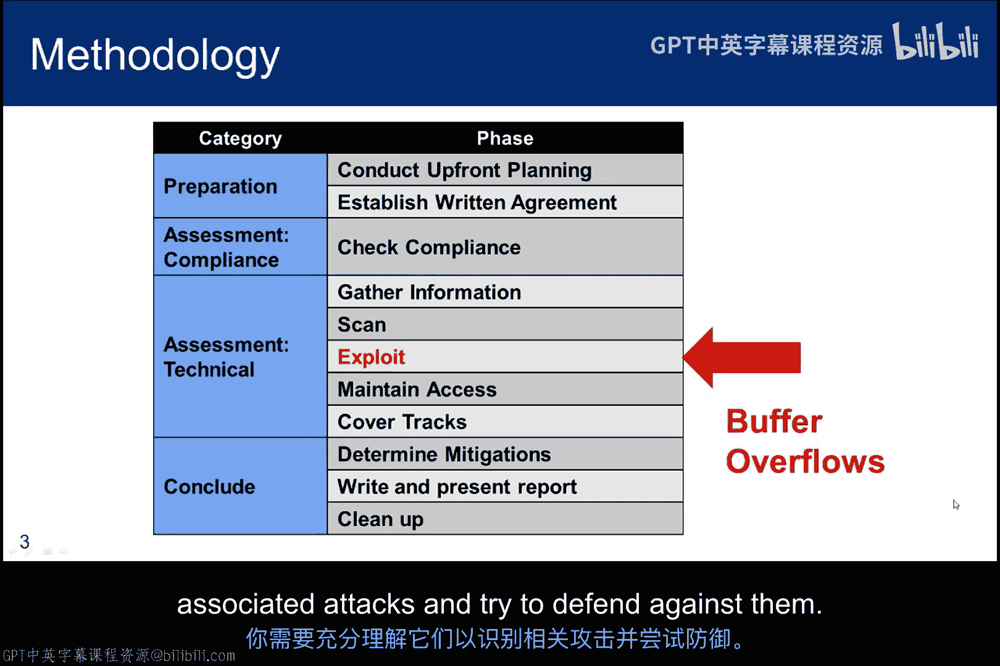
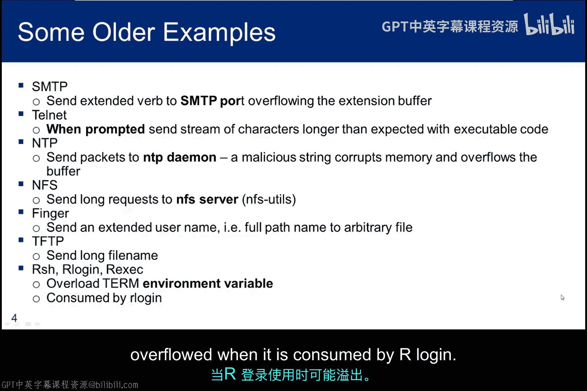
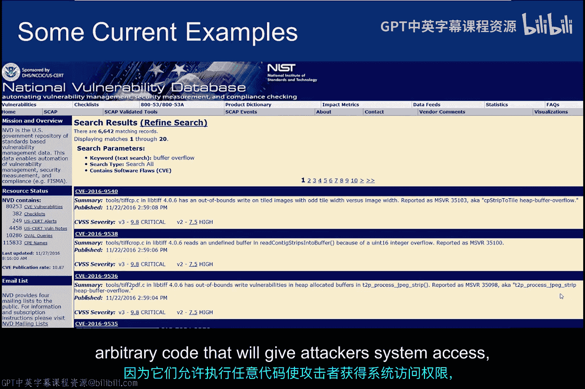
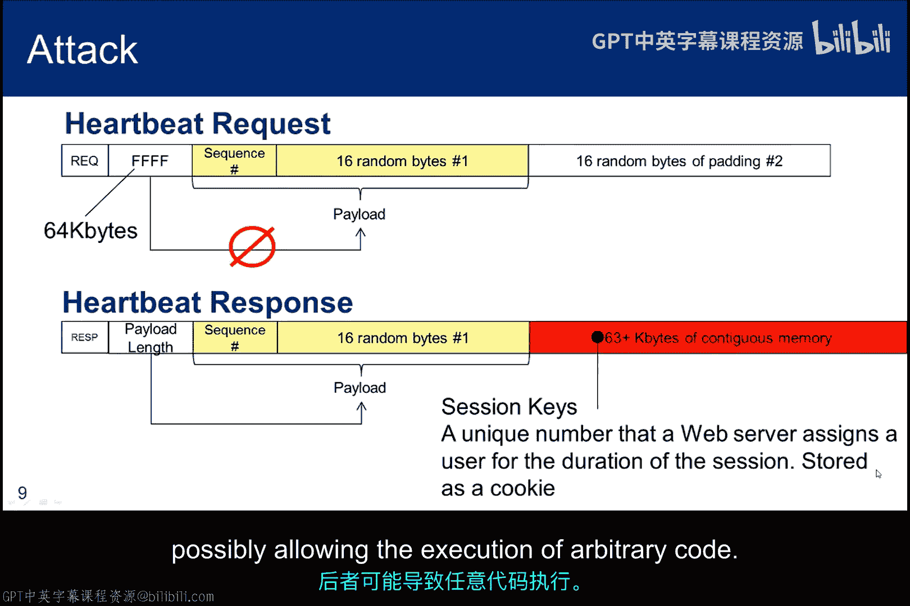
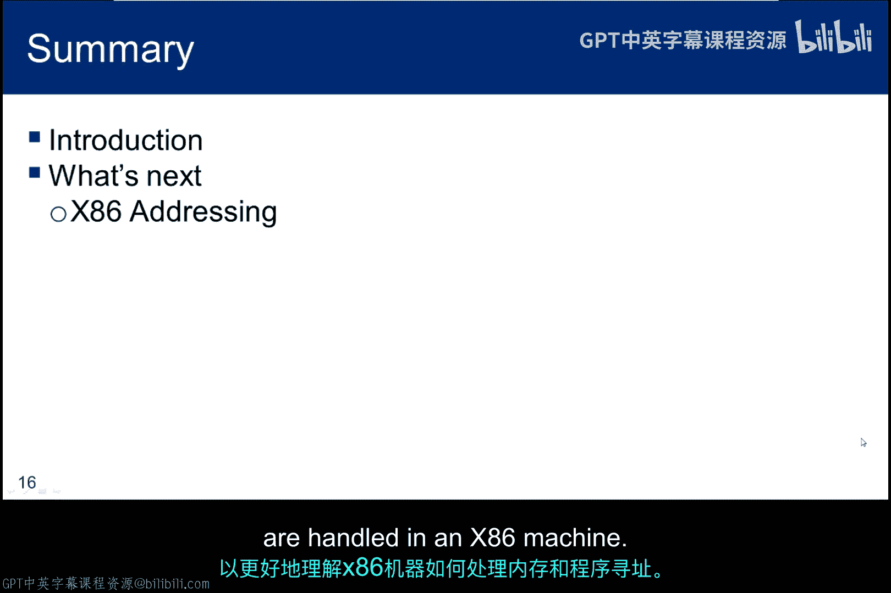

# 067：课程导论 🎯

在本节课中，我们将要学习缓冲区溢出攻击的基本概念、历史背景及其重要性。我们将从一篇开创性的论文《粉碎堆栈以获取乐趣和利润》开始，了解缓冲区溢出攻击的核心原理，并探讨为何这种攻击在当今网络安全领域依然至关重要。

## 缓冲区溢出的历史与背景 📜

上一节我们介绍了课程的整体目标，本节中我们来看看缓冲区溢出技术的历史渊源。

Frarack 是一本由黑客编写并为黑客服务的杂志，首次出版于 1985 年。它最初涵盖了电话系统破解和黑客技术。这本杂志至今仍在发行，并欢迎任何希望讨论相关主题原创想法的人投稿。黑客和安全专业人员都会使用并贡献其中的材料。

Aleph One 在 1996 年撰写了《粉碎堆栈以获取乐趣和利润》一文。它被作为 ASCII 文件发表在 Frarack 杂志第 7 卷第 49 期（1996年11月8日）。如果你查看第 49 卷的其他文章，会发现其中许多在当时都涉及电话系统。如今，你可以找到更易于阅读的 HTML 版本，但查看原始的 ASCII 版本仍然很有价值。《粉碎堆栈》是关于缓冲区溢出主题的开创性论文，我们将在本模块中详细研究它。

## 攻击技术与现实影响 ⚔️

缓冲区溢出和面向返回编程都是我们方法论中的漏洞利用技术。尽管道德黑客通常不使用这些技术，但攻击者（无论好坏）都会利用它们。因此，你需要充分理解它们，以便识别相关攻击并尝试进行防御。

以下是一些遭受缓冲区溢出攻击的旧程序示例：
*   对于 SMTP，攻击者向 SMTP 端口提供一个特制的扩展动词，允许执行任意代码。
*   对于 Telnet，当提示输入用户名时，攻击者提供一串比预期更长的字符，并包含可执行代码。
*   NTP 守护进程容易受到基于堆栈的缓冲区溢出攻击。
*   在 64 位架构机器上的 NFS，包含一个基于堆栈的缓冲区溢出漏洞。
*   远程攻击者可以通过在 finger 请求中用文件的完整路径名替换用户名，来查看系统上的任意文件。
*   TFTP 守护进程中的缓冲区溢出，允许通过一个长的文件名参数执行任意代码。
*   攻击者可以将 `TERM` 环境变量的值复制到一个内部缓冲区，当被我们的登录程序使用时，该缓冲区可能溢出。

## 漏洞的普遍性与持续性 📊

对国家漏洞数据库的搜索显示，有近 7000 条提及缓冲区溢出的漏洞记录。在我进行查询的当天发现了一个漏洞，前一天发现了一个，再前一天也发现了一个。这告诉我们，尽管多年来我们为应对这些漏洞采取了许多缓解措施，但它们仍然持续出现。如果你在观看本讲座的当天进行搜索，很可能会在前一周内看到一个缓冲区溢出漏洞。而且这不仅仅是冷门软件的问题。幻灯片上的最后一个 CVE 描述了一个 Mozilla Firefox 基于堆的缓冲区溢出。

本幻灯片和上一张幻灯片的要点是，我们确实需要理解这些攻击，因为它们允许执行任意代码，从而让攻击者获得系统访问权限，而且攻击面似乎并没有显著缩小。

## 心脏滴血：缓冲区“过读”攻击 💔

接下来，我想快速讨论导致心脏滴血攻击的 OpenSSL 漏洞。我之所以包含它，是因为太多工程师（甚至是安全工程师）将其称为缓冲区溢出攻击。**它不是**。尽管它确实涉及一个缓冲区，但它实际上是一种缓冲区“过读”攻击。我认为这不是一个常见的术语，但当我解释时，你会明白我的意思。更重要的是，当我们深入研究什么是真正的缓冲区溢出时，请思考心脏滴血与溢出的区别。

TLS 的某些实现可能导致隧道在没有数据发送时被丢弃。为了规避这个问题并保持隧道畅通（即使在不使用时），引入了“心跳”的概念。这是 SSL 的一个简单扩展，涉及在隧道上没有流量时，隧道两端之间周期性的请求和响应。

心跳的实现方式如下所示。首先，发送一个心跳请求，其中包含一个序列号和 16 字节的随机信息。当收到请求时，另一端通过从内存中读取相同的信息来响应。问题出现是因为响应者使用载荷长度字段来确定要返回多少字节。程序员确实检查了请求是否发送了 16 字节，但他没有检查载荷长度字段，看它是否请求返回 16 字节。

攻击过程如下：一个典型的 SSL 隧道，如果不强制相互认证，则只需要服务器凭证。这允许攻击者建立一个 SSL 隧道。现在，攻击者将心跳请求中的载荷长度字段从 `0,0,1,0` 更改为 `F,F,F,F` 并发送请求。响应者本应只在返回中包含 16 字节。但代码读取了载荷长度字段，并认为载荷应该是 65535 字节。因此，代码从初始载荷所在的内存区域读取那么多字节。所以，响应最终不仅包含那 16 字节，还包括缓冲区之后该内存区域中剩余的 64KB 数据。

谁知道那段内存中存储了什么？有时可能不是有用的信息，但有时它包含会话密钥。如果合法用户已登录，攻击者就可以劫持会话。这正是攻击发生的方式。随着我们在本模块中继续学习，请记住，这种攻击是关于读取缓冲区末尾之后的数据，而不是向缓冲区放入超过其容量的信息（从而可能允许执行任意代码）。

## 深入底层：学习路径与目标 🛠️

因此，我们将深入研究缓冲区溢出，学习汇编级代码，计算和反汇编任意字节，并跟踪堆栈活动。关键不是要成为逆向工程师或汇编级程序员。你只需要学习足够的知识来理解缓冲区溢出的细节。这项工作会变得繁琐，你会遇到必须解决的障碍，但这会让你学到很多东西。到最后，你将成为缓冲区溢出方面的专家，并对已实施的一些缓解措施有详细的了解。不要害怕深入其中并亲自动手，因为学习黑客技术不是一项旁观者的运动。

缓冲区溢出的风险最早在 1972 年被认识到，并在 James P. Anderson 公司为 ESD 撰写的题为《计算机安全技术规划研究》的报告中进行了讨论。这似乎很有先见之明，因为当时还没有互联网和个人电脑，也没有人观察到过这种攻击的例子。

## 缓冲区溢出攻击的发展历程 🚀

然后 16 年后，在 1988 年，罗伯特·莫里斯在互联网上发布了第一个已知的计算机蠕虫，它利用来获取访问权限的漏洞之一就是 finger 守护进程中的缓冲区溢出缺陷。提醒一下，莫里斯是第一个根据《计算机欺诈和滥用法》被起诉的人。整个事件对他的父亲来说相当尴尬，他父亲当时担任 NSA 国家计算机安全中心的首席科学家，并在计算机安全标准“彩虹系列”的开发中发挥了重要作用。

又过了七年，慕尼黑大学的 Thomas Lopatic 于 1995 年发布了针对 HP-UX 上 NCSA HTTPD 的堆栈溢出漏洞利用。NCSA HTTPD 是最早的 Web 服务器之一。这次攻击基于这个早期 Web 服务器中的一个堆栈溢出漏洞，该服务器由伊利诺伊大学的国家超级计算应用中心开发。顺便提一下，当该 Web 服务器的开发停滞时，代码被分叉出来启动了 Apache 项目，该项目当然在互联网兴起过程中起到了基础性作用。目前尚不清楚为什么 Lopatic 的工作没有像《粉碎堆栈以获取乐趣和利润》那样获得广泛关注。我猜是因为它只是针对特定服务器的漏洞利用，而《粉碎堆栈》更像是一个试图捕捉缓冲区溢出概念的教程，其目标是通过单一的抽象来概括和解释许多不同漏洞利用的内容。

在堆栈溢出的概念被更好地理解之后，人们开始考虑缓解措施，下一步就是堆溢出。概念非常相似，但限制堆活动更为复杂，因为堆是一个更健壮的结构，必须允许处理更自由形式的数据。在操作系统实施了许多缓解措施（如 DEP 和 ASLR，我们稍后会讨论）之后，攻击者寻找新的技术来控制堆栈，其中较新的发展之一是“返回至 libc”，我们也将在本系列模块中讨论。

返回至 libc 攻击是一种改进的方法，它始于缓冲区溢出，但调用堆栈上的返回地址被替换为已加载在二进制文件或共享库中的函数的地址。此时术语可能令人困惑，但别担心，我会一步一步带你了解。

## 核心概念：缓冲区溢出攻击原理图解 🎨

这个简单的图形捕捉了缓冲区溢出攻击的高级思想。相对寻址是操作系统的一个基本属性，它分配内存并将进程放入该内存空间执行。其思想是操作系统跟踪一个基地址，并能够通过添加偏移信息来找到所有其他指令和相对于该基地址的内存位置。

当一个程序调用一个函数时，左侧的灰色堆栈代表了发生的情况。堆栈用于跟踪信息，从顶部开始。返回指令指针是函数结束后要执行的下一条指令。然后，一堆重要信息被保存在堆栈上，底部是在堆栈上分配的一个缓冲区，因为它是在函数中定义的，需要为其分配内存。

右侧红色的相同堆栈显示了攻击者的操作。首先，它创建一个包含两部分的数据集。一部分是 shellcode。它之所以被称为 shellcode，是因为当它执行时，会为攻击者启动一个 shell。数据集的第二部分将是指向 shellcode 的地址。这个地址被反复复制。有了这个数据集，当攻击者被要求输入要放入缓冲区的数据时，他发送了别的东西。他输入他的数据集，其中包含 shellcode 和地址信息。如图所示，shellcode 被放在缓冲区的底部。然后，缓冲区被 shellcode 的地址填满，所有重要的东西都被 shellcode 的地址覆盖。最后，如果数据集足够大，指令指针将被覆盖，从而改变被调用进程结束时的返回指令。当这种情况发生时，指令指针指向 shellcode 而不是调用程序，于是 shellcode 被执行。这个技巧（在简单图形中没有体现）是正确确定 shellcode 的起始地址。这就是填充数据集和覆盖堆栈所需的地址。

## 关键问题与学习主题 ❓

基于对堆栈溢出的高级描述，这些是我们需要回答的问题：
*   缓冲区在哪里？我们如何将数据集放入其中？
*   缓冲区有多大？它可能太大，以至于你没有添加足够的返回地址来达到堆栈顶部；或者它可能太小，以至于 shellcode 放不下。
*   最后，我们如何确定 shellcode 在目标内存空间中将拥有的地址，以便使其执行？

以下是我们在本子模块中将讨论的主题列表：
*   X86 架构概述
*   内存布局与程序执行
*   函数调用与堆栈帧
*   缓冲区溢出原理详解
*   Shellcode 编写与注入
*   地址确定与利用构造
*   现代缓解措施（DEP， ASLR）
*   返回至 libc 攻击

## 总结 📝

本节课中我们一起学习了堆栈缓冲区溢出的基本介绍。其核心思想是将一些 shellcode 放入缓冲区，然后用 shellcode 的地址溢出缓冲区。当缓冲区被写入堆栈时，shellcode 的地址会覆盖调用函数的返回地址。结果是 shellcode 被执行，而不是返回到调用函数中的下一条指令。如前所述，挑战在于：第一，找出缓冲区在堆栈上的位置；第二，确保 shellcode 能放入缓冲区；第三，使 shellcode 得以执行。

接下来，我们将非常快速地了解一下 X86 架构，以便更好地理解 X86 机器中如何处理内存和程序寻址。