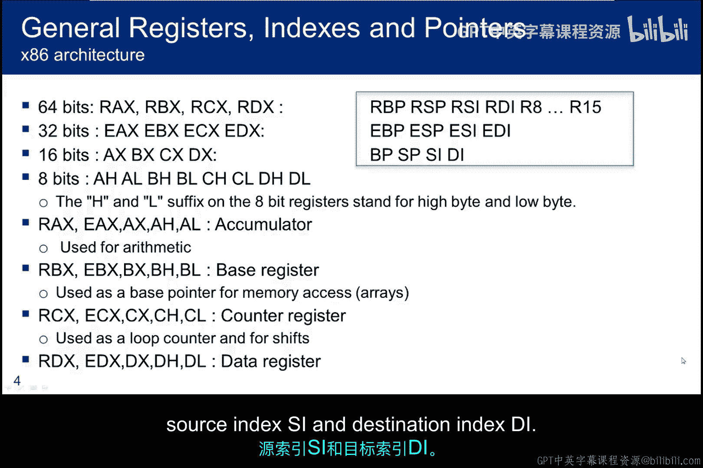
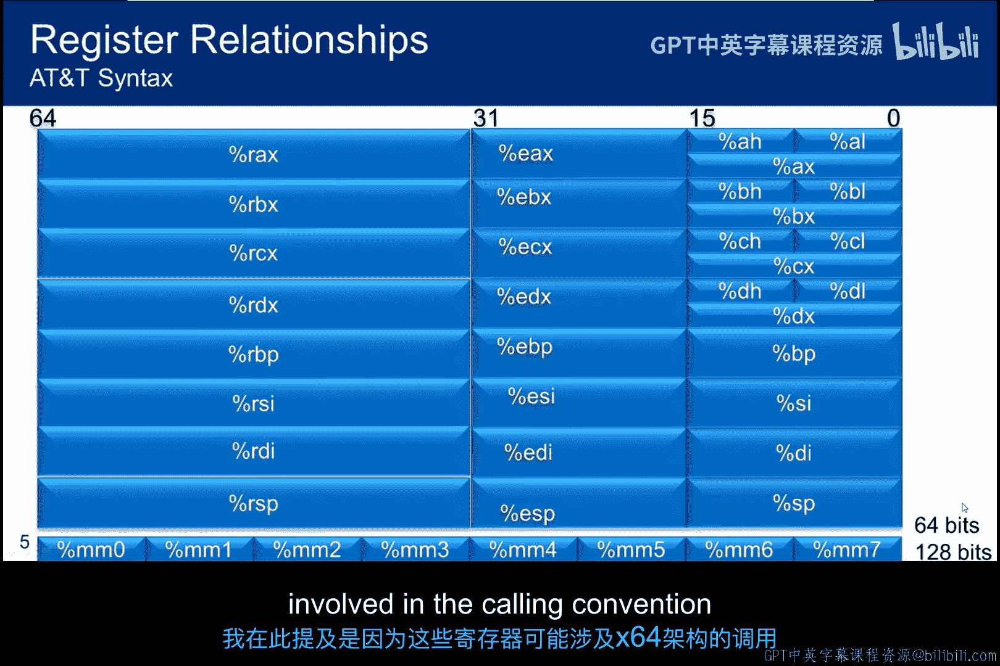
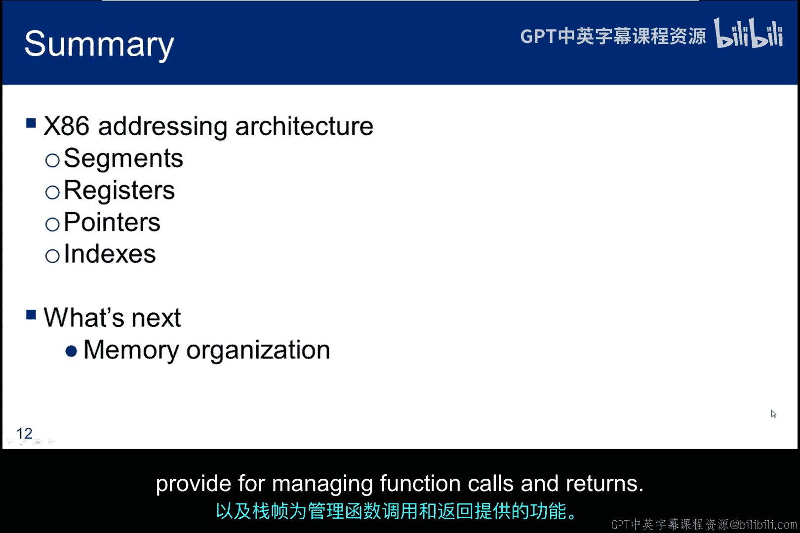

# 068：x86体系架构

在本节课中，我们将学习x86体系架构的寻址方式。理解这部分内容是解释栈的工作原理以及Shellcode如何真正运行的基础。

我们将简要提及64位架构，但重点放在自1985年就已存在的32位架构上。64位架构则大约在2000年左右出现。为了能够创建和理解Shellcode的行为，我们需要讨论以下三个主题。

## 段寄存器、通用寄存器与指针索引

上一节我们介绍了本课程的目标，本节中我们来看看构成x86寻址基础的三个核心组件。

1.  **段寄存器**：为我们提供了一种跟踪代码、数据和栈位置的方式。它们也为相对寻址提供了基地址信息。
2.  **通用寄存器**：提供了操作和移动数据的位置。
3.  **指针和索引寄存器**：提供了管理基地址偏移和在内存中查找内容的能力。

## 内存段详解

以下是x86架构中定义的四种主要内存段。

*   **代码段**：存放进程加载后待执行的指令。它是只读的，以防止代码在运行时被修改。
*   **数据段**：存放程序员初始化的全局变量和静态变量。它是可读写的，因为变量值在执行过程中可能需要修改。
*   **栈段**：一个后进先出的数据结构，用于保存地址以管理函数调用时的状态变化。
*   **扩展段**：提供对更大内存空间的访问。在像C这样的语言中，你可以声明一个`far`指针，这时就会使用扩展段，允许你访问当前段之外的内存地址。数据段和代码段都属于“近”段。

## 寄存器命名与结构

这些是调试器、汇编器和反汇编器将使用的通用寄存器、指针和索引寄存器的名称标签。

本页幻灯片主要关注通用寄存器。但为了完整性，我也包含了指针和索引寄存器的名称：基指针 **BP**、栈指针 **SP**、源索引 **SI** 和目的索引 **DI**。我们将在后续幻灯片中详细讨论它们。

这张图展示了x86架构演进过程中保持的物理寄存器关系。例如，64位 **RAX** 寄存器的低32位是 **EAX** 寄存器，而 **EAX** 寄存器的低16位是 **AX** 寄存器。**AX** 寄存器又分为高字节 **AH** 和低字节 **AL**。其他通用寄存器结构类似。

副标题“AT&T语法”指的是使用百分号 `%` 来表示寄存器名称。随着本模块的进行，我们将进一步讨论这一点。但每当我们启动汇编器或调试器查看底层代码时，工具会使用这种表示法或略有不同的Intel表示法，我们需要对两者都有基本的了解。

## MMX寄存器与64位架构简介

**MMX寄存器**（MM0到MM7）是Intel架构的一个扩展，它使用单指令多数据执行模式，允许同时处理多个数据元素。应用程序使用这些寄存器通过小整数进行并行计算，用于2D/3D图形、图像处理、虚拟现实、音频合成和数据压缩。我们在这里提到它们，是因为这些寄存器可能参与x64架构的调用约定。

以下是关于64位架构的简短说明。我提及这些概念是因为如果你使用64位虚拟机，本模块中的一些示例可能无法在你的环境中运行，或者运行方式会略有不同。

**应用二进制接口** 是两个程序模块之间的接口，其中一个通常是操作系统。它决定了诸如函数如何调用、信息应以何种二进制格式从一个程序组件传递到下一个（或在系统调用的情况下传递给操作系统）等细节。ABI决定了**调用约定**，它控制函数参数如何传递以及返回值如何获取。

在32位架构中，调用函数时所有参数都通过栈传递。但64位架构并非如此，它只在参数超过6个时才将额外的参数放在栈上。前6个整数或指针参数通过寄存器传递：**RDI, RSI, RDX, RCX, R8, R9**。而 **XMM0** 到 **XMM7** 用于传递浮点参数。任何超过6个的额外参数都通过栈传递，返回值存储在 **RAX** 中。

寻址方式在64位机器上也略有不同。遗憾的是，在当前CPU设计中并未使用完整的64位寻址能力，因为地址总线有限。只使用了64位地址中的48位，但仍提供了256TB的地址空间。虽然这已经是很大的内存，但这种实现方式在地址中留下了两个未使用的空字节。这种方法会影响缓冲区溢出示例，因为它们通常使用字符串操作符，而字符串操作符在看到空字节（`\0`，表示字符串结束）时通常会终止。因此，我们将在本模块中讨论的一些代码在64位虚拟机上无法正常工作。

## 有效地址计算

通过段描述符、页目录和页表，x86内存模型非常复杂，超出了本讲座的范围。但我们需要理解在汇编代码中看到的内容。

这张图展示了有效地址的表示方式。底部是两个具体示例：第一个使用Intel语法，第二个使用AT&T语法表示相同的表达式。

参数偏移量的计算方式是将基地址加上缩放后的索引值，再加上位移量。在第一个使用Intel语法的例子中，有效地址偏移量可以看作一个从左到右读取的数学等式。AT&T语法则不那么直观，位移量被移到了前面，但计算方式是相同的。

## 指针与索引寄存器的用途

这展示了通常与不同段寄存器一起使用的索引和指针寄存器，以及每种寄存器的常见用例。顺便说一下，“E”代表“扩展”，是16位架构扩展到32位时的遗留产物。虽然技术上不准确，但我在讨论指针时有时会省略“E”，不过我几乎总是指的是扩展指针。

请注意，指令指针是只读的，只有操作系统可以修改它。此外，栈是一个后进先出的结构，栈指针负责跟踪栈顶。基指针通常作为栈指针的参考点，但它会在新的函数调用时或函数完成并返回到调用程序时发生变化。

## Intel与AT&T语法差异

现在，简单介绍一下Intel语法和AT&T语法之间的区别。

1.  **立即数**：AT&T语法中，立即数前加美元符号 `$`。Intel语法中，立即数不加修饰。
2.  **寄存器**：AT&T语法中，寄存器前加百分号 `%`。Intel语法中，寄存器不加修饰。
3.  **操作数顺序**：AT&T和Intel语法对源操作数和目的操作数使用相反的次序。Intel语法是 **从右到左**（目的， 源），AT&T语法是 **从左到右**（源， 目的）。
4.  **操作数大小**：在AT&T语法中，内存操作数的大小由操作码名称的最后一个字符决定。操作码后缀 `b`, `w`, `l`, `q` 分别指定字节、字、长字和四字内存引用。Intel语法通过在内存操作数前加 `byte ptr`, `word ptr`, `dword ptr`, `qword ptr` 来实现。`mov` 指令没有后缀，可以根据上下文推断是字节还是字操作。
5.  **常数表示**：在AT&T语法中，十六进制数前缀为 `$0x`。在Intel语法中，十六进制或二进制立即数分别用后缀 `H` 和 `B` 表示。此外，如果十六进制数的第一个数字是字母，则该值前面必须加一个 `0`。
6.  **内存位置**：在Intel语法中，基寄存器用方括号 `[]` 括起来，而在AT&T语法中，用圆括号 `()` 括起来。

下表总结了两种语法中内存操作数的处理方式。但更有趣的是子标题下的语句。Intel语法中的两条相对简单的语句实现了与AT&T语法中两条语句相同的结果，但它们看起来却大不相同。

当你尝试单步执行程序时，请注意正在使用哪种语法，这样你才能知道值从哪里移动到哪里，哪些是常数，以及内存位置的偏移量是多少。如果你以前没有在这个级别工作过，这一切可能会相当令人困惑。

## 总结与下节预告

在本小节中，我们讨论了段寄存器、通用寄存器、指针和索引寄存器。我们还介绍了Intel和AT&T两种寻址语法。

在下一小节中，我将讨论内存是如何组织的，重点讲解栈、栈的工作原理以及栈帧为管理函数调用和返回提供了哪些功能。

