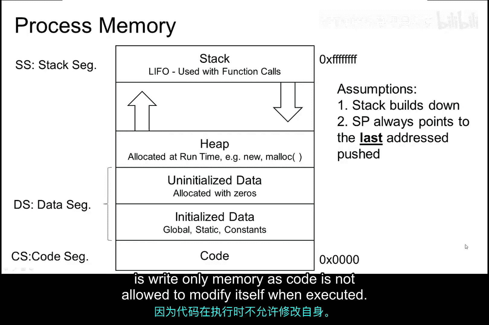
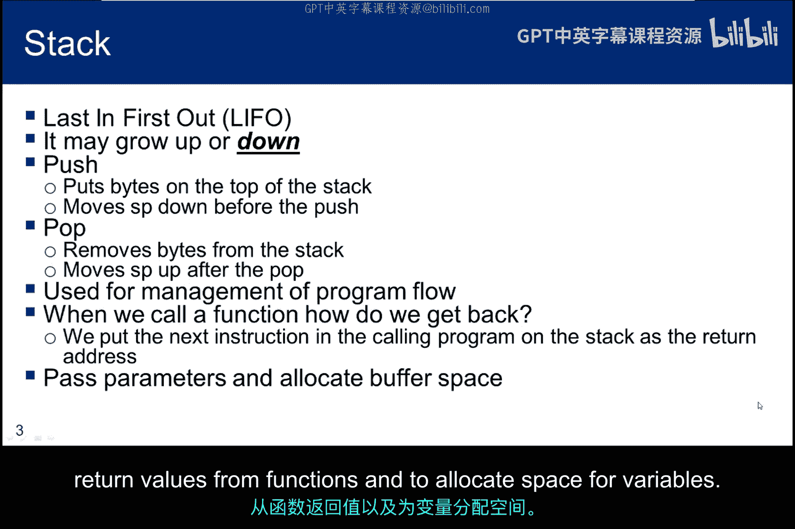
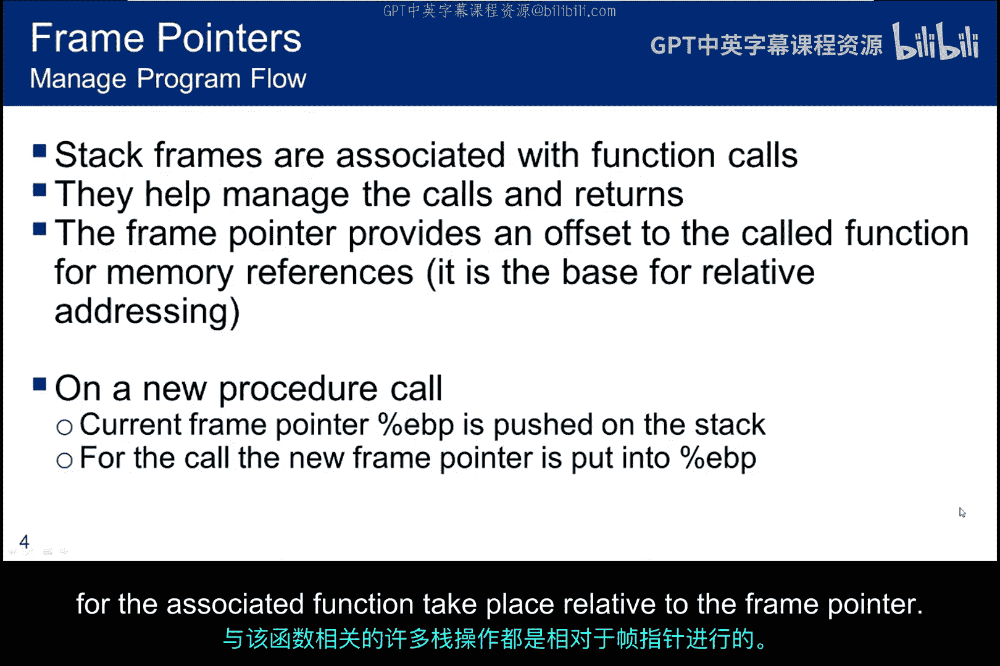
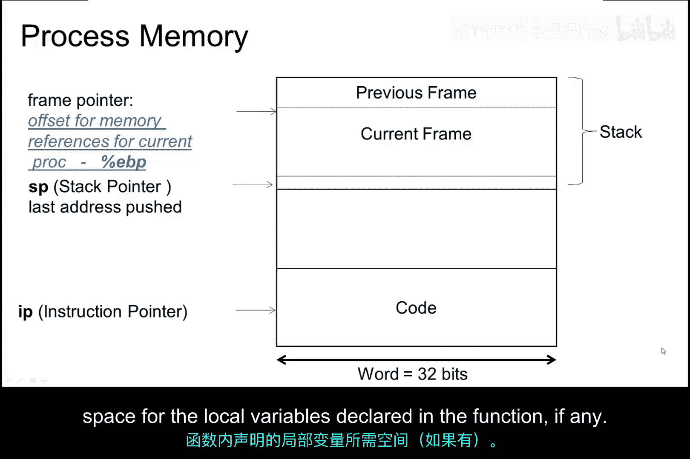
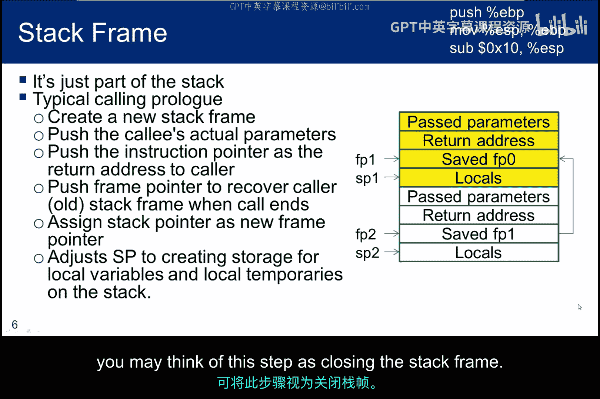
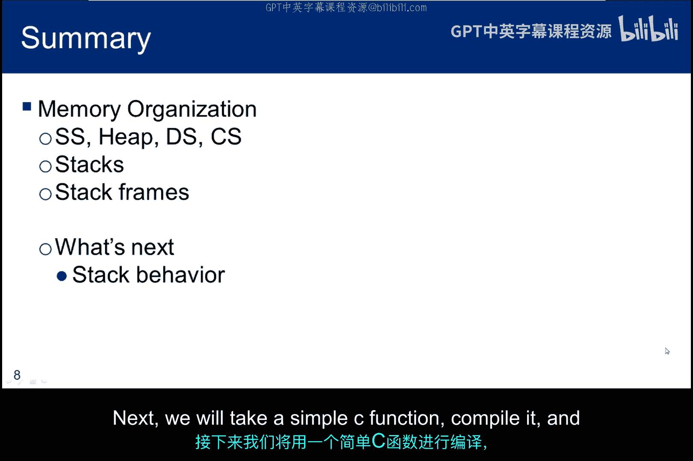

# 069：内存组织结构 🧠

在本节课中，我们将学习进程内存的组织结构，重点了解栈（Stack）的工作原理、栈帧（Stack Frame）的构成，以及它们如何管理函数调用与返回。

## 概述

本小节将阐述内存的使用方式、各个内存段之间的相对位置关系，以及栈是如何构建的。

下图展示了一个32位进程的内存布局，起始于高内存地址。

## 内存段详解

### 栈段（Stack Segment）

在内存的高地址区域，我们找到了栈段。每次数据被压入（push）栈时，栈指针（Stack Pointer）会递减；每次数据被弹出（pop）栈时，栈指针会递增。在本课程中，我们假设栈从高地址向低地址方向增长，并且栈指针总是指向最后被压入的地址，而不是下一个将要被压入的地址。这意味着栈指针在压入操作**之前**递减。

> **注意**：这两个假设非常重要，因为并非所有操作系统都以相同的方式实现栈。

### 堆段（Heap Segment）

堆使用的内存在运行时动态分配。堆位于栈段中，并向栈的方向增长。你可能听说过“栈缓冲区溢出”和“堆缓冲区溢出”这两个术语。上图显示它们是紧密相关的。堆可能被认为稍微更有吸引力，因为对其行为的约束更少。

### 数据段（Data Segment）

内存中下一个段是数据段，它也有两个基本组成部分：由程序员初始化的数据，以及已分配但未初始化的数据（例如数组）。这当然是一个可读写的段，这对于变量值改变时的更新是必要的。

### 代码段（Code Segment）

最后，我们拥有代码段，它包含可执行代码，并且是只读内存，因为代码在执行时不允许修改自身。

## 栈的工作原理

栈始终是一个后进先出（LIFO）的结构。但如前所述，你需要检查你的操作系统中栈的行为方式以及它何时递增。

在我们的所有示例中，栈将向下增长，这意味着栈指针在压入操作前递减。当我们从栈中弹出内容时，栈指针递增。

当我们调用一个函数时，通常希望在函数结束时返回到函数调用之后的语句。因此，返回地址（即调用指令之后的下一条指令地址）会在函数被调用时被压入栈中。

栈还用于向函数传递参数、从函数返回值，以及为变量分配空间。

## 栈帧（Stack Frame）

栈帧是栈的一部分，与尚未通过返回语句终止的子程序调用相关联。这个结构管理着程序进入函数、离开函数以及在函数内部的执行流程。

帧指针（Frame Pointer）指向帧的起始位置，它被保存在基址指针寄存器（Base Pointer Register）中。

如果函数1在自身结束前调用了函数2，那么函数1的帧指针会从基址指针寄存器中被压入栈，并为函数2在栈上创建一个新的帧。新帧的地址（通常称为帧指针）会被放入基址指针寄存器中供函数2使用。当函数2结束时，函数1的帧指针将从栈中弹出到基址指针寄存器中，供函数1使用。

帧指针通常被用作基地址，与该函数相关的许多栈操作都相对于帧指针进行。

下图展示了与函数调用相关联的帧。

帧帮助管理与当前正在执行的例程相关联的当前帧的调用和返回。帧指针位于EBP寄存器中。

## 栈帧的构成

栈帧通常至少包含以下项目：

1.  **传递给函数的参数**（如果有的话）。
2.  **返回地址**，用于返回到函数的调用者。
3.  **函数内部声明的局部变量**所占用的空间（如果有的话）。

下图是两个函数的静态图示。函数1正在运行并调用了函数2。在新的调用中，在为新的调用启动新的栈帧之前，需要将现有函数的局部变量压入栈以关闭其栈帧。

以下是新帧的构建步骤：

1.  **压入参数**：首先进入新帧的是函数2执行其任务所需的参数。参数以**相反的顺序**被压入栈中（最后一个参数先入栈）。
2.  **压入返回地址**：其次进入帧的是函数1的返回地址，以便操作系统在函数2终止时能找到返回函数1的路径。
3.  **保存旧的帧指针**：第三进入帧的是函数1的旧的帧指针，这样当新的帧指针被放入基址指针寄存器时，旧的帧指针不会丢失。
4.  **设置新的帧指针**：随后，将当前栈指针（ESP）的值赋给EBP，从而将新的帧指针设置到存储旧帧指针的这个位置。
5.  **分配局部变量**：最后，为局部变量和临时变量分配空间。你可以将此步骤视为关闭栈帧。

本幻灯片展示了AT&T汇编指令，用于保存旧的帧指针、为新进程分配新的帧指针以及在进程结束后恢复旧的帧指针。

## 总结

在本小节中，我们讨论了内存的组织方式，重点聚焦于栈。我们学习了栈如何工作，以及栈帧为管理函数调用和返回提供了哪些功能。接下来，我们将以一个简单的C函数为例，编译它并观察其栈的行为，以确切了解它是如何运作的。