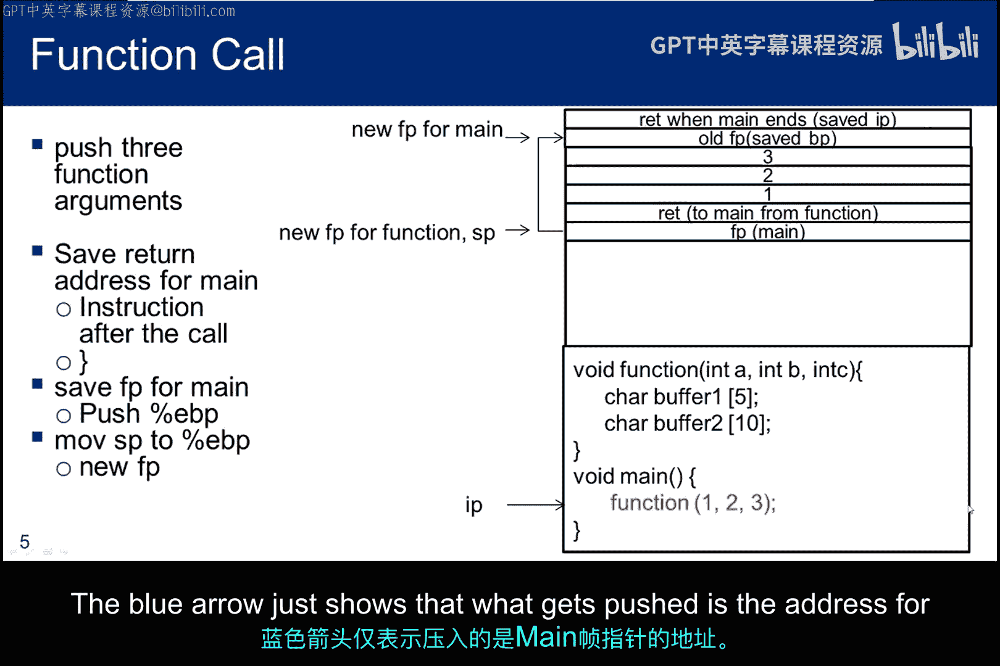
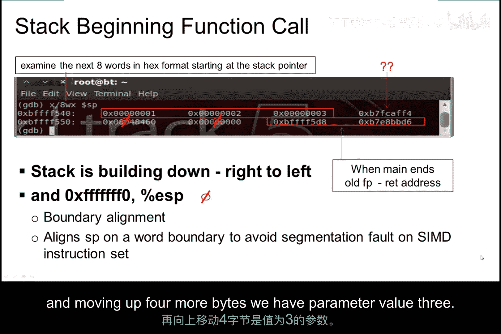
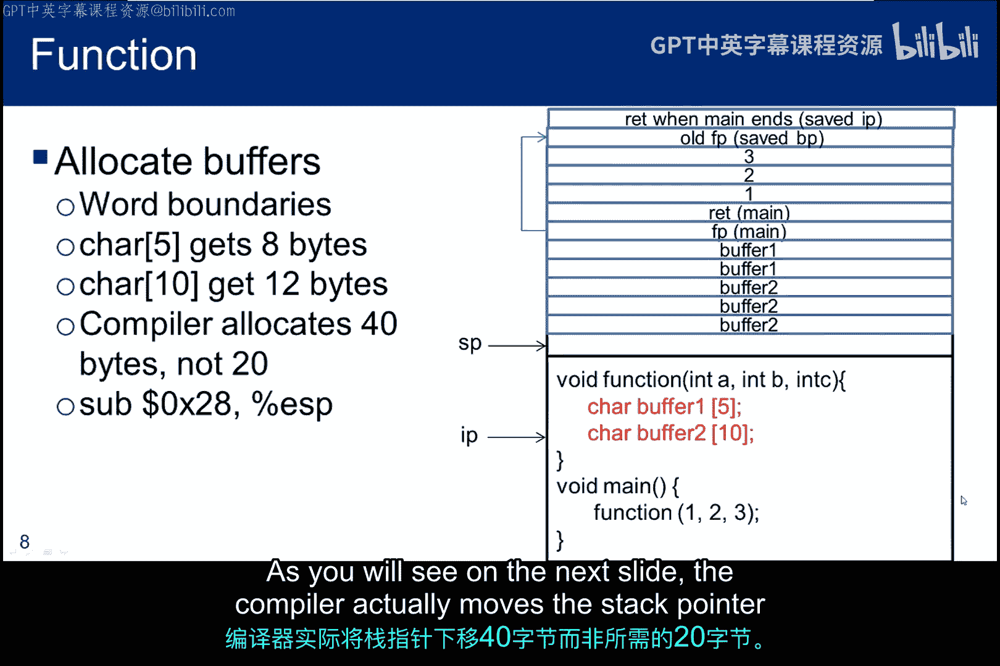
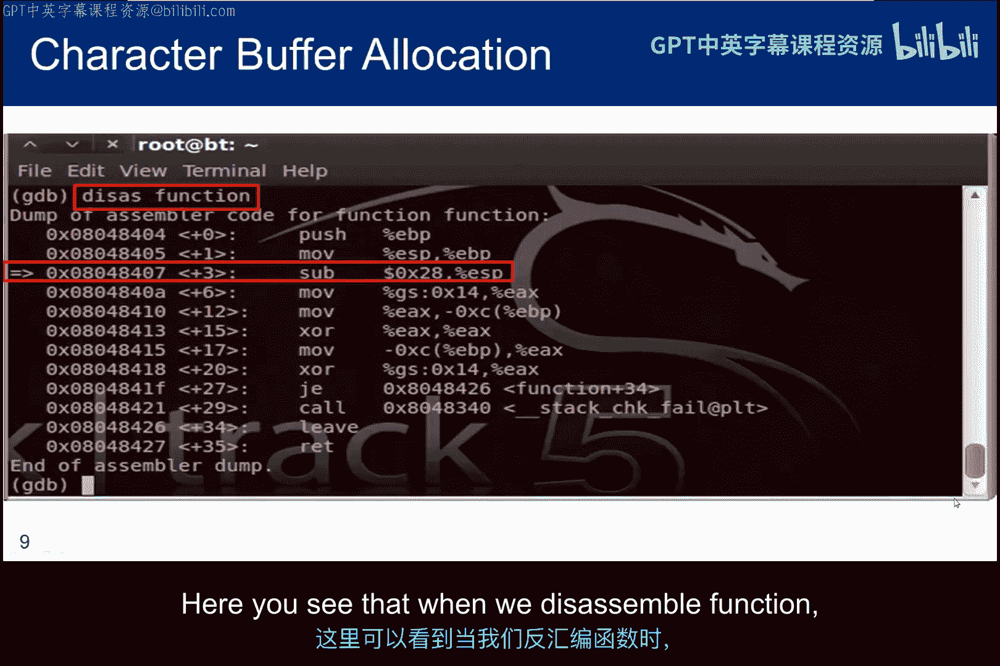
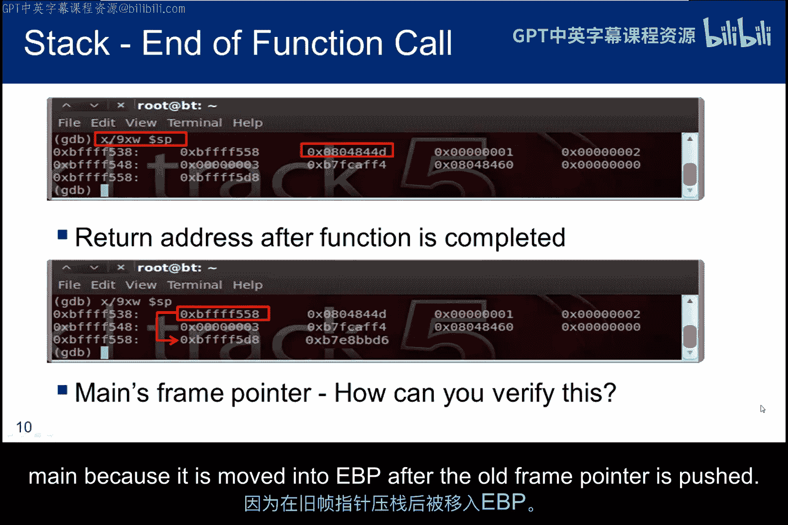
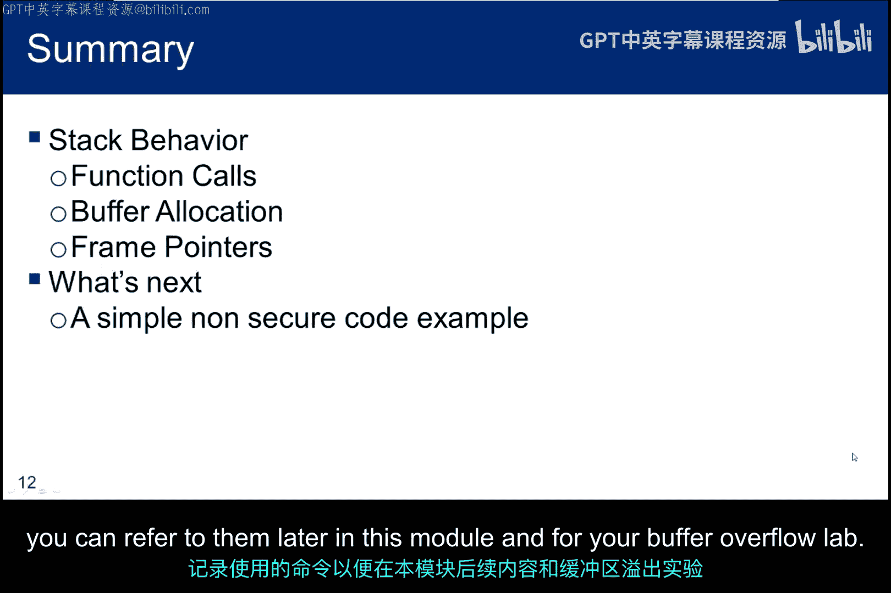

# 070：堆栈行为分析 🧱

在本节课中，我们将通过一个简单的C语言程序，深入分析函数调用时堆栈帧的构建与销毁过程。我们将具体观察函数参数如何传递、帧指针如何管理，以及局部变量（包括缓冲区）的内存是如何分配的。

## 概述

我们将分析一个调用函数并传递三个参数（1， 2， 3）的简单C程序。该函数内部会分配两个字符缓冲区，然后返回主函数。通过编译和调试此程序，我们将直观地理解堆栈在程序执行期间的变化。

## 程序与编译

我们使用的程序名为 `stack.c`。使用GCC编译器进行编译，命令如下：
```bash
gcc -g stack.c -o stack
```
其中，`-g` 开关用于在可执行文件中生成调试信息，以便后续使用GDB进行调试分析。

## 堆栈帧构建过程分析

上一节我们介绍了程序的基本情况，本节中我们来看看主函数 `main` 开始执行时，堆栈的初始状态。

当操作系统调用 `main` 函数时，堆栈顶部会保存命令行接口中下一条指令的返回地址。`main` 函数开始执行后，首先会将当前的基指针（即旧的帧指针）压入堆栈保存。



紧接着，堆栈指针（SP）被移动到新的位置，从而为 `main` 函数建立新的帧指针（FP）。

## 函数调用与参数传递

现在，我们进入 `stack.c` 的第二条指令。在调用函数之前，需要将参数压入堆栈。

以下是参数传递的步骤：
1.  三个函数参数以**逆序**被压入堆栈。
2.  调用函数后，主程序中下一条指令的地址（即返回地址）被压入堆栈。
3.  主函数的帧指针被保存，并为被调用的函数创建新的帧指针。

值得注意的是，在压入参数之前，编译器通过将堆栈指针下移16字节来分配栈空间，而不是程序实际请求的12字节。这多出的4个字节（位于 `SP+12` 处）是出于内存对齐的考虑。

## 函数内部的局部变量分配

回到 `stack.c`，函数调用已完成。函数内部唯一的任务是分配两个字符缓冲区。

内存分配必须在字边界上进行。因此：
*   一个5字符的缓冲区会分配2个字（8字节）。
*   一个10字符的缓冲区会分配3个字（12字节）。

然而，观察反汇编代码会发现，编译器实际上将堆栈指针下移了40字节（`0x28`），远大于所需的20字节。这再次体现了编译器为满足对齐和优化可能进行的额外分配。

## 验证帧指针与返回地址







我们可以在函数结束前、帧指针被弹出堆栈之前设置断点，以检查堆栈状态。

通过GDB命令 `x/8wx $sp`，我们可以查看从当前堆栈指针开始的8个字（以十六进制格式）。通过分析堆栈内容，我们可以找到：
*   返回地址：它指向主函数中 `leave` 指令的地址。
*   主函数的帧指针值。

我们可以通过设置断点并运行程序到函数入口处，然后使用 `info registers` 命令来验证EBP寄存器中的值是否与我们认为的主函数帧指针地址一致。

## 函数返回：Leave与Return指令

在反汇编代码中，我们常看到 `leave` 和 `return` 指令一起出现，但它们的功能不同。



以下是两者的区别：
*   **`leave` 指令**：清空被调用函数的堆栈帧，并恢复调用函数的帧指针。它为返回做好准备。
*   **`return` 指令**：从堆栈中弹出返回地址，并将其载入指令指针（IP），从而实际跳转回调用过程继续执行。

两者配合，共同完成从被调用函数返回到调用函数的完整过程。

## 总结

本节课中我们一起学习了堆栈在函数调用过程中的行为。我们从一个简单的C程序出发，编译并在GDB中反汇编它。通过分析反汇编代码，我们观察了：
*   函数参数如何通过堆栈传递。
*   局部变量（特别是字符缓冲区）的内存分配机制及其对齐原则。
*   帧指针在子程序调用与返回过程中的管理方式。
*   如何使用调试器设置断点并检查寄存器值来验证理论分析。



如果你对汇编或GDB命令感到生疏，建议回顾第一个子模块提供的参考资料。同时，强烈建议你在自己的道德黑客实验环境中亲自尝试编辑、编译和调试程序，以积累实践经验。记录下使用的命令，这对本模块后续的学习及你的缓冲区溢出实验都大有裨益。