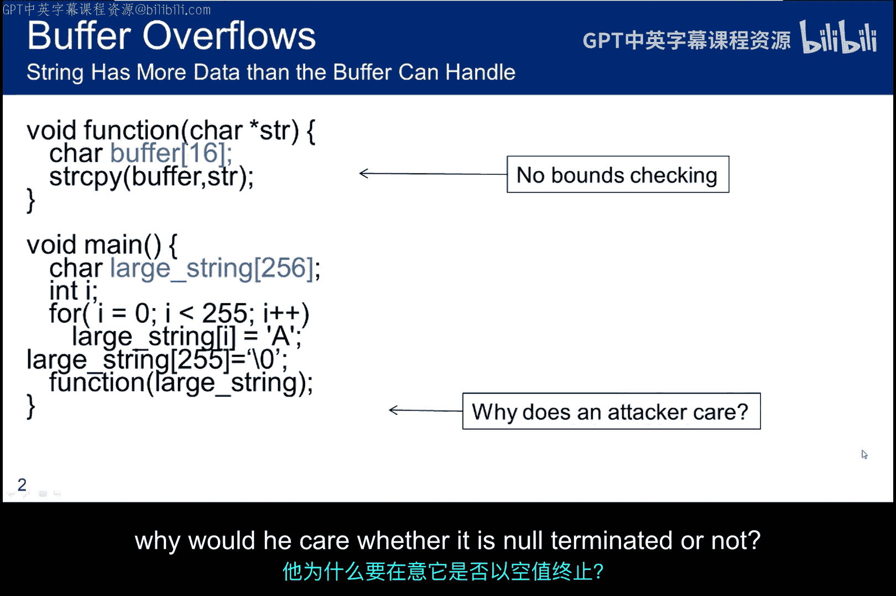
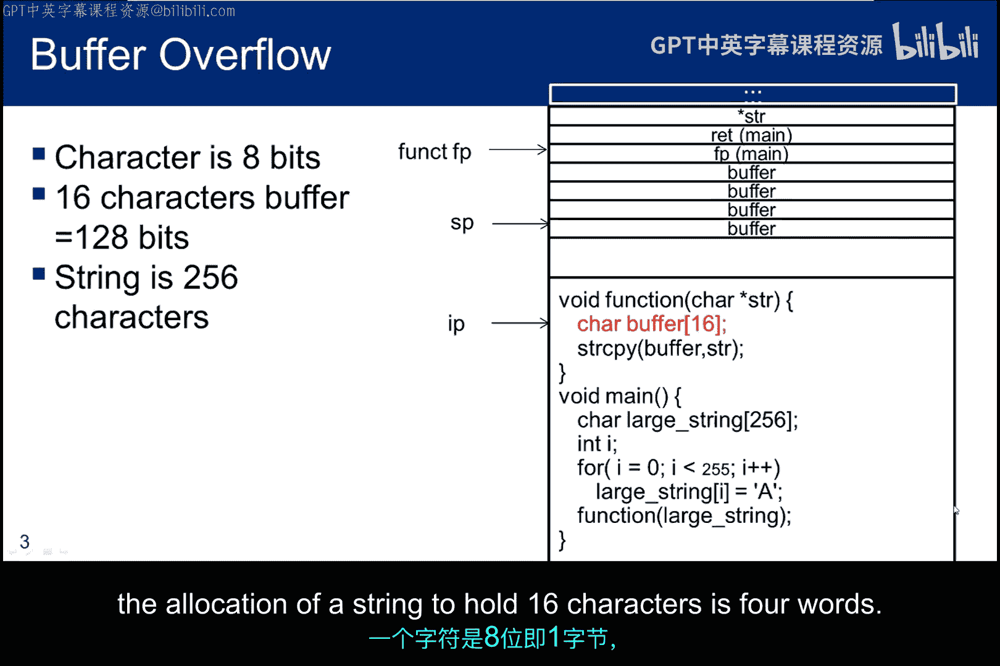
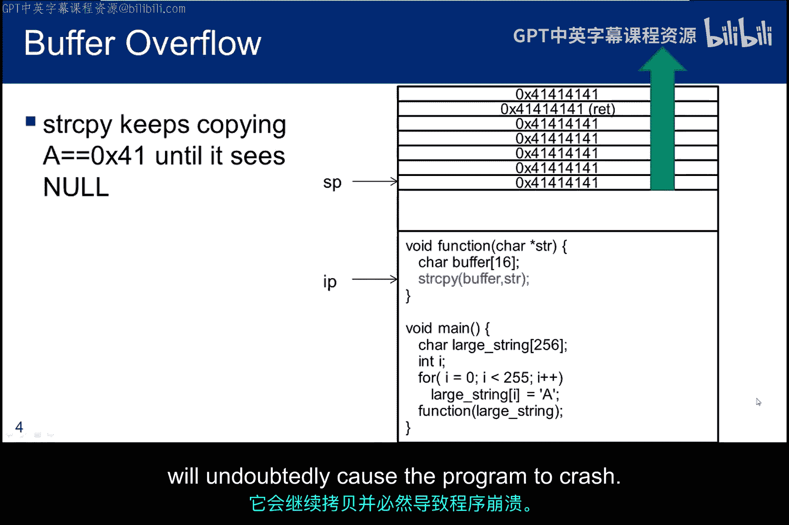
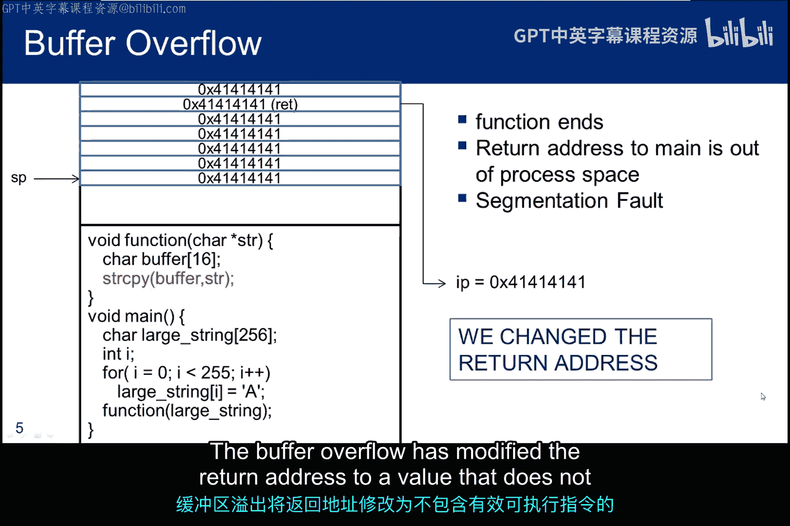
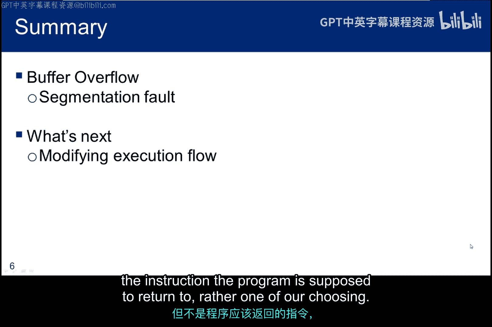

# 071：段错误诊断 🔍

在本节课中，我们将学习一个简单的C程序，它包含一个编程缺陷，该缺陷允许我们溢出缓冲区并引发段错误。这是理解下一节中程序流修改概念的重要基础。

## 程序概述

本节基于一个简单的C程序。该程序存在一个编程缺陷，允许我们溢出缓冲区并导致段错误。这是理解后续模块中程序流修改概念的基础。

以下是该程序的核心逻辑：
```c
int main() {
    char largeString[256];
    // 用字符‘A’填充字符串
    memset(largeString, 'A', 256);
    largeString[255] = '\0'; // 添加空终止符
    vulnerableFunction(largeString);
    return 0;
}

void vulnerableFunction(char* input) {
    char smallBuffer[16]; // 仅16字节的缓冲区
    strcpy(smallBuffer, input); // 将256字节的字符串复制到16字节的缓冲区
}
```
主函数 `main` 创建了一个256字符的字符串，用大写字母‘A’填充，并以空字符（`\0`）终止。然后它调用 `vulnerableFunction` 函数，并将该字符串传递给它。该函数试图将这个256字符的字符串复制到一个仅16字符的缓冲区中，这模拟了缓冲区溢出。

## 栈状态分析

上一节我们介绍了程序的基本结构，本节中我们来看看程序执行时栈的状态。首先，思考一个空终止字符串的问题：如果攻击者注入这个长字符串，他为什么要在乎它是否以空字符终止？

下图展示了 `main` 函数执行并调用 `vulnerableFunction` 后的栈状态。一个字符占8位（1字节）。因此，分配一个容纳16字符的字符串缓冲区需要4个字（在32位系统中，1字=4字节）。








## 缓冲区溢出过程

现在，我们来看字符串复制的具体过程。当复制开始时，一个256字符的字符串被放入一个16字符的缓冲区。

您会看到，当复制到缓冲区末尾时，`strcpy` 函数并不会停止。它会继续复制，直到遇到标志字符串结束的空字符（`\0`）。它持续将大写字母‘A’复制到栈中，并开始覆盖栈上本不应改变的重要元素。

以下是溢出发生时的栈示意图：




它覆盖了栈上的大量数据，甚至超出栈的范围。但特别关键的是，它覆盖了 `main` 函数结束时将要使用的返回地址。

这也就回答了前面提出的问题：如果 `strcpy` 没有看到空终止符，它会一直复制下去，这无疑会导致程序崩溃。但我们通常不希望目标程序崩溃，而是希望利用它。


## 段错误的产生

字符串复制完成后，`vulnerableFunction` 函数返回，接着 `main` 函数也返回。程序试图返回到C语言运行时库（CRT）调用 `main` 时压入栈的地址。

然而，这个返回地址已经被覆盖和破坏。程序试图返回到一个地址为 `0x41414141`（‘A’的ASCII码是0x41）的指令，这是一个非法地址。

因此，操作系统（OS）抛出一个段错误。缓冲区溢出将返回地址修改成了一个不包含有效、可执行指令的值。

下图展示了程序试图返回非法地址时的状态：




## 本节总结与下节预告

在本节中，我们分析了一个简单的C程序，其缓冲区太小，无法容纳传递给它的字符串。结果，栈的一部分被覆盖，包括 `main` 函数结束时下一条要执行指令的返回地址。


当 `main` 函数结束，操作系统试图返回到那个地址时，发现它是一个非法地址，于是程序因段错误而中止。

在下一节中，我们将利用这种溢出思想来修改执行流程，而不是仅仅制造一个段错误。返回的地址将是一个合法的、可执行的指令，但不是程序原本应该返回的指令，而是我们选择的一个指令。

下图示意了下一节我们将要实现的目标：控制程序跳转到我们指定的代码：





本节课中我们一起学习了缓冲区溢出如何导致段错误，理解了栈的结构和函数返回地址的关键作用，为后续学习如何利用溢出控制程序执行流打下了基础。