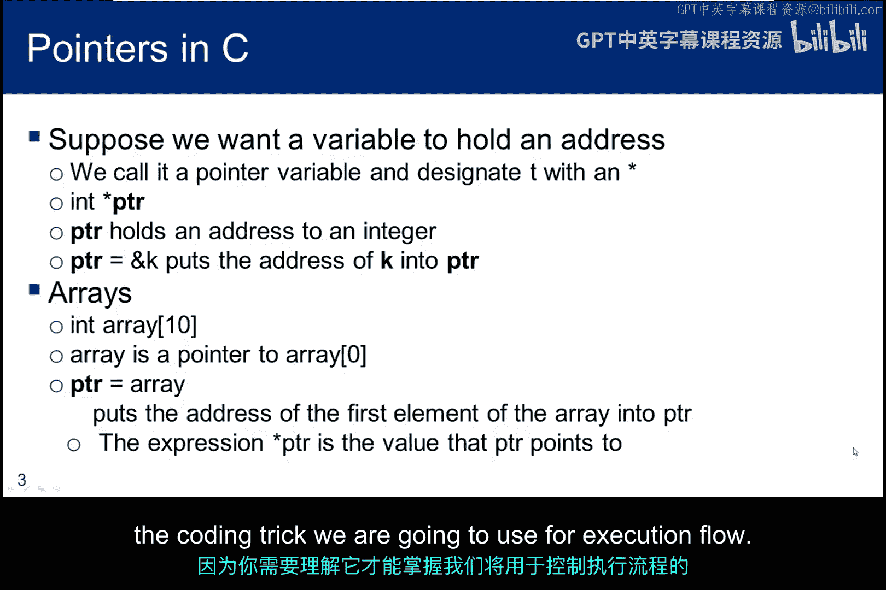
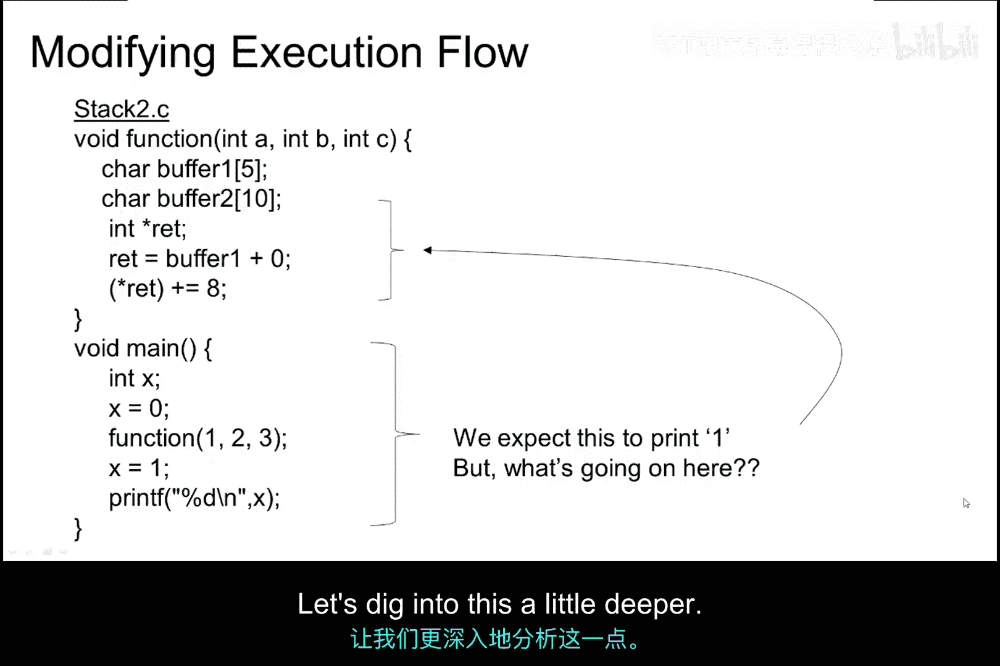
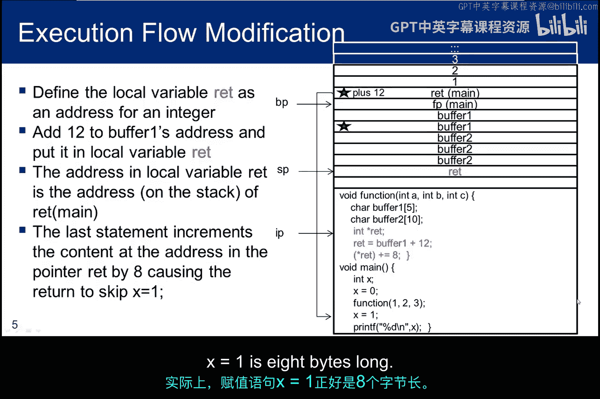
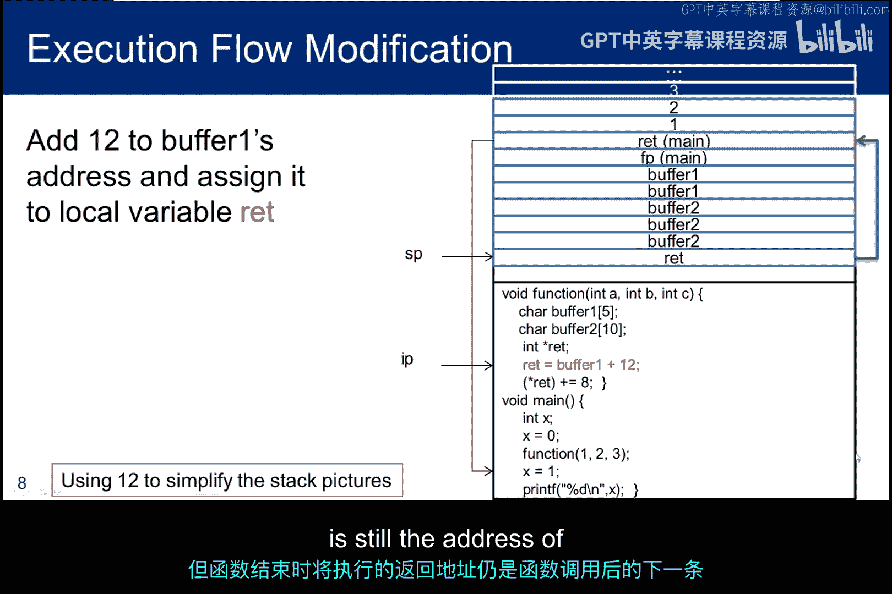
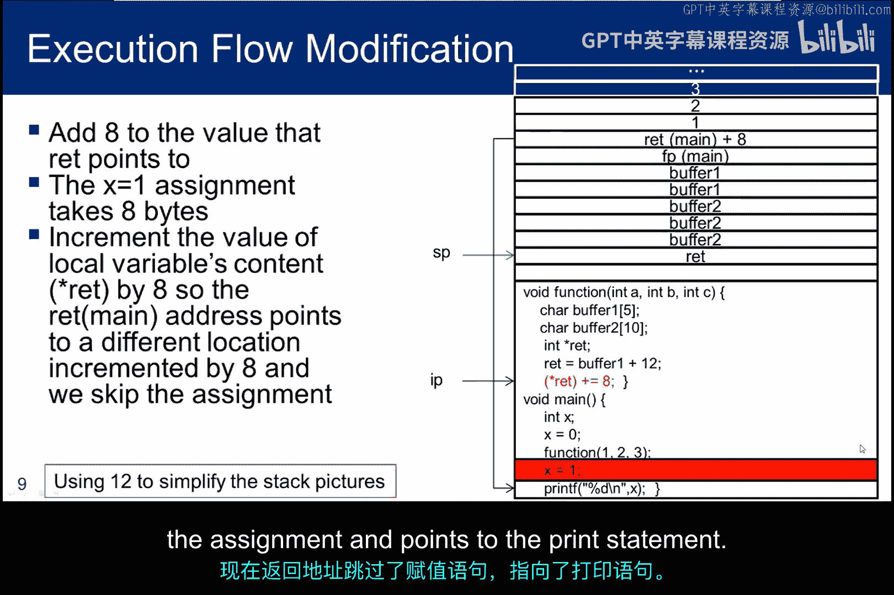
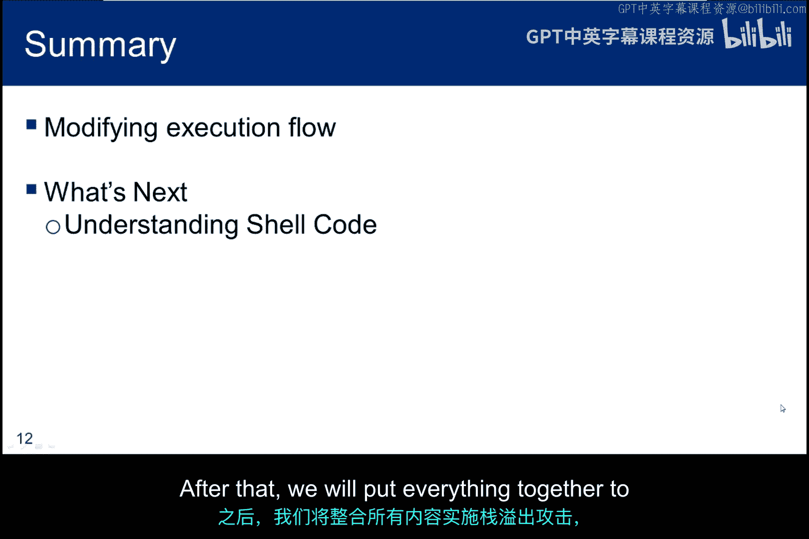

# 072：执行流篡改技术 💻

在本节课中，我们将学习如何利用缓冲区溢出来控制程序的执行流程，而不仅仅是引发段错误。我们将通过修改返回地址，让程序跳转到我们指定的代码位置执行。

## 概述

上一节我们讨论了栈的基本结构和缓冲区溢出的原理。本节中，我们将深入探讨如何利用缓冲区溢出，精确地篡改程序的执行流程。核心在于理解C语言中的指针概念，并利用它来修改函数返回地址。

## C语言指针基础

对于没有C语言编程基础的同学，我们需要先理解指针的概念。变量在内存中拥有两个关键属性：存储的值和存储的地址。

以下是一个简单的C代码片段，展示了变量的值和地址：

```c
int k = 2;
```

在这段代码中：
*   `k` 是一个整数变量。
*   `2` 是存储在 `k` 中的**值**。
*   内存中有一个特定的**地址**用于存放这个值 `2`。

现在，我们扩展这个例子：

```c
int k = 2;
int j = 7;
k = j;
```

*   在第3行，`j` 被解释为变量 `j` 的**地址**，编译器将值 `7` 存储到这个地址。
*   在第4行的赋值语句中，`j` 被解释为存储在 `j` 地址中的**值**（即 `7`），这个值被复制到变量 `k` 的地址中。

一个简单的经验法则是：在赋值语句的**左侧**，我们讨论的是变量的**地址**；在赋值语句的**右侧**，我们讨论的是变量的**值**。

## 指针变量

有时，我们需要一个变量来专门存储另一个变量的地址，这种变量称为**指针**。我们使用星号 `*` 来声明一个指针变量。

```c
int *ptr;
int k = 2;
ptr = &k;
```

*   `int *ptr;` 声明了一个名为 `ptr` 的指针变量，它用于存储一个整型变量的地址。
*   `&k` 表示获取变量 `k` 的地址。
*   `ptr = &k;` 将 `k` 的地址赋值给指针 `ptr`。现在，`ptr` **指向**整型变量 `k`。
*   通过 `*ptr` 可以访问 `ptr` 所指向地址中存储的值（即 `k` 的值 `2`）。

从语法角度看：`ptr` 是指针（地址），`*ptr` 是指针指向的值。

## 指针与数组

指针的概念可以延伸到数组。数组名本身就是一个指向数组第一个元素的指针。

```c
int array[10];
int *ptr;
ptr = array; // 等价于 ptr = &array[0]
```



*   `array` 是一个包含10个整数的数组。
*   单独使用 `array`（不带下标）时，它被视为一个整数指针，其值是数组第一个元素 `array[0]` 的地址。
*   因此，`ptr = array;` 将数组首地址赋值给了指针 `ptr`。

理解以上关于C语言指针的知识，就足以让我们理解接下来用于篡改执行流的编码技巧了。

## 实践：篡改执行流



这里有一个名为 `stack2.c` 的程序，它扩展了我们之前研究栈行为时使用的程序。

```c
#include <stdio.h>
void function(int a, int b, int c) {
    char buffer1[5];
    int *ret;
    ret = buffer1 + 12; // 关键步骤1：计算返回地址的位置
    (*ret) += 8;        // 关键步骤2：修改返回地址的值
}
int main() {
    int x = 0;
    function(1, 2, 3);
    x = 1; // 这行代码将被跳过
    printf(“%d\n“, x);
    return 0;
}
```

在 `main` 函数中，我们先将整数变量 `x` 赋值为 `0`，然后调用 `function` 函数。函数返回后，我们将 `x` 的值改为 `1` 并打印。我们期望输出 `1`，但实际输出是 `0`。这是因为 `function` 函数中的三行新代码修改了执行流程，导致 `main` 函数中的 `x = 1;` 这条赋值语句被跳过了。

让我们深入分析一下。

### 栈布局与操作

下图展示了 `main` 调用 `function` 后的栈状态。与我们之前所学一致，栈中包含了参数、返回地址、帧指针和为局部变量分配的缓冲区空间。


现在，我们重点分析 `function` 函数中新增的三行代码（图中标红部分）：
1.  `int *ret;`：声明一个名为 `ret` 的局部整型指针变量。它被分配在栈上。
2.  `ret = buffer1 + 12;`：将 `buffer1` 的地址加上 `12` 后赋值给 `ret`。在32位架构（4字节字长）中，这相当于在栈上向上移动了3个条目。通过计算，`ret` 现在指向了 `main` 函数的**返回地址**在栈中的存储位置。
3.  `(*ret) += 8;`：对 `ret` 所指向地址中存储的值（即返回地址）增加 `8`。这意味着我们修改了栈上的返回地址值。

总结一下：首先，我们让指针变量 `ret` 指向了正确的返回地址位置；然后，我们增加了该位置存储的地址值。这样，函数返回时就不会返回到 `main` 中调用语句之后的下一条指令，而是会跳过 `8` 个字节。事实上，`x = 1;` 这条赋值语句正好是 `8` 字节长。因此，当 `function` 返回时，它跳过了这条赋值语句，直接执行了 `printf` 语句，打印出 `x` 最初的值 `0`。

### 环境差异与作业



在实际编译中，编译器生成的代码可能与理论分析略有不同。例如，缓冲区 `buffer1` 在栈中的实际偏移地址可能不是简单的 `buffer1 + 12`。


上图是 `stack2.c` 编译后 `function` 函数的反汇编代码（黄色括号部分为栈金丝雀，与本讨论无关）。可以看到，`buffer1` 的起始位置相对于基址指针 `ebp` 的偏移是 `0x21`（即33字节）。因此，仅仅加 `12` 字节不足以定位到返回地址。你需要根据自己环境的反汇编结果，调整 `ret = buffer1 + N;` 中的 `N` 值。

**你的第一个作业是**：在你自己的道德黑客实验环境中编译 `stack2.c`，并通过调试确定需要给 `ret` 加上多大的偏移量 `N`，才能使程序输出 `0` 而不是 `1`。

### 执行流篡改过程图解

以下四张图逐步展示了栈的变化过程：

1.  **声明指针**：当局部指针变量 `ret` 声明后，栈上为其分配了空间。
    

2.  **计算地址**：执行 `ret = buffer1 + N;` 后，`ret` 指向了 `main` 的返回地址（图中蓝色箭头所示）。此时返回地址仍指向 `x = 1;` 这条语句。
    

3.  **修改地址**：执行 `(*ret) += 8;` 后，返回地址的值增加了 `8` 字节，现在指向了 `printf` 语句。
    

4.  **流程跳转**：`function` 返回后，直接执行 `printf(“%d\n“, x);`，打印出 `0`。随后 `main` 函数结束，清理栈并返回。
    


## 目标：跳转到Shellcode

我们的目标不仅仅是跳过一条指令，而是要利用这种修改程序流程的思想，实现更强大的攻击。我们希望让程序跳转到一段我们精心构造并已通过缓冲区注入到程序中的特殊代码去执行。这段代码通常被称为 **Shellcode**，它被执行后会生成一个命令行shell，从而允许我们执行任意命令。

因此，我们面临两个任务：
1.  将Shellcode放入目标程序的缓冲区中。
2.  修改程序流程，使其返回到我们的Shellcode，而不是预期的返回地址。

本节课我们提供了一个修改执行流的简单示例，你将在本模块的作业中在自己的实验环境里进行实践。下一个子模块将介绍Shellcode，我们将编写一些Shellcode作为实现完整攻击的第一步。之后，我们会把所有知识结合起来，完成“栈粉碎”攻击，并成功执行Shellcode。

## 总结


本节课我们一起学习了执行流篡改技术。我们首先回顾了C语言中指针的核心概念，理解了变量地址与值的区别，以及如何利用指针操作内存。然后，我们通过一个具体的程序 `stack2.c`，详细分析了如何通过缓冲区溢出计算并修改函数返回地址，从而改变程序的正常执行路径，跳过特定的指令。最后，我们指明了最终的攻击目标：将程序流程引导至我们注入的Shellcode。这是缓冲区溢出攻击从“造成崩溃”到“获取控制权”的关键一步。