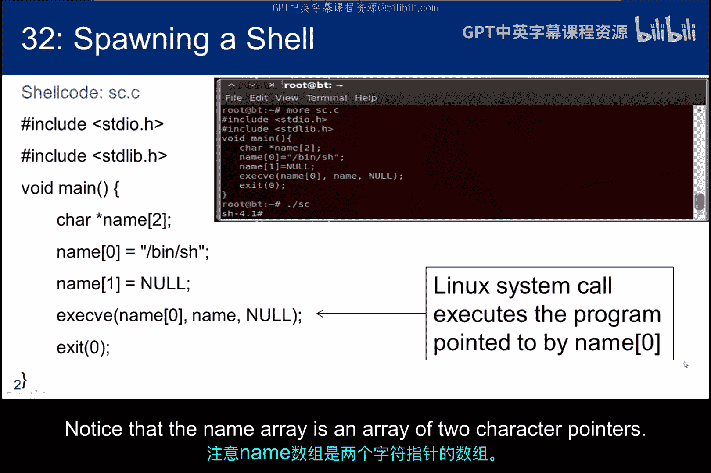
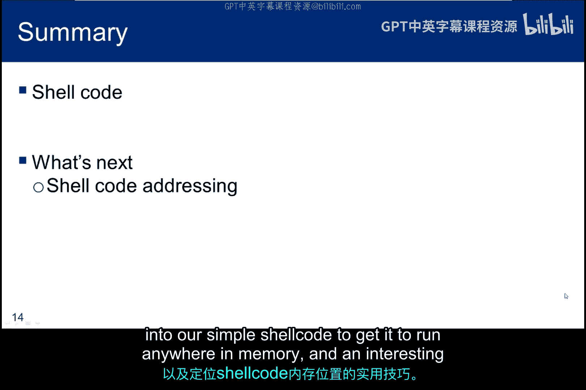

# 073：Shellcode原理剖析 🧠

在本节课中，我们将要学习Shellcode的核心原理。Shellcode是能让我们获得目标系统命令行访问权限的代码。我们将从分析一个简单的C程序开始，逐步拆解其汇编指令，最终理解如何构造出能够通过缓冲区溢出漏洞注入并执行的Shellcode。

## 概述

我们的目标是生成一段小巧、高效的代码，它能通过一个小的缓冲区传递给目标程序并执行。我们将从一个能创建标准Linux shell的C程序入手，通过反汇编分析其工作原理，提取出构造Shellcode所需的关键步骤和指令。

## 从C程序到系统调用

如果我们可以编写并运行一个C程序，那么任务会很简单。但我们需要的是能够通过小缓冲区传递的精简代码。

我们从一个名为 `sc.c` 的C程序开始，它使用系统调用 `execve` 来执行 `/bin/sh`，从而创建一个标准的Linux shell。编译并执行此程序，你将获得一个shell，如截图所示。

请注意，`name` 数组是一个包含两个字符指针的数组。

以下是一个更简单的 `execve` 调用示例，但这种方法不够优雅，且可能不总是有效。作为本模块的一部分，我尝试过这种方法，但得到了不一致的结果，尤其是在64位虚拟机中。网上有许多例子认为这种方法可行，但它可能导致程序崩溃，并且不一定具有一致性或可重复性。我推荐更系统的方法：将程序信息放入数组中。

## 理解C语言命令行参数

接下来，简要说明C语言中的命令行参数。

变量名 `argc` 代表参数计数。`argc` 包含传递给程序的参数数量。变量名 `argv` 代表参数向量。向量是一维数组，`argv` 是一个字符串的一维数组。每个字符串都是传递给程序的参数之一。`envp` 是一个字符串指针的一维数组，作为第三个参数传递，包含环境信息。

例如，命令行 `gcc -o myprog myprog.c` 会在 `gcc` 内部产生以下值：`argc` 为 4。`argv[0]` 是 `gcc`。`argv[1]` 是 `-o`。`argv[2]` 是 `myprog`。`argv[3]` 是 `myprog.c`。

## execve系统调用语法

`execve` 系统调用的语法如下。当然，系统调用有很多，这只是用于执行程序的一个。该调用涉及三个参数：

*   第一个参数是一个字符指针，指向要执行的文件名。
*   第二个参数是一个字符指针，指向通过 `sc.c` 命令行传递给 `execve` 所执行程序的任何参数。
*   第三个参数是一个字符指针，指向程序环境数组。标准环境变量提供有关用户主目录、终端类型、当前区域设置等信息。

## 反汇编分析

为了更详细地探究shellcode，将 `sc.c` 输入文本编辑器，编译它并进行反汇编。如果尚未安装调试器，现在需要安装它。

我们将同时检查 `main` 函数和系统调用。使用 `gdb` 进行反汇编将生成 AT&T 语法。如果需要复习，请参考 x86 架构子模块。

这三张幻灯片展示了生成shell的C程序的反汇编代码。它复杂且混乱，可能会让你头疼，但我们只想提取足够的信息来创建自己的shellcode。所以请耐心并逐步分析代码。

代码像往常一样开始，它管理栈帧，将栈指针对齐到边界，并为字符数组 `name` 向下移动栈指针。为了简化图示，我没有显示对齐字节。换句话说，我们假设最后4位是 `0000`。

第五行的字面量是字符串 `/bin/sh` 的地址，它被放入栈中为指针 `name[0]` 分配的位置。然后，一个长整型的 `null` 被放入栈中为指针 `name[1]` 分配的位置。

一旦我们将值插入到字符指针数组 `name` 的栈中，编译器就开始操作栈底部的额外空间。首先，它插入一个长整型的 `null`。接下来的两条指令将数组 `name` 的地址添加到 `null` 下方的栈位置。然后，将 `/bin/sh` 的地址加载到更下面的位置。接着我们进行系统调用，并在 `execve` 返回时返回到 `main`。

顺便提一下，根据 `execve` 的函数定义，`$esp+0x14` 应该是 `null` 的地址，而不是字面量 `null`。之所以如此，是因为第三个参数也是一个指针。这似乎是编译器中的草率编程，但由于它是 `null` 且不包含环境信息，所以显然可以工作。此外，此时 `%eax` 拥有 `/bin/sh` 的地址，`%edx` 拥有 `name` 数组的地址。

`execve` 将地址移入寄存器以进行系统调用 `0x80`。函数参数被放入 `%eax`。要执行的程序字符串地址进入 `%ebx`。`name` 数组的地址进入 `%ecx`，一个 `null` 进入 `%edx`，最后发生中断。

`execve` 的反汇编指令集从此处继续，但我们将跳过它，因为我们不关心它。我们已经找出了让shellcode执行的所有步骤。

## Shellcode的内存布局

这张幻灯片以图示形式展示了执行shell程序 `/bin/sh` 所需的条件，但它增加了更多关于我们如何在内存中定位信息的结构。这些信息是在中断发生前需要放入寄存器的内容。

其思路是，我们将字符串 `/bin/sh` 放入内存。然后，相对于字符串的起始位置，我们紧随其后放置空字符以终止字符串、字符串的地址和一个长整型的 `null`。顶部的箭头显示我们将使用的所有寻址都是相对于 `/bin/sh` 的，底部的箭头显示在调用中断前必须传入寄存器的地址。

请注意，成功开发shellcode的关键在于找出 `/bin/sh` 的位置，因为我们将相对于该位置寻址其他所有内容。

这是同一张图，但我们使用了两次长整型的 `null`：一次是作为由元素 `/bin/sh` 和 `null` 组成的 `name` 数组，另一次是作为 `execve` 调用中所需的环境变量 `null`。这实际上就是我们在调用中断 `0x80` 之前设置字符串的方式。我不清楚 Aleph1 为何采用这种捷径，但为了与《Smashing The Stack For Fun And Profit》论文保持一致，我们将以同样的方式实现它。

## 添加退出代码

因此，我们知道了执行shell所需的步骤。但在我们开发代码的过程中，为了进行测试，我们将添加一些简单的退出代码，以便在调用失败时能够优雅地终止。

一个优雅的退出包括另一个系统中断，其中函数参数设置为 `0x1`，退出代码设置为 `0`。

## 知识总结

将这些部分组合在一起，这张幻灯片总结了我们学到的关于执行shell的知识。我们知道在调用中断之前，内存中需要有哪些字符串，以及寄存器的内容需要是什么。

在本子模块中，我们学习了启动shell所需的基本指令，并且我们是通过检查提供相同功能的C代码的反汇编版本得出这一结论的。展望未来，我们将能够利用这些知识来生成将通过缓冲区传递给目标的shellcode，并且我们将通过溢出缓冲区来使该shellcode执行。

接下来，我们将讨论必须插入到我们简单shellcode中的相对寻址元素，以便它能在内存中的任何位置运行，以及一个用于找出shellcode位置以便使其运行的有趣技巧。

## 总结

本节课中，我们一起学习了Shellcode的基本构造原理。我们从分析一个产生shell的C程序出发，通过反汇编理解了`execve`系统调用的具体步骤和内存布局。我们明确了成功Shellcode的关键在于确定`/bin/sh`字符串在内存中的位置，并使用相对寻址来构建参数。最后，我们还了解了为测试目的添加优雅退出代码的方法。这些知识为我们后续构造可注入的、位置无关的Shellcode打下了坚实的基础。