# 074：Shellcode寻址机制 🧠

在本节课中，我们将学习Shellcode中的相对寻址机制。这种机制能让Shellcode无论被放置在内存的哪个位置，都能正确执行。我们还将学习如何定位Shellcode在内存中的位置，以便找到第一条指令并开始执行。

## 构建内存中的字符串结构

上一节我们介绍了Shellcode所需的基本指令集，本节中我们来看看如何在内存中构建字符串结构，以便在调用中断前填充寄存器。

我们将字符串 `/bin/sh` 放入内存。紧接着该字符串，我们会放置一个空字符来终止字符串。之后是字符串的地址和一个长整型的空值。所有寻址操作都将相对于 `/bin/sh` 字符串的起始位置进行。下图展示了在调用中断前，需要传入寄存器的地址。

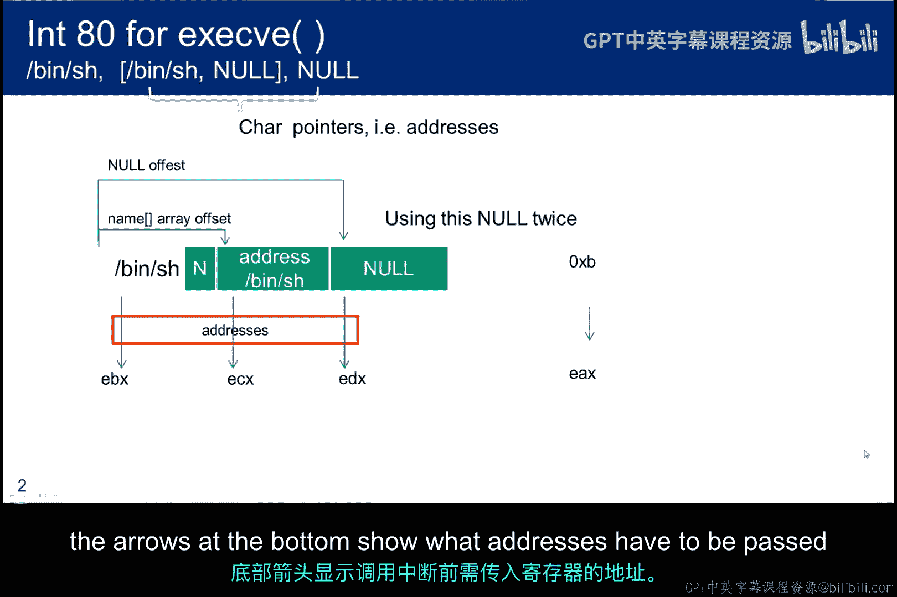

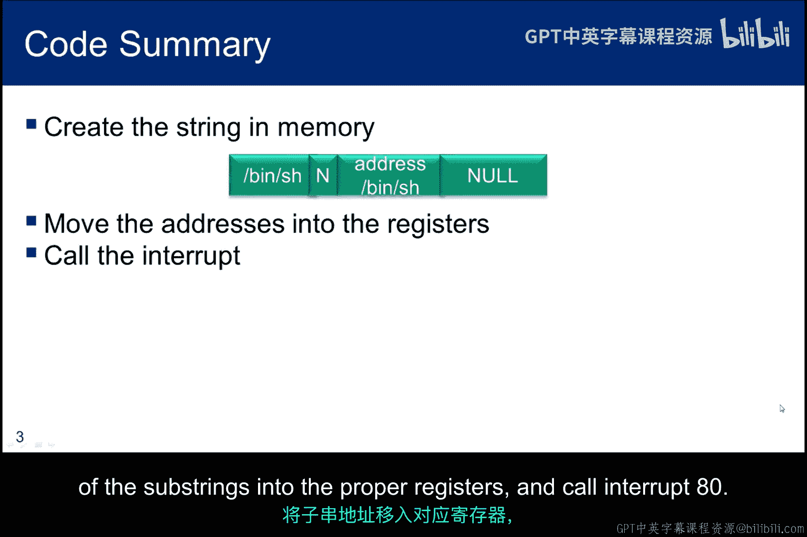

总结来说，我们将在内存中创建字符串，将子字符串的地址移动到正确的寄存器中，然后调用中断 `80`。

## Shellcode初版解析

下图展示了利用之前所学知识的基本代码。这是我们将在缓冲区溢出攻击中使用的Shellcode的第一个草案。

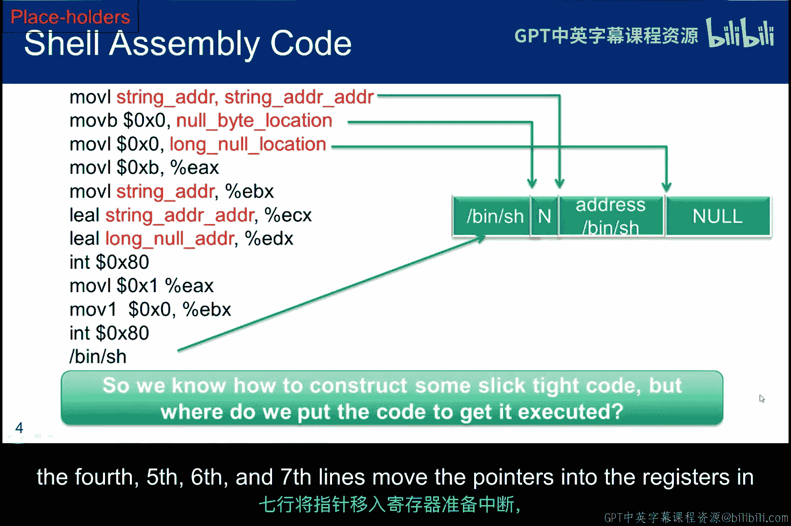

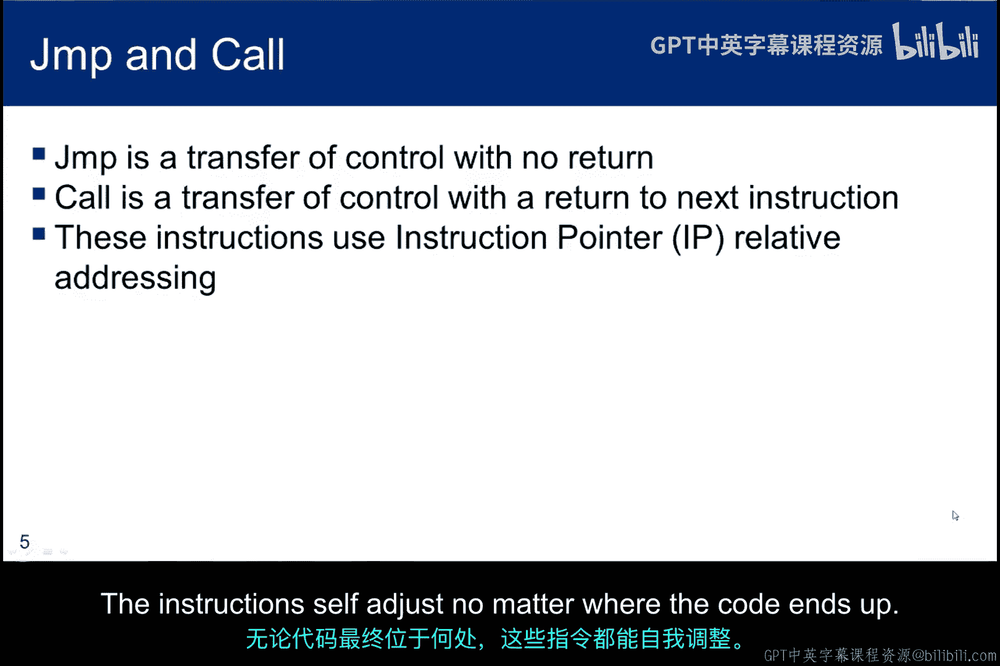

我将逐行解析，但请注意红色文本代表我们尚未确定的地址。在指令底部，作为代码的一部分，我们看到标识要执行程序的字符串 `/bin/sh`。蓝色框展示了我们如何将中断所需的其他信息“锚定”到 `/bin/sh` 字符串上。

目前的关键之一是确定在通过缓冲区传递Shellcode后，该字符串在目标内存中的位置。有一个巧妙的技巧可以解决这个问题。但现在，我们只需要理解Shellcode的其他部分。因此，暂时假设我们知道 `/bin/sh` 的位置。

以下是代码行的具体操作：
1.  第一行，将其地址移动到字符串地址位置（第三个蓝色框）。
2.  第二行，在 `/bin/sh` 后放置一个空字节以终止它。
3.  第三行，将一个32位的长整型空值移动到第四个蓝色框。
4.  第四、五、六、七行，将指针移动到寄存器中，为中断调用做准备。

## 跳转与调用指令的巧妙运用

提醒一下 `jump` 和 `call` 的区别。`jump` 不提供返回机制。而 `call` 会将调用后下一条指令的指针压入栈中，这样当调用结束时，下一条指令就能被执行。

这些指令的另一个重要方面是，程序员不需要确切的地址。它们将控制权转移到相对于当前指令指针的一个偏移点。这非常有用，因为这意味着程序员不必知道缓冲区的地址即可使用它们。无论代码最终位于内存何处，指令都能自我调整。

现在，我们将探索 `jump` 和 `call` 指令的巧妙用法，这将允许我们定位放置在Shellcode末尾的 `/bin/sh` 字符串。一旦我们知道字符串的位置，就大功告成了，因为Shellcode中的其他所有内容都相对于该字符串定位。

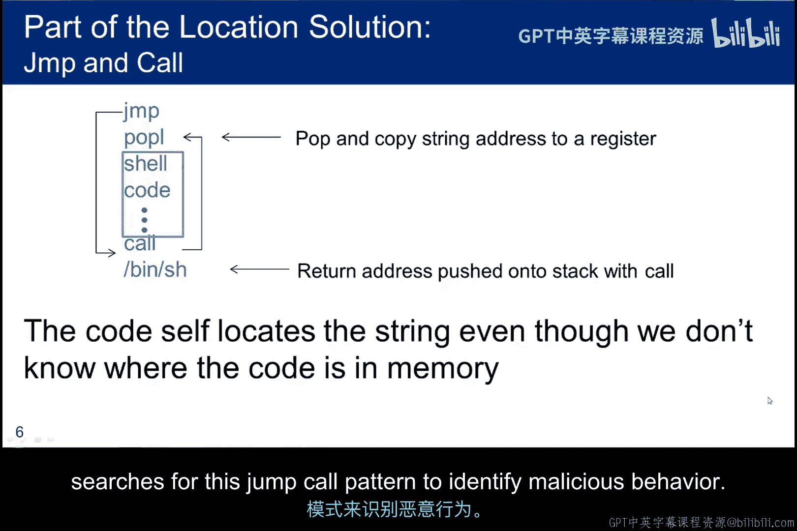

在图片中间，您可以看到标记为“Shellcode”的小框。这是我们一直在讨论的汇编指令集，但我们添加了三条指令：开头的 `jump` 和 `pop`，以及结尾的 `call`。

这个技巧的工作原理如下：
1.  第一条指令跳转到 `call` 语句。我们可以计算出如何做到这一点，因为寻址是相对的。
2.  `call` 语句调用 `pop` 指令。但在 `call` 执行之前，下一条指令（即 `/bin/sh` 字符串的地址）被压入栈中。
3.  然后，在 `call` 之后，执行 `pop` 指令，这样我们就将 `/bin/sh` 的位置存入了 `pop` 所使用的寄存器中。

为了理清相对寻址，我们需要在Shellcode内逐条指令计算字节数以计算跳转和调用的偏移量。您将看到，这并不难做到。顺便提一下，处理恶意代码的取证工程师实际上会搜索这种 `jump-call` 模式来识别恶意行为。

至此，我们已经将Shellcode包装在一个 `jump-call` 例程中，该例程将 `/bin/sh` 的地址弹出到 `ESI` 寄存器中。现在，我们能够填充在Shellcode初版中留下的占位符了。所有内容都相对于 `ESI` 进行偏移。我们仍然需要计算字节数以确定偏移量的实际值，但GDB调试器将帮助我们完成这项工作。

在左侧，我使用调试器计算了每条指令关联的字节数，我们将用它来完成 `jump` 和 `call` 的语法。

## 自定位代码与偏移计算

这是自定位代码。无论它最终位于内存何处，相对寻址都会处理好所有偏移量，因此代码能够执行。

另一点需要注意，蓝色框表示我们的Shellcode正在 `/bin/sh` 的末尾写入内存。这意味着代码正在修改其自身的字符串空间。操作系统用于消除缓冲区溢出的一些防御方法会阻止代码修改自身。关于这一点，我们稍后再讨论。

下图使用子字符串的长度来计算偏移量。

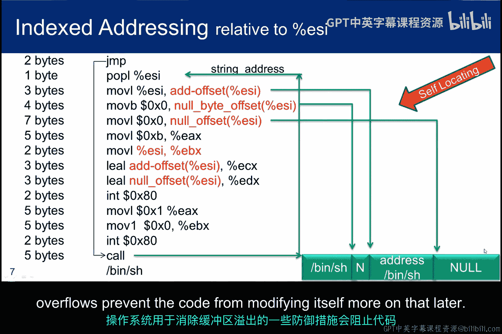

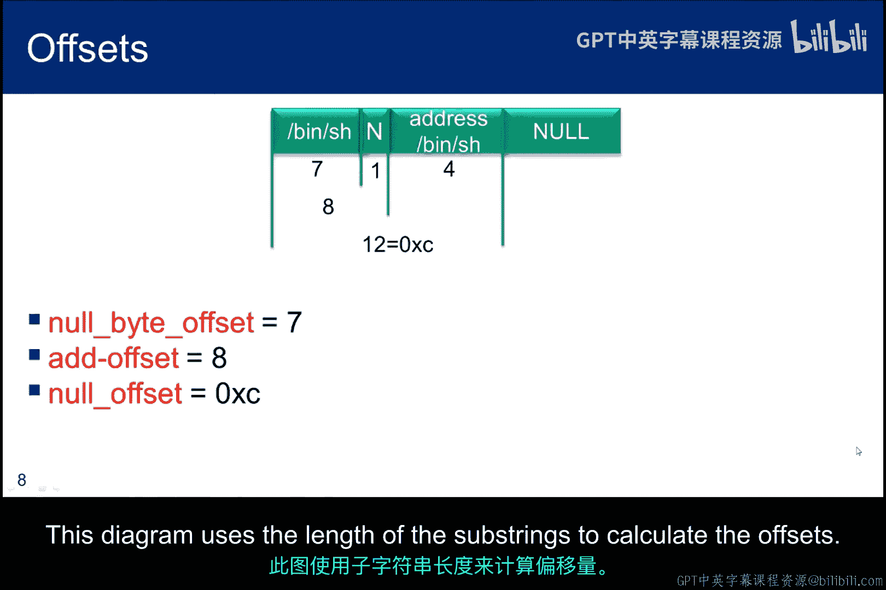

在这里，占位符已被刚刚计算出的实际偏移值所取代。

## GCC内联汇编与相对寻址

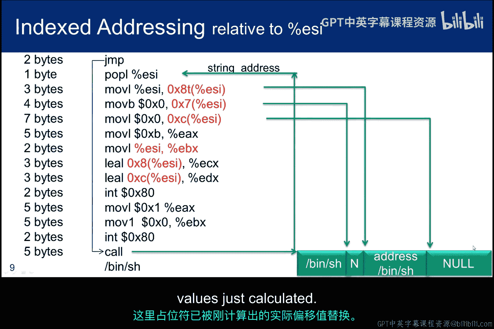

这是关于相对寻址如何与GCC汇编器配合工作的简短说明。我们将利用这个想法来完成 `jump` 和 `call` 指令。

在使用GCC时，这种代码被称为内联汇编代码。`__asm__` 告诉编译器将其解释为汇编代码。从技术上讲，下划线并非必需，但它们相当标准，有助于避免命名冲突。

每行都需要一个换行符终止，并且每行都用引号括起来。如果您想了解更多关于其工作原理的信息，或者在使用中遇到问题，可以在互联网上搜索“inline assembly”。

我标为红色的点 `.`，是我们告诉汇编器使用相对寻址的方式。在这个例子中，`jmp .+6` 告诉汇编器从当前指令指针向前跳转6个字节。编译器获取 `jump` 的当前IP并加上6。由于 `jump` 是一个两字节指令，而 `nop` 是一个一字节指令，所以它跳转到最后一个 `nop`。

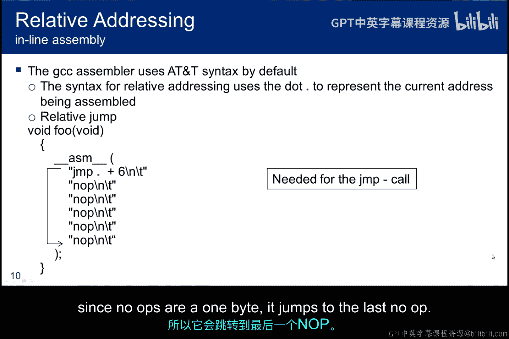

现在，让我们使用GCC编译器的内联汇编语法输入我们的汇编代码。

发生了哪些变化？
1.  首先，我使用内联汇编语法对其进行了格式化。
2.  其次，我通过计算字节数确定了 `ESI` 的偏移量。我是如何做到的？这很简单。`/bin/sh` 字符串是7个字节。所以空字节的偏移量将是再加1。我们从0开始计数，偏移量就是7。类似地，字符串地址的偏移量是8，长整型空值的偏移量是12（十六进制C）。
3.  第三，我猜测了 `jump` 和 `call` 相对寻址的计数。我从 `jump` 用18、`call` 用16开始编译，但没有运行它，而是对其进行了反汇编。我知道16和18是错误的。但现在在GDB中，我可以看到指令的长度并计算字节数，以确定相对寻址的字节数应该是多少，才能使 `jump` 命中 `call` 指令，以及 `call` 命中 `pop` 指令。

## 调试与字节计数示例

下图是 `sc_asm.c` 反汇编后的示例，以及如何进行字节计数。

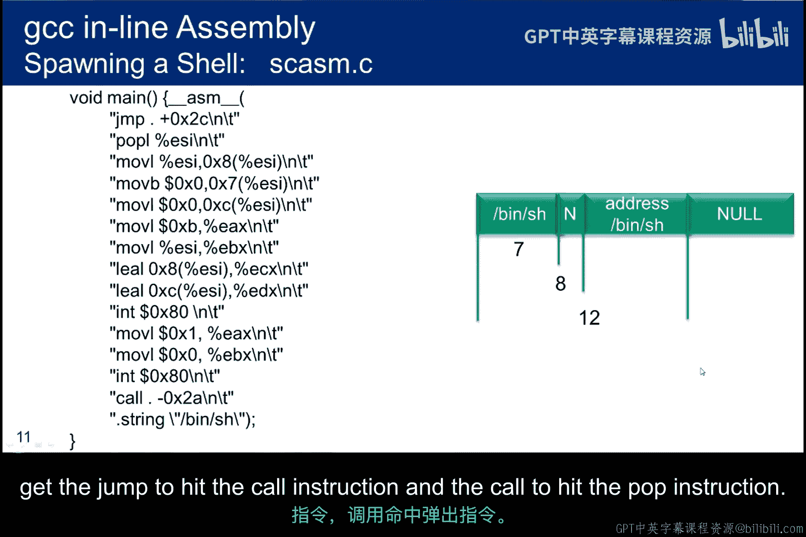

第一个 `jump` 从 `+3` 到 `+5`，所以它使用了2个字节。`pop` 指令从 `+5` 到 `+6`，所以它使用了1个字节。您继续以这种方式计算 `jump` 和 `call` 之间的字节数。

这只是字节计数的图示视图。您可以数蓝色框（代表字节）来了解我是如何得出偏移量计数44和42（或十六进制2C和2A）的。

这只是一个屏幕截图，显示了 `jump` 之后的 `pop` 地址和 `call` 的地址。绿色箭头显示 `jump` 落在了 `call` 上，而 `call` 落在了 `jump` 之后的 `pop` 上，符合我们之前讨论的 `jump-call` 模式，并确保我们正确定义了相对寻址。

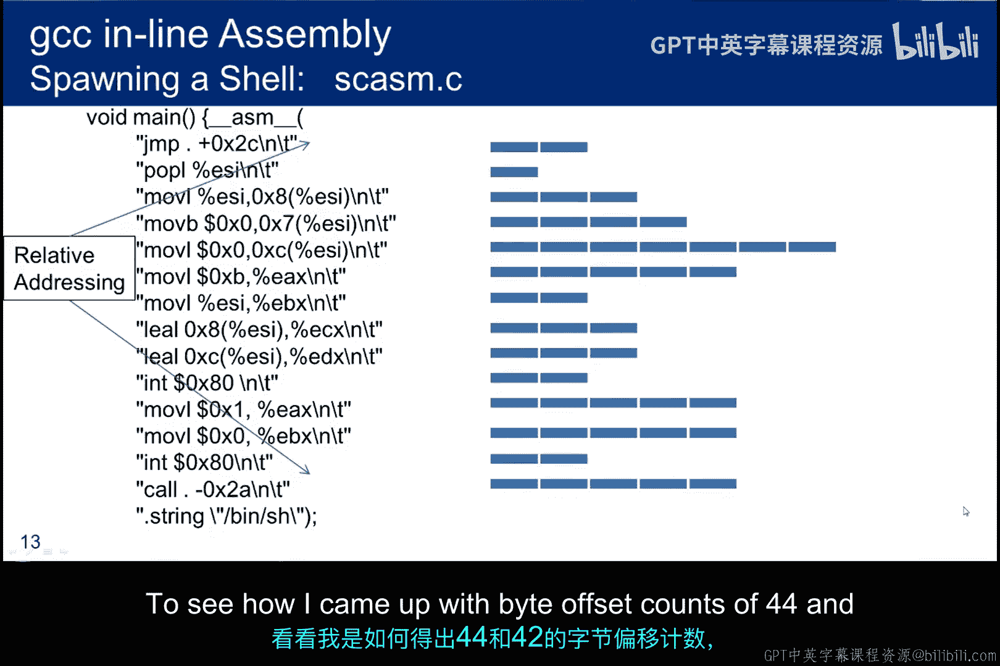

## 课程总结

在本节课中，我们一起学习了Shellcode寻址的所有步骤，以确保它无论位于内存何处都能运行。两个关键思想是：
1.  使用 `jump-call` 技巧获取字符串位置以计算偏移量。
2.  确定 `jump` 和 `call` 的相对寻址偏移量。

我还简要介绍了使用GCC内联汇编来生成代码的想法。在下一节中，我们将利用这个想法来编译刚刚编写的Shellcode，然后学习如何管理和执行生成的十六进制字符串以启动一个shell。

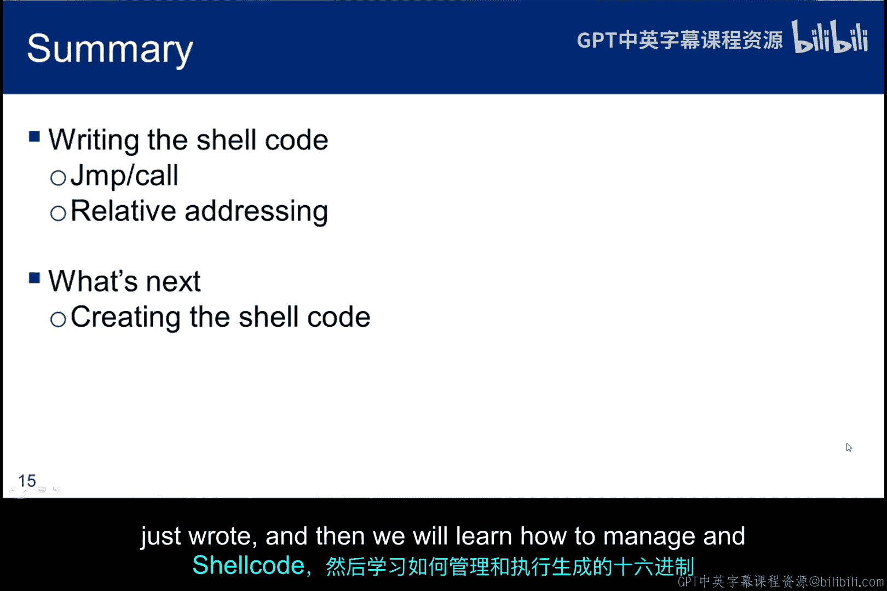

