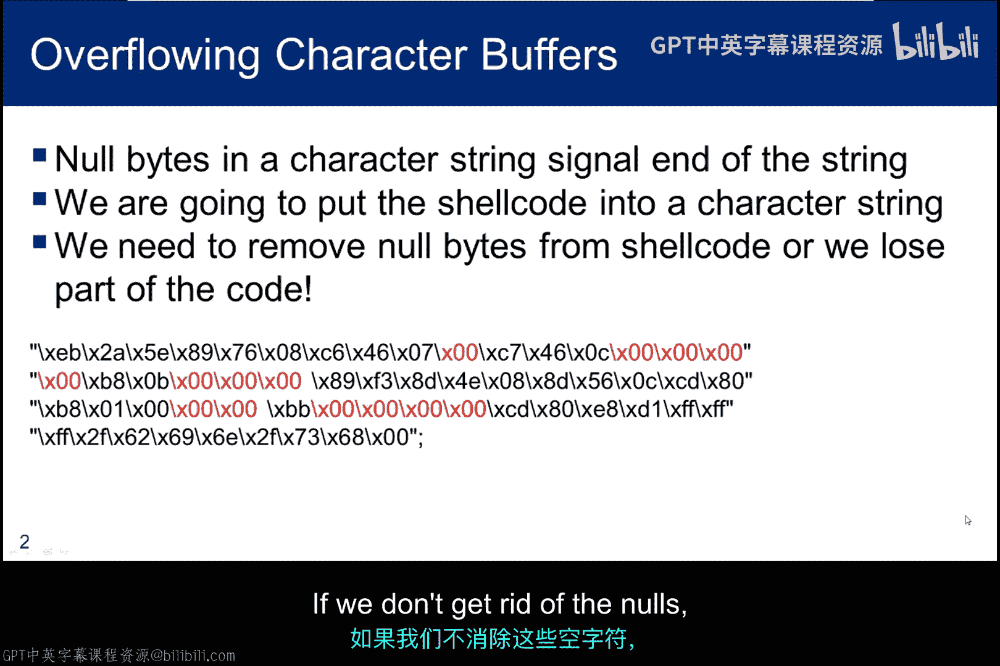
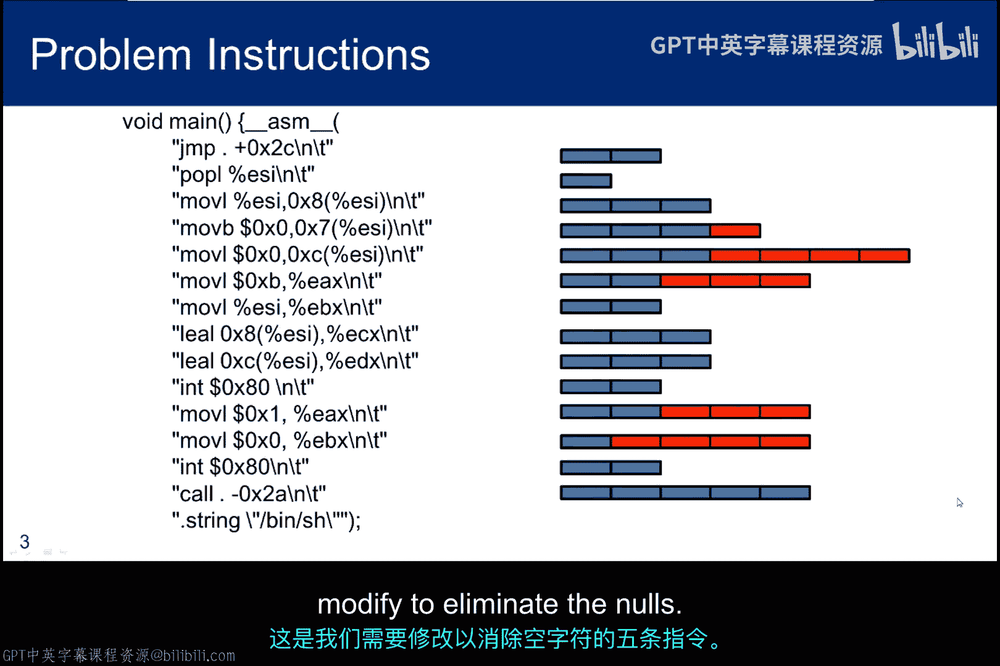
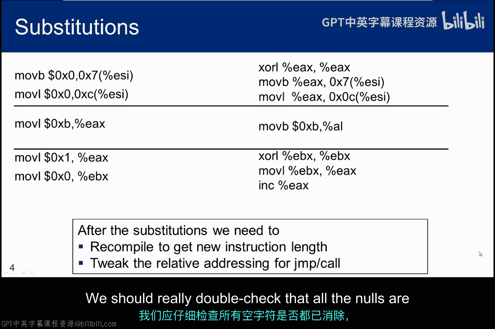
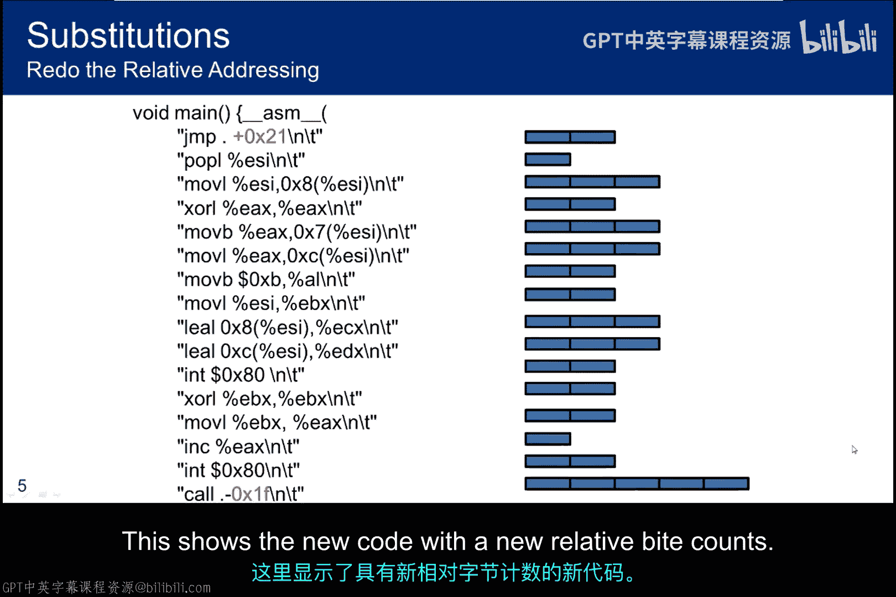
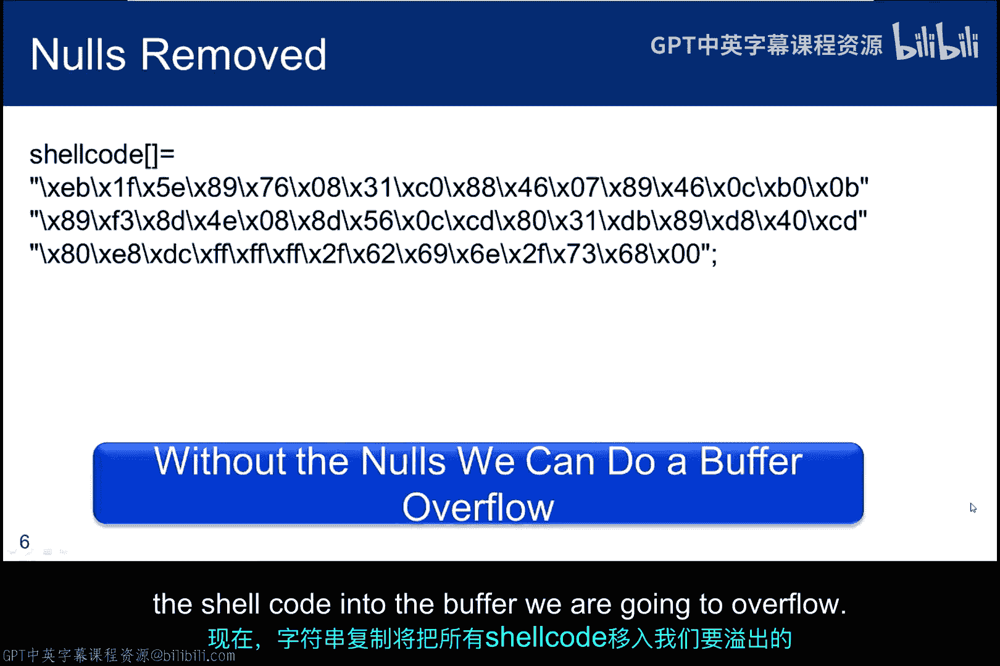
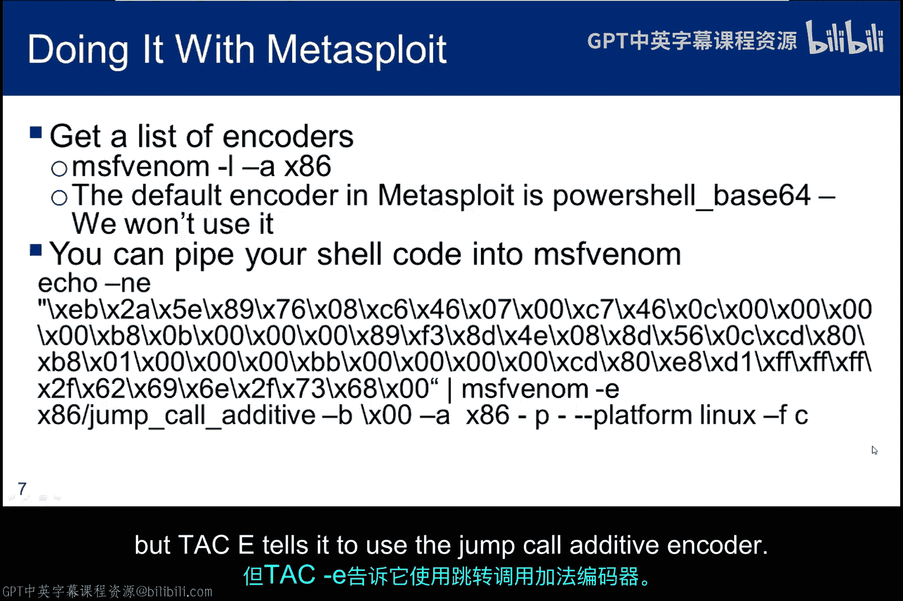
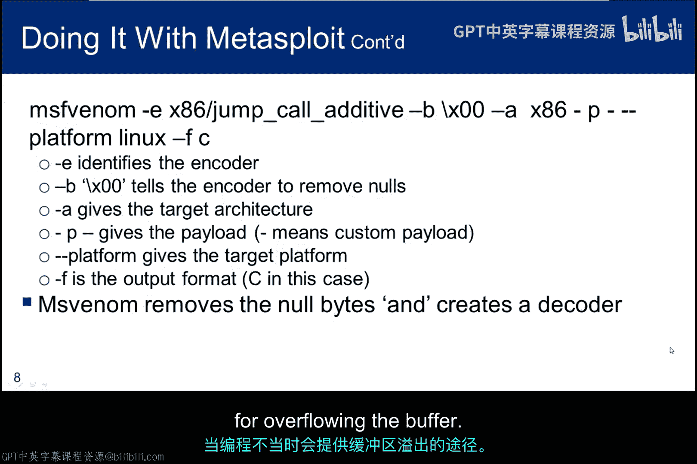
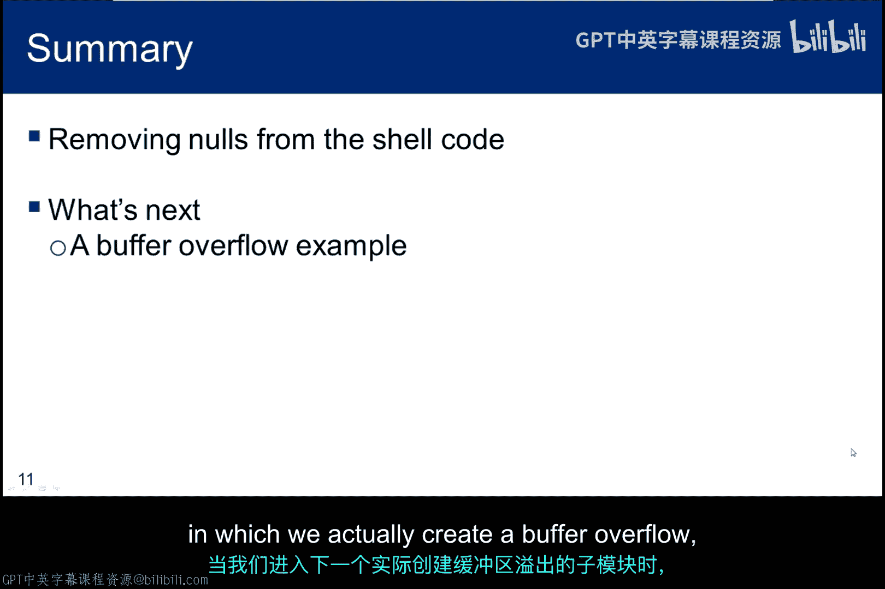

# 076：空字符问题处理 🛡️

在本节课程中，我们将学习一个在缓冲区溢出攻击中至关重要的概念：空字符的处理。理解并解决空字符问题，是确保我们的Shellcode能够被完整复制到目标缓冲区的关键步骤。

## 概述

缓冲区溢出攻击通常涉及字符串复制操作。当字符串复制函数遇到空字符（`\0`）时，它会认为字符串已经结束并停止复制。因此，如果我们的Shellcode中包含空字符，复制过程就会提前终止，导致部分攻击代码无法成功载入目标缓冲区。本节将详细探讨如何识别并消除Shellcode中的空字符。

## 空字符问题详解

上一节我们介绍了Shellcode的构造，本节中我们来看看如何确保它的完整性。空字符问题源于C语言中字符串以空字符作为终止符的约定。





以下是一个包含空字符的Shellcode示例，其中空字符已用红色标出：
```
31 c0 50 68 2f 2f 73 68 68 2f 62 69 6e 89 e3 50 89 e2 53 89 e1 b0 0b cd 80
```
（注：其中 `b0 0b` 指令中的 `0b` 可能在某些上下文中被视为空字符的源头，需要处理）

如果不去除这些空字符，使用如 `strcpy` 这样的函数进行复制时，代码将被截断。





## 手动消除空字符

对于内联汇编形式的Shellcode，我们可以通过指令替换来手动消除空字符。核心思路是使用功能等效但不包含空字节的指令序列。

以下是需要修改的五条包含空字符的指令及其对应的“无空字符”多态版本：



*   **原始指令（左侧） vs. 多态指令（右侧）**
    *   `mov al, 0xb` -> `xor eax, eax; mov al, 0xb` (通过先清零寄存器再赋值来避免直接使用0xb操作码中的空字节)
    *   `mov ebx, 0x0` -> `xor ebx, ebx` (使用异或操作将寄存器清零，比直接赋0值更短且无空字节)
    *   `mov ecx, 0x0` -> `xor ecx, ecx`
    *   `mov edx, 0x0` -> `xor edx, edx`
    *   `int 0x80` -> (此指令本身通常不产生空字符问题，但需注意其机器码 `cd 80`)

**重要提示**：替换指令后，由于指令长度发生变化，代码中的相对地址（特别是 `jump` 和 `call` 指令的偏移量）会被破坏。因此，我们必须重新编译、反汇编，并手动调整这些偏移量。

调整完成后，应再次检查是否所有空字符都已消除，必要时重复此过程。最终，我们得到的新Shellcode将不包含除字符串终止符外的任何空字符，从而确保能被完整复制。

## 使用MSFvenom自动消除空字符

手动消除空字符的过程可能有些繁琐，并且需要一定的汇编语言专业知识。另一种更高效的选择是使用Metasploit框架中的 `msfvenom` 工具，它提供了一系列专门设计用于处理此类问题的编码器。

在Kali Linux的命令行中，可以通过以下命令获取编码器列表：
```bash
msfvenom -l encoders
```
若要筛选x86架构的编码器，可以使用：
```bash
msfvenom -l encoders --arch x86
```

`msfvenom` 的默认编码器现在是 `powershell/base64`，专为Windows PowerShell框架设计。对于去除空字符，常用的编码器是 `x86/shikata_ga_nai`。





以下是如何将原始Shellcode通过管道传递给 `msfvenom` 进行编码的示例命令：
```bash
echo -ne \"\x31\xc0\x50...\x80\" | msfvenom -p - -a x86 --platform linux -e x86/shikata_ga_nai -f raw
```
*   `echo -n` 告诉 echo 不要输出尾随的换行符。
*   `-e` 启用反斜杠转义的解释。
*   `-e x86/shikata_ga_nai` 指定使用该编码器。
*   `msfvenom` 的其他选项还包括指定要移除的坏字符、目标平台、载荷类型和输出格式。

当Shellcode被输入 `msfvenom` 后，它会被编码，生成的载荷中的空字符将被移除，从而避免字符串复制时出现问题。

**注意事项**：
1.  `msfvenom` 可以指定多次编码（`-i <次数>`），有些人曾试图用此技术来规避入侵检测系统(IDS)，但效果有限。
2.  编码会导致代码体积增大，因为 `msfvenom` 需要在载荷中内置解码器。这种增长可能导致载荷超出你试图溢出的缓冲区大小，从而使攻击失败。

## 测试编码后的Shellcode

为了测试编码器的效果，可以按照以下步骤操作：
1.  从终端窗口复制编码后的载荷。
2.  编辑测试程序（例如 `test_sc.c`），将新的载荷粘贴到原有Shellcode的位置。
3.  重新编译并运行测试程序。如果成功获得一个shell，则证明编码器提供的、不含空字符的载荷与原始Shellcode功能完全一致。

## 总结

本节课中我们一起学习了如何处理Shellcode中的空字符问题。我们探讨了两种主要方法：
1.  **手动修改汇编指令**：通过思考并使用功能等效但不包含空字节的指令序列进行替换，然后重新计算地址偏移。这种方法在简单示例中可能一次成功，但并非万无一失，且需要汇编知识。
2.  **使用 `msfvenom` 自动编码**：利用Metasploit框架提供的强大工具自动移除空字符并编码Shellcode。这种方法更高效，但需要注意编码带来的体积膨胀问题。



随着我们进入下一个实际创建缓冲区溢出漏洞利用的子模块，你可能需要根据实际情况测试这两种方法，选择最适合当前场景的方案。