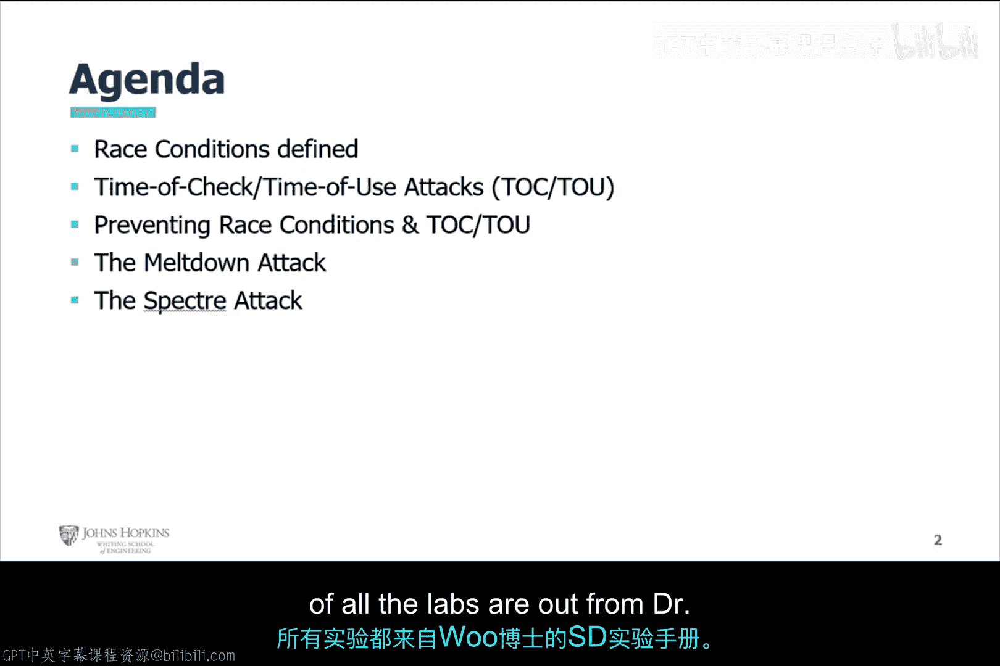
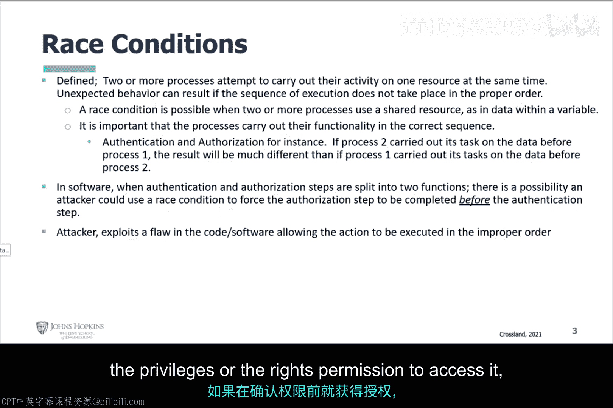
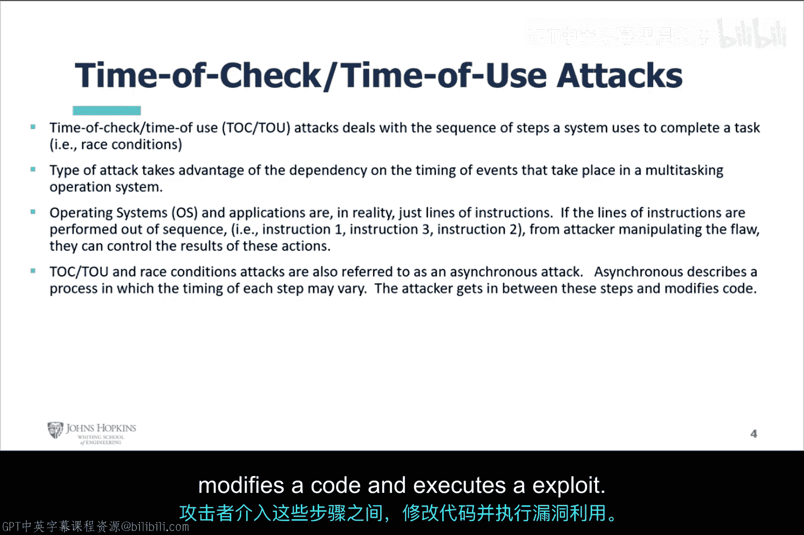
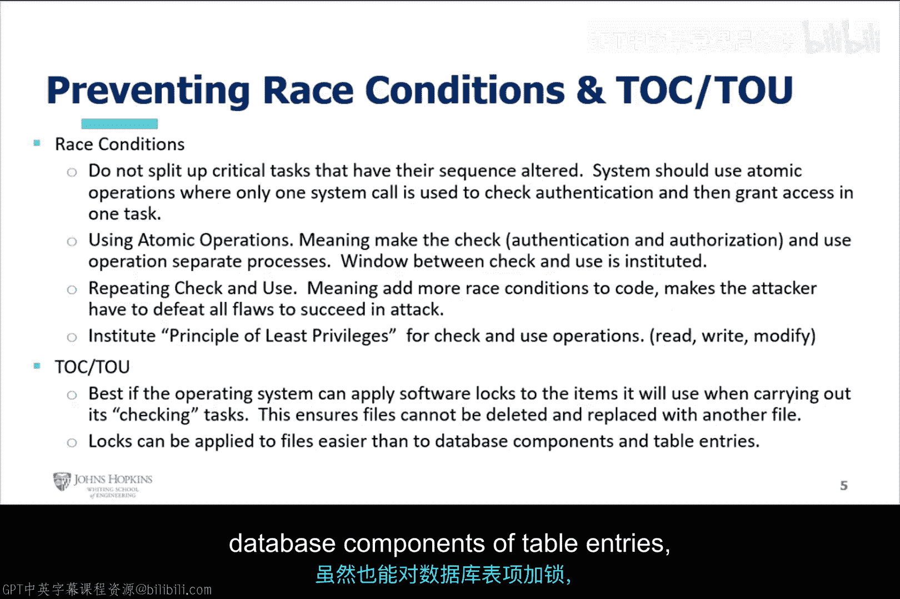
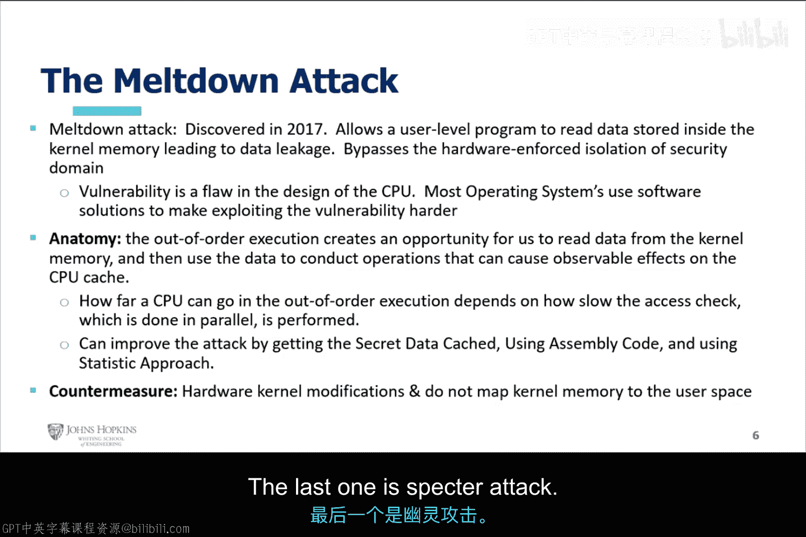
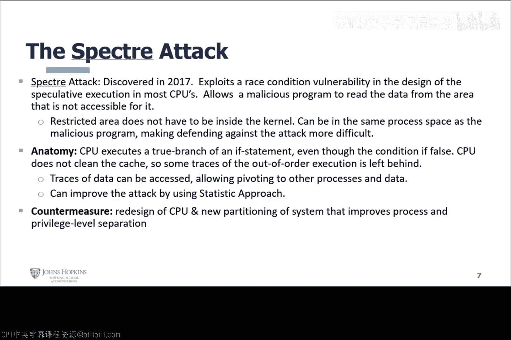

# 077：竞态条件基本原理 🏁

在本节课中，我们将要学习竞态条件的基本概念、其表现形式（如“检查时间-使用时间”攻击），以及如何防范此类漏洞。我们还将探讨两个著名的现代处理器漏洞：Meltdown和Spectre。

## 竞态条件定义

上一节我们介绍了课程的整体安排，本节中我们来看看竞态条件的核心定义。

竞态条件是指两个或更多进程试图在同一时间对同一资源执行其活动。这可能导致执行序列未按正确顺序发生，从而产生意外行为。

竞态条件可能发生在两个或更多进程使用共享资源（例如变量中的数据）时。确保进程按正确顺序执行其功能至关重要。例如，身份验证和授权就是一个关键示例。

在软件中，当身份验证和授权步骤被拆分为两个函数（例如“检查”和“使用”）时，攻击者就有可能利用竞态条件，强制授权步骤在身份验证步骤之前完成。攻击者需要利用代码或软件中的缺陷，使得操作能以错误的顺序执行。

## 检查时间-使用时间攻击

理解了竞态条件的基本定义后，本节我们来探讨其一种具体形式：检查时间-使用时间攻击。

检查时间-使用时间是竞态条件的另一种形式。这种攻击利用了系统完成一项任务所需的一系列步骤。本质上，它利用了多任务操作系统中事件发生时间的依赖性。

操作系统和应用程序实际上是一行行的指令。如果指令的执行顺序被打乱，攻击者通过利用漏洞，就能操控这些操作的结果。

检查时间-使用时间这类竞态条件攻击也被称为异步攻击。它特别描述了每个步骤的时机可能变化的进程。攻击者介入这些步骤之间，修改代码并执行其攻击。

## 防范竞态条件与检查时间-使用时间攻击

了解了攻击原理，本节我们来看看如何防范竞态条件与检查时间-使用时间攻击。主要有以下几种方法：

以下是防范竞态条件的主要方法：
*   **不要拆分关键任务**：不应拆分那些顺序可能被改变的关键任务。
*   **使用原子操作**：系统应使用原子操作，即仅通过一个系统调用来检查身份验证并授予访问权限，将其作为一个任务完成。这相当于在“检查”和“使用”之间设立了一个时间窗口或间隔。
*   **重复检查与使用**：可以添加更多的竞态条件检查代码，增加攻击者需要攻破的障碍。
*   **遵循最小权限原则**：对于检查和使用操作，只授予用户和对象执行其工作所必需的最小权限。

以下是防范检查时间-使用时间攻击的方法：
*   **应用软件锁**：最佳做法是操作系统能在执行检查任务时，对将要使用的项目应用软件锁。这确保了文件不能被删除或替换。对文件应用锁比锁定数据库组件或表条目更容易。

## Meltdown与Spectre攻击

在探讨了传统竞态条件后，本节我们来看看两个基于类似原理的现代处理器漏洞：Meltdown和Spectre。这两个漏洞均在2017年被发现，与事件执行顺序错乱有关。

**Meltdown攻击**允许用户级程序读取内核内存，导致数据泄露。它绕过了硬件强制实施的安全域隔离。该漏洞是CPU设计上的缺陷。其攻击原理是：乱序执行操作为用户创造了从内核内存读取数据的机会，然后利用这些数据在CPU缓存上引发可观测的效果。对抗措施包括硬件内核修改以及不将内核内存映射到用户空间。

**Spectre攻击**同样发现于2017年。它利用了大多数CPU推测执行设计中的一个竞态条件漏洞，允许恶意程序从本无法访问的区域读取数据。这个受限区域不一定在内核中，这使得防御Spectre攻击更加困难。其攻击原理是：CPU执行了一个条件为假的if语句分支，并且没有按预期清理缓存，从而留下了乱序执行的痕迹。这些残留的数据痕迹可以被访问。对抗措施包括CPU的重新设计，以及使用新的系统分区来改进进程和权限级别的隔离。

本节课中我们一起学习了竞态条件的基本概念，包括其定义和“检查时间-使用时间”这种具体攻击形式。我们探讨了通过原子操作、最小权限原则和应用锁等方法来防范此类漏洞。最后，我们了解了两个著名的现代处理器漏洞Meltdown和Spectre的攻击原理与基本防御思路。