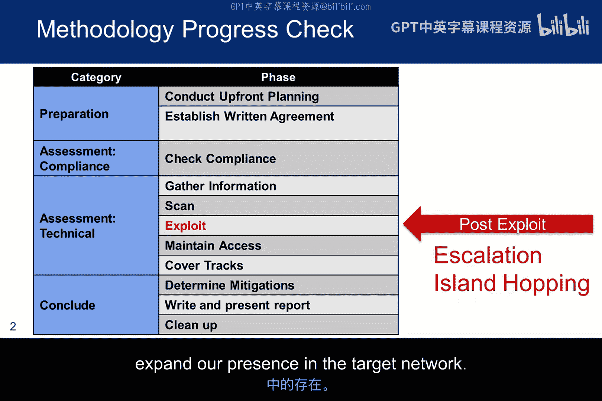
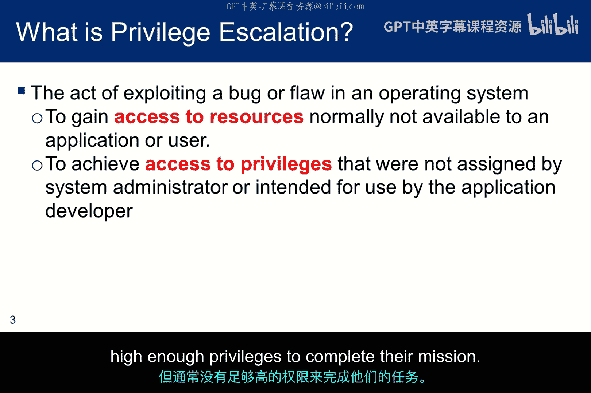
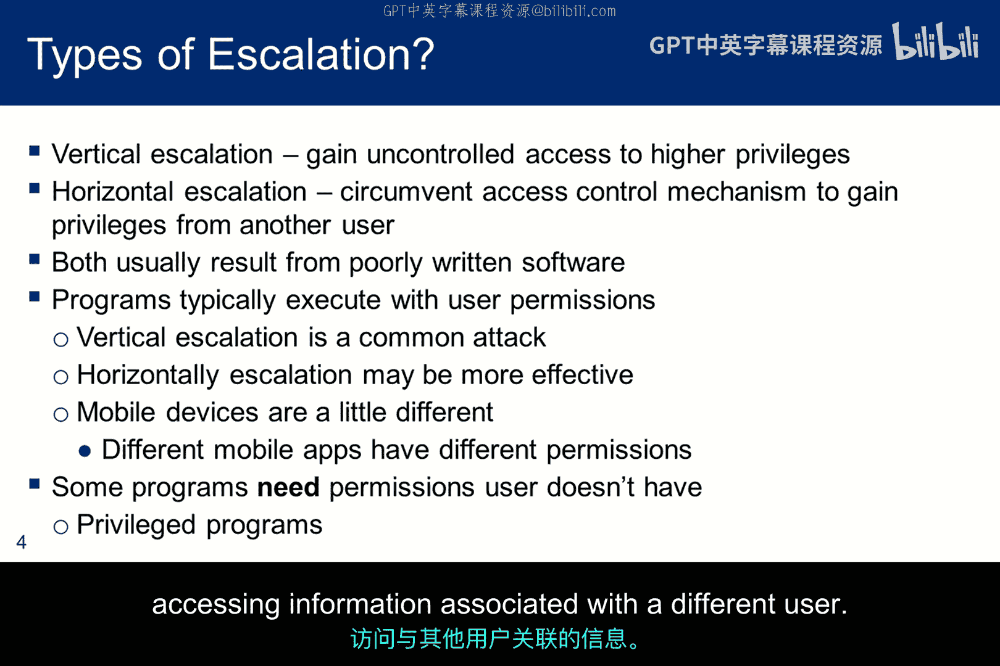
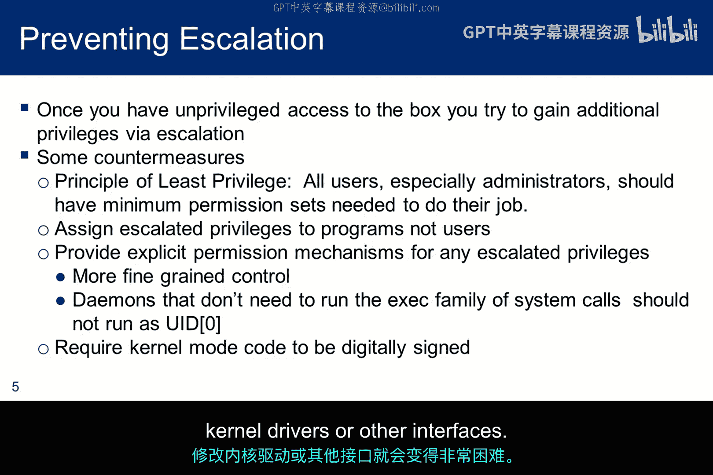
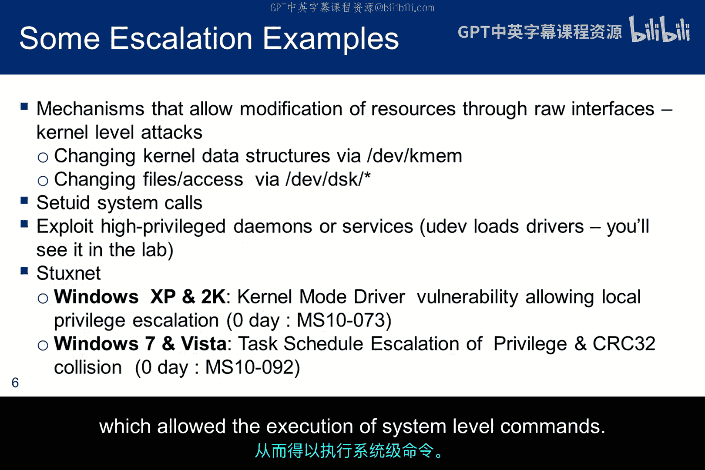
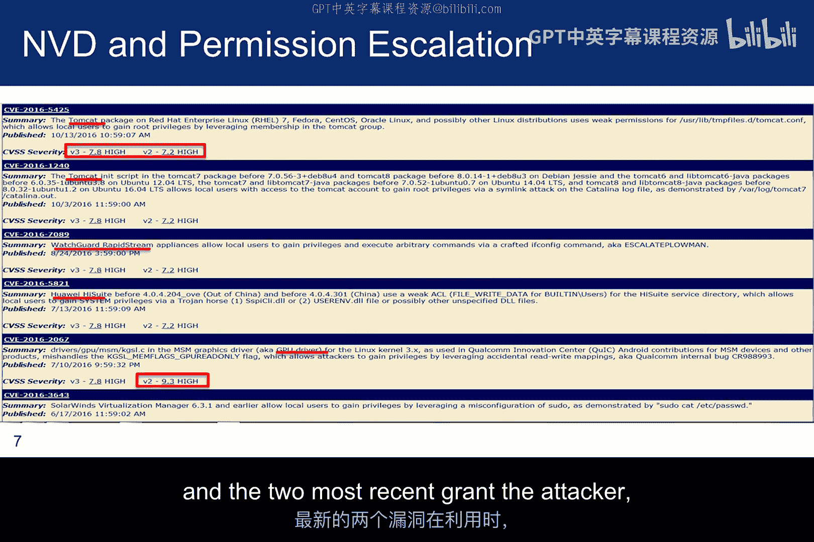
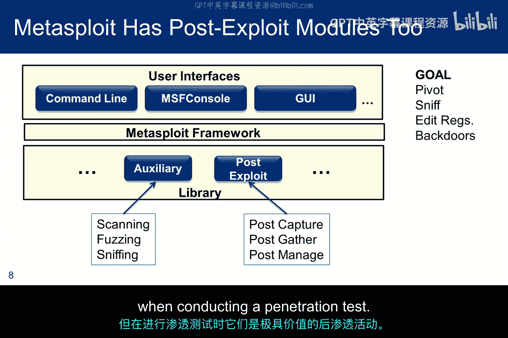
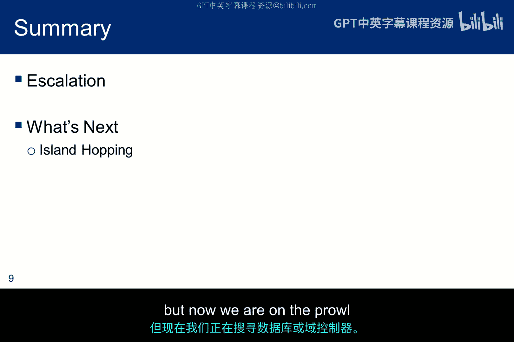

# 078：渗透后利用技术 🎯

在本节课中，我们将要学习在成功获得目标系统的初步访问权限（即“立足点”）之后，接下来需要执行的一系列关键活动。这些活动被称为“渗透后利用技术”，其核心目标是扩大我们在目标网络中的存在和影响力。

上一节我们介绍了如何获得初始访问权限，本节中我们来看看在获得立足点之后，攻击者或渗透测试者通常会做些什么。

---

## 权限提升 ⬆️

权限提升是渗透后阶段的首要目标之一。其基本概念是，用户、应用程序或攻击者通过利用某些漏洞，获得超出其正常授权范围的系统权限。

**权限提升** 可定义为：
> 利用应用程序中的缺陷，获取通常对低权限用户或应用程序被禁止访问的资源的行为。

权限提升主要分为两种类型：
*   **垂直提升**：攻击者获取更高级别账户（如管理员）的权限。
*   **水平提升**：攻击者获取与自身权限级别相似的其他账户的访问权限。

以下是防御权限提升的一些关键原则：
*   **最小权限原则**：只授予用户或程序完成工作所必需的最低权限。
*   **应用程序级授权**：将权限授予应用程序而非用户账户，限制横向移动。
*   **细粒度权限控制**：对高权限操作实施额外的访问控制检查。
*   **服务限制**：确保系统服务（守护进程）以所需的最低权限运行。
*   **代码签名**：要求内核模式代码必须经过签名，增加修改系统底层组件的难度。

---

## 权限提升实例 🔍

在现实世界中，权限提升漏洞多种多样。以下是一些常见的例子：

*   **基于平台的攻击**：通常涉及通过原始接口修改内核级别的访问，例如直接操作内存或磁盘。
*   **SetUID攻击**：利用设置了SetUID位的程序在短暂时间内拥有的高权限（如root），通过攻击将其转化为长期的高权限访问（例如获得一个root shell）。
*   **服务（守护进程）攻击**：如果一个以高权限运行的服务被攻破，攻击者可能直接获得相应的高权限。

一个著名的例子是Stuxnet蠕虫，它使用了两个零日漏洞进行权限提升。其中一个漏洞利用了键盘的内核模式驱动程序，允许攻击者以内核级别访问数据；另一个则通过修改内核级任务文件并创建CRC32碰撞来隐藏篡改痕迹，从而执行系统级命令。

---

## 持久化访问与痕迹清理 🕵️

在提升权限的同时或之后，攻击者会致力于维持长期访问并隐藏其活动痕迹。

以下是攻击者可能采取的一些关键行动：
*   **网络探测**：利用已攻陷的系统作为跳板，探测网络中的其他机器。
*   **数据嗅探**：捕获网络数据包，以发现其他潜在目标或窃取凭证。
*   **注册表操作**：在Windows系统中编辑注册表以获取信息或配置后门。
*   **后门植入**：安装后门程序或创建隐藏账户，以确保在系统重启或漏洞修复后仍能访问。
*   **痕迹清理**：删除日志文件、清除命令历史记录等，以掩盖入侵证据。

---

## Metasploit 渗透后利用模块 ⚙️

Metasploit框架提供了丰富的渗透后利用模块，帮助渗透测试者从已被攻陷的系统中收集数据和维持访问。

以下是几类主要的模块及其功能：
*   **信息收集模块**：例如 `windows/gather/credentials` 模块，用于收集密码、哈希值和令牌。
*   **交互控制模块**：例如 `windows/capture/keylog_recorder` 模块，用于记录被控系统的键盘输入（注意：需先迁移到一个交互式进程）。
*   **系统管理模块**：例如 `windows/manage/delete_user` 模块，用于从被控系统中删除指定用户账户。
*   **Shell升级模块**：用于将简单的shell会话升级为功能更全的Meterpreter会话。

此外，Metasploit还包含数百个辅助模块，用于执行扫描、模糊测试、嗅探等任务。这些模块虽然不直接提供shell，但在渗透测试的后期阶段极具价值。

---

## 横向移动（跳板攻击） 🔄

获得一个立足点后，攻击者不会止步于此。下一步通常是进行横向移动，有时也称为“跳岛攻击”，即从一个已攻陷的系统出发，去探测和攻击网络内部的其他计算机。

我们可能已经攻陷了一台办公电脑，但现在需要寻找并攻击更关键的目标，如数据库服务器或域控制器。横向移动使我们能够深入目标网络的信任区域。

---

本节课中我们一起学习了渗透后利用技术的关键组成部分。我们首先探讨了**权限提升**的核心概念与防御方法，然后通过实例了解了其具体表现形式。接着，我们学习了攻击者如何通过**持久化访问**和**痕迹清理**来巩固成果并隐藏行踪。之后，我们介绍了**Metasploit框架**中强大的渗透后利用模块，它们能自动化执行许多关键任务。最后，我们了解了**横向移动**的重要性，它是从单一立足点扩展到整个网络控制的关键步骤。掌握这些技术对于理解完整的攻击链和构建有效的防御体系至关重要。