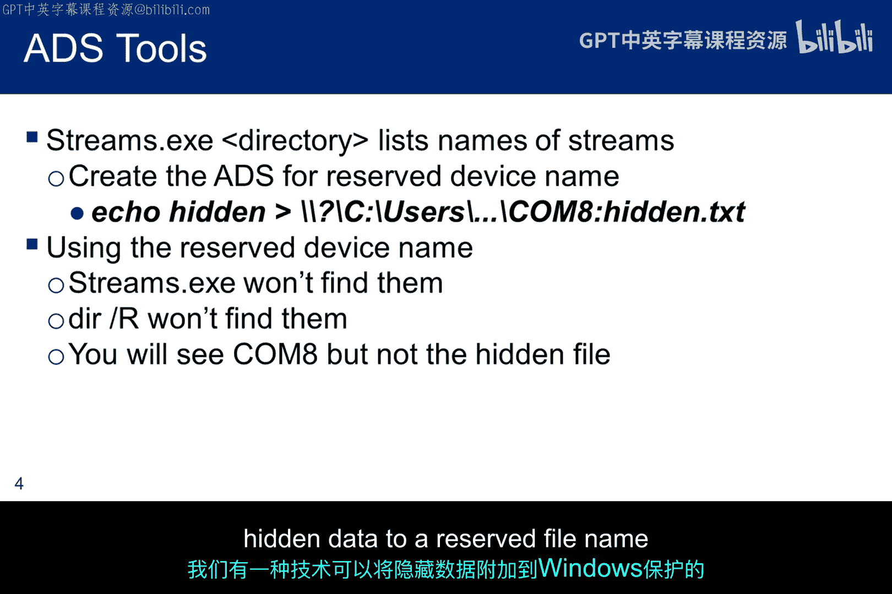
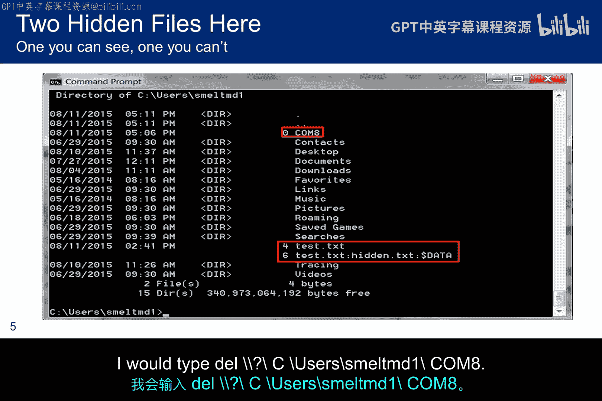
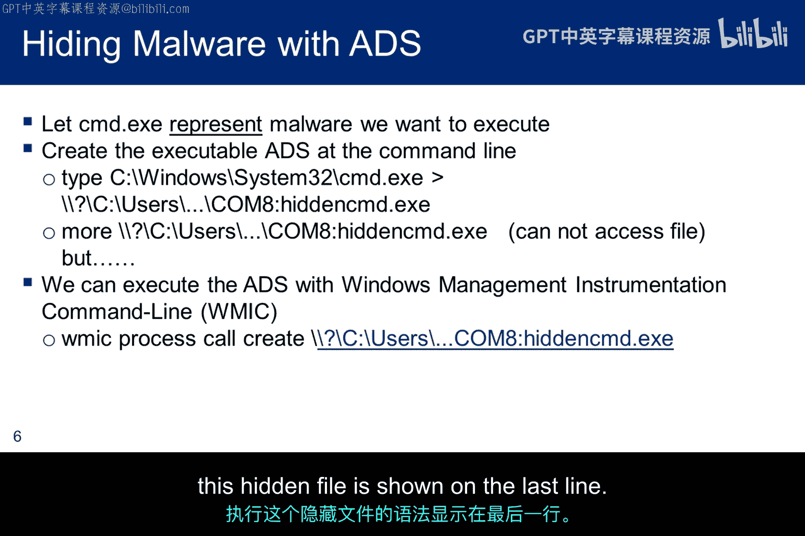
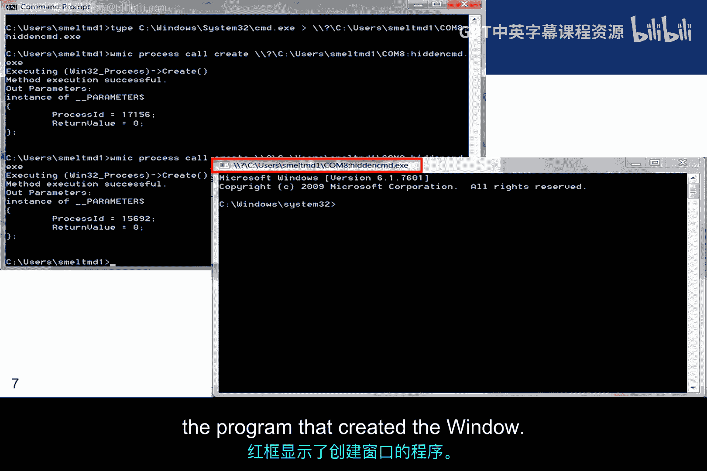
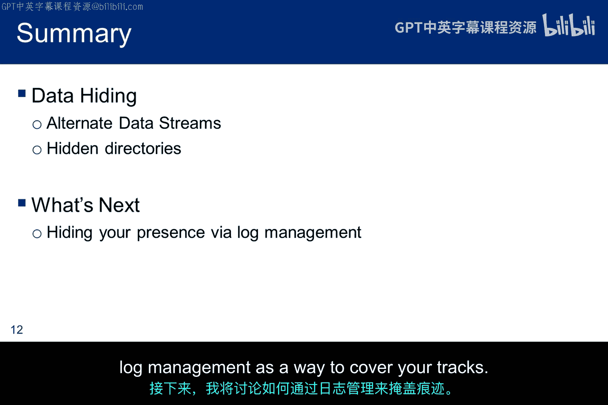

# 079：数据隐匿方法 🔍

在本节课中，我们将要学习数据隐匿的基本概念与方法。数据隐匿技术旨在将信息隐藏起来，以避免被轻易发现。例如，攻击者可能需要在目标系统上整理或加密数据，以便后续将其窃取，同时希望避免被检测到。课程将介绍几种具体的隐匿技术，包括利用操作系统特性隐藏文件或可执行程序。这些技术也引出了“rootkit”的概念，即试图对用户和系统管理员隐藏自身的恶意软件，但rootkit本身是另一个讲座的主题，本小节将不深入讨论。

## 文件系统与元数据

上一节我们介绍了数据隐匿的目的，本节中我们来看看操作系统如何存储文件信息，这为数据隐匿提供了基础。

Macintosh文件系统将数据存储在两个部分：资源分支（resource fork）和数据分支（data fork）。数据分支是实际包含数据内容的地方，而资源分支则告诉操作系统如何解释数据分支。换句话说，资源分支是**元数据**。

Windows系统采用了另一种方法来实现类似功能，称为**交替数据流**。ADS是一个隐藏的数据流，它补充了包含文件主体内容的常规数据流。这意味着元数据并不总是会在你认为它应该出现的时候显示出来。这个隐藏的流可以包含文件的元数据，例如文件的访问、修改时间和文件属性。

但Windows并不使用ADS来解释数据内容，文件内容的解释是由文件扩展名决定的。因此，重要的是，我们实际上可以将其他信息放入资源分支或ADS中将其隐藏，并以非预期的方式使用它。

## 创建与利用交替数据流

了解了ADS的基本概念后，我们来看看如何具体创建和利用它来隐藏数据。

本幻灯片展示了一种使用记事本创建ADS的简单方法。当我们使用 `dir /R` 选项请求目录内容时，隐藏的.txt文件会显示出来。但是，还有其他技术可以更安全地隐藏数据。

一种技巧利用了设备名称。这些是以大写字母标识的特殊名称，有时带有一个数字，例如 `COM8`。如果我们尝试用记事本创建 `COM8.txt`，会收到一条错误消息，提示该名称被Windows保留，应选择另一个名称。基本上，操作系统名称解析会检查这些保留名称并保护它们。

但是，表达式 `\\?\` 可以关闭操作系统的名称解析。这个表达式告诉Windows API禁用所有字符串解析，并将紧随其后的字符串直接发送到文件系统。因此，如果我们调用该表达式，就可以创建和写入保留的文件名。`echo` 命令和 `more` 命令都接受这个表达式，它们允许我们创建和读取一个Windows认为归其所有的文件。

以下是利用保留设备名创建隐藏文件的步骤：
1.  使用 `\\?\` 前缀绕过Windows的名称保护机制。
2.  使用 `echo` 命令将数据写入该文件。
3.  使用带有 `\\?\` 前缀的 `more` 命令可以读取该文件内容。

## 检测与删除ADS

既然可以创建隐藏的ADS，那么如何发现和清理它们呢？

有一些工具旨在帮助处理交替数据流。其中一个叫做 `streams.exe`。它会检查命令行中指定的文件和目录，并告知在这些文件中遇到的任何命名流的名称和大小。然而，`streams.exe` 使用了一个未公开的本机函数来检索文件流信息，因此它并不完美，并且无法找到附加到像 `COM8` 这样的保留名称上的数据流。



当我们使用保留名称时，`dir /R` 也无法识别这些流。因此，我们拥有一种技术，允许我们将隐藏数据附加到Windows保护的保留文件名上。


这是我的Windows机器上的一个截图，其中有两个交替数据流。一个流附加到 `COM8`，另一个附加到 `test.txt`。你可以看到 `dir /R` 对其中一个有效，但对另一个无效。顺便说一下，如果你决定尝试这个，删除一个ADS需要使用相同的 `\\?\` 表达式来关闭解析。例如，要删除此目录中的 `COM8`，我需要键入：
```
DEL \\?\C:\users\smeltMD1\COM8
```



## 隐匿恶意软件示例

数据隐匿技术可能被滥用于恶意目的，接下来我们看看如何利用ADS隐藏可执行程序。

现在，我想谈谈利用这个想法来隐藏恶意软件。因此，我将使用可执行文件 `cd.exe` 来代表一个恶意的可执行程序。这个程序会打开一个带有命令提示符的窗口。所以当这种情况发生时，我们可以推断恶意软件可能已被执行并采取了恶意行动。

我打开一个命令提示符。第一步是创建一个具有保留文件名（如 `COM8`）的文件。接下来，我们想使用 `type` 命令。这个命令通常列出文件的内容。如果你输入 `type cd.exe`，Windows 会将可执行文件中每8位字节的ASCII字符渲染到屏幕上。但如果你不试图渲染它，它将被逐位复制。

在所示案例中，该命令表示：将 `cd.exe` 复制到附加到 `COM8` 的交替数据流，并且不要解析文件名以尝试保护保留字。命令如下：
```
type cd.exe > \\?\C:\Users\smeltMD1\COM8:hidden.exe
```

不幸的是，我们无法使用 `more` 来读取这个文件，但我们可以使用 **Windows管理规范命令行** 工具来使其执行。执行这个隐藏文件的语法显示在最后一行：
```
wmic process call create \\?\C:\Users\smeltMD1\COM8:hidden.exe
```






此屏幕截图显示了左上角的执行过程。当它运行时，会在右下角打开命令提示符。红色框显示了创建窗口的程序。


当我在连接到JHU网络的机器上运行此程序时，Carbon Black检测到了意外活动，并将其识别为潜在恶意活动。我开始收到来自我们安全团队的紧急加密电子邮件，询问我此事。他们分享了这张截图。我很惊讶Carbon Black能识别出这个，因为它根本没有任何恶意，但看起来它是以 **Windows管理规范可执行文件** 为关键特征进行识别的。一点历史：Bit9成立于2002年，该公司在2014年初收购了总部位于德克萨斯州的Carbon Black，并开始使用合并后的名称。此后，Carbon Black产品似乎增长非常迅速。

这是来自网络安全的另一张截图，显示了我的机器上运行的一些进程，再次，`WMIC` 被高亮显示，尽管它链接的是一个无害的可执行文件。

## Linux下的数据隐匿

Linux并没有像交替数据流那样的隐藏机制，但我们仍然可以使用一些技巧来隐藏数据。我将讨论其中之一。

其思想是创建一个可能被忽略的目录。我们将创建一个名为 `. `（点+空格）的目录。由于它以点开头，`ls` 命令默认不会显示它。`ls -la` 会显示它，但它可能很容易被忽略，特别是当该目录在文件结构深处并且有大量点文件时。

以下是一个显示所述目录的屏幕截图。你可以看到有几个点文件有助于隐藏它。我们创建用于隐藏数据的目录位于顶部，如果不了解Linux，很容易错过它。它看起来确实像一个普通的目录。许多用户除了shell配置文件外，从不查看他们的点文件。

但是，如果你确实注意到了它，却又不知道它的名字是“点+空格”，你甚至无法进入或删除它，除非进行一些分析来弄清楚目录名。

## 总结

本节课中我们一起学习了数据隐匿的几种核心方法。我讨论了使用交替数据流和隐蔽目录来隐藏数据。接下来，我将讨论日志管理作为掩盖踪迹的一种方法。



