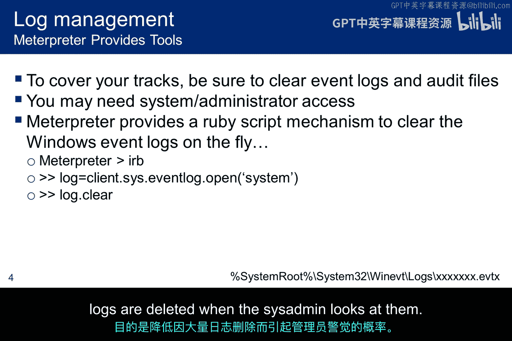
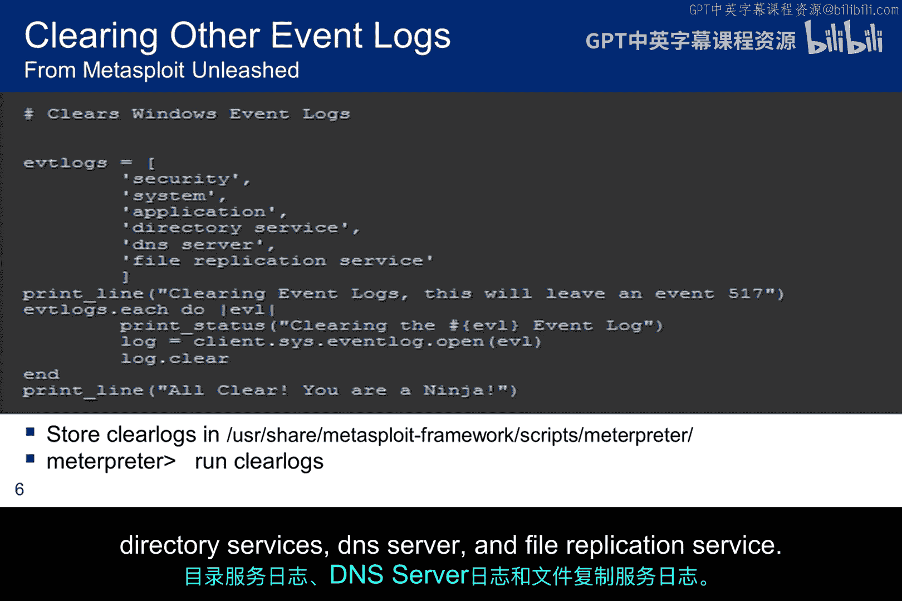
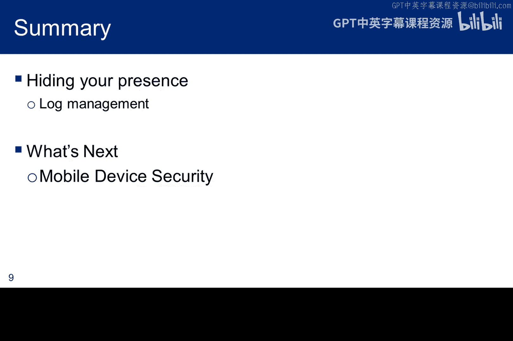

# 080：日志清除与痕迹隐藏 🕵️

在本节课中，我们将学习如何在获得系统访问权限后，通过管理日志来隐藏自己的活动痕迹。核心目标是避免被系统管理员发现，这包括禁用审计、清理临时文件以及从日志中移除特定条目。

上一节我们讨论了权限提升，本节中我们来看看如何清理留下的痕迹。

## 禁用审计与初步清理

获得初步立足点后，第一件事是尝试禁用系统审计。如果成功，后续活动将不会被记录。但这通常不足以完全隐藏，因为渗透过程中可能已经留下了痕迹。因此，需要进行清理工作。

以下是需要清理的主要项目：
*   **临时文件**：删除渗透过程中创建的任何临时文件。
*   **缓存**：清除可能记录活动信息的各种缓存。
*   **日志条目**：从系统日志中移除与渗透活动相关的记录。
*   **临时用户**：删除为渗透而创建的临时用户账户。

**注意**：直接删除整个日志文件容易被发现。更佳的做法是精准地移除由你的活动产生的特定日志条目。

## 定位并管理MySQL日志

在我们的实验环境中，获得权限后可能需要探查数据库。在操作数据库前，需先尝试禁用或规避其活动日志记录。

以下是定位MySQL相关日志的检查点：
1.  **检查默认日志位置**：查看MySQL的默认日志文件是否存在。
2.  **检查系统日志**：在标准系统日志文件中搜索MySQL条目。
3.  **检查配置文件**：查看`/etc/mysql/my.cnf`配置文件，确认是否启用了额外日志。若文件位置不同，可使用 `find` 命令搜索 `my*.cnf`。
4.  **检查进程参数**：运行 `ps aux | grep mysql`，查看MySQL守护进程启动时是否启用了日志记录。
5.  **检查其他日志进程**：运行 `ps aux | grep log`，查看系统启用了哪些其他日志记录。
6.  **检查初始化脚本**：检查 `/etc/init.d/mysql` 或 `/etc/rc*.d/` 中的符号链接文件，确认MySQL服务启动时是否附带日志记录参数。
7.  **检查二进制日志**：查看 `/var/lib/mysql/` 目录下的二进制日志。这些日志主要用于SQL事务和复制，通常不记录数据库访问，但仍需核对时间戳以确认。

## 清除Windows系统日志

如果通过Meterpreter获得了Windows系统的shell，可以利用其Ruby环境动态清除日志。

首先，在Meterpreter shell中启动Ruby解释器：
```ruby
irb
```
然后，设置要清除的日志变量并执行清除命令。例如，清除系统日志：
```ruby
log = client.sys.eventlog.open('system')
log.clear
```
Windows系统中有多种事件日志，位于 `C:\Windows\System32\winevt\Logs\` 目录下，文件扩展名为 `.evtx`。清除前应充分了解目标，避免删除不必要的日志，以防因过多日志缺失而引起管理员怀疑。




上图展示了Windows日志目录，红框内为系统日志，但可见还有其他多种日志需要审查。

## 使用脚本批量清除日志

可以编写Ruby脚本批量清除多个日志。以下脚本示例 `clear_logs.rb`：
```ruby
# clear_logs.rb 脚本示例
['security', 'system', 'application', 'directory service', 'dns server', 'file replication service'].each do |log|
    puts "Clearing the #{log} Event Log"
    client.sys.eventlog.open(log).clear
end
```
将脚本放置在 `/usr/share/metasploit-framework/scripts/meterpreter/` 目录下。当获得Meterpreter会话后，只需执行：
```
run clear_logs
```
脚本将依次清除列表中指定的日志（安全、系统、应用程序等），并在清除时打印日志名称。




上图展示了通过事件查看器（可通过右键点击“计算机”->“管理”->“事件查看器”->“Windows日志”打开）查看的系统日志在被清除前后的对比。

## 渗透测试收尾工作

至此，我们的道德黑客方法论已基本讲解完毕。最后阶段涉及为客户交互做准备：
1.  **分析结果与制定建议**：分析所有发现，并为修复漏洞、降低风险制定建议。
2.  **撰写报告与准备演示**：编写完整的渗透测试报告，并为客户准备结果演示。
3.  **清理系统**：移除测试过程中留下的所有痕迹，使系统恢复如初，完全可操作。如果在测试范围内植入了后门，也必须全部清除。本质上，就是将系统恢复到原始状态。

## 总结

本节课中我们一起学习了渗透后痕迹清除的关键技术。本讲重点介绍了日志清除，而本模块涵盖的其他主题还包括后渗透技术、权限提升、横向移动、持久化和数据隐藏。接下来，我们将转向移动设备领域，探索针对Android模拟器使用渗透测试工具的方法。



