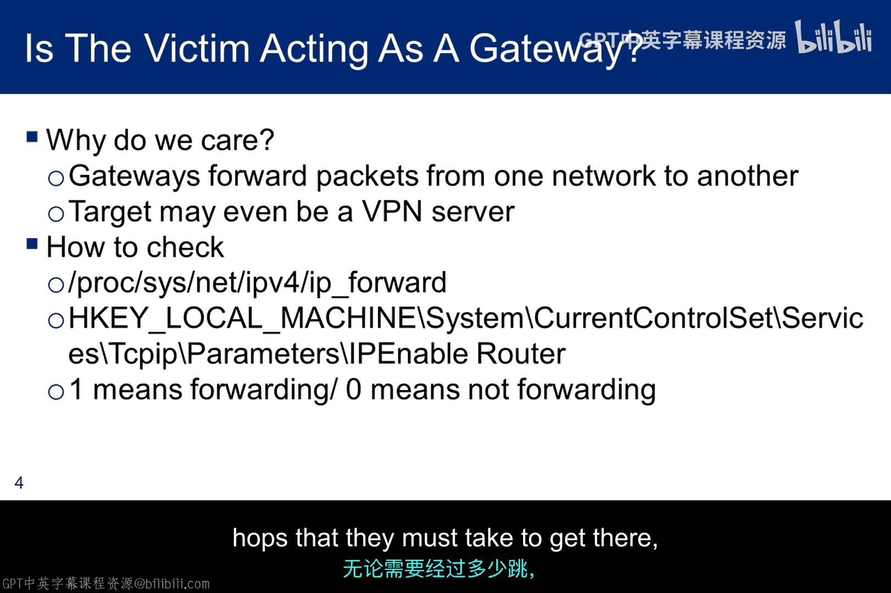
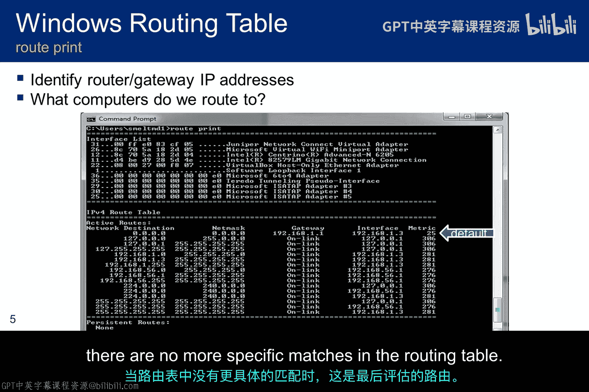
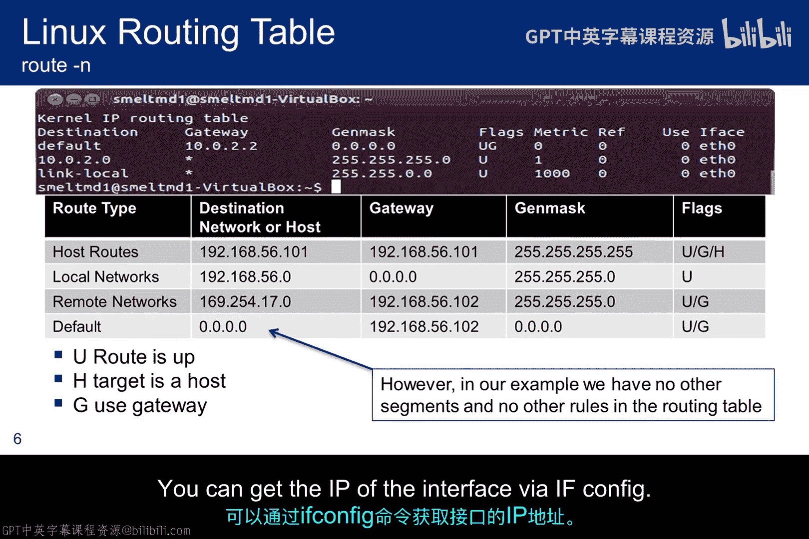
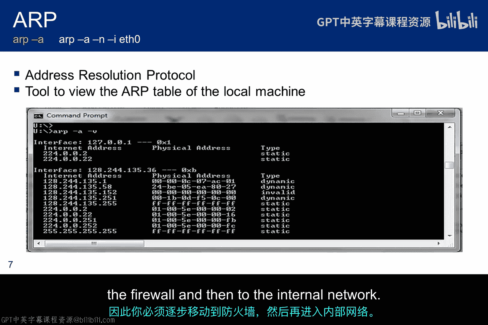
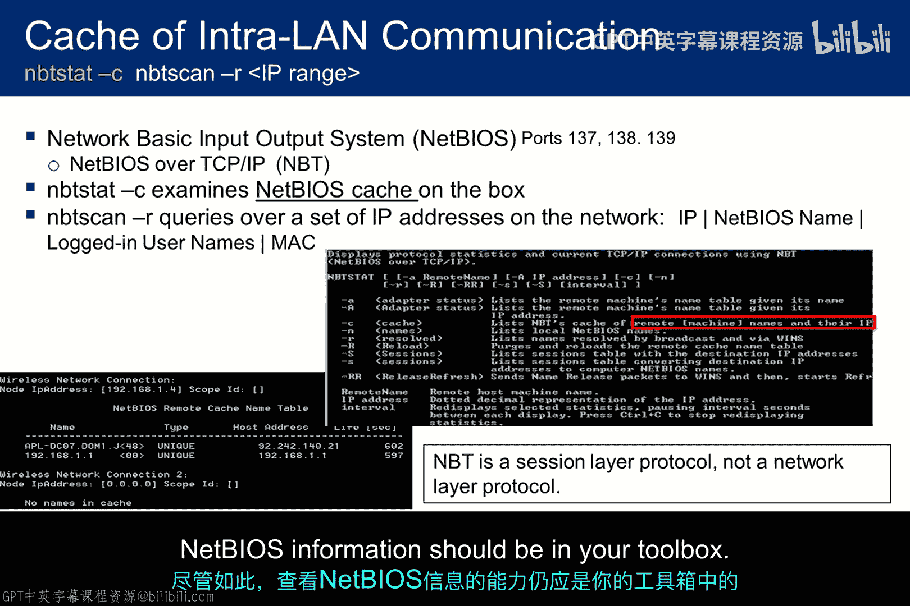
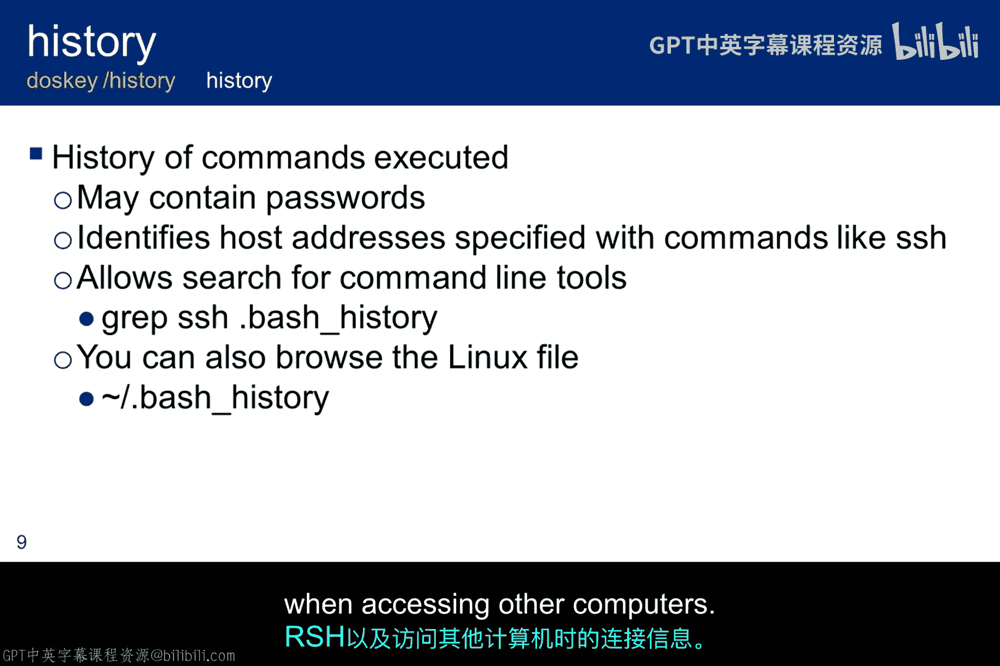
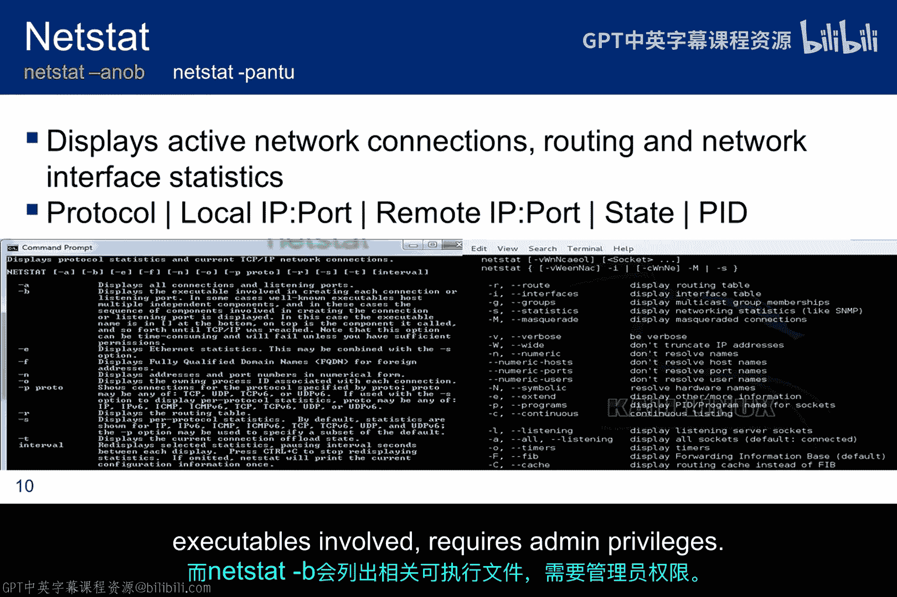
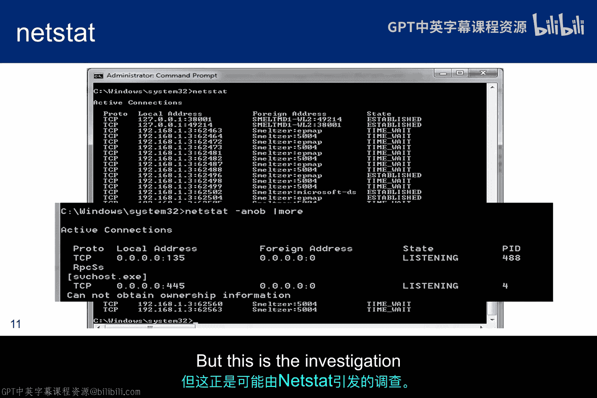
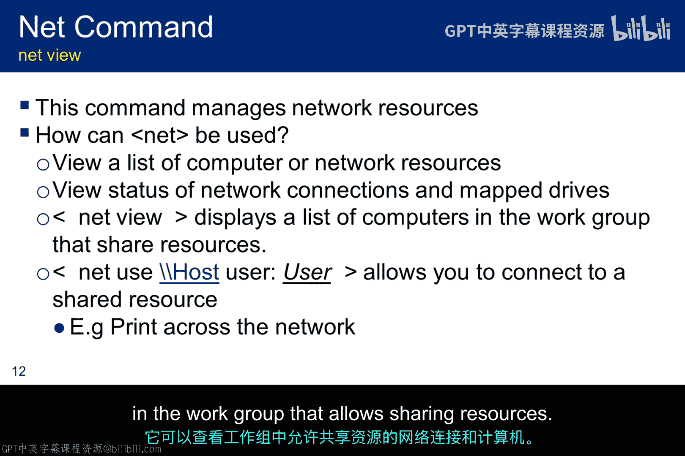
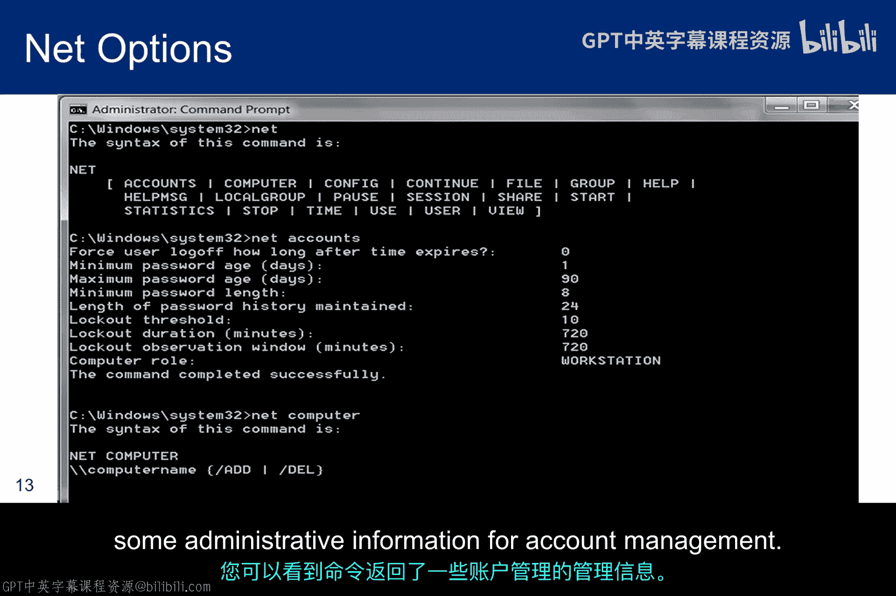

# 081：跳岛攻击与网络枢纽渗透 🏝️➡️🔀

## 概述
在本节课中，我们将要学习一个至关重要的概念——**枢纽渗透**。在渗透测试或攻击中，我们常常只能获得一个低权限的初始立足点。本节课将介绍如何利用这个立足点，收集信息并探索网络内部，以寻找更高价值的攻击目标，这个过程也被形象地称为“跳岛攻击”。

---

## 枢纽渗透的重要性
我们的方法论已经引导我们完成了侦察、扫描和漏洞利用。但在许多情况下，我们可能只在一个对达成任务目标无关紧要的系统上获得了一个低权限的立足点。客户可能不认为这种访问构成实质威胁。然而，对于黑客和道德黑客而言，下一步都是确定我们能在网络中移动到何处，以便提升权限或窃取影响任务的关键敏感信息。

## 跳岛攻击的信息收集方法
以下是四种收集跳岛攻击信息的方法，本节课将对其进行概述。综合利用这四种来源的信息，可以帮助我们识别潜在目标，以及初始受害主机过去、现在和未来与之通信的其他设备。

在后续幻灯片中，我将讨论一些操作系统功能，它们能帮助你在成功入侵一台主机后收集跳岛攻击所需的信息。大多数情况下，工具依赖于操作系统。在幻灯片中，白色文本提供Linux语法，黄色文本提供Windows语法。

---

## 网络接口配置信息
`ifconfig` 是用于显示配置信息和控制网络接口的操作系统工具的一个例子。

`ifconfig` 的一些用途包括：设置接口的IP地址和子网掩码、查找MAC地址以及禁用指定接口。此外，Linux系统通常使用调用 `ifconfig` 的Shell脚本来初始化其接口。系统管理员经常使用此工具来显示和分析网络接口参数、默认网关以及DNS和WINS服务器。

识别网关的核心思想在于扩大我们的活动范围。如果初始受害者充当网关，它可以被视为一个将数据包转发到其他网络上其他计算机的路由器。这些路由可以由网络管理员硬编码（称为静态路由），也可以通过路由协议动态学习。重要的是，我们可以收集有关其他IP地址、VPN和远程设备的信息。

如果我们知道它同时充当VPN服务器，那么这台机器还将拥有对后端企业网络的访问权限和多个连接，这可以被用于跳岛攻击。我们可以通过检查Linux上的 `ip_forward` 开关或Windows上的 `IPEnabledRouter` 开关，来查看设备是否充当路由器。如果它启用了IP转发功能，我们就需要详细检查其路由表。路由表为路由器提供了如何利用现有的物理网络基础设施将数据包送达目的地的指令，无论数据包需要经过多少跳才能到达。我们想要利用这些信息。

---

## 分析路由表
任何使用TCP/IP的计算机都需要做出路由决策。路由表用于控制这些决策。就跳岛攻击而言，路由表将提供网关IP地址，并允许你识别新的网络和主机目标。

以下截图显示了一个Windows路由表。`网络目标` 和 `网络掩码` 列共同描述了一个网络。例如，目标 `192.168.1.0` 和网络掩码 `255.255.255.0` 可以写作网络 `192.168.1.0/24`。`网关` 列描述了下一跳，换句话说，它指向可以到达该网络的网关。`接口` 列指示哪个本地可用接口负责到达该网关。在此示例中，网关 `192.168.1.1` 可以通过地址为 `192.168.1.3` 的本地无线网卡到达。最后，`跃点数` 列表示使用指定路由的相关成本，这对于确定网络中两点之间某条路由的效率很有用。

网关列中的 `在链路上` 表示一条可直接到达的路由，换句话说，网络接口与其在同一子网上直接通信。因此，在表中，要联系 `192.168.1.x/24` 网络，只需从 `192.168.1.3` 向 `192.168.1.x` 发送数据包，目标机器将直接看到并接收该数据包。而列出的网关为 `192.168.1.1` 的路由，则必须通过该网关进行联系。

`0.0.0.0` 是默认路由，即当路由表中没有其他更具体的规则时使用的路由。它要求数据包从 `192.168.1.3` 发送到网关 `192.168.1.1`，然后由网关将其转发到最终目的地。当路由表中没有更具体的匹配项时，这是最后被评估的路由。

---

## Linux路由表详解
在顶部，你可以看到我的一个Linux路由表，当时它非常简洁。它显示的格式与Windows路由表略有不同，尽管功能相同。在底部的PowerPoint版本中，我列出了路由类型的类别，以扩展上一张幻灯片的讨论。

**主机路由** 是针对特定IP地址的路由。随着你向下查看，下一个路由规则提供的信息越来越不具体，子网范围越来越大，直到最终到达默认路由。

因此，Linux路由表条目存储以下类型的路由：
1.  **主机路由**：指向特定IP地址的路由，允许基于每个IP地址进行路由。网络ID是指定主机的IP地址，网络掩码是 `255.255.255.255`。
2.  **本地路由**：针对直接连接的网络ID的路由。发往直接连接网络的IP数据包不会转发给路由器，而是直接发送到目的地。对于本地网络，网关显示为 `0.0.0.0`，例如，如果目的地在 `192.168.1.2` 到 `192.168.1.255` 的网络范围内。
3.  **远程网络ID路由**：针对非直接连接但可通过其他路由器访问的网络ID的路由。网关字段将包含位于转发节点和远程网络之间的本地路由器的IP地址。
4.  **默认路由**：当找不到更具体的网络ID或主机路由时使用的路由。默认路由的网络ID是 `0.0.0.0`，网络掩码是 `0.0.0.0`，相当于Windows中的“在链路上”。当因为找不到更好的路由而选择默认路由时，IP数据包将使用接口列中对应IP地址的接口，转发到网关列中的IP地址。你可以使用 `ifconfig` 获取接口的IP。

---

## 地址解析协议缓存
地址解析协议用于查找给定IPv4地址对应的网络邻居的MAC地址。

如前所述，这里显示的工具输出用于查看本地机器的ARP表。命令行输入是带有各种开关的 `arp`。ARP表已被缓存，该工具列出了当前机器与之通信过的其他主机，为跳岛攻击提供了宝贵信息。

在Linux中，`-n` 开关禁用DNS查找来解析主机名，只使用数字地址，这提供了一种更安静的扫描技术，属于被动而非主动扫描。如果你在典型网络上运行 `arp`，你会看到每个人都与防火墙通信。因此，你必须逐步移动到防火墙，然后再进入内部网络。

---

## NetBIOS 网络信息服务
NetBIOS是一种允许不同计算机上的应用程序在局域网内通信的程序。它由IBM为其早期PC网络创建，后被微软采用，并已成为其所在领域事实上的行业标准。其主要功能是作为通过TCP/IP传输的会话层协议，为计算机和共享文件夹提供名称解析。基于TCP/IP的NetBIOS将NetBIOS名称解析为IP地址，类似于DNS。

该系统还会缓存局域网内的通信信息，可以使用 `net` 命令或TCP工具查看。当启用时，NetBIOS为通过其通信的不同计算机上的应用程序提供三种不同的服务：
1.  名称服务，用于名称注册和解析，通过UDP端口137完成。
2.  数据报分发服务，用于无连接通信，同样通过UDP端口138完成。
3.  会话服务，用于面向连接的通信，通过TCP端口139完成。

Windows上的 `nbtstat` 可以揭示有关NetBIOS名称以及远程或本地机器名称表的信息，但仅限于一台主机。Linux上的 `nbtscan` 是一个NetBIOS名称服务器扫描器，其功能与 `nbtstat` 相同，但它针对一个地址范围而不是单个地址进行操作。`nbtscan` 显示网络上运行NetBIOS服务的主机的IP地址、NetBIOS名称、登录用户和MAC地址。

一段时间前，微软引入了无需NetBIOS层、直接在TCP/IP上运行SMB的能力。这种直接的TCP/IP SMB运行在端口445，是运行SMB的首选方法。尽管如此，查看NetBIOS信息的能力仍应是你工具箱中的一部分。

---

## 命令行历史记录
查看命令行使用历史可以产生关于用户在机器上输入内容的有价值信息。用户可能无意中在命令行下输入了密码，历史文件会将其暴露。例如，如果你工作迅速，以为上次登录信息提示密码错误，你可能会重新输入密码，而没有意识到你已经登录。当发生这种情况时，它会留在历史文件中，如果用户没有想到清除它或不知道如何清除它。

命令行历史还可能产生关于命令行工具的信息，例如安全外壳、安全FTP、Telnet、远程登录，以及在访问其他计算机时的连接信息。

---

## 网络连接状态
`netstat` 显示有关活动网络配置的资源信息。它可能允许攻击者识别本地服务以进行潜在的权限提升，或识别到其他网络的已建立连接（可能通过防火墙）。它甚至可能提供帮助攻击者劫持会话的信息。

如本幻灯片所示，`netstat` 有许多选项。Windows上的 `-n` 允许你关闭名称解析，使侦察更加被动。而 `-b` 用于列出涉及的可执行文件，需要管理员权限，因此你必须以管理员身份运行命令提示符才能使用它。正如下一张幻灯片将说明的，输出提供了本地和远程IP地址以及连接状态。

---

## Netstat 输出示例
这是我的Windows机器上的 `netstat` 输出。`-tn` 显示活动的TCP连接，`-a` 表示所有端口，`-o` 表示包含进程ID。`netstat -tno` 和 `tasklist` 可以让你比较进程ID，并杀死具有未知外部地址（例如C2服务器）的可疑进程。

曾经有一段时间，我使用卡巴斯基杀毒软件，并且连接到了英国的服务器。但我必须进行一些挖掘才能确定这一点。这种连接可以通过更改配置选项在一定程度上进行控制。但这正是可能由 `netstat` 引发的调查类型。

---

## Net 命令
Windows上的 `net` 命令将为你提供网络资源的视图、共享这些资源的计算机，并可能允许你连接到这些资源（如果没有访问控制机制的话）。

`net` 有时是建立跨网络打印连接的有用工具。与我们在此讨论的许多工具一样，它提供了网络连接和工作组中允许共享资源的计算机的视图。

---

## Net 命令帮助信息
此截图是 `net` 命令的帮助屏幕。在这种情况下，我还请求了有关帐户的信息，你可以看到该命令返回了一些用于帐户管理的管理信息。

---

## 实战脚本与后续步骤
2013年，专门从事安全事件取证和调查的公司Mandiant，撰写了一份关于中国高级持续性威胁的报告，并试图识别APT攻击者的身份。作为该报告的一部分，Mandiant识别出攻击者在获得机器访问权限后立即使用的一个脚本。你可以看到，我在这里讨论的几个工具都包含在这个脚本中。其明确目标是立即捕获尽可能多的信息，以协助他们获取对其他潜在受害者（包括可能在网络上的域控制器）的访问权限。

虽然我没有重点讨论Windows网络，但攻击者的首要目标是找到域控制器。你甚至可能会发现测试这个脚本很有趣，但请不要这样做。它很可能会被你组织的IDS或IPS识别或阻止，并且你可能需要为此做出解释。Mandiant报告值得一读，如果你还没有看过的话。目前可以在 `intelreport.mandiant.com` 找到。如果报告因某种原因被移动或链接失效，你应该能够通过搜索“Mandiant”和“APT1”找到它。

一旦你在一个主机上获得了立足点，道德黑客的过程就重新开始了。你开始从内部进行侦察和扫描。Metasploit通常安装在Linux机器上，甚至可能提供网络脚本引擎功能。在我们的虚拟黑客环境中就是这种情况，但由于Linux版本较旧，Metasploit上的可用脚本有限。你可能能够将脚本从攻击机移动到目标机，然后从防火墙内部运行它们。

配置错误也可以被利用。出于多种原因，管理员可能会重用管理员或域控制器的访问密码。虽然这是一个严重的安全错误，但如果网络很大，它可以消除跟踪多个密码或将它们写在可能被窃取的文件中的需要。这种做法是安全性与易用性之间经典权衡的完美例子。无论如何，一旦你获得了管理员密码，你应该尝试在所有地方使用它，看看是否有效。在许多情况下，它会。

---

## 总结
本节课中我们一起学习了枢纽渗透和跳岛攻击的核心概念。我们探讨了多种用于在网络内部收集信息、识别新目标的工具和技术，包括分析网络接口配置、路由表、ARP缓存、NetBIOS信息、命令行历史、网络连接状态以及使用 `net` 命令。这些信息对于从一个初始的、可能权限较低的立足点出发，逐步深入目标网络，寻找更高价值目标至关重要。接下来，我们将讨论持久化和后门。