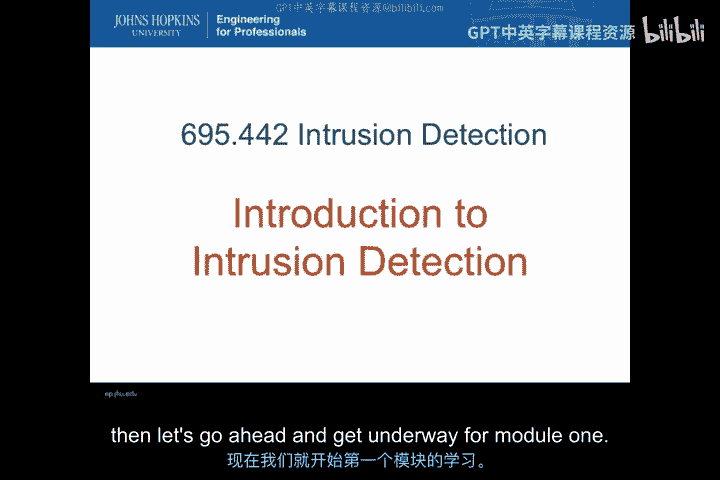
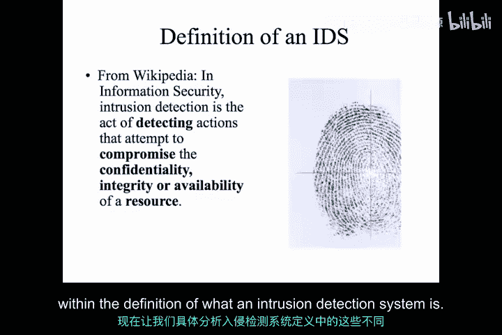
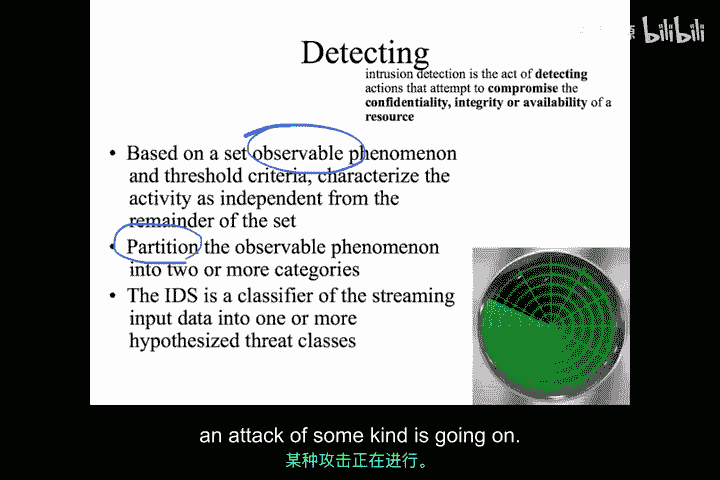
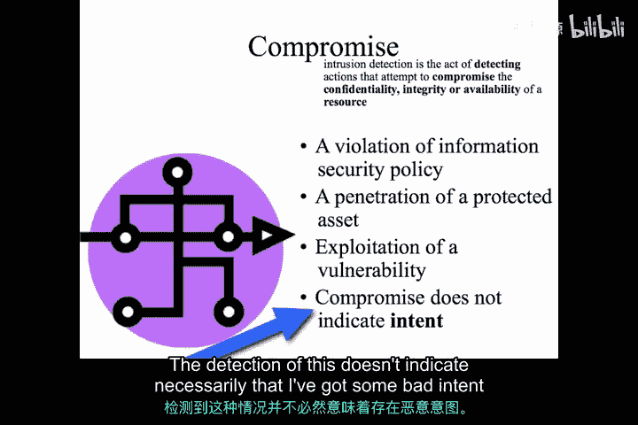
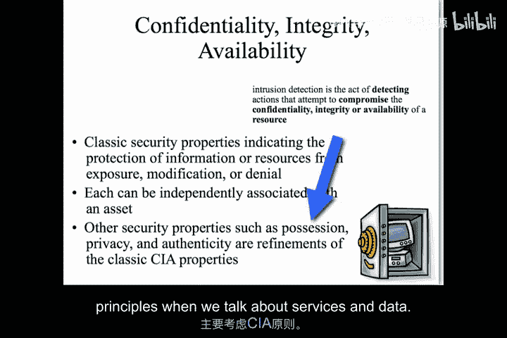
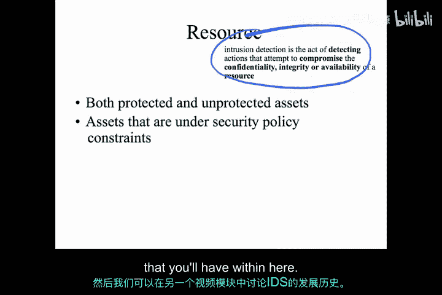

# 002：入侵检测系统导论 🛡️

在本节课中，我们将学习入侵检测系统的基本概念。我们将从定义入手，逐步拆解其核心组成部分，帮助你理解IDS是什么以及它是如何工作的。

---

## 概述

入侵检测系统是网络安全领域的关键工具。它通过监控和分析系统或网络活动，来识别可能违反安全策略的行为。本节将详细介绍IDS的定义及其核心要素。

---

## 入侵检测系统的定义

首先，我们从传统的定义开始，并对其进行拆解，以便理解入侵检测系统的各个组成部分。

以下定义引自维基百科，它很好地概括了入侵检测系统的本质：

> 入侵检测系统是一种**检测**企图**破坏**资源**机密性、完整性或可用性**行为的设备或软件应用。

这个定义中的关键要素已加粗显示，即**检测**、**破坏**、**CIA三原则**以及**资源**的概念。

接下来，我们将逐一分析定义中的这些不同领域。

---

## 核心概念解析

### 1. 检测的含义

“检测”显然是定义中的重要部分。在入侵检测系统的语境下，检测意味着存在一组**可观察的现象**、**可观察的标准**以及某种**阈值**，这些能将特定活动与其他活动区分开来。

这意味着，从根本上说，IDS系统是一个数学意义上的**分类器**。它接收一组**流式输入数据**，并将其分类到一个或多个假设的威胁类别中。这就是入侵检测系统中“检测”某物的基本原理。

具体来说，当我们谈论IDS中的检测时，因为涉及分类器，我们讨论的**并非**检测意图、恶意、邪恶或“攻击”这个词本身。在这些关于检测的概念中，你看不到任何这类东西。

检测的关键在于你**起始的数据集**，即所有现象都必须是**可观察的**。一旦可观察，我们就能将这些可观察现象划分到不同类别中。这正是我们从IDS中得到的。IDS**永远不会**告诉我们意图，也**永远不会**真正知道某事是恶意的。事实上，“检测”并不意味着我**正确识别**了某种攻击正在进行。它只是意味着，在我这里的分类器中，我将可观察的集合划分成了**感兴趣的部分**。

### 2. 破坏的含义

现在，当我想讨论“破坏”这个领域时，我所说的“感兴趣的部分”主要是指那些**违反信息安全策略**的事情。

因此，这个分类器的工作方式，就是将观察结果划分为：我认为属于我的信息安全策略范围内的，以及不属于我的信息安全策略范围内的。

例如，“对受保护资产的渗透”这个概念，意味着我获得了一个可观察的现象，表明我从一个本不应发起该访问的位置，接触到了一个受保护资产。这就是我们说“受保护资产遭到破坏”时的具体含义。

“破坏”也可能与**漏洞利用**相关的可观察现象有关。例如，有时我可以特别观察某个网络服务的输入字符串，并知道我正在匹配某种漏洞利用。

但需要特别强调的是（这一点怎么说都不为过），这里的“破坏”**并不表明意图**。无论这个特定的可观察现象显示信息安全策略遭到破坏是偶然造成的，还是其他原因，检测到它并不必然意味着涉及恶意意图。

### 3. CIA三原则

如果不深入探讨**CIA三原则**——即资源的**机密性、完整性和可用性**——就无法真正谈论根据信息安全策略定义的“破坏”。

这些我们讨论的经典安全属性，表明了信息的保护本质上是至关重要的，这样IDS才能专注于那些真正被信息安全策略所围绕的要素。

具体在本课程中，当我们谈论“破坏”时，我们再次真正关注的是信息保障中的经典CIA原则。当然，还有其他安全属性，如**持有性、隐私性、真实性**，它们都是经典CIA属性的细化。这些是描述安全属性的有用方式，入侵检测系统可能对检测它们感兴趣。但总的来说，这些属性大多已经可以与现有的某个CIA类别相关联。因此，在讨论服务和数据时，我们主要会考虑CIA原则。

### 4. 资源

自然地，当你想谈论CIA属性遭到破坏时，你谈论的是某种**资源**，即某种受安全策略约束保护的或未受保护的资产。

需要记住的重要一点是，**并非每个资产都必须明确定义在安全策略之下**。可能存在许多隐含的约束，甚至缺乏明确的策略，但存在关于什么应该受到保护的常识。例如，在我自己的家庭基础设施中，我可能没有把所有我认为在遭到破坏时应受保护的资源都写下来，但我当然会意识到，当一个未经授权的个人（无论是本地靠近我的网络，还是从某个地方远程接入）获取了一个我不希望被分发的文件时，我就遭到了破坏。或者，如果我把自己的信息（比如照片等）放到了云端，即使我没有明确的政策规定这些文件或照片不应被分享，如果这些照片突然在某个开放的网页群组中被曝光，我仍然会认为这是一种破坏。

---

## IDS的本质与特点

从上面的通用定义可以看出，当我说入侵检测是**检测**企图**破坏**资源**CIA属性**的**行动**时，这本身就意味着IDS与计算机取证或我们可能想到的其他保护系统的活动**非常不同**。

IDS就其本质而言，是一种**接近实时的活动**，你希望在事件**实际发生时**进行检测。它并非专门用于查看分类器以识别系统中先前发生的破坏，或试图对过去发生的事情进行归因。你可能会使用收集到的数据来测试入侵检测系统，但入侵检测的部署和行动确实意味着，我有一组**实时流式事件**正在被分类到威胁类别中，以便识别对某种受保护资源的CIA属性的破坏。

---

## 总结

本节课中，我们一起学习了入侵检测系统的基本定义和核心概念。我们了解到，IDS是一个基于可观察现象对活动进行分类的系统，其核心目标是检测对资源CIA属性的潜在破坏行为，而无需判定行为背后的意图。理解这些基础概念是深入学习IDS工作原理和技术细节的第一步。