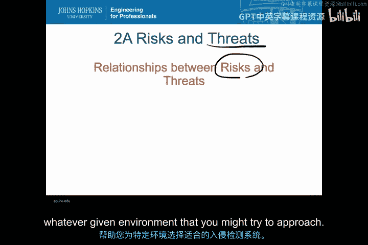
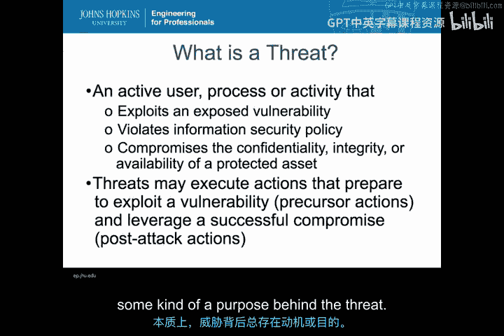
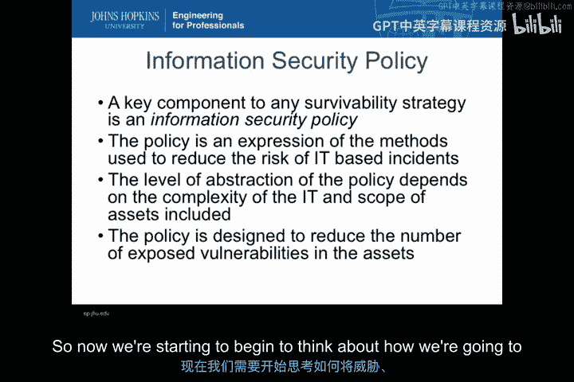
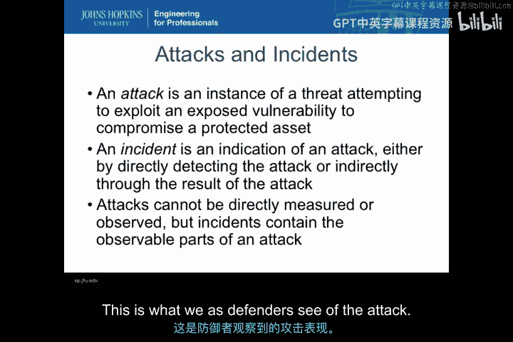
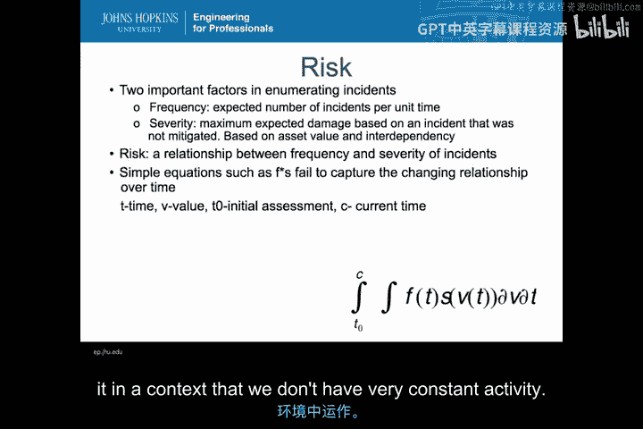
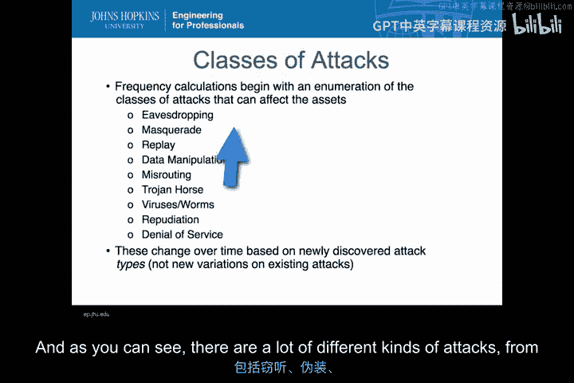
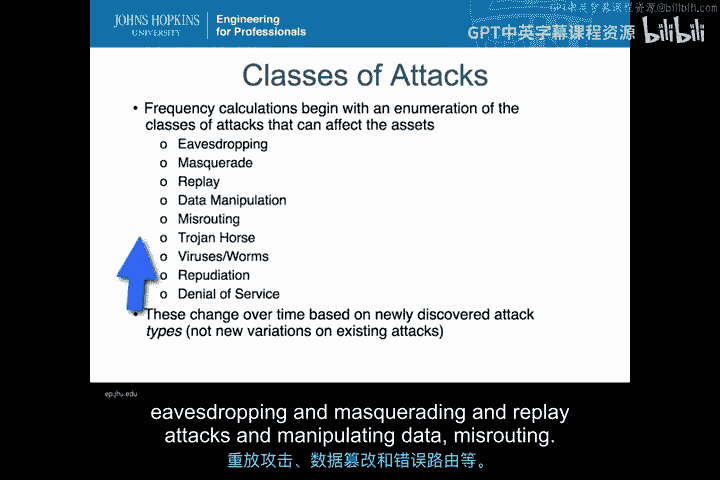
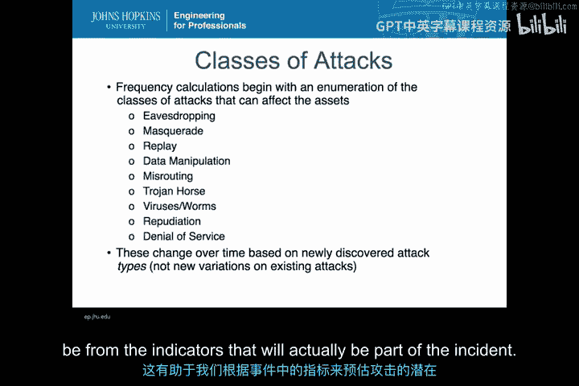
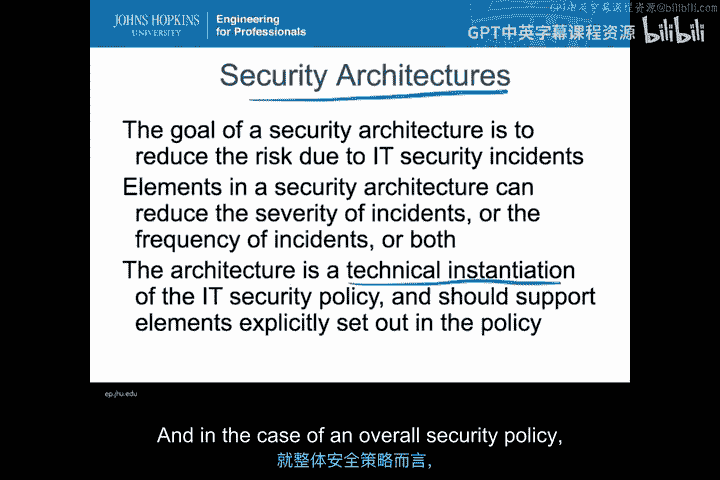
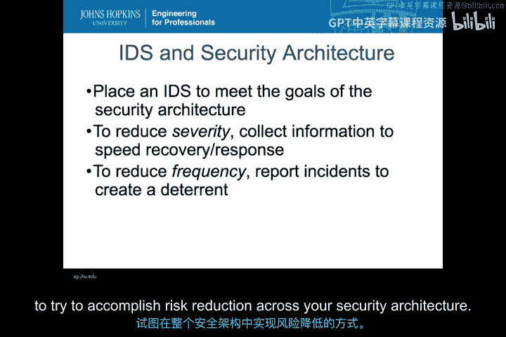

# 003：网络风险与威胁类型 🔍

在本节课中，我们将探讨入侵检测系统的应用与降低组织风险之间的关系。理解威胁、风险与入侵检测系统之间的核心联系，是选择合适系统的基础。

---

## 威胁的定义与构成 🎯

上一节我们介绍了课程概述，本节中我们来看看什么是威胁。在入侵检测系统的语境下，威胁指的是一个**主动的用户进程或活动**，它正在对系统执行某些操作。威胁不是被动的、抽象的，也不是指某个特定的人群。

一个活动要成为威胁，必须利用某种**漏洞**。这里的漏洞不一定是技术性的，也可能是策略、组织架构或控制措施上的缺陷。威胁总是有动机的，其目的是试图违反或破坏信息安全策略的某些方面，这些方面通常围绕着受保护资产的**机密性、完整性或可用性**。

以下是威胁可能采取的行动阶段：
*   **攻击前行动**：为利用漏洞而进行的准备工作。
*   **漏洞利用**：利用暴露的漏洞进行攻击的核心行动。
*   **攻击后行动**：在成功入侵后，利用已攻陷的系统进行的后续活动。

本质上，威胁是主动的渗透组件，是入侵检测系统需要帮助我们应对的对象。

---

## 信息安全策略的核心作用 🛡️

信息安全策略是定义安全事件的核心。威胁违反系统内的规则，本质上就是违反了信息安全策略。策略本身是降低风险所采用方法的体现。

这些策略的抽象层次因组织的环境和复杂性而异，没有统一的编写方式。但所有策略的目的都是减少暴露的漏洞数量，从而降低威胁可能实现的渗透程度。

---

## 攻击与事件的区别 ⚔️

我们一直在讨论威胁的攻击行为。那么，攻击和事件有什么区别呢？攻击是从攻击者视角出发的，是威胁试图利用暴露的漏洞来破坏受保护资产的一个具体实例。它包含了攻击者的动机和试图达成的目标。

与此形成鲜明对比的是**事件**。事件是我们作为防御者所看到的攻击迹象。它为我们提供了攻击者可能正在做什么的**指标**，这些指标可以是直接观察到的系统活动，也可以是攻击产生的间接结果。

这意味着攻击本身无法被直接测量或观察。入侵检测系统实际能看到的是事件中**可观察到的攻击部分**。我们无法直接看到攻击者的动机和意图，但可以看到他们为实现目标而留下的具体技术指标。

---

## 风险：频率与严重性的组合 📊

这直接引出了对风险的讨论。风险是**频率**和**严重性**的组合。

*   **频率**：指单位时间内预期发生的事件数量。
*   **严重性**：指在攻击成功的前提下，预期造成的最大损害，通常基于资产价值和相互依赖性。

风险本身是事件频率和严重性之间的关系。然而，实际情况并非简单的 `风险 = 频率 × 严重性` 这么简单，因为两者都会随时间变化。

*   **严重性变化**：资产价值会因市场、环境、依赖性等因素而增减。
*   **频率变化**：当新漏洞暴露时，频率可能上升；当目标吸引力下降时，频率可能降低。

因此，频率、严重性、时间和价值之间存在复杂的关系。对于入侵检测而言，理解这种动态变化至关重要，因为许多系统试图定义“正常”行为，但网络空间的复杂性使得这些概念难以用固定公式求解。

---

## 攻击类型与风险计算 🗂️

风险的另一个复杂之处在于攻击类型的多样性。我们的频率计算始于对可能影响各类资产的攻击类别进行枚举。

以下是不同的攻击类别示例：
*   窃听
*   伪装
*   重放攻击
*   数据篡改
*   错误路由

这些是不同的攻击类别，而不仅仅是单个攻击。每个攻击类别对目标的影响各不相同，因此其严重性也取决于被操纵的资产和攻击方式。

这些不同的攻击类别为我们提供了观察和分类攻击指标的不同视角，有助于我们从事件指标中预估攻击的潜在严重性。

---

## 安全架构与入侵检测的角色 🏗️

综合以上所有概念，我们需要构建一个安全架构来降低风险。降低风险意味着降低所检测到事件的严重性或频率。安全架构中的各个组件可以单独或共同作用，来降低严重性或频率。

安全架构是信息安全策略的技术实现，是执行策略目标的元素集合。入侵检测系统只是整个安全架构中的一个元素，它需要与其他元素（如防火墙、访问控制等）协同工作，共同实现信息安全策略。

因此，入侵检测系统并非设计用来执行安全策略的每一个方面，我们需要明确它在安全架构中的适当定位。

---

## 入侵检测系统如何降低风险 ⚙️

入侵检测系统在安全架构中主要通过两种方式降低风险：

**1. 降低严重性**
主要通过收集信息来加速**响应和恢复**工作。即使入侵检测系统只能在事后告警，更快的恢复速度也能降低该事件造成的总体严重性。其核心逻辑是：`快速响应 → 缩短攻击者自由活动时间 → 减少潜在损害 → 降低严重性`。

**2. 降低频率**
这更具挑战性，主要通过对威胁方施加影响来实现，即起到**威慑**作用。
*   **对于内部威胁**：如果内部人员知道自己的行为受到监控且会被报告，可以起到一定的威慑作用，减少攻击尝试的频率。
*   **对于外部威胁**：如果能够通过入侵检测系统进行良好的溯源，并借助执法等行动，也可以对尤其是偶然的外部攻击者产生威慑。

---

## 总结 📝

本节课中，我们一起学习了网络风险与威胁的核心概念。我们明确了**威胁**是主动利用漏洞的活动，**攻击**是其实例，而**事件**是我们观察到的攻击迹象。**风险**由事件的频率和严重性动态构成。入侵检测系统作为安全架构的一部分，通过**加速响应以降低严重性**，以及**通过监测和溯源产生威慑以降低频率**，来帮助组织实现风险降低的目标。理解这些基本关系，是有效部署和运用入侵检测系统的前提。