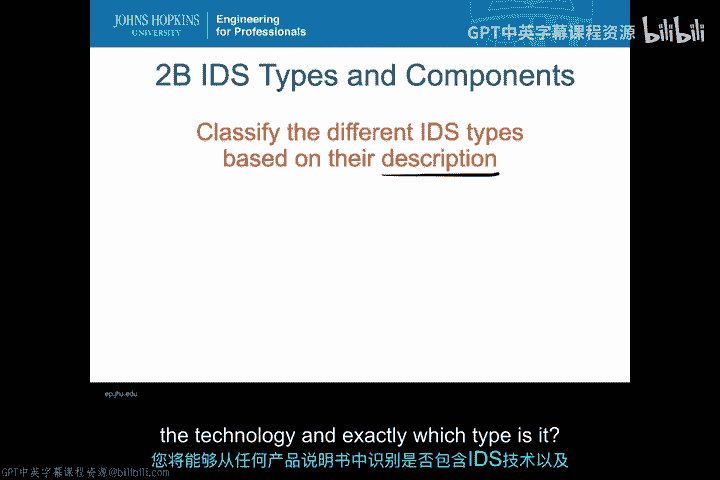
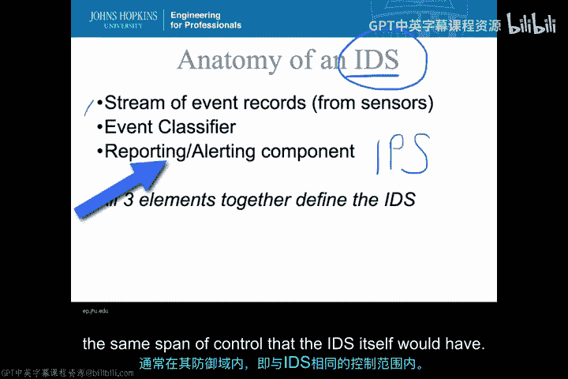
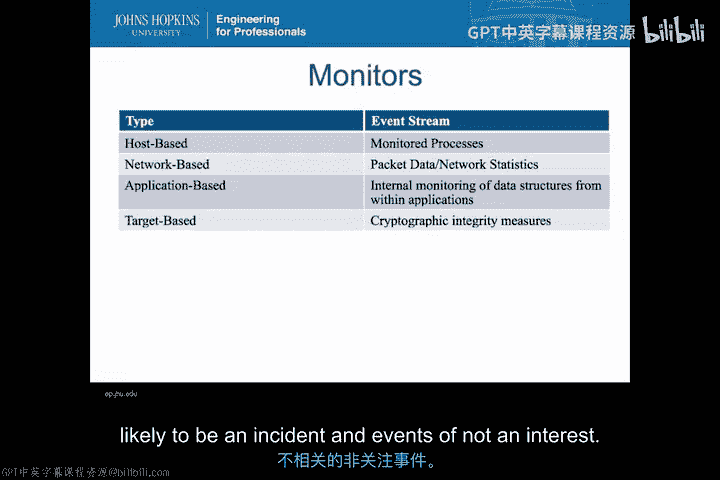
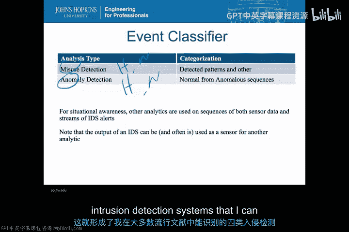
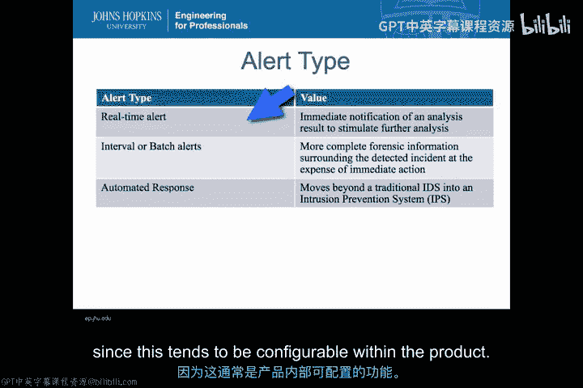
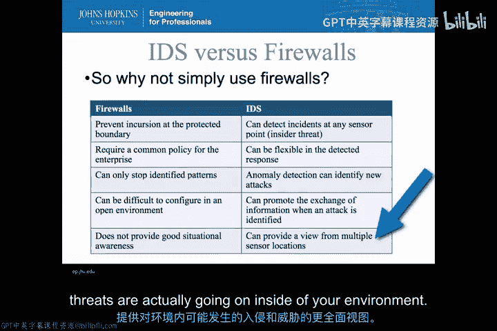
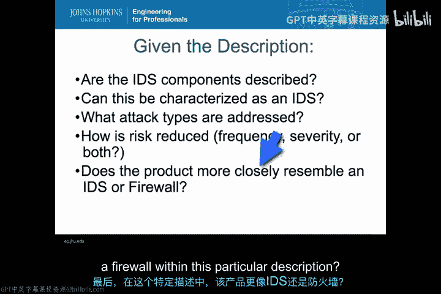
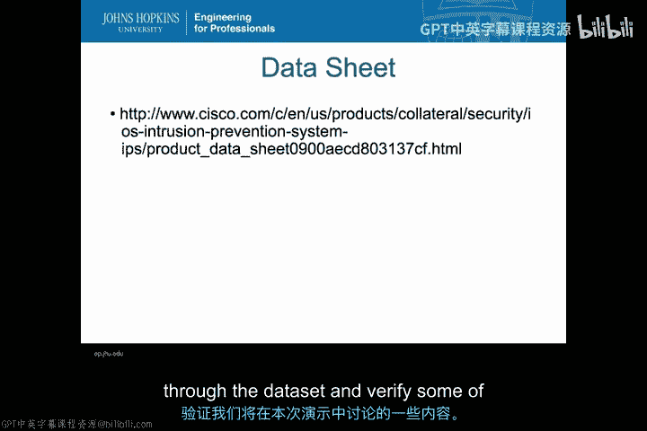

# 004：IDS分类与核心组件 🔍

在本节课中，我们将深入学习入侵检测系统的不同类型和核心组件。我们将对IDS进行分类，并剖析其构成要素。学完本节后，你将能够阅读任何产品说明书，并准确判断其中是否包含IDS技术，以及它属于哪种类型。

---

## 入侵检测系统的解剖结构 🧬

每一个入侵检测系统，无论其具体形态如何，都由三个基本要素构成。产品说明书中必须包含这三个要素，才能称之为一个真正的IDS系统。

以下是构成IDS的三个核心组件：

*   **事件流**：输入到IDS的数据流。
*   **事件分类器**：分析事件流并识别潜在事件的引擎。
*   **报告/告警组件**：将分类结果通知用户或系统。

需要特别说明的是，第三个组件——报告/告警组件——如果具备**自动响应**能力，那么该系统就从IDS升级为**入侵防御系统**。IPS除了具备IDS的三个要素外，还能在其防御域内自动采取行动。

---

## 事件流：监控数据的来源 📡

上一节我们介绍了IDS的整体结构，本节中我们来看看第一个核心组件：事件流。IDS的类型主要根据其输入的数据流类型来区分。

以下是四种主要的IDS输入类型：

*   **基于主机的IDS**：监控主机上的进程。事件流通常来自被监控进程的审计日志、操作系统内核或应用程序。其监控的是**静态数据**。
*   **基于网络的IDS**：监控网络数据包或网络统计信息。其监控的是**传输中的数据**。
*   **基于应用的IDS**：监控应用程序内部的数据结构。它可以是基于主机的（监控应用进程），也可以是基于网络的（通过深度包检测分析应用层流量）。
*   **基于目标的IDS**：专注于监控重要文件或元素的**完整性**。例如，确保系统文件或特定的网络流量模式不被篡改。最著名的例子是**Tripwire**。

所有这些监控器的共同点是，它们都涉及将数据流实时或近实时地送入分析引擎进行分类，这与事后取证的取证工具不同。

---

## 事件分类器：系统的心脏 ❤️

现在，让我们从输入事件流转向IDS的核心——事件分类器。分类器负责将输入事件流进行分离和分类，判断哪些事件可能指示一次安全事件。

基本上，IDS的分类器可分为两大类：

*   **误用检测**：也称为**基于特征的检测**。系统预先定义了一系列代表攻击模式的“特征”或事件序列。当输入流中出现匹配这些特征的模式时，即被判定为事件。其公式可简化为：`检测到已知特征 => 事件告警`。
*   **异常检测**：系统首先建立一个“正常”行为基线。当输入事件流偏离这个正常基线，无法匹配时，就被判定为异常事件。其逻辑是：`行为偏离正常基线 => 事件告警`。

**误用检测**的优点是能精确识别已知攻击，误报率低；缺点是无法检测未知的“零日攻击”。**异常检测**的优点是理论上能发现新型攻击；缺点是容易将不常见但合法的行为误判为攻击，导致误报率高。

此外，关于分类器还有两点需要注意：
1.  IDS收集的原始数据和告警信息常被保存下来，用于态势感知或取证分析。
2.  IDS可以**级联**使用，即一个IDS的输出（告警事件流）可以作为另一个IDS分析引擎的输入，这有助于发现更广泛的攻击趋势。

结合监控源（主机/网络）和检测方法（误用/异常），我们得到了四种主要的IDS类型：基于主机的误用检测IDS、基于网络的误用检测IDS、基于主机的异常检测IDS、基于网络的异常检测IDS。

---

## 报告与告警：信息的传递 📢

在了解了如何收集和分析数据后，我们来看看IDS如何将结果呈现给用户。告警方式也是区分IDS的一个方面。

主要有三种告警类型：

*   **实时告警**：一旦检测到事件，立即通知用户或触发响应。
*   **间隔/批量告警**：收集一段时间内的信息或进行更详细的取证分析后，再生成报告。
*   **自动响应**：系统自动采取对抗措施，如重新配置防火墙、重置连接、增加监控等。这通常就是IPS的功能。

在现代IDS产品中，这些告警类型通常是可配置的，因此告警方式本身不用于区分产品类型。

---

## IDS 与 防火墙：互补的防御手段 🛡️

你可能会问，既然防火墙也能根据规则匹配并阻止流量，为什么还需要IDS？它们的目的不同，是互补的关系。

以下是两者的主要区别：

*   **部署位置**：防火墙部署在**保护边界**（如网络入口），执行访问控制。IDS可以部署在**任何能获取传感器数据的地方**，包括内部网络，更适合检测内部威胁。
*   **检测能力**：防火墙通常只阻止**已识别的模式**（类似误用检测），为避免影响正常业务，规则配置需相对宽松。IDS可以部署**异常检测**来发现新型攻击，因为它只是告警，而不直接阻断。
*   **策略灵活性**：防火墙需要对穿越边界的所有流量执行**统一的策略**。IDS可以针对不同目标设置更**灵活的检测规则**。
*   **信息共享与态势感知**：防火墙主要功能是阻断，不擅长提供内部活动的深入洞察。IDS基于多位置的传感器日志，能提供更全面的威胁视图，其告警信息也更容易在不同系统间共享，支持协同防御。

简而言之，防火墙是执行访问控制的“门卫”，而IDS是监控内外活动的“安全摄像头”和“警报器”。

---

## 实战分析：解读产品说明书 🔎

最后，让我们通过一个真实产品来练习如何分类IDS。我们以**思科IOS IPS**为例进行分析。

通过阅读其产品说明书，我们可以提出并回答几个关键问题来对其进行分类：

1.  **是否描述了三大组件？** 是。它监控网络流量（事件流），使用特征库进行匹配（分类器），并能自动阻止攻击（自动响应/告警组件）。
2.  **它针对何种攻击？** 主要针对已知的威胁，如互联网蠕虫。这指向**误用（特征）检测**。
3.  **如何降低风险？** 通过在网络设备层面实时扫描和阻止恶意流量，同时降低攻击频率和严重性。
4.  **更像IDS还是防火墙？** 它具备IPS的自动阻断能力，但其核心是基于深度包检测的入侵检测，因此更偏向一个具备强大阻断功能的**网络IDS**。

**结论**：思科IOS IPS是一个**基于网络的、误用（特征）检测型的入侵防御系统**。它具备自动特征更新和网络设备级的自动防护能力。

---

## 总结 📝

本节课中，我们一起学习了入侵检测系统的核心知识。我们首先剖析了IDS的三个必备组件：**事件流**、**事件分类器**和**报告/告警组件**。接着，我们根据数据源将IDS分为**基于主机**、**基于网络**、**基于应用**和**基于目标**四类；根据检测方法分为**误用检测**和**异常检测**两类。我们还比较了IDS与防火墙的不同角色与优势。最后，我们通过分析思科IOS IPS的产品说明书，实践了如何运用这些知识对真实的IDS产品进行分类和评估。掌握这些分类方法，将使你能够清晰地理解任何IDS产品的功能定位和能力范围。