# 005：威胁指标与检测类型映射分析 📊

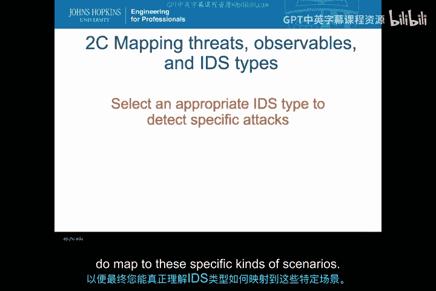

在本节课中，我们将综合前几节的知识，通过两个具体的案例分析，将威胁指标与入侵检测系统类型进行映射。我们的目标不仅仅是分类IDS，而是在更复杂的场景下，为特定的攻击选择合适的IDS类型。这是一个较长的视频模块，建议您在学习两个案例之间稍作休息，以便更好地将所学知识融会贯通。

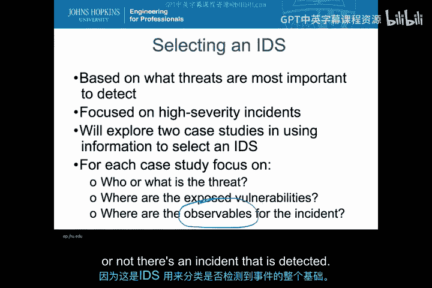

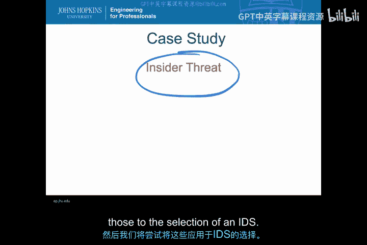

## 案例研究一：内部威胁分析 🔍

上一节我们介绍了入侵检测系统的基本类型，本节中我们来看看如何将其应用于具体的威胁场景。首先，我们将深入探讨内部威胁，分析其产生的可观测指标，并探讨如何选择合适的IDS进行检测。

### 内部威胁的基本特征

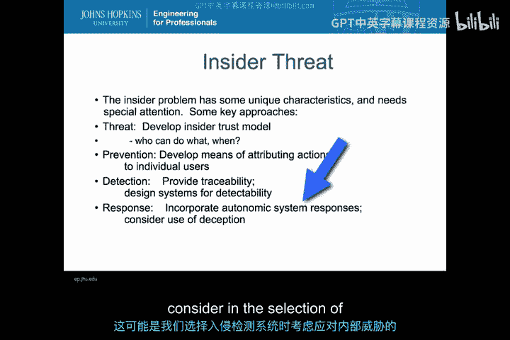

内部威胁问题具有一些非常独特且有趣的特征。选择此案例的原因之一是，内部威胁在媒体和新闻报道中备受关注，但市场上很少有产品能真正有效地针对内部威胁的典型问题。处理内部威胁时，我们面对的是一个信任模型，而“信任”是讨论内部威胁的核心。内部人员初始拥有比外部威胁更高的信任级别，并利用这种信任来绕过旨在防止信息滥用的内部信息安全策略。

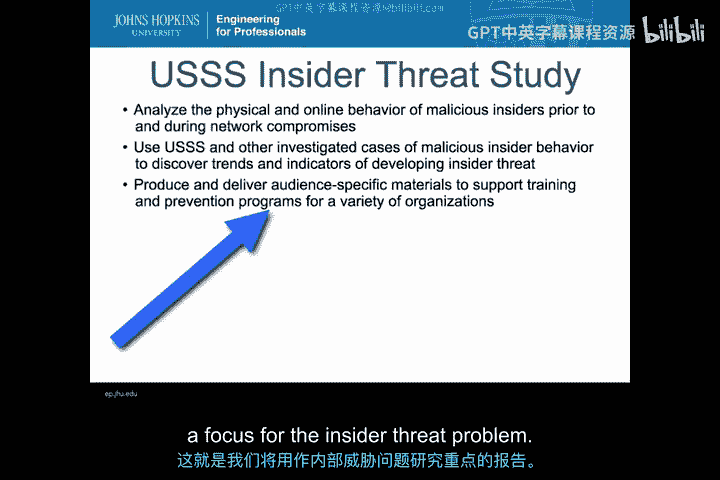

在IDS的框架下，我们可以将多个目的直接应用于内部威胁：
*   **预防**：我们可以开发将行为归因于特定用户的方法，以减少事件发生的频率或潜在频率。
*   **检测与追踪**：我们可以利用直接检测能力，特别是提供可追溯性，从而实现归因。这是关键——我们希望能够将事件归因于个人，因为我们处理的是信任问题。
*   **自动响应**：我们还将探讨如何为内部威胁整合入侵防御系统，这在设计不会反过来被内部人员利用的自动响应机制时尤其具有挑战性。

### 研究基础与方法

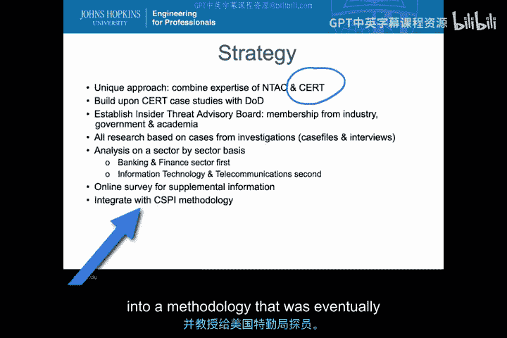

我们的分析将基于美国特勤局过去十年进行的一项内部威胁研究，该研究分析了恶意内部人员在网络入侵之前和期间的物理及在线行为。这项研究以及其他对恶意内部行为案例的调查，揭示了有助于我们理解IDS在内部威胁场景下实际需要做什么的趋势和指标。

这项研究采用了独特的方法，结合了美国特勤局国家威胁评估中心的专业知识和卡内基梅隆大学CERT项目组的事件响应经验。研究基于真实的调查案例，所有数据均非推测或模拟。分析按行业部门进行，最初的假设是不同行业可能表现出不同类型的内部威胁。

### 关键研究发现与启示

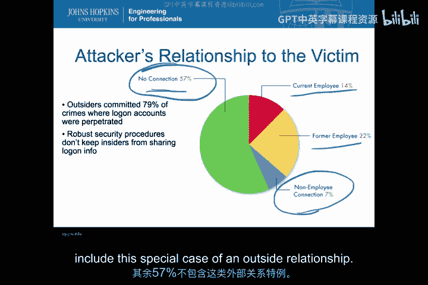

以下是该研究的一些关键发现，它们直接影响我们选择IDS的策略：

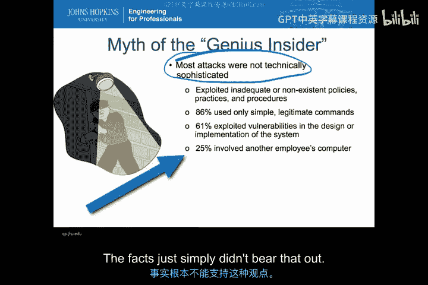

**1. 攻击者与受害者的关系**
研究发现，57%的内部威胁实施者与组织有信任关系，但无合同或雇佣关系（如外部承包商）。7%的实施者与员工有关联（如配偶、子女），他们利用这种关系信任来接触组织。这提醒我们，威胁可能来自任何受信任的实体。

**2. 攻击的技术复杂性**
大多数攻击在技术上并不复杂。61%的攻击只是利用了不完善或缺失的策略、实践和程序，使用了非常简单的命令。只有少数攻击利用了特定漏洞（如弱密码），约四分之一的案例仅仅是利用了他人的已登录会话。这表明，我们不应假设内部人员都是技术天才。

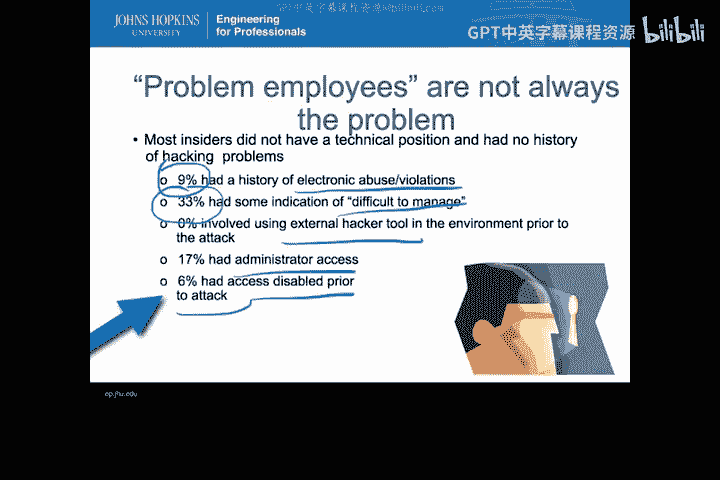

**3. 问题员工假设**
研究通过查看人力资源记录发现，只有9%的内部威胁实施者有滥用电子资源的历史，约三分之一在事后被认为难以管理。几乎没有实施者使用外部黑客工具或是系统管理员。这表明，仅依赖人力资源记录中的“问题员工”特征来调整IDS是无效的。

**4. 检测方式**
只有48%的内部威胁是由安全人员发现的，35%是由外部客户报告的，这给IDS的调优带来了挑战。然而，好消息是，约30%的案例通过技术取证得以识别，26%通过系统故障或异常被直接识别。这说明存在技术指标和可观测物，可供实时流式入侵检测系统利用。

**5. 攻击影响与目标**
78%的案例涉及修改或删除公司信息，约30%涉及破坏数据。几乎所有案例都涉及信息系统和网络。这提示我们，可以围绕信息的完整性来捕获可观测指标，这对选择IDS类型非常有用。

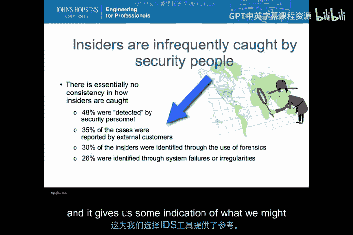

**6. 攻击发生时间**
70%的攻击发生在工作时间，83%发生在实体工作场所。虽然30%的攻击涉及从家中发起，但75%同时使用了家庭和工作地点。这意味着我们有机会在常规工作时间内收集可观测指标，但不能忽视非工作时间的活动。

**7. 攻击者画像**
研究发现，内部威胁实施者在性别、职位（高管、技术人员、支持人员）、雇佣类型（全职、兼职、合同工）上的分布，与他们在组织中的比例完全一致。这表明任何人都可能成为内部威胁者，没有单一的画像可以帮助我们调整IDS只关注组织的特定区域。

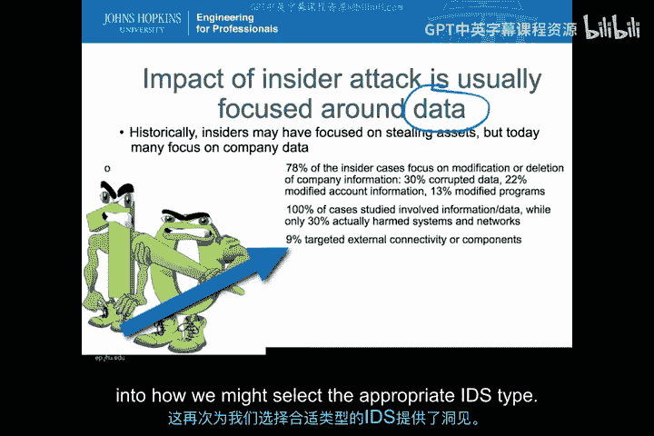

### 内部威胁的IDS选择策略

基于以上发现，我们可以推导出针对内部威胁的IDS选择策略：

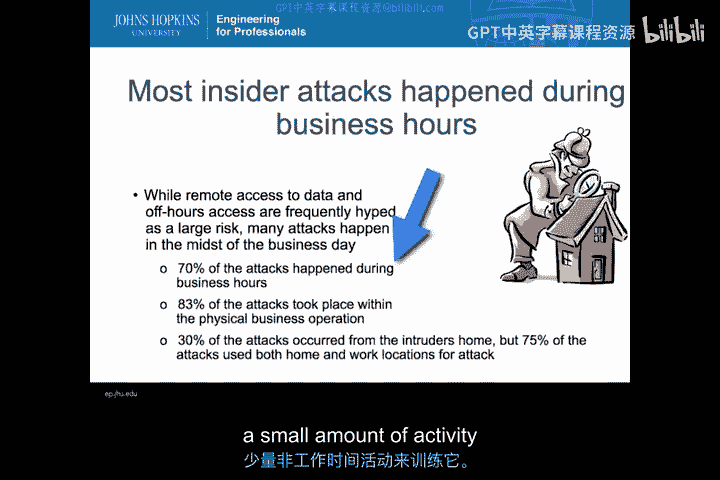

*   **关注访问控制违规**：应使用基于主机的IDS，部署在服务器或云环境内部，监控访问控制违规行为并发出警报。
*   **谨慎使用异常检测**：虽然异常检测是应对内部威胁的常用方法，但由于正常的用户误操作和环境变化，可能会产生大量误报。需要做好准备。
*   **利用自动警报作为威慑**：可以部署一种IPS系统，它不直接关闭系统，而是自动向用户警报检测到的事件并归因于其操作。对于无意犯错者，这是一个提醒；对于恶意内部人员，则是一种威慑。
*   **保护关键数据**：在关键数据附近部署基于主机的系统是一个好的起点。同时，可以考虑使用基于网络的IDS，专注于出站流量的IP识别，以检测数据泄露。这也有助于发现内部运行的、行为类似自动化内部人员的恶意软件。
*   **具体工具思路**：可以使用基于主机的IDS产品、针对关键不变文件的工具（如Tripwire），或将访问控制系统数据输入IDS以识别越权用户。

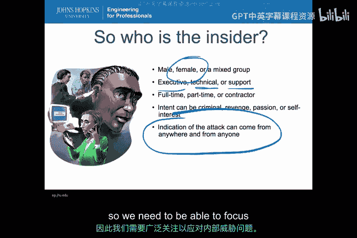

---

在进入第二个案例研究——2003年北美东北部大停电之前，建议您稍作休息。回顾一下本节关于内部威胁如何获取数据的分析，并思考像Tripwire这样的IDS如何应对视频第一部分提出的内部威胁细节。

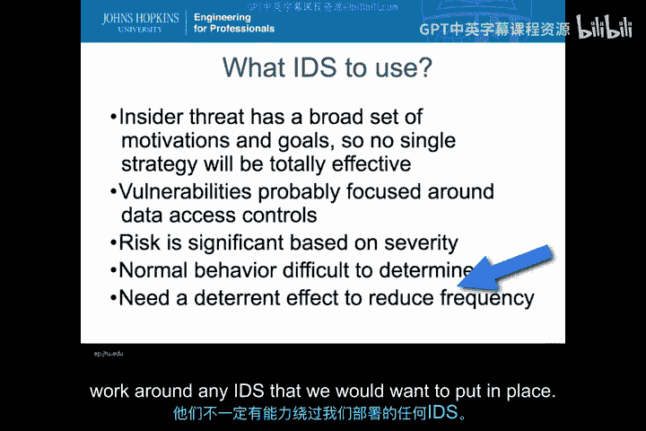

## 案例研究二：2003年北美东北部大停电 ⚡

（*注：根据提供的文本，第二个案例研究的具体内容未在输入中给出，因此教程在此处结束。在实际完整教程中，此处将开始分析大停电案例，并同样遵循“威胁分析-可观测指标-IDS类型映射”的结构进行阐述。*）

---

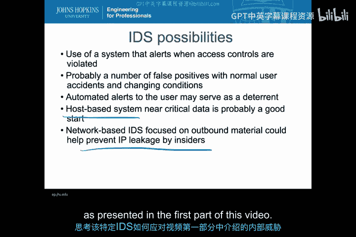

**本节课总结**：本节课我们一起学习了如何将威胁指标与入侵检测系统类型进行实际映射。通过深入分析内部威胁案例，我们了解到内部威胁的特征、研究发现的启示，并推导出针对性的IDS选择策略，包括侧重基于主机的检测、访问控制监控、利用警报作为威慑，以及结合网络流量分析来应对数据泄露风险。这为我们根据具体场景选择合适的安全工具提供了清晰的思路。