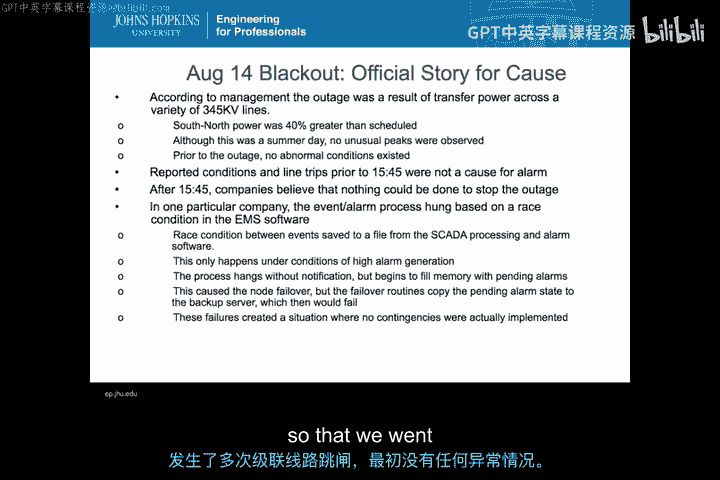
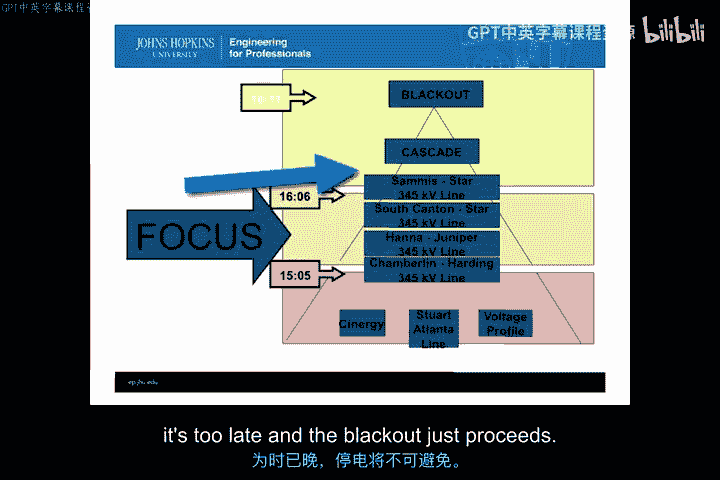
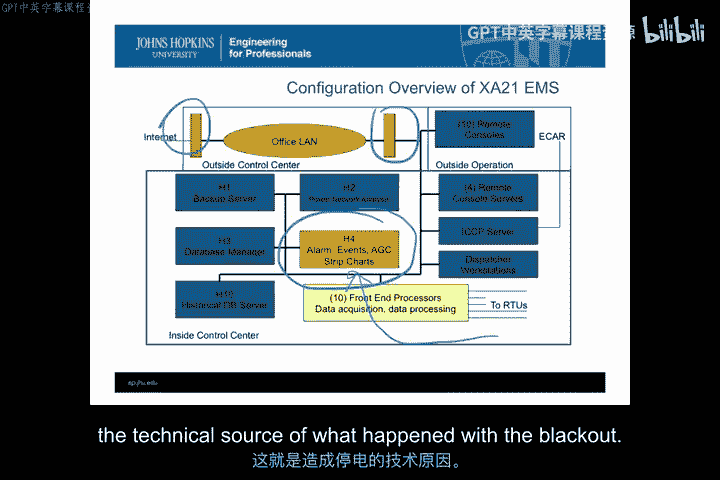
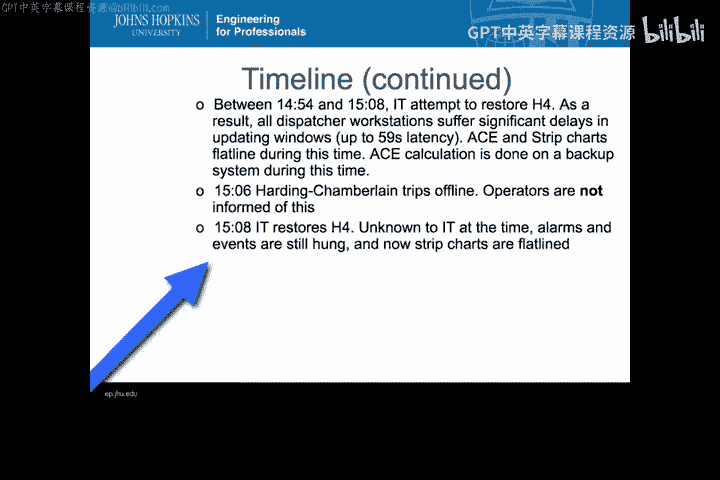
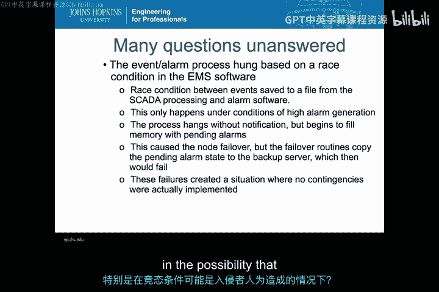
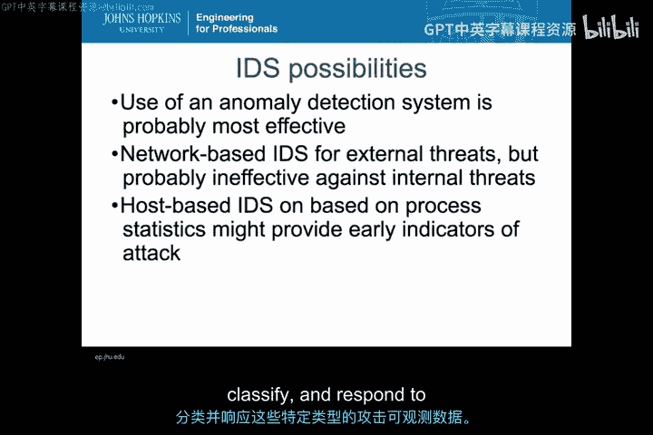

# 006：威胁指标与检测类型映射分析 🔍

在本节中，我们将通过一个真实案例——2003年北美东北部大停电事件，来探讨如何将威胁指标与入侵检测系统（IDS）的类型进行映射分析。我们将分析事件的起因、系统架构的缺陷，并思考如果这是一次攻击，应如何选择和部署IDS来应对。

---



## 案例概述：2003年北美东北部大停电

2003年8月14日至15日，美国东北部从纽约州到五大湖区，再到宾夕法尼亚州的大片区域发生大规模停电。这次事件并非虚构，它真实地展示了关键基础设施可能面临的危机。核心问题是：这究竟是一次事故，还是一次网络攻击？我们将以此为例，探讨在此类场景下应如何选择和部署入侵检测系统。

---

## 事件官方原因分析

一份关于此次停电的详细报告指出，官方认定的原因是电力系统过载。具体来说，南北向输电线路的负载比预定值高出约40%。这本身并非灾难，但若处理不当，就会引发一系列连锁的线路跳闸，最终导致大范围停电。

一个关键的技术细节是，俄亥俄州某公司用于管理输电线路的能源管理系统（EMS）软件存在一个**竞态条件**漏洞。这个漏洞导致程序挂起而非崩溃，因此系统未能切换到备用服务器。由于程序没有彻底失效，运行人员未能收到来自数据采集与监控系统（SCADA）的警报，从而错过了在早期干预、防止连锁故障发生的机会。

这个竞态条件在高警报生成的情况下是可复现的。然而，由于相关机器**没有任何访问日志**，无法确定这究竟是安全事故还是单纯的事故。最终，整个事件被定性为事故。

---

## 假设场景：如果这是攻击



现在，让我们进行一个思想实验：假设对手有能力故意触发这个竞态条件漏洞。这将是一个高严重性的问题。那么，我们应如何为此类场景创建或选择IDS？

以下是停电事件发生过程的详细时间线，它揭示了系统的脆弱环节：

*   **14:14**：H4主机上生成警报和事件的进程因竞态条件而挂起，且无通知。
*   **随后**：五个远程终端开始排队等待该进程处理的事件，很快导致资源耗尽并失效。
*   **两分钟内**：系统热切换到备份服务器，IT部门收到通知，但未能定位到H4的根本问题。
*   **14:41**：H4最终因队列事件而失效，其状态（包括挂起的进程）被复制到备份服务器H1，导致警报功能在H1上同样失效。
*   **14:54**：H1以同样方式失效。此时，控制室内显示所有变电站电力曲线的**整墙带状图全部变为直线**，但无人察觉，因为操作员依赖的是终端警报，而警报功能已失效。
*   **15:06**：由于操作员未收到警报，第一条关键输电线路（Harding-Chamberlain）跳闸，问题开始升级。
*   **15:32**：第二条关键线路（Hanna-Juniper）跳闸，操作员仍不知情。此时已接近无法挽回的临界点。
*   **15:41后**：随着Star-South Canton等线路相继过载跳闸，系统进入不可逆转的崩溃阶段，最终导致大停电。

整个事件的核心在于，**关键的警报信息流在早期就被阻断**，使得人工干预完全失效。



---

## 系统架构与安全缺陷

要理解如何防御，必须先了解被攻击系统的架构。本次事件中的能源管理系统（XA/21）架构存在严重安全缺陷：

```
[互联网] <-> [防火墙] <-> [路由器] <-> [办公室局域网] <-> [EMS系统服务器群（H1, H2, H3, H4...）]
```

1.  **设计过时**：该系统基于老旧的IBM AIX系统，自1998年后未打补丁，最初设计为**独立系统**，从未考虑接入互联网。
2.  **认证薄弱**：使用共享的root密码，认证机制非常弱。
3.  **缺乏日志**：系统几乎没有维护任何操作系统日志。
4.  **远程访问风险**：IT人员为方便维护，可通过家庭电脑直接远程登录系统。远程登录使用X Windows协议，其认证信息易于被嗅探，且**整个过程没有日志记录**。

这种架构意味着，外部攻击者有可能利用薄弱的认证和缺乏监控的通道，潜入系统并触发漏洞。



---

## IDS选择策略分析

面对这样一个高价值、高风险的工业控制系统，我们应该如何选择IDS？以下是我们的分析思路：

上一节我们分析了威胁场景和系统弱点，本节中我们来看看如何根据这些信息选择检测策略。

首先，我们需要评估威胁来源。对于此案例：



*   **内部威胁**：可能性较低。
*   **外部威胁**：是主要关切点，包括犯罪组织、国家背景的黑客等有动机攻击电网的实体。
*   **攻击特征**：此类利用竞态条件的攻击很可能属于**零日攻击**，没有已知的特征码（Signature）。

因此，基于特征码检测的IDS在此效果有限。

然而，我们有一个关键优势：**系统行为非常规律**。它只运行少数几个固定进程，执行特定任务。这种规律性为异常检测提供了理想条件。

基于以上分析，我们建议采用分层检测策略：

1.  **网络层异常检测（NIDS）**：在防火墙内侧部署基于网络的异常检测系统。由于系统网络流量模式固定，任何异常的入站连接尝试、协议违规或通信模式变化都可能被捕捉到，这对防御外部零日攻击尤为有效。
2.  **主机层完整性检测（HIDS）**：在关键的EMS服务器（如H4）上部署基于主机的IDS。它可以监控进程统计信息（CPU、内存占用）、关键系统文件完整性以及进程行为异常。例如，如果某个关键进程（如警报生成进程）意外挂起或资源使用异常，HIDS可以提供早期预警。

**简而言之，最佳策略很可能是结合使用基于网络的异常检测系统来捕捉外部入侵企图，以及基于主机的完整性检测系统来监控内部关键进程的状态，从而在这种高风险场景下提供纵深防御。**

---

## 总结

通过2003年大停电这个案例，我们一起学习了如何将具体的威胁指标映射到合适的入侵检测类型。关键步骤如下：

1.  **分析威胁**：确定威胁来源（内部/外部）、动机和能力。
2.  **评估影响**：理解攻击成功可能造成的后果的严重性。
3.  **寻找可观测点**：基于系统架构和常规行为，确定哪些地方可能产生异常信号（网络流量、主机进程、日志）。
4.  **理解上下文**：充分考虑运行IDS的组织的具体流程、约束条件和系统环境。



选择IDS时，没有放之四海而皆准的方案。最有效的策略源于对威胁、系统和组织环境的深刻理解，从而选择能够监控到最关键“可观测指标”的检测工具组合。