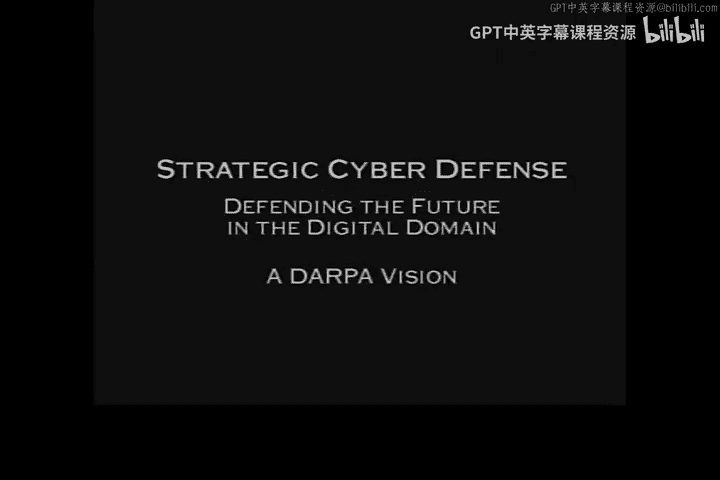
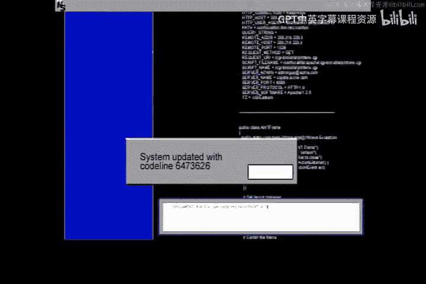
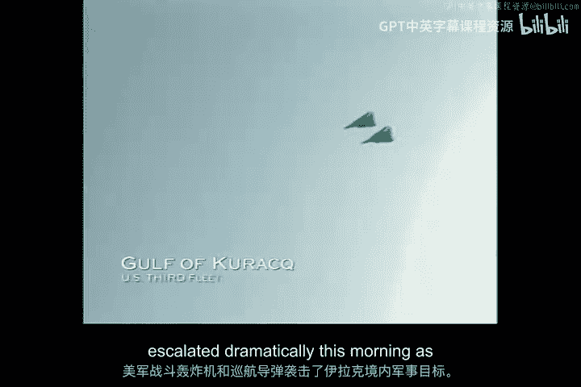

# 007：DARPA战略网络防御技术 🛡️

## 概述
在本节课中，我们将通过一个虚构的、但极具代表性的网络攻防案例，学习DARPA（美国国防高级研究计划局）战略网络防御技术的核心概念与应用。我们将跟随一次模拟的、针对美国关键基础设施的协同网络攻击事件，观察防御方如何运用入侵检测、态势感知、溯源分析、动态防御与反制等一系列技术手段进行响应和处置。

---

## 场景引入：危机爆发 🌍

一段新闻报道拉开了序幕。中东地区局势升级，美国对伊拉克发动了空袭。与此同时，一场隐秘的网络战已经悄然开始。

---

## 第一阶段：攻击初现与内部渗透 📧

攻击首先以“心理战”和“社会工程学”的形式出现。美军任务部队内部开始流传匿名信件和电子邮件，内容涉及士兵的家庭隐私、虚构的婚外情指控，甚至详细列出其子女的姓名、地址、学校日程和车辆信息。这些信息虽然没有直接威胁，但严重影响了部队士气。

此外，部队成员还遭遇了由伪造信用报告引发的信用问题。这些攻击全部基于网络，其共同特点是利用虚假信息制造混乱和恐慌。

防御方的初步应对是启用**强身份认证协议**，这似乎解决了许多问题。然而，真正的网络攻击才刚刚开始。

---

## 第二阶段：关键基础设施遭受攻击 ⚡

入侵检测系统发出警报，指向对一颗商用中继卫星地面控制系统的攻击。虽然此次攻击本身并非针对军事设施，但其造成的卫星服务中断产生了连带影响。

联合特遣部队立即提升警戒级别至Infocon Delta，并采取了一系列紧急防御措施：
*   收紧边界控制器策略，以阻断攻击序列。
*   启动攻击溯源。
*   自动取证系统开始开发应对措施。

很快，事态升级。攻击范围扩大，金融、交通，尤其是电力部门遭受了全面打击。东海岸开始出现一系列停电事故，导致交通瘫痪、银行ATM机故障，社会秩序受到严重影响。同样的攻击也在西欧和中东的盟国中出现。

总统宣布进入国家网络紧急状态，国家基础设施保护中心被赋予核心防御角色，拥有法律保护的信息共享权和重要的信息安全指令权。

---

## 第三阶段：深度分析与动态防御 🎯

防御团队开始深入分析攻击模式。他们发现攻击者非常专业，专门针对东部电网中更脆弱的发电和输电控制设施。通过分析攻击模式，团队预测了下一个可能的目标。

为了在不影响真实系统的情况下观察攻击者的手法并收集证据，防御方启用了名为“鱼缸”的隔离仿真环境技术。他们将可能遭受攻击的站点“克隆”到鱼缸中，并部署重定向软件，将针对真实站点的攻击流量引导至这个仿真环境。

在鱼缸中，他们捕捉到了攻击细节：攻击者向控制系统服务器的异常端口发送了一串特殊字符，触发了系统内一个名为“Novicof”的软件中的**木马程序**，导致服务器关闭了其他控制端口。Novicof被超过一半的控制中心使用，这意味着攻击可能造成大规模停电。

形势危急，防御团队必须在20分钟内控制局面，否则东海岸电网将因连锁故障而崩溃。

---

## 第四阶段：艰难决策与紧急响应 ⚖️

防御系统分析了高、中、低三种“先发制人式隔离”行动方案。初步报告显示，切换到备用控制系统至少需要两小时，时间不够。

计算机推荐的“中等选项”方案预计会造成人员伤亡。指挥官基于成本效益评估，否决了该方案，选择了伤亡风险更低的“低选项”隔离方案。

然而，新的攻击接踵而至，这次主要针对西海岸，采用了逻辑炸弹、木马和内部人员等不同机制。系统重新分析后得出结论：必须执行“高选项”方案，尽管这会带来严重的交通伤亡和医疗紧急情况。指挥官同意并实施了该方案。

电网的连锁故障得以避免，但防御团队意识到，必须找出并消灭攻击源头。

---

## 第五阶段：攻击溯源与威胁归因 🔍

防御团队开始过滤攻击数据，聚焦于有能力、有动机以已识别方式攻击电网、金融和交通部门的行为体。最初名单上有300个组织。

通过部署更高级别的传感器进行探测和情报收集，并结合入侵异常报告关联分析，名单被缩小到12个可疑组织。

与此同时，前线指挥官报告了严重的弹药供应问题：收到错误口径的弹药、零件不匹配、系统显示已送达但实际未到货。防御团队怀疑存在共同的故障点。

通过运行恶意代码检测套件并进行数据库损坏检查，他们分析了相关软件和数据库在过去六个月内的访问历史，锁定了一批有机会接触这些系统的政府人员、军火商和承包商。

经过FBI、司法部和财政部的联合调查，最终将嫌疑人范围缩小到4人，其中3人与可疑的恐怖组织可能存在关联。

---

## 第六阶段：拼图完成与反制行动 🧩

防御团队运行了一个程序，将发现的恶意代码与12个可疑组织的编程特征子集进行匹配。最终，所有线索指向一个名为“跨国全球资源”的公司，其总部设在敌国控制的坦博拉岛上。

分析表明，这是一场由敌国资助和控制的、跨国协同网络恐怖主义活动。其战略目标是分裂联盟、削弱美国决心，并将其驱逐出该地区。

在获得总统授权后，美军发起了代号为“沙暴行动”的信息战反制攻击，目标是“跨国全球资源”的基础设施及敌国内部的相关网络节点。反制行动取得了成功。

敌国政府通过秘密渠道表示，他们对境内存在网络恐怖组织“感到震惊”，并“祝福”美方将其清除。国际紧张局势随之缓和。

---

## 总结 🏁

本节课中，我们一起学习了一个完整的战略网络攻防推演案例。我们看到了网络攻击如何从社会工程渗透开始，逐步升级为对关键基础设施的毁灭性打击。更重要的是，我们观察了防御方如何综合运用以下技术进行响应：
1.  **入侵检测与态势感知**：及时发现攻击并评估其影响范围。
2.  **动态防御与隔离**：采用“鱼缸”等技术进行攻击重定向和取证。
3.  **溯源分析与威胁归因**：结合技术特征、访问日志和情报，锁定攻击源头和幕后主使。
4.  **协同指挥与决策**：在紧急状态下，跨部门协同，并基于成本效益做出艰难决策。
5.  **主动反制**：在政治授权下，对攻击源头实施网络反制。

这个案例深刻揭示了现代网络战的复杂性和战略性，以及构建多层次、智能化、协同防御体系的重要性。

---

新闻报道为事件画上句号：一系列停电和计算机故障被归因于一个复杂的、基于中东的恐怖组织行动。美军与NIPC合作摧毁了该组织。市场开始反弹。

防御团队确认将警戒级别过渡回Infocon Alpha，联合特遣部队转为待命状态，并将本次行动的教训更新至数据库以供研究。

---

