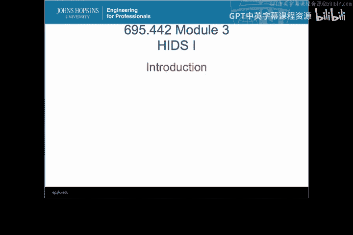
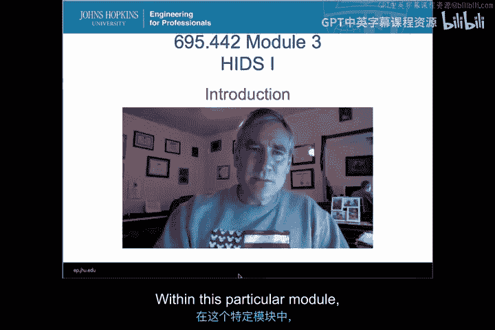
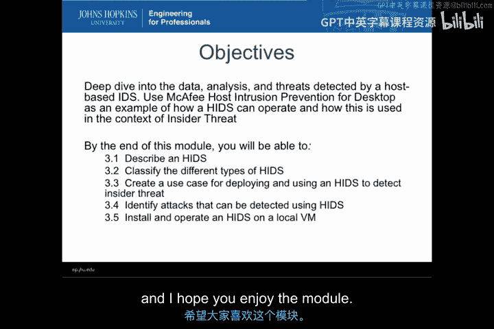

# 008：主机入侵检测系统导论 🖥️

在本模块中，我们将学习主机入侵检测系统。我们将探讨如何利用直接从主机可观测项获取的信息，来构建一个能够对事件进行分类的入侵检测系统。这些系统可以直接对事件采取行动，或将其报告出来以提升事件响应能力。

上一模块我们讨论了入侵检测的基本概念，本节中我们将聚焦于一种具体的实现方式——主机入侵检测系统。

## 模块学习目标 🎯

以下是本模块将涵盖的核心内容：

*   **描述HIDS**：你将能够识别主机入侵检测系统，并理解所有HIDS和HIPS系统的共同特征。
*   **分类HIDS类型**：你将了解基于不同可观测项来源和事件分类方式的多种HIDS类型，并能联系到商业产品实例。
*   **应用案例研究**：我们将基于上一模块的“内部威胁”案例，构建一个在大型复杂企业中部署和使用HIDS以检测内部威胁的框架。
*   **识别攻击类型**：你将能够识别出HIDS可以检测的、超越内部威胁范畴的各类具体攻击。
*   **实践配置**：你将在虚拟机上获得实际配置HIDS的实践经验。

## 内容概述 📋

接下来，我们将深入探讨不同类型的HIDS、它们的功能、告警方式以及防护机制，并将这些知识直接应用到上节课的“内部威胁”案例研究中。

我们还将详细分解那些能够被HIDS检测到的具体攻击类型。最后，你将有机会在虚拟机上动手配置HIDS，获得更贴近实际的操作经验。

希望你能享受这个模块，我们将深入探究这种通过审视主机上各类可观测项来工作的入侵检测系统，并理解在大型、复杂、多样化的企业环境中构建一个有效的基于主机的入侵检测系统所面临的挑战。

现在，让我们开始学习具体内容。