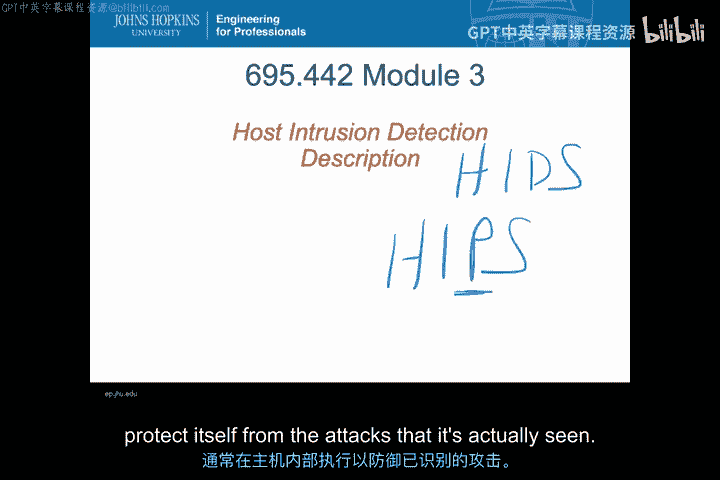
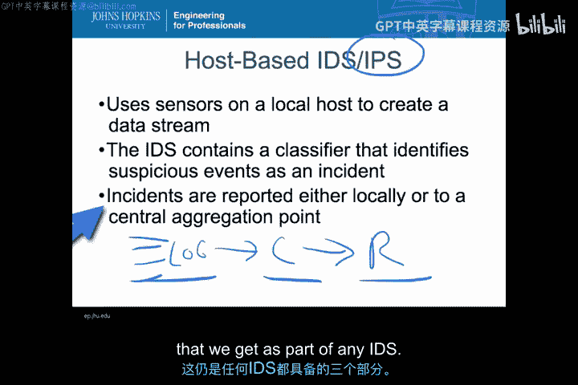
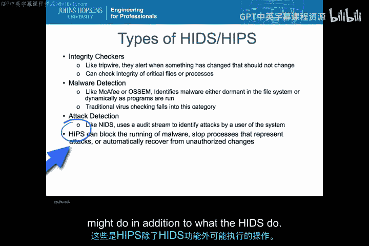
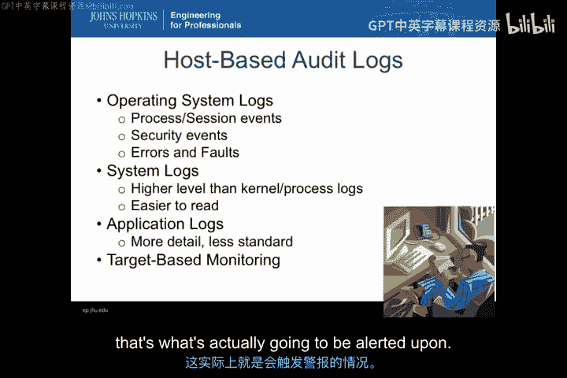
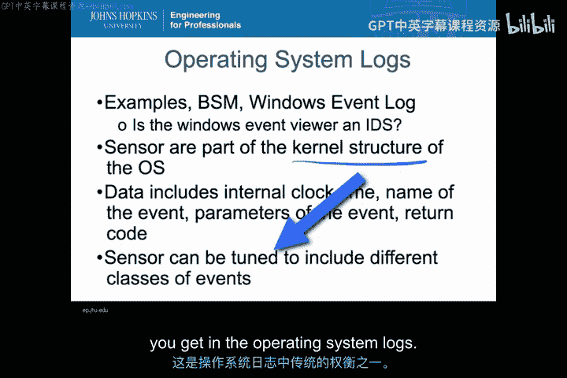
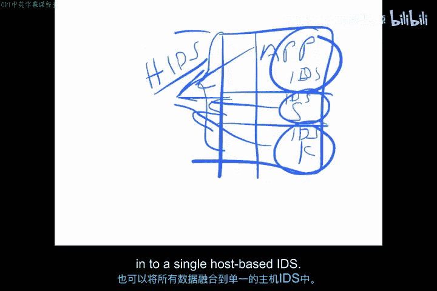
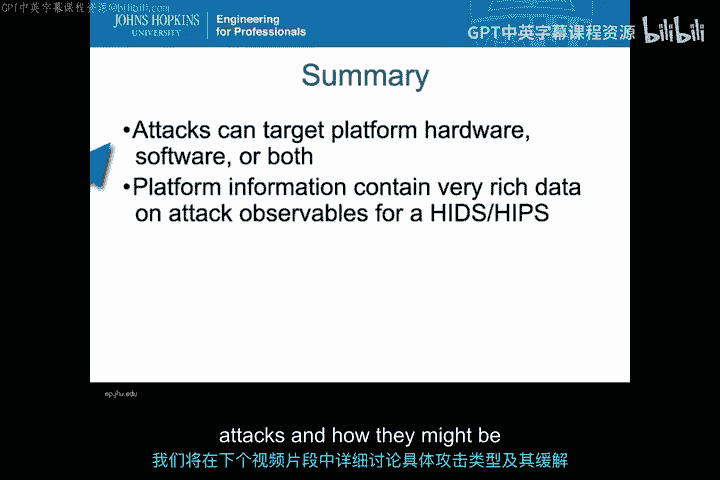

# 009：主机入侵检测系统原理 🖥️

在本节课中，我们将学习主机入侵检测系统的基本原理。我们将了解它与网络入侵检测的区别，其核心组成部分，以及它如何从主机内部收集和分析数据来识别威胁。

## 概述

主机入侵检测系统专注于监控单个计算机系统（主机）上的活动，而不是网络流量。它利用主机内部的日志文件和其他数据源作为传感器，来检测可疑行为或攻击。

## 主机入侵检测系统（HIDS）的核心组件

与所有入侵检测系统一样，基于主机的IDS也包含三个主要部分。

以下是这三个核心部分：

1.  **传感器**：位于本地主机上，负责收集数据并生成数据流，为IDS提供输入。这些数据通常来自日志文件。
2.  **分类器**：接收传感器传来的事件，并从中识别出被标记为可疑或需要跟进的事件。这些被识别出的事件称为“事件”或“可疑事件元素”。
3.  **报告器**：负责处理分类器输出的“事件”。这些事件可以报告给本地主机，也可以通过网络报告给某个中央聚合点。如果涉及入侵防御系统，报告器还可能直接对发现的事件做出反应，执行阻断或其他操作。

因此，我们的传感器（主机日志文件）将数据馈送给分类器，分类器再将结果传递给报告部分。任何IDS都具备这三个部分。

## HIDS/HIPS的主要类型

上一节我们介绍了HIDS的通用结构，本节中我们来看看它的几种主要实现类型。

以下是三种基本类型：

*   **完整性检查器**：例如Tripwire。这类系统在系统内的重要文件或其他本不应改变的元素发生变化时发出警报。文件发生变化的唯一合理原因应是遭受了攻击或发生了某种事件。
*   **恶意软件检测器**：例如传统的病毒检测软件。它们识别系统上运行的任何特洛伊木马、恶意软件或病毒。检测方式可以是静态的（检查休眠文件）或动态的（检查运行中的程序）。
*   **传统攻击检测器**：这是最早的主机入侵检测类型，例如早期的工具。它利用系统内应用程序等生成的审计流，来识别当前正在发生的实际攻击。这与恶意软件检测略有不同，它更侧重于检测交互式攻击，例如已登录系统的内部人员或其他用户正在进行的操作。

当我们谈论**主机入侵防御系统**时，它具备上述所有HIDS的检测能力，但除此之外，HIPS还能采取行动。例如，它可以阻止恶意软件运行、终止进程、自动恢复文件，基本上可以自动执行任何用户能执行的操作。由于在本地主机上有足够的上下文信息，HIPS通常能采取非常有效的措施来阻止攻击。

## 主机活动数据的收集来源

无论何种类型的HIDS，其本质都是从主机收集信息。那么，这些信息具体从哪里来呢？

主机活动通常从以下三个常见位置收集，此外还有一类特殊的目标监控。

*   **操作系统日志**：这是传统的审计日志，记录进程状态、事件或文件访问失败等本不应发生的情况。可以将其理解为Windows事件日志或任何操作系统上描述活动详情的审计日志文件。
*   **系统日志**：这些日志与操作系统级别的日志略有不同，它们运行在更接近用户级别，例如记录用户最后登录时间的`lastlog`。它们更侧重于记录发生在用户层面的活动，通常与系统服务相关。
*   **应用程序日志**：这是主机日志中级别最高的一类，特定于系统上运行的单个应用程序，例如邮件日志、Web访问日志或数据库日志。它们详细记录了应用程序交互的具体信息。

**目标监控**则有些不同。它是指将传感器指向某些本应永不改变的目标（如关键系统文件）。传感器会读取目标的值，并将其与标准或基线值进行比较，如果发生变化就会触发警报。这与上述动态变化的审计日志不同，目标监控期望每次读取的值都相同。

## 操作系统日志详解

了解了数据来源的分类后，我们先深入看看操作系统日志。

操作系统内部有多种不同的日志文件，具体取决于运行的操作系统。在Unix/Linux系统上，有伯克利系统监视器或安全监视器；在Windows系统上，有特定的事件日志。事件日志系统本身有时就包含一定的警报功能，使其本身就具备一些IDS的特性。

这些传感器通常位于内核结构中，远离普通用户可以操纵的区域。这很有价值，因为我们需要将其置于传统用户的控制范围之外。当然，这只有在管理员/特权用户与普通用户分离的情况下才有效。如果用户总是以管理员身份登录，那么入侵者就可能访问到内核结构和所有生成警报的机制。这是HIDS的一个风险：它非常接近可能正在实施入侵的人或恶意软件。

操作系统日志包含的数据级别很低，例如时钟时间、事件参数名称等，这些都是操作系统或内核视角的事件参数。这种低级别特性使得很难将这些事件直接追溯到实际发生的高级应用层攻击。此外，这些传感器可以被配置为非常详细（记录每个文件访问）或相对精简。记录的信息越少，分类器可用于判断事件是否发生的依据就越少，这是操作系统日志中一个传统的权衡。

## 系统日志与应用程序日志

上一节我们探讨了底层的操作系统日志，本节我们来看看更上一层的系统日志和应用程序日志。

**系统日志**位于操作系统内核之上，属于系统工具日志，运行在非常接近或就在用户级别。它们记录的活动大致与用户在用户层面的操作相关。例如在Unix系统中，`lastlog`、`history`、`uptime`、`su`日志等都属于此类。它们通常在服务级别收集，而非内核级别。系统日志总是围绕某种特定类型的事件（通常是某项服务，如登录服务）展开。由于它们是系统服务的一部分，每个服务往往创建自己独立的日志文件，这导致格式可能不统一，分类器需要解析引擎来处理这些不同格式，并将不同数据流融合在一起进行分析。

**应用程序日志**是主机日志中级别最高的。它们特定于系统上运行的单个应用程序（如Web访问日志、电子邮件日志、数据库日志）。这些日志在应用程序运行时收集，如果应用程序在用户级别运行，那么日志也将在该用户级别收集。这意味着运行该应用程序的用户有可能修改这些日志。因此，虽然应用程序日志包含更具体、更丰富的攻击信息（包括系统信息和应用特定信息），但其完整性可能不如操作系统或系统日志。与系统服务日志类似，应用程序日志也存在格式各异的问题，给分类器的分析带来挑战。

在主机内部，我们有低级别的基于内核的日志、系统服务日志以及更高级别的应用程序日志。所有这些日志都可以馈送给某个HIDS系统。HIDS可以同时接收所有这些来源的数据，也可以只接收其中一个，甚至可以在每个区域运行独立的IDS。

## 目标监控与HIDS的挑战

最后，我们来谈谈目标监控以及部署HIDS时面临的主要挑战。

**目标监控**的核心思想是检查系统中任何本应保持静态的对象的完整性。你需要预先选定监控目标（特定资产），并记录对该对象的更改活动。像Tripwire或StackGuard这类应用就属于此列。监控对象不一定是文件，也可以是内存、BIOS甚至内核中的某些动态参数，只要它们本应保持恒定值即可。这种方法的关键在于选择正确的资产进行监控。如果选择的资产确实是攻击的一部分，那么效果会非常好；如果选错了，目标监控就没什么用处。

无论传感器位于系统的哪个位置，都必须安全地管理这些数据。必须确保传感器日志在传输到分类器的过程中是安全且完整的。如果日志本身可以被篡改，那么IDS的有效性就取决于传感器数据流的完整性。这涉及到许多问题，例如磁盘空间耗尽时如何处理事件？是丢弃旧事件还是新事件？是否停止系统？如何验证监控数据的完整性？

此外，仍然存在如何组合不同审计源（尤其是来自主机内不同层级的数据）的问题。还有性能问题需要考虑：当HIDS与系统上其他关键应用程序并行运行时，如果HIDS开始占用过多系统资源（内存、磁盘等），该怎么办？这些都是部署HIDS时需要权衡的主要困难。

## 总结与拓展思考

本节课我们一起学习了主机入侵检测系统的基本原理。我们来总结一下关键点，并拓展一些思考。

你可以从平台的众多层级获取信息，从硬件、固件、内部总线、内部网络、存储设备，到所有操作系统层、框架、动态链接库，直至应用程序。其中任何一个区域都可能产生系统日志，并成为攻击的目标。每个区域可能对应特定类型的攻击。

当我们谈论HIDS寻找攻击时，攻击当然需要利用某种漏洞才能进行。从主机的角度来看，这些漏洞可以是物理层面的（例如通过物理探针探测主板芯片间数据传输、在外部设备间插入设备、添加额外板卡或协处理器），也可以是软件层面的。因此，有时我们需要寻找的平台漏洞可能与经典的“寻找软件漏洞并利用”有所不同。HIDS检查硬件渗透或物理篡改的功能通常被归入“防篡改”范畴。

请记住，攻击可以针对平台、硬件、软件或两者兼而有之。我们拥有的这些平台信息源是攻击可观测数据的极其丰富的集合。由于你非常接近被攻击的元素，因此可能处于检测此类攻击的最佳位置，同时也处于对文件等进行本地缓解的最佳位置，无需进行大量复杂的协调。

然而，这种能力也带来了重大挑战，包括：如何在企业内大规模部署主机入侵检测并协调它们之间的信息？如何保持病毒或恶意软件的签名库更新？如何在平台级别区分正常行为和滥用行为？当然，性能也是一个主要挑战。

总之，主机入侵检测系统非常接近攻击源，其信息极具价值，有时能让我们真正实现一些自动化应对措施。

本节课的内容到此结束，在接下来的视频中，我们将更详细地探讨具体有哪些类型的攻击以及如何缓解它们。