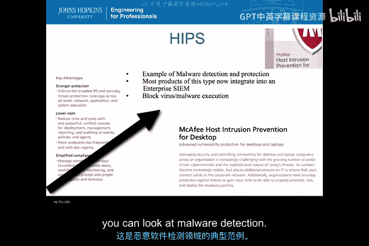
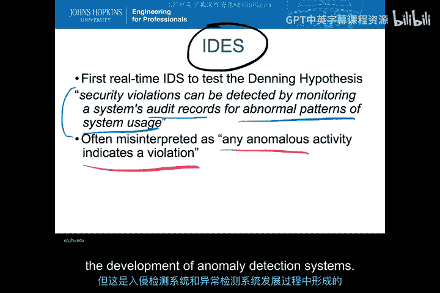
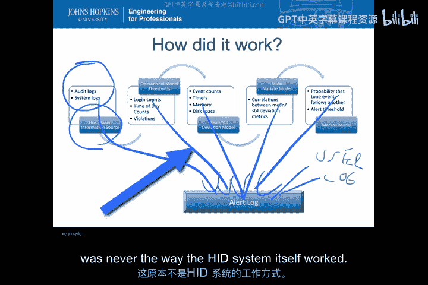
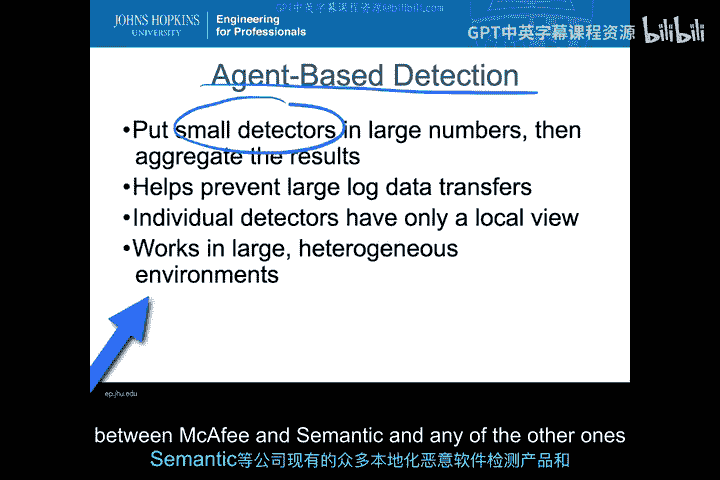
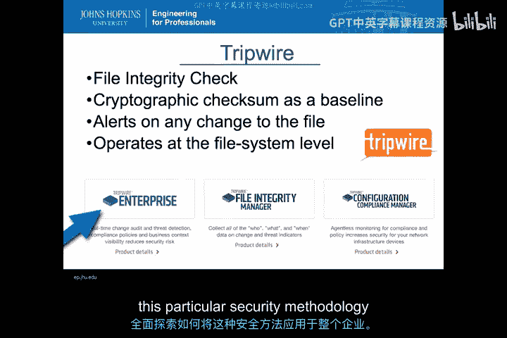
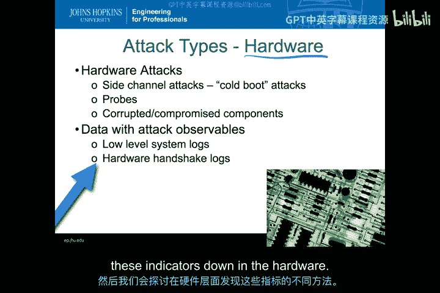
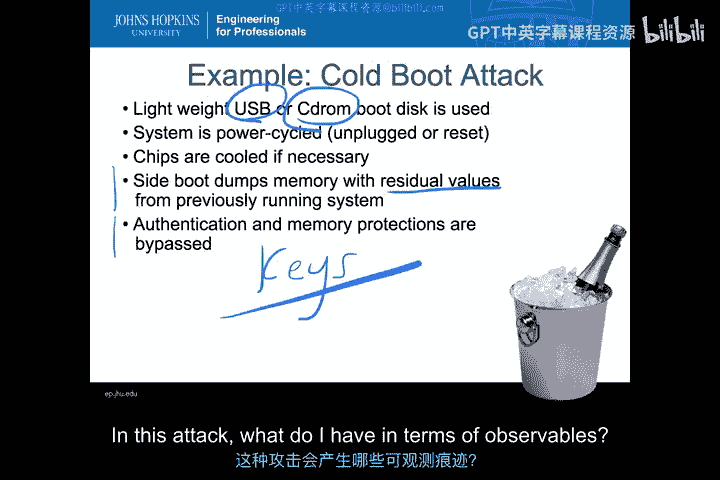
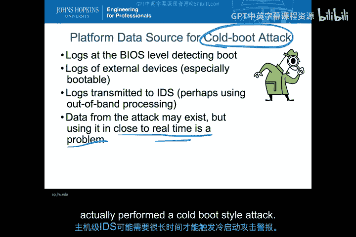
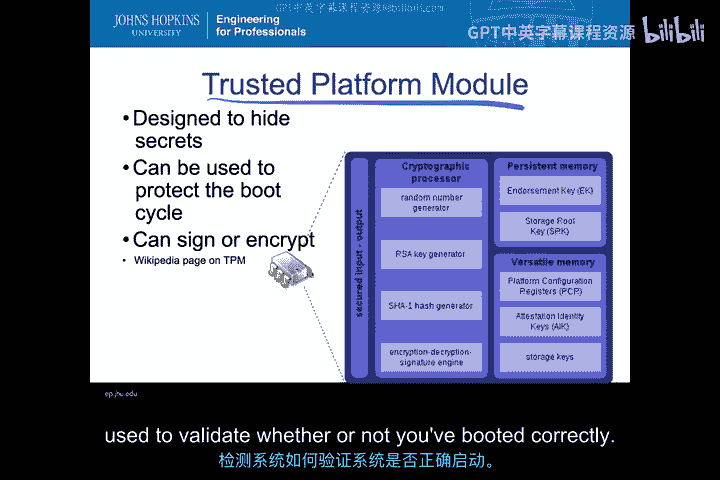
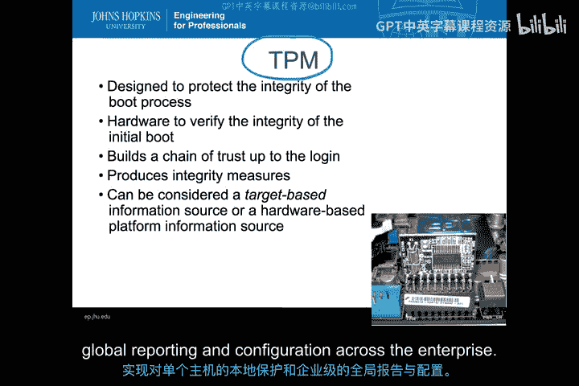

# 010：HIDS类型与典型系统 🛡️

在本节课中，我们将学习主机入侵检测系统（HIDS）的主要类型及其典型代表系统。我们将探讨基于主机的入侵防御系统（HIPS）、基于审计日志的异常检测系统、文件完整性检查系统以及针对硬件攻击的检测方法，并通过具体产品实例来理解它们的工作原理。

## 基于主机的入侵防御系统（HIPS）示例

上一节我们介绍了HIDS的基本概念，本节中我们来看看一个具体的HIPS产品实例。

第一个例子属于HIPS类别，即恶意软件检测类型的HIPS。市面上有许多此类产品，例如迈克菲（McAfee）的基于主机的入侵检测系统。这是一个典型的、用于恶意软件检测和防护的HIPS产品。

如今，任何具有商业可行性的产品都不再仅仅是单机上的病毒查杀工具。几乎所有产品都集成了某种企业安全信息与事件管理（SIEM）系统。这些系统能够收集来自不同主机的信息，并以统一的格式呈现给企业。但在主机层面，系统仍然能够阻止单个病毒和恶意软件的执行。因此，主机入侵检测的实际运作并不需要每次都往返于某个中央SIEM系统。

以下是该HIPS系统功能的一些概述描述，其核心理念是提供一种跨越主机与网络边界的威胁防护。系统通过监控主机上应用程序的所有个体网络活动来实现这一点，并能够强制执行系统内发生的任何变更。虽然系统会涉及成本与合规性问题，但除了病毒查杀，该系统的重要功能还包括：
*   **基于签名的检测**：允许查找基于签名的威胁。
*   **行为分析**：理解应用程序的行为模式。
*   **集中管理**：可以从中央位置锁定主机、更新配置并接收警报。

这是一个涵盖恶意软件检测整个领域的优秀示例。

## 基于审计日志的异常检测系统

对于交互式攻击类型，我们需要在审计日志中寻找特定行为。这里需要回顾一些早期的入侵检测系统（IDS）。

大多数系统都基于一个非常相似的、用于主机入侵检测的元素。这基于**丹宁假说**，其核心观点是：**安全违规可以通过监控系统的审计记录来检测**。审计记录是关键，用于寻找异常的系统使用模式。这意味着这不是一个基于签名的系统，而是一个进行**异常检测**的系统，旨在尝试发现零日攻击或以前未见过的攻击。

因此，丹宁假说常被解读为“任何异常活动都表明存在违规”，但这并非丹宁假说的原意。不过，由于HIDS和异常检测系统的发展，它已被普遍这样理解。

### IDES系统的工作原理

IDES系统的工作方式始于收集审计日志和系统日志。这些是主机层面的信息源，即来自系统层面、操作系统内部审计以及部分应用程序的流式日志。

以下是IDES处理数据的主要步骤：
1.  **操作模型与阈值**：首先，系统对审计日志和系统日志进行统计变量分析，例如计数和发生时间，并寻找基于规则的直接违规。这是对审计数据的第一轮处理。
2.  **均值与标准差模型**：违规数据和原始数据被送入一个均值与标准差模型。这是确定“正常”事件计数、内存使用量、磁盘活动等基线的地方。如果出现偏差，则会触发警报。
3.  **多元模型**：上述结果会输入一个多元模型，用于分析各项指标与操作阈值规则之间的相关性。这是IDES内部的一种融合机制，旨在对所有已生成的警报进行关联分析。
4.  **马尔可夫模型**：关联分析的结果被输入一个马尔可夫模型，用于判断攻击的各个要素组合在一起的概率是否会超过某个警报阈值。我们将在后续模块中详细讨论马尔可夫模型和分类器的概念。
5.  **生成警报**：整个处理流程（结合了基于规则、基于异常、基于马尔可夫模型和融合分析）最终会生成一个警报日志。这些警报可以直接发送给用户，或输出到新的日志文件，在现代也可能被输入到某个HIPS程序中。

## 现代代理式HIDS架构

IDES和许多现代系统（包括前面提到的迈克菲系统）的架构，实际上是**基于代理的系统**。其思路是在大量主机上部署小型检测器，并将结果汇总到中央位置。

这并不改变本地主机可以运行检测和防护功能的事实，但通过仅回传警报而非原始数据，避免了大规模原始日志文件的传输。这些独立的检测器只具备本地视图，这在攻击目标是主机上的文件或活动时很有价值。但如果攻击是协作式的，则可能需要更全局的视图。

因此，HIDS/HIPS系统从独立的单台PC，发展到通过安全事件管理器接入大型异构环境。IDES及其后续的Emerald系统成为首批基于代理的检测系统，它们催生了我们现在看到的许多产品和服务。

## 文件完整性检查系统示例

我们讨论过的另一种主要类型是完整性检查系统。以**Tripwire**为例，这是一个开源版本，易于在虚拟机中安装，也是本课程练习的一部分。

Tripwire的核心是一个文件完整性检查器。它创建加密校验和作为基线，并对文件的任何更改发出警报。开源版本附带一个默认配置文件，但需要修改，因为它对Unix系统关键文件的假设可能不适用于你的特定系统。

Tripwire在文件系统层面运行，因此你指定为“关键”的文件至关重要。与迈克菲等产品类似，Tripwire也已从其最初在主机本地收集变更和威胁指标的文件完整性管理器，发展为企业版本，能够将审计数据上传至公共企业区域，并集成配置合规管理功能。通过加密校验和，你不仅可以检测更改，还可以验证整个配置是否符合关键文件的基线要求。

## 针对硬件攻击的HIDS检测

在之前的视频中，我们未深入探讨硬件攻击的检测。硬件攻击有多种形式，例如旁路攻击、冷启动攻击、主板上的探测、损坏或受感染的组件（即供应链攻击）。

这些攻击仍然会产生可被HIDS发现的**攻击可观测项**。关键在于，即使攻击不通过传统软件进行，它仍然会产生可观测项。通常，低级别的系统日志和硬件握手日志可能包含这些难以检测的攻击的迹象。

接下来，我们将具体讨论冷启动攻击，以及如何在硬件层面发现这些攻击指标。

### 冷启动攻击及其可观测项

**冷启动攻击**是指攻击者使用外部操作系统（如CD-ROM或USB）启动目标系统，从而绕过目标系统的安全控制，使攻击者的控制生效。

为了实现这一点，攻击者需要给系统断电重启，以便从其设备启动。如果无法直接启动，攻击者还可以通过冷却芯片来维持主板内存中的残留数据，然后将内存挂载到外部操作系统进行数据转储。这样，攻击者可以绕过任何身份验证或保护，从内存中提取信息，例如各种密钥或其他通常只保存在内存中的安全相关数据。

在这种攻击中，存在哪些可观测项呢？

首先，系统最低级别会记录启动日志。如果从CD-ROM或USB启动，会产生大量独立于操作系统加载的日志，表明系统以非正常方式启动。可能还有其他日志显示从外部设备启动，或存在非常低级的硬件日志记录硬件层面的启动协商过程。

这些日志仍然可以通过某种带外处理方式传输到SIEM系统。虽然普通PC不典型，但并非没有系统可以传输冷启动日志。然而，实时获取这些数据对大多数系统来说是个难题。通常，只有在系统再次正常启动后，日志文件才会传输到中央位置。因此，从攻击发生到HIDS发出警报，可能会有几分钟到几小时的延迟，如果攻击者事后关闭了系统，则延迟可能更长。

### 可信平台模块（TPM）的完整性保护

另一种保护启动周期的完整性检查HIPS系统是**可信平台模块（TPM）**。TPM是一个硬件芯片，位于系统主板上，设计用于创建从硬件、引导扇区到BIOS启动所需的加密密钥。

TPM通常的工作方式是：在主板通电时，首先验证用于选择系统启动位置的BIOS是否正确，并进行加密签名。如果不正确，它可以选择不启动，或者将加密的完整性度量值发送到日志文件并最终到达中央位置。通过这种方式，可以一直保护到BIOS级别。

TPM允许链接这种加密完整性检查。一旦验证BIOS正确并用于启动，就可以验证磁盘上的引导扇区是否正确，进而可以链接验证从磁盘加载的其他引导扇区，理论上甚至可以验证操作系统启动时加载的关键文件。

在目前大多数实现中，TPM主要用于保护启动周期的最低级别。但TPM可用于在整个系统中链接任意数量的完整性检查，并利用这些完整性检查信息来阻止或记录启动周期的各个要素。这可以为HIPS提供信息，以阻止不良软件、USB或CD-ROM启动，或者至少向中央位置或单机用户指示系统未正确启动。

因此，硬件中的TPM可以深入到任何可能的BIOS替换件或来自USB/CD-ROM的低级启动之下。这些是非常低级的硬件对HIDS的支持，展示了完整性检查和完整性入侵检测系统如何用于验证启动是否正确。

## 总结

本节课中，我们一起学习了多种HIDS类型及其典型系统。

TPM旨在保护启动过程的完整性，其硬件用于验证初始启动的完整性，并可以构建一条直到登录的信任链。它产生的完整性度量值是基于完整性或基于目标的IDS所需的原始材料。

以上是当今现代系统中运行的一些HIDS类型和不同要素的示例。虽然商业产品中有很多变体，但大多数要么试图深入到系统和硬件底层并利用TPM的功能，要么演变为跨企业的基于代理的同步系统，以实现单个主机的本地保护和整个企业的全局报告与配置。