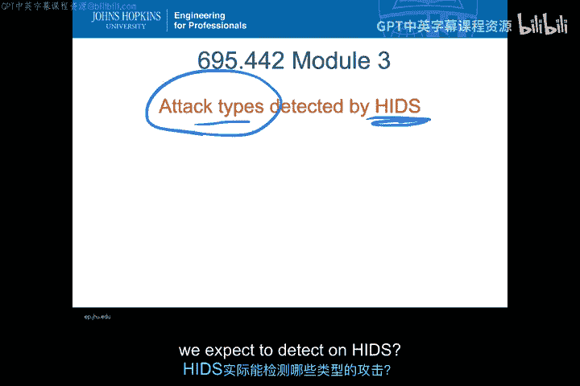
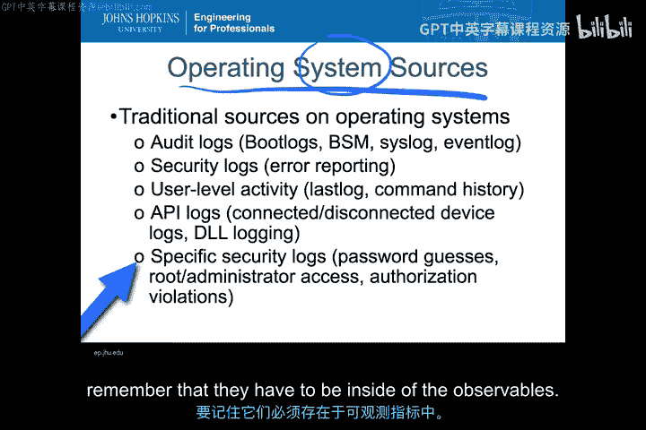
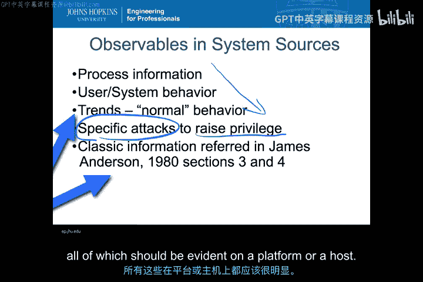
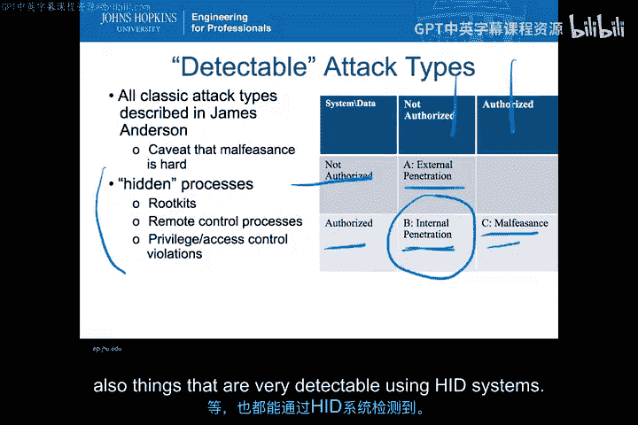
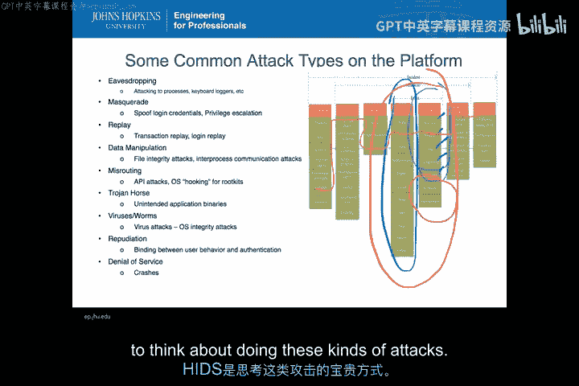

# 011：HIDS可检测的攻击类型（第二部分）🔍

在本节课中，我们将深入探讨主机入侵检测系统（HIDS）能够检测的具体攻击类型。我们已经了解了HIDS收集的信息类型以及部署在系统上的不同HIDS类型，现在让我们来看看HIDS实际可以检测哪些攻击。

## 概述

任何入侵检测系统要检测攻击，前提是攻击行为必须在可观测数据中留下证据。对于HIDS而言，这意味着攻击痕迹必须存在于操作系统或系统层面的各种日志和活动记录中。因此，我们讨论HIDS可检测的攻击类型时，必须从这些可观测数据的来源出发。

上一节我们介绍了HIDS的基础概念，本节中我们来看看攻击行为具体如何在这些可观测数据中体现。

## 可观测数据源

HIDS检测攻击的能力，取决于攻击是否在以下可观测数据源中留下痕迹：

*   **进程信息**：包括进程的启动/停止时间、内存使用量、进程所有者、进程打开的网络/文件连接，以及系统调用链。这些信息对于判断程序或进程是否行为异常至关重要，无论是代码本身是恶意软件，还是用户操控进程执行了不当操作。
*   **用户与系统行为**：例如登录时间是否异常、是否启动了不常见的程序。这与单个进程信息不同，更侧重于用户或系统在何时运行何种应用程序的行为模式。
*   **趋势数据**：这是比用户行为更高层次的抽象，关注的是用户或系统活动随时间的变化模式，以及什么构成了该环境下的“正常”行为。

从进程信息到进程组行为，再到长期趋势，我们分析的抽象层次逐渐提高。

此外，还有一类特定的攻击旨在**提升权限**。这让我们回想起James Anderson报告中描述的经典攻击分类。

## 基于经典分类的攻击检测

James Anderson报告中描述的所有经典攻击类型，都应该能在基于主机的入侵检测系统中被检测到，因为它们都会在主机上留下可观测的痕迹。

*   **外部渗透**：攻击者寻找系统漏洞或用户可利用的弱点，以提升权限、获取未授权信息。
*   **内部渗透**：这通常表现为内部威胁，攻击者利用漏洞进行权限提升。这类攻击在主机层面非常常见，是HIDS重点检测的对象。即使是由外部攻击者植入的恶意软件，其在主机上的运行权限也往往表现为内部用户，因此其观测特征与内部渗透相似。
*   **非法行为**：检测这类攻击通常比较困难，因为用户可能在权限范围内进行操作。但HIDS仍可通过分析用户运行的进程是否符合安全策略，来发现异常。

除了这些经典的、与交互式入侵相关的攻击，HIDS还能检测许多通常隐藏在操作系统中的活动，例如**Rootkit**、远程控制进程等自动化入侵行为。

## 具体的攻击类型分类

以下是各类攻击的列表，从窃听到拒绝服务。每一类攻击中都存在可以通过HIDS检测的主机层面攻击或可观测数据。

以下是HIDS可检测的主要攻击类别：

1.  **窃听**：例如通过键盘记录器或附着到其他进程来窥探进程内存。HIDS可以通过检测键盘记录器等程序的安装、或进程附着其他进程的行为来发现此类攻击。相关可观测数据存在于进程日志或硬件事件日志中。
2.  **伪装**：攻击者冒用他人登录凭证或进行权限提升。尽管这类攻击很难防范，但登录行为和权限提升操作本身会在主机上留下日志记录，可供HIDS分析。
3.  **重放攻击**：攻击者捕获主机上的某些数据（如认证令牌）并重新发送。虽然我们通常认为重放攻击发生在网络层面，但在主机上重放数据或命令同样可能发生，并且可以被HIDS检测到。
4.  **数据篡改/文件完整性破坏**：这正是像Tripwire这样的文件完整性检查工具所针对的。HIDS可以通过比对文件哈希或监控文件更改来检测此类攻击。
5.  **错误路由**：这类攻击通常针对网络，但在主机内部也可能发生。例如，通过API攻击滥用程序接口，或利用Rootkit钩子（Hook）篡改程序加载的DLL（动态链接库），都属于在计算机内部错误路由数据路径。此类攻击在主机上同样有迹可循。
6.  **特洛伊木马、病毒、蠕虫**：这些是意外的或恶意的应用程序二进制文件。检测它们是反恶意软件/防病毒软件的主要任务，而HIDS可以通过行为分析或特征匹配来辅助检测。
7.  **抵赖攻击**：这类攻击涉及用户行为与认证之间的绑定问题。在主机上，许多伪装攻击最终都可能表现为抵赖攻击的形式，这些痕迹在主机上是可见的。
8.  **拒绝服务与系统崩溃**：系统崩溃和因此导致的重启事件都会被记录在系统日志中，HIDS可以据此检测到导致服务中断或系统不稳定的攻击。

以上所有攻击类别中，都有在主机上常见且能被HIDS检测到的具体攻击实例。这证明了HIDS的强大能力，因为它非常接近攻击的终点。

我们还可以回顾在模块1中讨论的原始攻击分类法（Taxonomy）。在“目标”这一维度上，从账户、进程、数据、组件到计算机，所有这些目标都是基于主机的。因此，针对这些目标（账户、进程、数据、组件、计算机）的大多数攻击行动，都可以在主机上被观测和检测到。通常只有以“网络”和“互连”为目标的攻击，不会直接在主机可观测数据中留下明显痕迹。

## 总结

本节课中，我们一起学习了主机入侵检测系统（HIDS）能够检测的各种攻击类型。关键在于，攻击必须在主机的可观测数据（如进程信息、系统日志、用户行为模式）中留下证据。HIDS不仅能检测经典的权限提升和渗透攻击，还能发现Rootkit、木马等隐蔽威胁，覆盖了从数据窃听到拒绝服务的广泛攻击类别。正是由于HIDS紧邻攻击端点，它能对发生在主机层面的绝大多数威胁提供有价值的检测能力。