# 012：11_导论

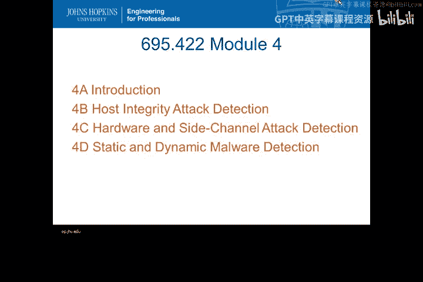

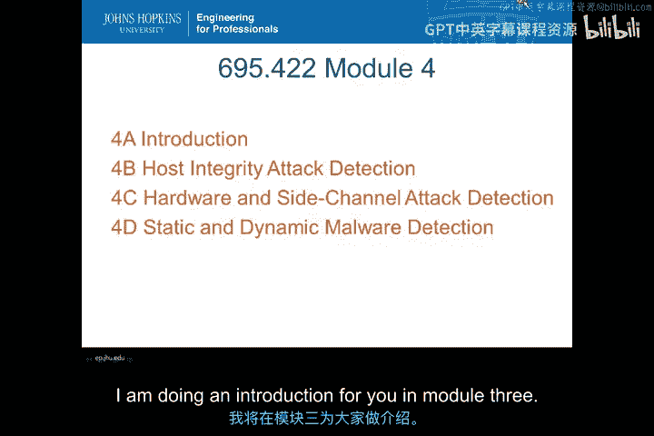

在本节课中，我们将学习约翰霍普金斯大学《入侵检测》课程中关于主机入侵检测系统的概述。我们将聚焦于模块三和模块四的核心内容，了解主机完整性攻击检测、硬件与侧信道攻击检测以及恶意软件检测等关键主题。

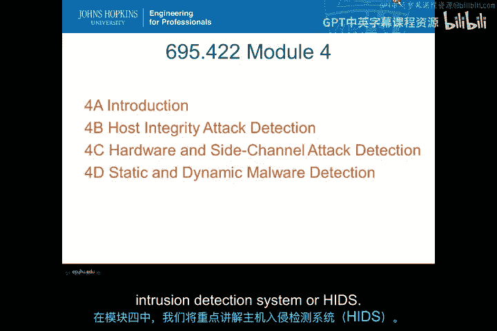

大家好，我是 Philip Ching。我将为大家介绍模块三和模块四的内容。

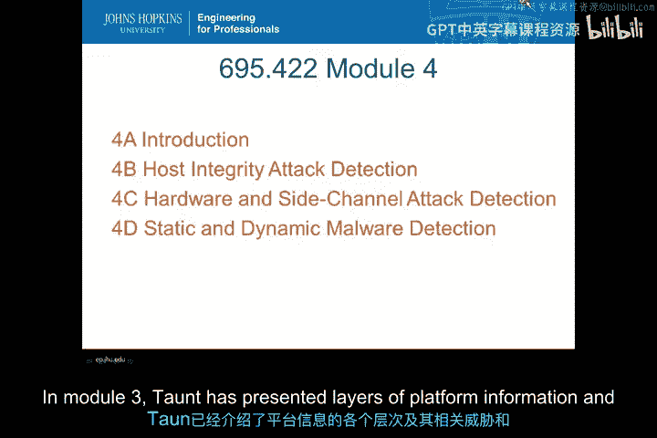

这两个模块的重点是**主机入侵检测系统**。

在模块三中，Tong 介绍了平台信息的各个层级，以及可以被不同类型主机入侵检测系统检测到的相关威胁与漏洞。

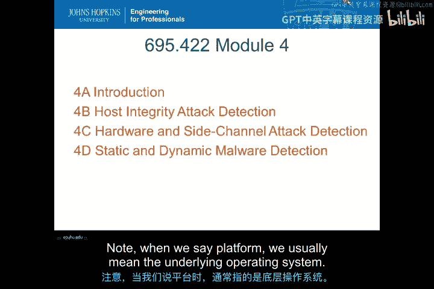

当我们提到“平台”时，通常指的是底层的操作系统。

在模块四中，Toang 将介绍更多关于不同类型检测的信息。

主要主题包括：
*   主机完整性攻击检测
*   硬件与侧信道攻击检测
*   静态与动态恶意软件检测

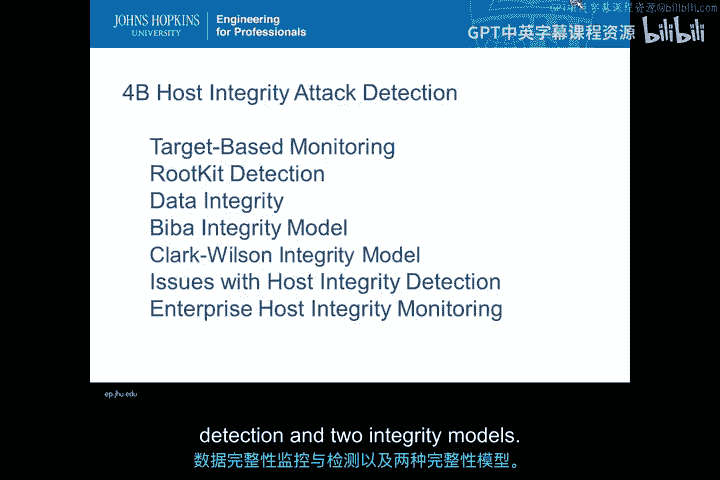

在主机完整性攻击检测部分，我们将讨论以下主题：
*   基于目标的监控
*   根工具包检测
*   数据完整性/主机完整性监控与检测
*   两种完整性模型

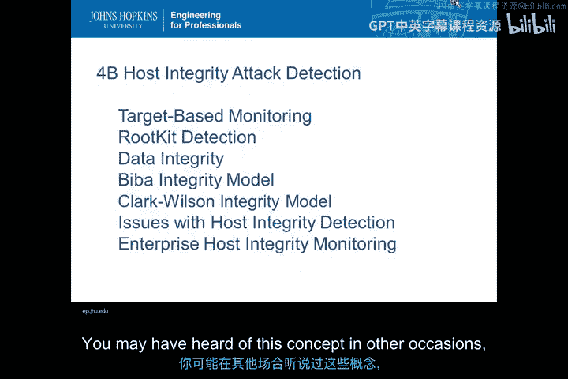

你可能在其他场合听说过这些概念。

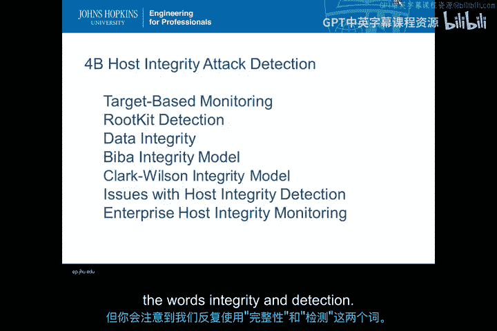

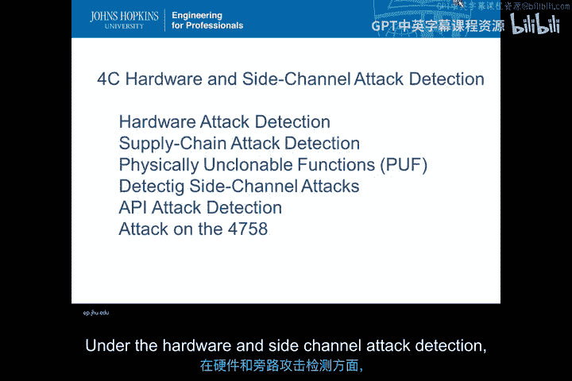

但请注意，我们反复使用了“完整性”和“检测”这两个词。

接下来是硬件与侧信道攻击检测部分，我们将讨论不同类型的检测：
*   硬件攻击检测
*   供应链攻击检测
*   物理不可克隆函数
*   侧信道攻击检测
*   电磁干扰攻击检测

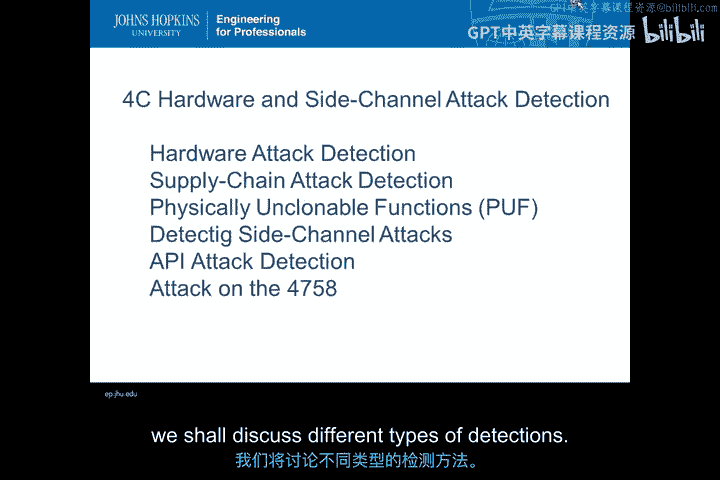

再次请注意，我们反复使用了“检测”这个词。

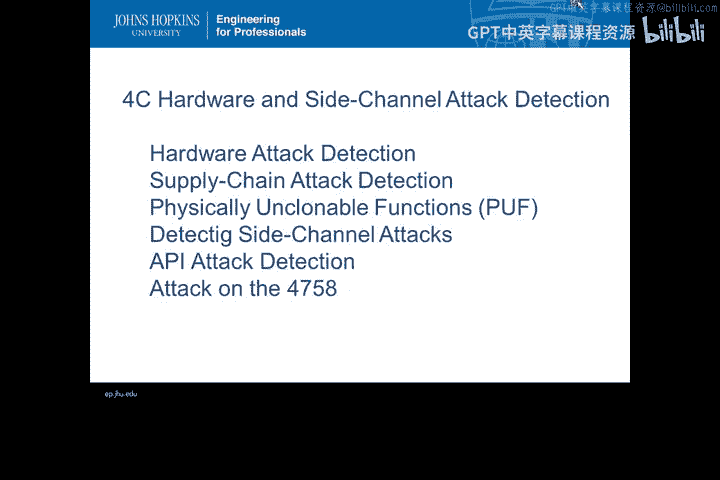

在模块四的这一部分，我们将讨论静态与动态恶意软件检测。

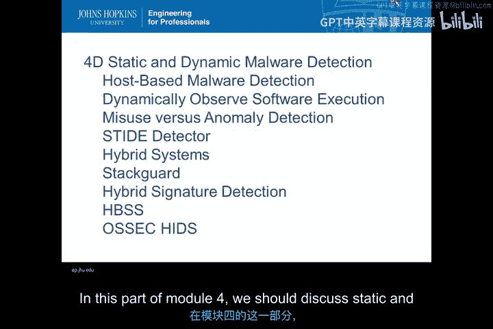

同时，我们还将涵盖基于主机的恶意软件检测。

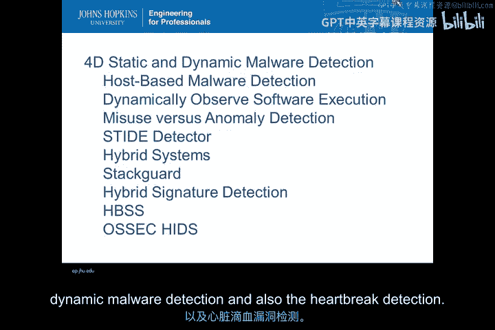

以下是该部分将涉及的内容：
*   动态观察软件执行
*   误用检测与异常检测
*   序列、时间、延迟、嵌入检测器
*   STIDE 检测器
*   混合系统与堆栈
*   基于主机的安全系统
*   混合签名检测

我们将介绍一个名为 OSSEC 的主机入侵检测系统作为理论与实践的结合。OSSEC 代表开源安全。

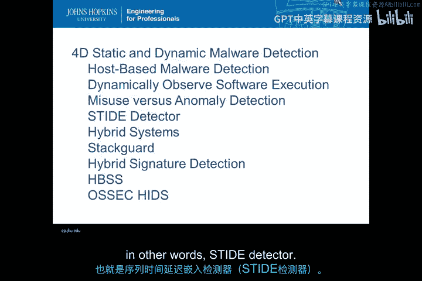

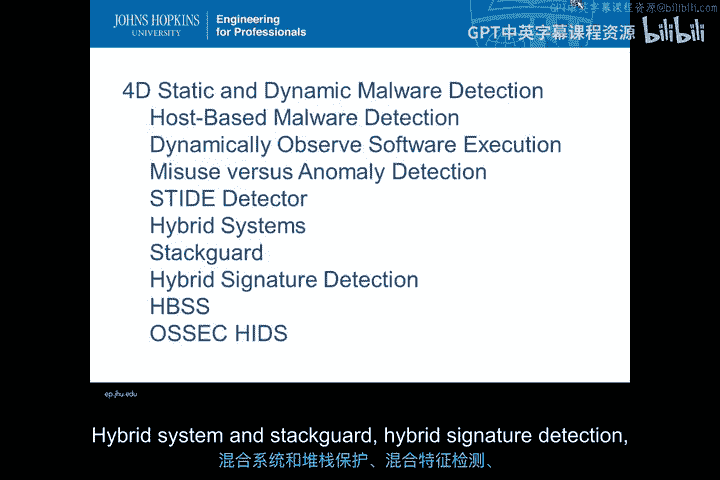

供你在本模块及其他模块中进行实践。

当你学习不同类型的攻击和异常理论时，请时刻思考：你实际上将如何检测这些入侵行为。

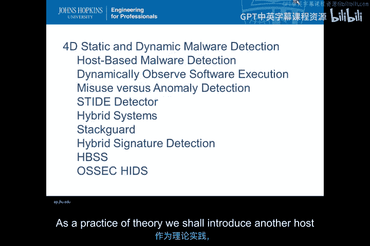

请记住，关键词是“检测”。

本课程的学习目标要求你实践理论，并最终能够发现并捕获恶意行为。

感谢观看。

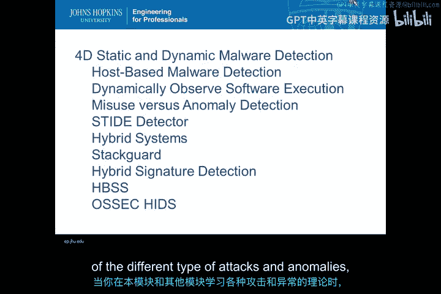

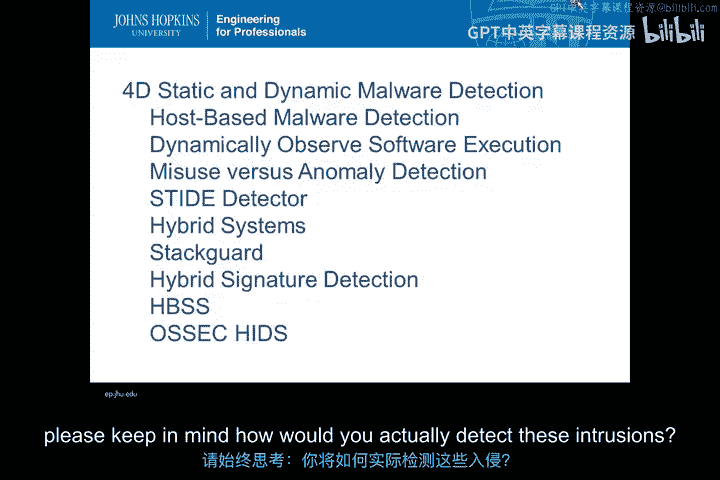

---

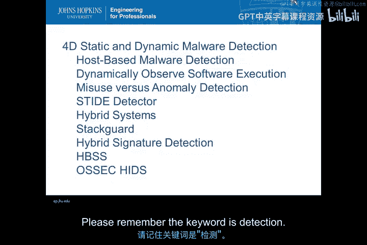

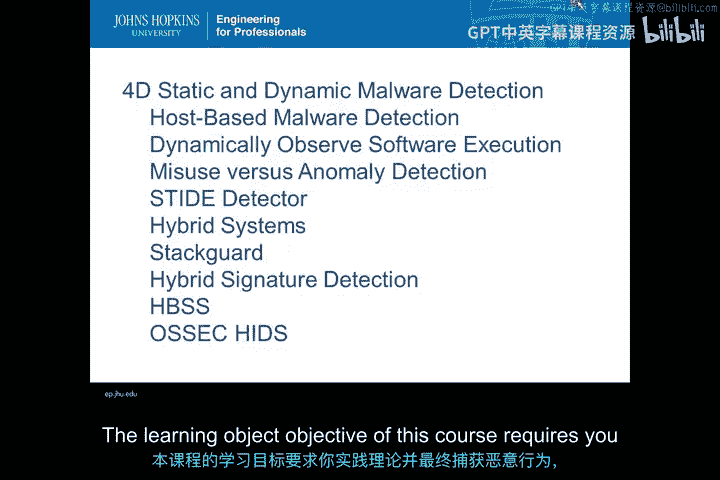

**本节课总结**

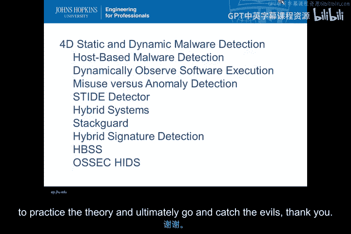

在本节课中，我们一起学习了主机入侵检测系统的课程导论。我们明确了模块三和模块四的学习重点，即主机完整性攻击检测、硬件与侧信道攻击检测以及恶意软件检测。课程强调了“检测”这一核心目标，并介绍了用于实践的开源安全工具 OSSEC，为后续深入的技术学习奠定了基础。