# 013：主机完整性攻击检测 🔍

在本节课中，我们将重点学习一种专注于**完整性**的主机入侵检测系统。这类系统监控主机内数据项、操作系统等本应保持恒定的元素。一旦这些元素发生非预期的变化，就表明可能存在攻击或篡改，需要进行调查。

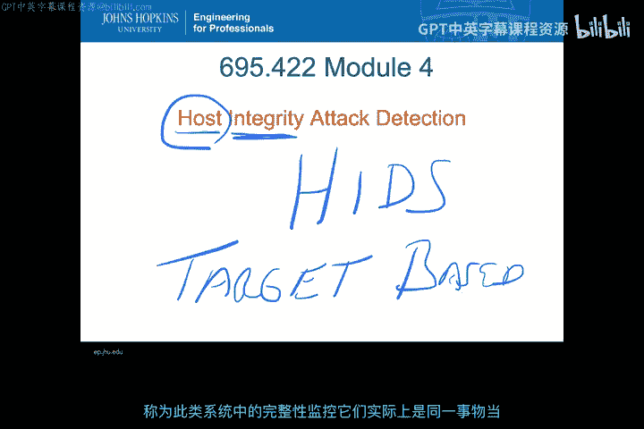

上一节我们介绍了主机入侵检测系统（HIDS）的基本概念，本节中我们来看看其中专注于**完整性监控**的特定类型。

## 目标式监控与完整性监控 🎯

这种基于主机的IDS，其核心是关注系统的完整性方面。如果你还记得之前的模块，这与**目标式入侵检测系统**非常相似，因为它也运行在主机上，但监控的是特定的“目标”。

**目标式监控**在这种语境下也被称为**完整性监控**，两者本质上是同一件事。当我们谈论一个特定“目标”时，指的是主机内一个必须保持其完整性的特定数据元素或项目。

在主机内部，这意味着“目标”是某种非常具体的资产。该资产会生成关于该对象变更的活动记录。对于一个本不应改变的对象，其变更记录序列就能指示系统可能遭受了攻击。

以下是此类监控的主要例子：
*   **Tripwire**
*   **StackGuard**

随着本模块的深入，我们还将讨论其他不同类型的完整性度量方法。

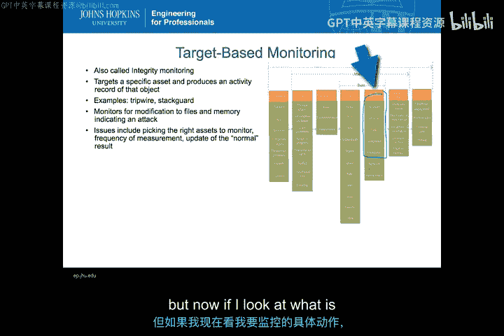

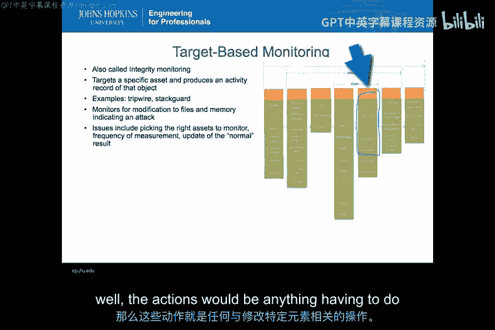

如前所述，这种系统监控的是**修改**。对于大多数目标式监控，我们期望某些数据元素是完全静态的。但这并非目标式监控的唯一方式。你可能有一个会变化的目标，但只以特定的、已知的方式变化。如果你有一个模型来描述目标应如何变化，并可以监控目标是否符合该模型的变更，那么你也可以对随可信进程而变化的事物进行目标式监控。

## 目标式监控的挑战 ⚠️

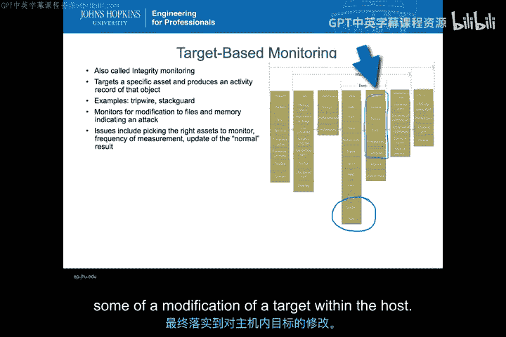

目标式监控面临许多问题。首先，你必须选择正确的资产进行监控。其次，你需要决定测量的频率。最后，当被监控对象以预期方式发生变更时，如何更新“正常”结果的基准。

例如，假设我正在监控Linux系统中一个特定的二进制文件，比如登录程序`login`的二进制文件。这个登录程序本应永不改变，因此它可能是一个很好的监控目标，可以帮助我了解其是否遭受了攻击。如果攻击者篡改了登录二进制文件，就可能绕过身份验证。然而，如果我要对系统进行补丁或更新，那么显然我必须更改那个特定的基准，以免合法的修改被误报为攻击。这些就是我们在讨论目标式监控时会涉及的一些问题。

## 在分类法中的位置 📊

那么，这种目标式监控在我们的分类法中处于什么位置？基本上，如果我们具体看“目标”，如果目标存在于主机上，那么我们就有了基于主机的监控（这与任何HIDS相同）。但如果我们看所寻找的特定“行动”，那么这些行动将是任何与修改特定元素相关的操作。

在攻击分类中，诸如探测、扫描、洪水攻击等行为不会改变目标；身份验证、绕过、缓冲区溢出、读取等行为通常也不直接修改。但当我们看到底部的**修改**、**删除**等操作时，这些就是我所说的目标式监控所关注的核心行动。这就是我如何将攻击、工具、漏洞与对主机内目标的修改行为联系起来。

## 经典工具：Tripwire 🛠️

最常见的、也是最早的完整性监控工具之一是**Tripwire**。它由Gene Kim和Gene Spafford于1992年创建（Gene Kim是当时Gene Spafford教授的学生）。这是Gene Kim 1992年博士论文的一部分。Gene Kim后来成为Tripwire公司的首席技术官，至今仍深度参与完整性和变更管理相关系统的工作。

Tripwire的实际功能是，针对一个基准配置执行**文件完整性检查**。首次使用Tripwire时，你必须创建这个基准配置。然后，你可以定期或按需对这些文件执行完整性检查。这就是你在本课程中将使用的开源版Tripwire的核心功能。

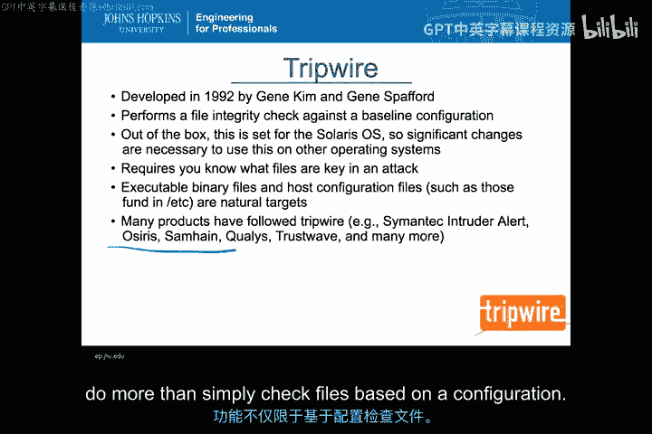

默认情况下，你下载的开源版Tripwire是为Cyrus操作系统设计的。因此，当你在Linux上安装它时，可能会看到大量错误，提示Tripwire基准配置中预设的某些文件不存在。这不应该成为问题，它仅仅意味着你需要更新Tripwire的配置文件，以包含你想要保护的、系统上的特定文件。

但这引出了一个非常重要的问题：你必须知道哪些文件是攻击的关键目标。如果你不知道哪些文件在攻击中会被修改，你就不知道应该配置哪些文件来建立基准和监控变更。当然，你建立基准的文件越多，在主机上检查这些文件的速度就越慢，资源消耗也越大。因此，你真的需要挑选那些**本不应改变**且对各类攻击**至关重要**的文件。

可执行的二进制文件以及位于`/etc`等目录下的主机配置文件，是攻击者的天然目标。因此，这些是开始使用Tripwire进行保护的首选位置。如果攻击者更改了这些文件，他们就能改变系统的身份验证机制和这些文件的使用方式。主机配置文件的更改可能影响系统启动方式、默认运行的程序、网络配置以及其他主机行为。所有这些关键文件（主要位于`/etc`等目录）都是你想要放入Tripwire配置文件的地方。

当然，Tripwire并非唯一的文件完整性检查工具。自1992年以来，这项技术被证明极具价值，几乎每家安全公司都推出了某种版本的完整性检查器，从赛门铁克到McAfee，再到Trustwave等。此外，还有像Samhain这样的开源版本，它们功能相似，甚至可以作为Tripwire的更高级替代品。Tripwire公司本身也已转向开发更复杂的产品，其功能远超基于配置的简单文件检查。

## 检测Rootkit 🕵️♂️

完整性检查器可以做的一件事是检测**Rootkit**。那么，什么是Rootkit？Rootkit是一种软件，它潜伏在系统其他安全机制、身份验证或可观察组件之下。例如，一个Rootkit可能成为内核的一部分，挂钩到负责列出进程的组件，以确保当你实际探查系统上运行的程序时，运行Rootkit的进程永远不会被显示出来。这是一种让恶意软件隐藏在系统内部的方式。一旦系统感染了Rootkit，你就已经破坏了操作系统运行方式的安装完整性。

有多种方法可以使用完整性检查来检测Rootkit。一种常见的方法是检查**控制流的完整性**。这试图确定你的操作系统是否被挂钩，各种系统工具的调用方式是否与操作系统安装时的原始状态完全一致。如果你对这些调用发生的方式建立了基准，那么完整性检查就能识别出是否安装了Rootkit。

因此，这些检查会验证DLL（动态链接库）的完整性以及内核挂钩。但请注意，这只有在基准和完整性检查本身未被破坏的情况下才有效。这一点至关重要。完整性检查器必须在恶意软件安装的层次之下运行。如果恶意软件控制了完整性检查器实际查看的内容，那么你就无法信任完整性检查器给出的关于是否发生变更的真实结果。

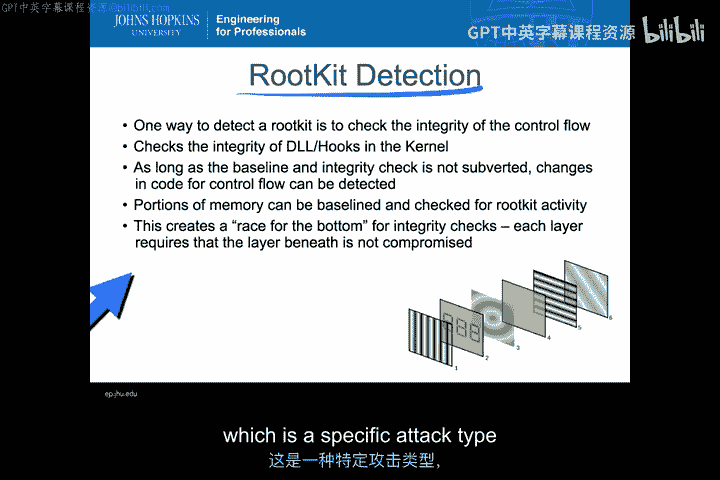

这就引发了所谓的**“逐底竞赛”**。由于系统中的每一层都使用其下一层的功能，如果你控制了下一层，你就可以对上一层的任何工具撒谎。因此，如果你的完整性检查器作为一个应用程序运行，而你破坏了操作系统，那么你就可以对完整性检查器撒谎，使其产生错误的结果。如果你的检查器在内核中工作，攻击者可以潜入更底层的固件并对它撒谎，那么内核也无法获得真相。即使你将完整性检查器一直深入到固件层，攻击者仍可能通过某种供应链攻击修改硬件，对固件撒谎，从而从根本上绕过检查。这就是我们所说的“逐底竞赛”。

当然，即便如此，你仍然可以对部分内存建立基准并检查Rootkit活动。因此，使用基于主机的完整性检查器来识别Rootkit这种特定攻击类型，有很多不同的方法。

## 数据完整性模型 📈

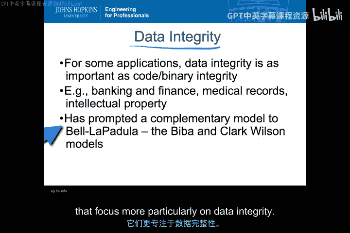

操作系统漏洞和针对操作系统的攻击，并非数据完整性或完整性检查器唯一重要的领域。对于某些应用程序而言，系统中数据的完整性，与代码或系统本身的完整性同等重要。你可以想象，在银行和金融领域，你希望自己银行账户的余额具有高度的完整性，不易被篡改。医疗记录、知识产权等也是如此。

这种对数据完整性模型的需求——即保证数据的完整性（不一定是机密性）——催生了一些与Bell-LaPadula模型互补的模型。你可能在早期的安全课程中记得Bell-LaPadula模型，它本质上创建了一个“星属性”，根据安全许可级别和文件或对象的分类来提供机密性保护。

从Bell-LaPadula模型出发，**Biba完整性模型**和**Clark-Wilson模型**被创建出来，它们更侧重于数据完整性。

### Biba完整性模型

首先谈谈Biba完整性模型。Biba模型与Bell-LaPadula非常相似。主体被授予**许可**，客体被**分类**，就像在Bell-LaPadula中一样。也像在Bell-LaPadula中一样，存在一个“星属性”。在Biba模型中，星属性意味着一个主体只能向**不高于其自身完整性级别**的客体进行写入。

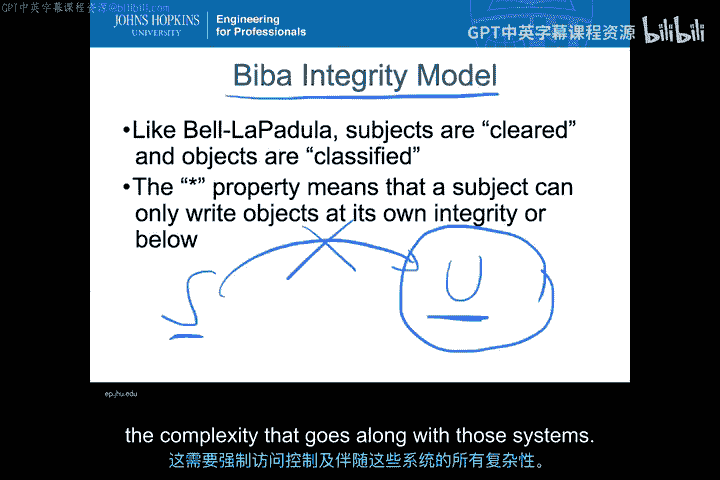

例如，如果我有一个具有“秘密”级别许可的主体，以及一个“秘密”级别的客体，那么这个主体可以向该客体写入。如果有一个“绝密”级别的客体，这个主体也可以向更高级别的客体写入。但不能做的是向更低级别的客体写入。

这意味着，如果我的主体处于“秘密”级别，而有一个“未分类”的客体，我**不能**从该主体向那个特定客体写入。这保证了较低分类级别的客体可以具有比主体更高的完整性，因为我无法向这些较低层写入，从而污染它们。这是一个旨在保证完整性的模型。

然而，在当前项目中，我们很少看到Biba完整性模型被实现。主要是因为，就像Bell-LaPadula一样，要实现它，必须在操作系统中内置**强制访问控制**的概念。你不能对这些元素进行自主控制，因为如果允许自主控制，用户就可以简单地移除限制，并自主地进行写入操作。由于我们不希望这处于用户控制之下，这就需要强制访问控制以及随之而来的所有复杂性。

### Clark-Wilson完整性模型

与Biba完整性模型相比，**Clark-Wilson完整性模型**是当今许多实际系统中真正使用的模型。Clark-Wilson并非完全遵循Bell-LaPadula的模式，而是始于三个具体目标：
1.  防止未经授权的修改。
2.  保持数据的一致性。
3.  防止授权但不恰当的修改。

你会发现，这些目标实际上与我们早在模块1和2中讨论过的安德森报告中的内部威胁类别相匹配。Clark-Wilson模型正是从这些目标开始的。

为了运行这个模型，你需要将系统上的所有数据划分为**受约束数据项**和**不受约束数据项**。CDIs是那些在系统中受到某种完整性控制的数据项。UDIs则不受完整性控制。但是，存在可信进程可以使UDIs转变为CDIs，或者影响CDIs。关键在于，只有通过可信进程，不受约束的数据项才能成为或影响受约束的数据项。

整个Clark-Wilson模型真正依赖于这样一个事实：你可以要求某种模型来验证CDIs是否处于有效状态。换句话说，CDIs要么处于完整性得到保证的有效状态，要么因为未按应有方式变更而处于无效状态。

这意味着，你需要定义**良构事务**，这些事务严格控制CDIs如何实际变更。这些就是我们的可信进程。因此，可信进程变更CDIs，其他任何东西都不能变更CDI。只要你的可信进程本身仍然保持完整性（当然，进程描述和数据本身也是CDIs），这些特定事物就将控制系统内CDIs的完整性。

与之前讨论的Biba完整性模型不同，包括Windows在内的许多操作系统实际上已经采用了至少一部分Clark-Wilson模型。原因是，我们可以用符合现代操作系统构建方式的、自然的方式来解释我们谈到的这三个目标。

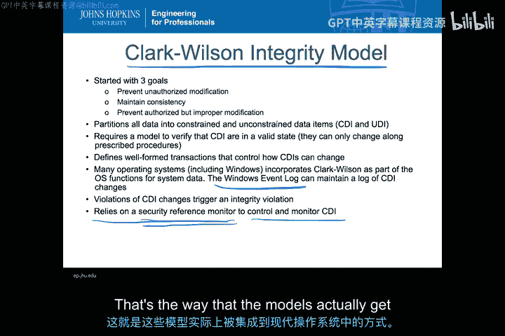

例如，你需要以特定方式记录CDIs的变更。在Windows中，当CDI发生变更时，实际上会被记录到Windows事件日志中。这就维护了一份CDI变更的日志。因此，当你查看Windows事件日志时，你实际上看到的是受控进程的结果，以及当受控进程实际更改某些内容时发生了什么。这也使得Windows事件日志成为在主机层进行入侵检测时有价值的日志文件。

其作为入侵检测系统的运作方式是：对CDI的**违反**（即变更）会触发完整性违规。完整性违规正是IDS工作的核心。为了理解发生了完整性违规，你需要一个比变更CDIs的可信进程更可信的进程，这实际上依赖于一个**安全引用监视器**。安全引用监视器是操作系统内的一段可信代码，用于控制和监控CDIs，基本上是管理可信进程如何实际变更CDIs。因此，创建事件日志的Windows日志系统——事件记录器——实际上是Windows系统内部的安全引用监视器。它可能不是你期望的高度可信系统中那种经过形式化验证的引用监视器，但它在Clark-Wilson完整性模型中起到了相同的作用。这就是这些模型如何被整合到当今操作系统中的方式。

## 主机完整性检测的问题与挑战 🐢

在讨论如何进行主机完整性检测时，存在许多问题。首要问题是，我用于检测完整性攻击的资源，与完整性攻击的目标是相同的。这导致了之前提到的“逐底竞赛”：你使用同一个系统既作为攻击的目标，又作为检测攻击的工具。因此，如果你成功攻击了完整性机制，你就可以进而攻击该机制所保护的其他文件。

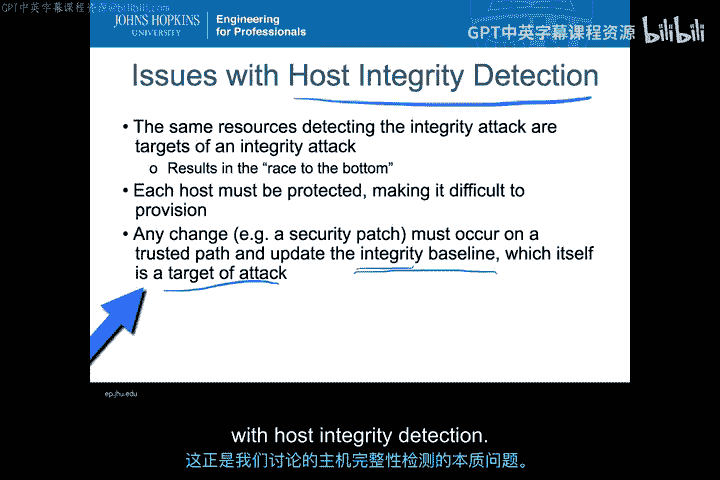

这类系统面临的另一个问题是，每台主机都必须独立受保护。在企业环境中，这可能使得部署和维护变得非常困难，尤其是在主机完整性方面，因为许多关键文件在整个企业中的变更速率可能不同。有些系统可能以不同方式打补丁。你将拥有具有不同关键文件的不同操作系统。所有这些都会使得在企业级别实施完整性监控更加困难。

此外，任何变更（例如必须在可信路径上执行的安全补丁）都必须更新安全基准，以便在进行未来的完整性检查时，知道更新后的基准是正确的。然而，这个更新过程本身也是攻击的目标。因此，攻击的目标由本身也是攻击目标的事物保护，而这些事物又由其他同样是攻击目标的事物保护……这就像那句谚语“全是乌龟驮着”，这基本上就是我们讨论主机完整性检测时所面临的情况。

## 企业级部署 🌐

这就引出了如何实现企业级部署的问题。如何从单台主机扩展到监控整个企业的主机？为了使其实用化，首先，你需要一个**安全通道**来将警报传出平台并将更新传入平台。为所有主机创建安全通道，是从单机主机完整性监控系统扩展到整个企业范围的第零步。

这在当今的商业产品中非常常见。想象一下，如果你必须将用Tripwire在单机上做的事情扩展到整个企业，在成千上万的系统上单独登录和检测，那将非常困难。因此，像Tripwire Enterprise和McAfee HBSS这样的工具包含了有助于协调所有这些工作的机制。然后，这些机制可以使用标准和各种技术来确保这些系统能够以可信的方式与某种中央服务器进行通信。

因此，企业内外完整性信息的交换可以通过像**SCAP**这样的标准来支持，你可以在相关网址查看更多细节。这可以作为从单机版Tripwire扩展到企业版Tripwire，或从基于主机的IDS扩展到某种企业系统的基础。

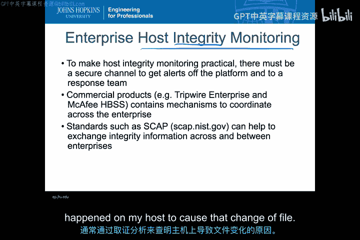

本节课中我们一起学习了主机完整性监控。当然还有更多额外信息，但这基本上是核心内容，即如何利用完整性的变化作为主机内的检测系统。这是整个HIDS中极其重要的一类，并且在检测零日攻击和我们未知的攻击方面非常成功。因为只要我能理解某个元素本不应改变，那么我不关心是什么导致了改变，任何完整性的变化都表明该系统遭受了攻击。这为我提供了额外的能力，让我知道发生了某种新的攻击，从而通常借助取证手段开始调查，查明主机上发生了什么导致了文件的变更。