# 014：硬件与旁路攻击检测 🔍

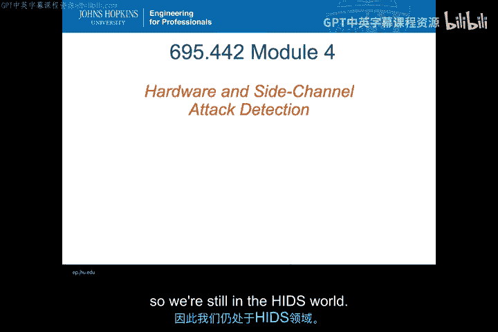

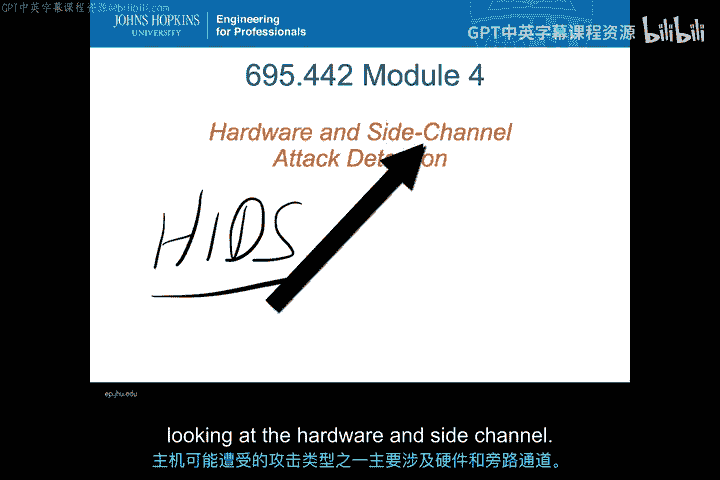

在本节课中，我们将继续聚焦于基于主机的入侵检测系统。我们将深入探讨针对硬件和旁路发起的攻击，并了解如何检测这类攻击。课程内容将涵盖硬件攻击检测的基本类型、供应链验证的挑战、物理不可克隆函数的概念，以及旁路攻击的原理与检测方法。最后，我们将通过一个具体的API攻击案例来巩固所学知识。

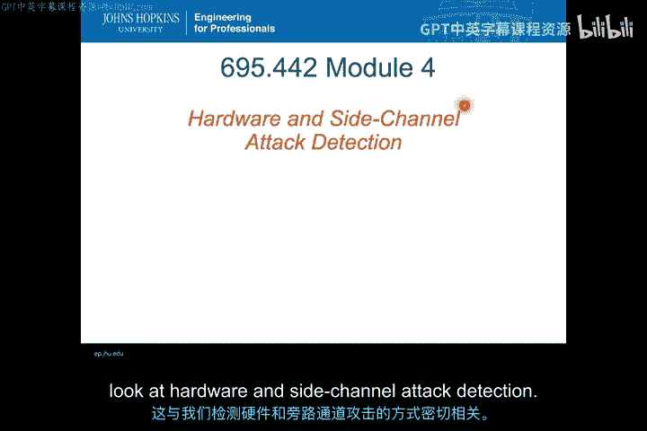

---

上一节我们讨论了基于主机的入侵检测系统（HIDS）的总体框架。本节中，我们将目光投向更底层，看看如何检测针对硬件本身以及利用旁路信息发起的攻击。

## 硬件攻击检测 🛡️

硬件攻击检测主要关注物理设备层面的安全威胁。以下是三种基本的检测类型。

### 完整性检查

完整性检查针对那些本应保持静态的配置或数据元素，监测其是否发生变更。在硬件层面，我们可以寻找那些具有静态可观测特性的组件，并检查其完整性。其核心思想是验证预期不变的事物是否被篡改。

### 供应链验证

硬件攻击可能发生在硬件供应或交付过程中的任何环节。攻击者可能在供应链中引入恶意硬件、假冒硬件或具有意外行为的组件。供应链验证主要是一个人工流程，旨在检查制造和运输的每个环节，确保每个组件仅按授权方式进行修改。需要注意的是，验证不仅限于初始供应阶段，硬件或底层操作系统的更新也可能在供应链中被篡改。

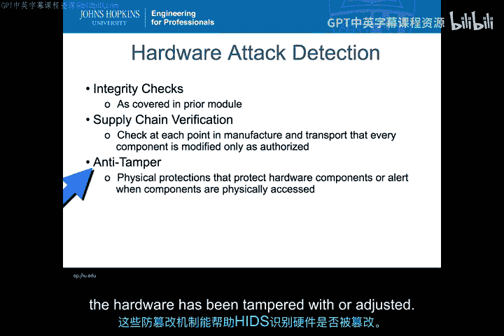

### 防篡改机制

防篡改机制是指当保护硬件组件的物理防护措施被物理访问时，会触发某种警报机制。这更接近于传统的警报系统。当这些机制与基于主机的入侵检测系统集成时，可以帮助HIDS识别硬件是否已被篡改或调整。

---

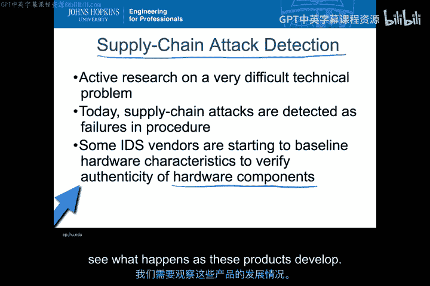

在讨论了硬件攻击检测的基本类型后，我们必须认识到，供应链攻击检测是当前最严峻的挑战之一。接下来，我们看看业界如何尝试解决这个“信任根”的问题。

## 供应链验证与物理不可克隆函数 🔬

目前，尝试对硬件进行基准测试和验证的技术，很多都聚焦于**物理不可克隆函数** 的概念。PUF利用的是每个芯片在制造过程中产生的、独特的物理特性。

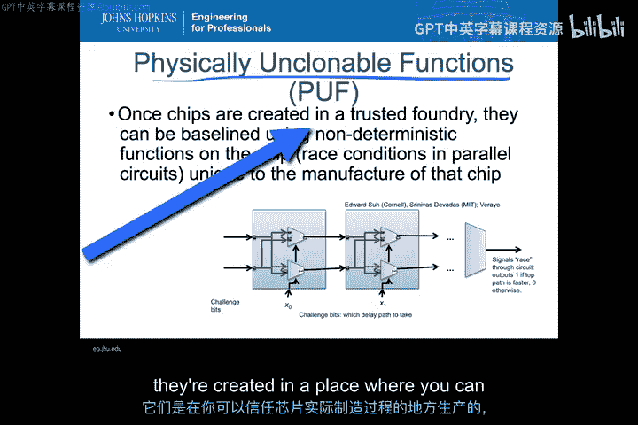

其工作原理可以简化理解如下：在一个可信的芯片制造厂中，每个芯片内部都包含一些微小的、非确定性的电路路径。当向芯片输入一组特定的“挑战”比特时，这些比特会在芯片内部形成反馈回路，并产生“竞争”条件。由于制造过程中微小的物理差异，某些路径会比其他路径略快一些，这最终会导致输出一个特定的“响应”比特。通过输入多组挑战比特，可以获得一个长比特串，这个比特串就构成了该芯片独一无二的“指纹”。

芯片交付后，可以再次运行这些挑战比特。如果得到相同的响应，则证明芯片是原始且未被篡改的；如果响应不同，则表明硬件可能在供应链中遭到了替换或篡改。PUF为将硬件特征纳入入侵检测系统提供了一种潜在途径。

---

了解了如何从物理层面验证硬件后，我们转向另一种更隐蔽的攻击方式：旁路攻击。这类攻击不直接破解算法，而是通过分析系统的物理特征来窃取信息。

## 旁路攻击检测 📡

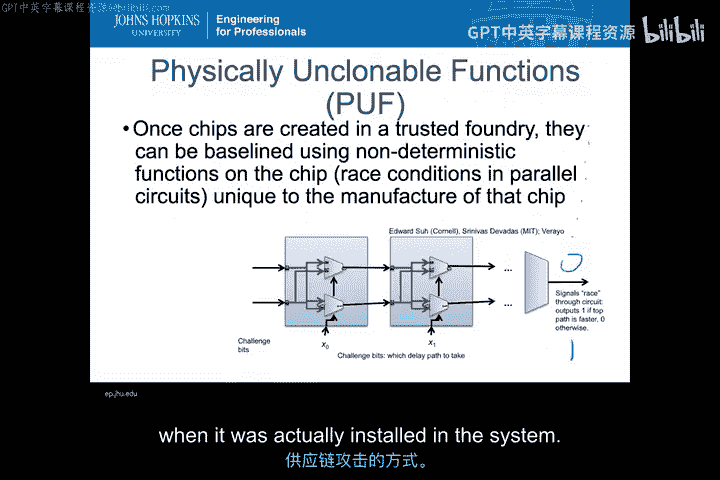

旁路攻击源于密码学领域，攻击者通过分析加密设备运行时的物理特征（而非明文或密文本身）来推断密钥信息。

以下是几种常见的旁路攻击方式：
*   **时序攻击**：不同的密钥值在加密过程中可能导致微小的、特征性的时间差异。通过精确测量加密操作的耗时，可以推断密钥信息。
*   **功耗分析**：不同的密钥或操作会导致设备功耗的微小变化。监测这些功耗变化可以用于密钥分析。
*   **电磁辐射分析**：设备运行时会产生电磁辐射，这些辐射可能携带与处理数据相关的信息。

那么，入侵检测系统如何检测这类被动的旁路窃听呢？这非常困难，但一些初步的思路正在形成。例如，检测系统是否可以感知到因读取功耗信息而导致的功耗特征变化？能否探测到是否有传感器正在读取系统发出的特定辐射？这些检测通常与设备的具体物理特性紧密相关，但正开始被整合到基于主机的IDS中，以判断是否存在旁路攻击。

---

旁路攻击检测的一个前沿领域是量子信息交换。接下来，我们看看量子物理特性如何帮助检测窃听。

## 量子通信与旁路攻击检测 ⚛️

在量子信息交换中，检测旁路攻击意味着需要检测窃听设备获取信息的行为。量子通信的特性使得这种检测成为可能。

其核心原理基于“量子纠缠”。当一对光子处于纠缠态时，对其中一个光子的测量会瞬间影响另一个光子的状态，无论它们相距多远。更重要的是，任何试图在传输途中“读取”或测量这个光子的行为，都会不可避免地破坏其量子态。

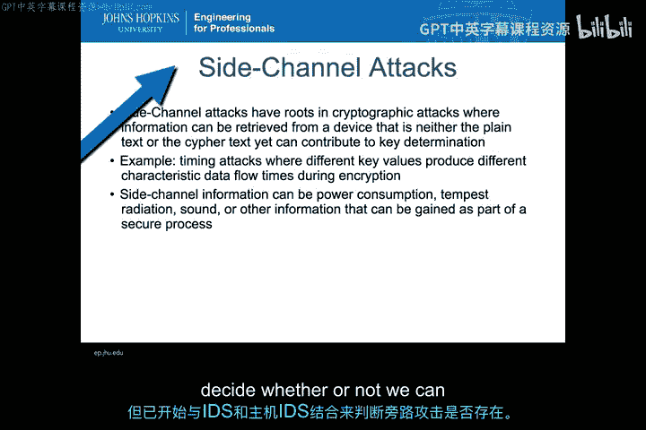

因此，在量子通信中，如果通信双方发现光子的量子态被意外破坏，就可以断定传输通道中存在着窃听行为。即使攻击者试图复制一个相同值的光子重新发送，也无法复制出与原始光子相同的纠缠态。通过这种方式，我们可以利用量子物理定律本身来检测旁路攻击。

---

许多硬件和旁路攻击最终都需要通过某种**应用程序编程接口** 来获取信息。因此，API攻击检测成为一个关键环节。

## API攻击检测 🔌

API攻击检测关注运行进程之间的通信是否被攻击者观察或篡改。攻击可能被动地监听API调用，也可能主动地将通信重定向到恶意端点（类似于中间人攻击）。

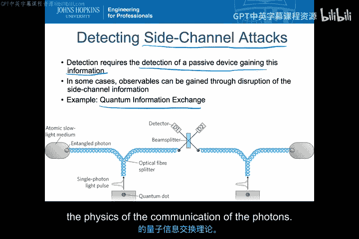

检测这类攻击的核心在于：了解系统上安装了什么、安装在哪里，以及这些API的**完整性** 是否得以维持。我们需要确保通信端点的真实性和通信过程未被劫持。

---

为了加深对API攻击的理解，你将通过一个阅读练习来探索一个具体案例。这个案例将展示攻击者如何利用加密设备上的API发起攻击。

## 练习：分析加密设备API攻击案例 📖

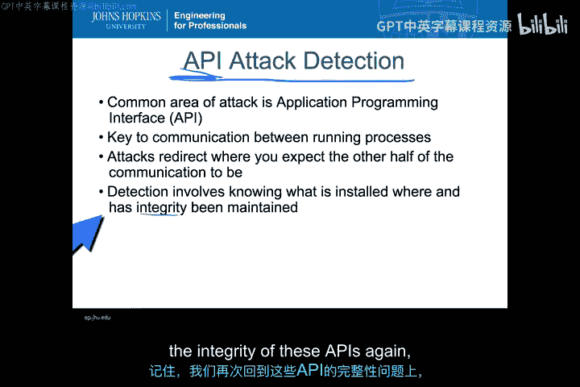

你将通过阅读《Security Engineering》第18章，具体是18.2.2节，来深入分析一个针对名为“4758”的加密设备的API攻击。

该攻击利用加密设备上的API，实质上获得了无限次尝试破解密钥的机会。虽然存在与此攻击相关的可观测指标，但需要认识到，这是一种从机器外部观察到的攻击，属于硬件风格攻击，并且严重依赖于旁路和外部的可观测信息。

你的任务是：仔细阅读第18章（特别是18.2.2节）中关于API风格攻击的内容，并尝试描述，对于这种特定攻击，有哪些可用的平台信息源包含了入侵检测系统所需的可观测指标。

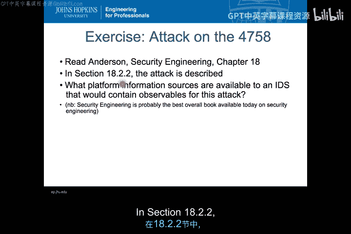

---

**本节课总结**

在本节课中，我们一起学习了基于主机的入侵检测中针对硬件和旁路攻击的检测方法。我们探讨了硬件攻击检测的三种类型：完整性检查、供应链验证和防篡改机制。我们了解了供应链验证的挑战以及物理不可克隆函数这一潜在解决方案。我们还分析了旁路攻击的原理，如时序攻击和功耗分析，并看到了量子通信如何用于检测窃听。最后，我们认识到许多此类攻击通过API实现，因此API的完整性检查至关重要。

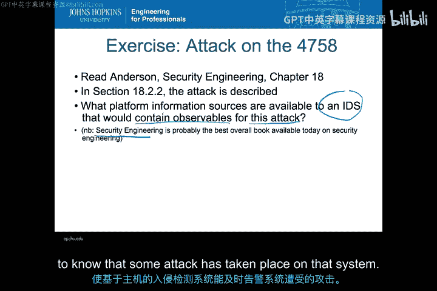

核心在于，无论是通过PUF、量子干涉还是API监控，将这些物理或底层的可观测指标与警报机制关联起来，才能帮助基于主机的入侵检测系统及时发出警报，告知我们系统正在遭受某种攻击。