# 015：静态与动态恶意软件检测 🛡️

在本节课中，我们将深入探讨主机入侵检测系统中最重要的一类：恶意软件检测。我们将学习如何识别系统中可能存在的恶意代码，无论它是静态存储在文件系统中，还是正在动态运行。

## 概述

恶意软件是我们当前在主机系统中面临的最危险的威胁之一。它可能通过网页浏览、电子邮件附件等多种方式进入系统。因此，主机恶意软件检测至关重要。检测方法主要分为静态检测和动态检测两大类。

## 静态恶意软件检测 🔍

上一节我们概述了恶意软件检测的重要性，本节我们先来看看静态检测。静态恶意软件检测主要存在于防病毒软件领域。这是一种被动扫描文件系统的方法，旨在通过特征码或其他识别技术，找出文件系统中存在的恶意软件。

大多数静态检测技术更像是取证分析，而非实时入侵检测。虽然在本课程中，取证分析通常超出范围，但由于一些静态技术在动态环境中也有效，并且许多主机入侵检测知识源于静态检测领域，我们仍需了解它。

静态分析包括对系统上二进制文件的静态分析，在某种程度上也包括对源代码的静态分析（尽管本课程不深入讨论源代码分析）。就本课程而言，静态恶意软件检测本身并不完全属于入侵检测范畴，它更像是一套取证工具。虽然许多入侵检测工具集成了静态检测功能，但我们将其视为对入侵检测系统的取证补充。

## 动态恶意软件检测 ⚙️

静态检测的重点是被动扫描，而动态恶意软件检测的核心在于：我们不想仅仅通过被动扫描来发现系统中的恶意软件；我们希望观察恶意软件的执行过程，并动态地根据其行为来判断是否属于恶意活动。这才是入侵检测系统应该关注的。

在动态恶意软件检测中，我们有两种基本方法：

以下是两种主要的动态检测方式：
1.  **在沙箱环境中观察执行**：将可疑代码放在受保护的环境中运行，观察其行为而不造成实际危害。Java沙箱机制是这方面的早期实践，而像FireEye这样的公司则专注于此业务模型。
2.  **在正常软件运行时观察可观测指标**：在正常工作过程中，监控正常软件运行时的各种可观测指标，试图识别出具有恶意软件特征的行为。

动态恶意软件检测具备我们之前讨论过的入侵检测系统的所有特征：它有一个事件队列或日志记录机制来收集来自内核的可观测数据；有一个分析模块来对事件空间进行划分和分类；还有一个报告或拦截模块，实现入侵检测或入侵防御的功能。

这是一个非常活跃的研究领域，每年有大量相关论文发表。本周模块中包含了一篇名为《恶意软件检测技术综述》的调查报告，很好地总结了这类主机入侵检测技术。

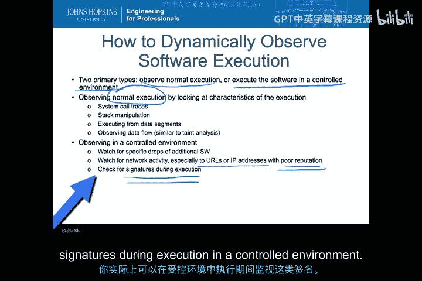

## 动态观测执行的方法 👀

那么，我们如何动态地观测软件执行呢？同样有两种主要途径：

以下是两种动态观测途径：
*   **观测正常执行**：在正常环境中，观察软件执行的特征。这通常包括系统调用轨迹、栈上的活动、从数据段执行代码（即控制流从代码段转移到数据段）等。我们还可以观察数据流，分析软件内部的决策过程，类似于污点分析，以判断软件是否被外部控制。
*   **在受控环境中执行**：在隔离环境中，可以观察非常具体的行为，例如：是否释放了额外的软件文件以备后用；是否开启了额外的网络端口或连接到具有不良声誉的URL或IP地址（现在已有服务可以查询URL或IP的声誉）；当然，也可以在执行过程中检查特征码——这不全是异常检测，如果你有特征码，就可以在受控执行环境中进行匹配。

## 基于误用与基于异常的检测 🎯

无论是在受控环境还是自然环境中观测，我们都可以使用基于误用或基于异常的检测方法。主机恶意软件检测同样可以是基于特征（误用）或基于异常的。

**基于特征的系统**会检查代表恶意软件的特定模式。这些模式是代码执行过程中的特定活动序列，而不仅仅是静态的二进制模式。它还可以检查与恶意软件相关的特定URL、IP地址，或者检查自修改代码的特征。例如，如果一个二进制文件解包成多个将被执行的文件，我可以动态检查每个解包后的文件是否匹配已知的恶意软件特征。

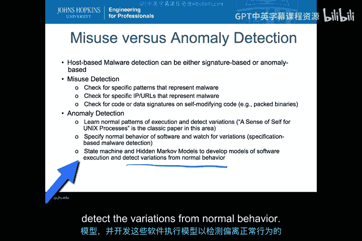

**基于异常的系统**则与我们之前讨论的异常检测原理相同：必须先学习或定义“正常”行为，才能区分正常与异常。可以通过多种方式来实现：
*   学习正常的执行模式及其变体。该领域的开创性工作是《Sense of Self for Unix Processes》这篇经典论文。
*   为软件指定正常行为规范，并观察偏差。这是基于规范的恶意软件检测，旨在指定软件的关键行为（而非全部），这些行为会被大多数常见恶意软件模式破坏。
*   将正常行为表示为状态机或隐马尔可夫模型，通过模型来检测偏离正常行为的异常。

## 示例：序列时间延迟检测器 ⏱️

《Sense of Self for Unix Processes》论文中的一个实例是序列时间延迟检测器。它是一个基于滑动窗口的检测器，每次查看连续六个系统调用的执行块，并在每次执行新系统调用时滑动窗口。它通过学习程序的正常调用轨迹，来理解哪些执行模式是之前出现过的。

其工作方式可以简化为：假设正常模式有 `ABCDEF`、`G`、`H`、`A` 等。当出现一个新模式 `AFGBA` 时，检测器会将其与所有已知正常模式比较，如果从未见过，则触发警报。

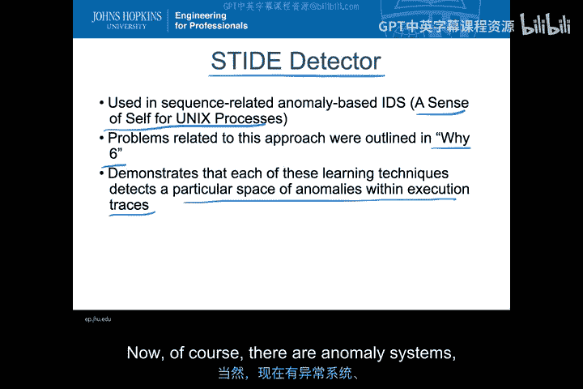

本周模块中有两篇论文：原始的《Sense of Self for Unix Processes》和另一篇名为《Y6》的论文。《Y6》论文指出了该检测器存在的问题，这充分说明每种学习技术只能检测执行轨迹中特定类型的异常。例如，对于序列时间延迟检测器，其检测能力很大程度上依赖于窗口大小（论文中为6），并且只能检测特定类型的恶意软件。这很好地展示了该领域研究是如何随时间发展的。

## 混合系统 🤝

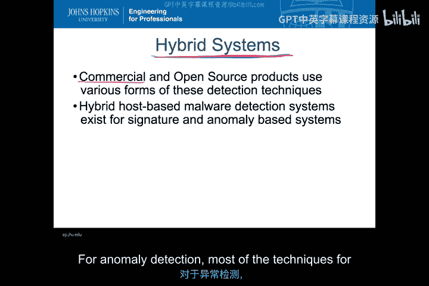

当然，除了纯异常系统和基于特征的系统，还有很多混合系统。目前商业和开源世界中的产品几乎都使用多种检测技术，而非单一技术。为什么？正如我们在《Y6》论文中看到的，所有技术都有其局限性。通过创建包含多种技术的混合系统，可以降低误报率、提高检测率，使系统更具商业可行性。这就是关键所在。

混合系统既存在于基于特征的检测中，也存在于基于异常的检测中。

## 混合异常检测 🧠

混合异常检测的技术大多涉及集成分类器的思想。这种技术将多个相对简单或直接的分类器组合在一起，让它们相互协作，共同对事件空间进行分类。这是创建机器学习算法（如神经网络）的一种方式，能够比单一异常检测系统更好地进行检测。

例如，考虑rootkit检测。我可以结合基于特征的rootkit检测方法和基于“自我感知”的异常检测方法，从而降低对某类恶意软件的误报率。有一个很好的例子是针对“鬼网”这类恶意软件的检测。通过结合rootkit检测和自我感知检测，检测鬼网的误报率显著降低。

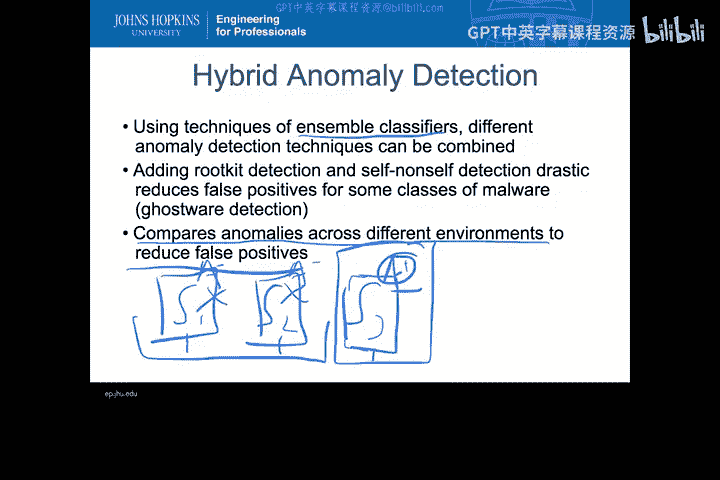

集成分类器的核心思想是通过比较不同环境下的异常来减少误报。例如，如果我在多个运行相同软件的系统上部署检测，在系统1上发现一个异常，而在系统2和系统3上没有，那么这个异常就更可能与恶意软件或该系统特有的问题相关，从而帮助降低误报。

## 示例：基于规范的检测——StackGuard 🛡️

另一个基于规范的异常检测系统例子是StackGuard。它是一个用于防御缓冲区溢出攻击的产品。StackGuard本质上是一个基于规范的异常检测系统，它不针对任何特定的缓冲区溢出攻击，而是使用“金丝雀值”的概念。金丝雀值是栈中的一个额外字，如果它被覆盖，就表明栈中发生了溢出。

其原理是：在正常的栈布局中，缓冲区内的字符串向下增长。为了通过缓冲区溢出来改变返回地址（使其指向恶意代码），金丝雀值会被覆盖。通过检查金丝雀值是否被改变（这是一个被检查的规范），可以在返回地址被使用之前检测到缓冲区溢出攻击。

重要的是，金丝雀值必须是随机选择或不可预测的，否则恶意软件可以在溢出时用原值覆盖它，从而绕过检测。这体现了入侵者与防御者之间的共同演化：最初固定的金丝雀值容易被绕过；改为随机值后，检测变得更复杂；随后，金丝雀值被保护起来，防止进程读取……双方在不断升级对抗手段。

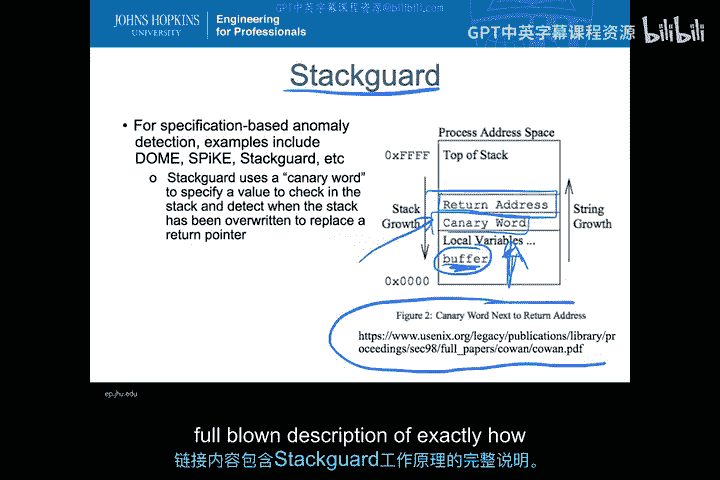

## 混合特征检测 🔄

混合特征检测结合了静态和动态特征生成技术来检测恶意软件。它旨在解决一个难题：特征码在恶意软件被发现后，很难及时产生良好、独特的特征码。流程通常是：发现恶意软件 -> 分析 -> 创建特征码 -> 验证唯一性 -> 分发。

现在有一些系统试图自动化这个过程。例如，Honeycomb 系统尝试从蜜罐活动中自动生成基于主机的特征码。蜜罐专门用于检测攻击，当攻击被检测到时，系统会自动生成特征码并推送到主机，这比人工介入快得多。

另一个例子是 MCF 系统，它在检测到恶意软件时，尝试根据其行为自动生成特征码。这是一种面向沙箱的执行方式，生成的签名可用于保护实际运行环境。

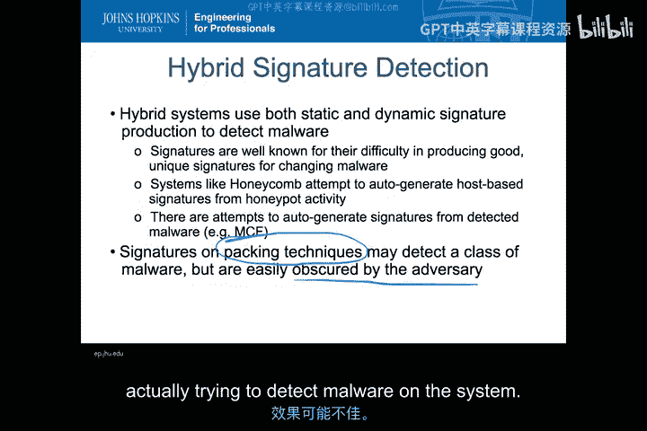

此外，也可以针对打包技术生成特征码，以检测使用类似打包算法的一类恶意软件。但遗憾的是，打包算法很容易被攻击者更改、更新和混淆，因此如今仅依赖打包技术特征码的检测效果可能不佳。

## 当前研究与产品 🚀

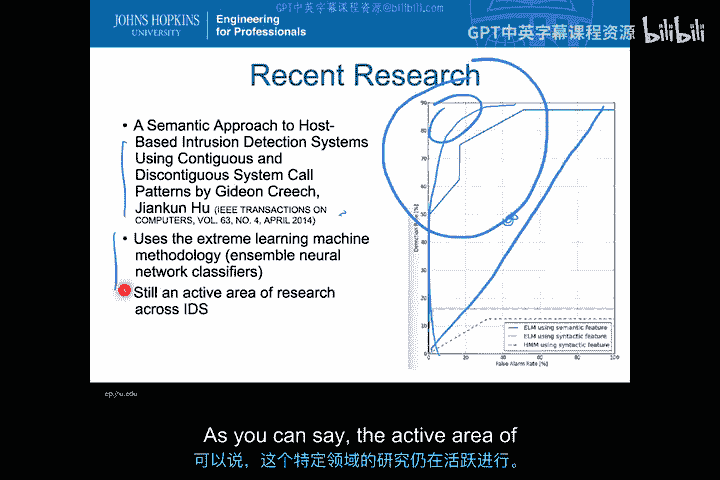

这方面的研究一直持续至今。例如，2014年的一篇论文仍在基于《Sense of Self for Unix Processes》的思想，研究使用系统调用模式的行为检测系统。该论文使用极限学习机（一种集成神经网络分类器），其ROC曲线显示出对某类攻击较好的检测效果（ROC分析我们将在后续课程深入探讨）。图表中，越靠近左上角的检测器越好，越靠近对角线的则越差。该研究实现了在较低误报率下的良好检测率，表明这仍是一个活跃的研究领域。

除了研究，这些技术如何影响实际产品呢？一个例子是 HBSS。这是一款由 McAfee 支持的产品，在美国联邦政府中广泛用于主机安全。它是一个商业主机入侵防御系统，旨在监控、检测和缓解基于主机的攻击。它是一个混合系统，包含多种模块：资产配置、基于特征码的防病毒、类似Tripwire的基线监控、设备控制、传统HIPS策略执行、流氓软件检测以及审计功能。

## 课程项目工具：OSSEC 🔧

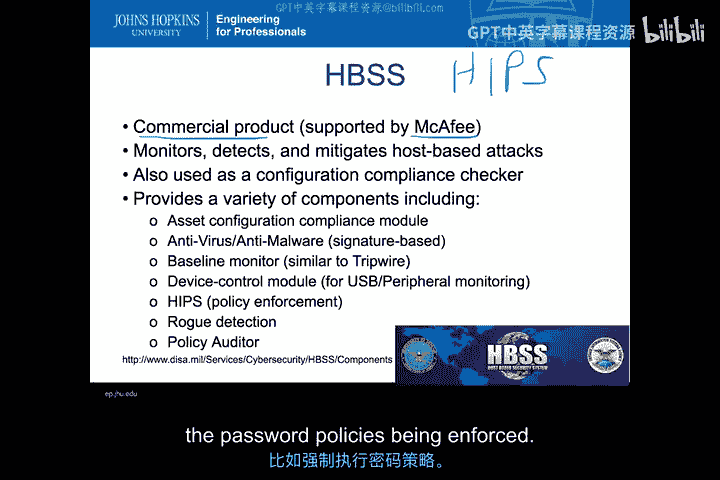

在本课程的项目中，我们将重点使用 OSSEC。这是一个集成了本模块讨论的多种恶意软件和攻击检测功能的主机入侵检测系统。OSSEC 提供完整性检查、rootkit检测、基于时间的警报、主动响应和Windows注册表监控等功能。从其核心来看，OSSEC 完全符合我们对一个入侵检测系统的所有标准描述。

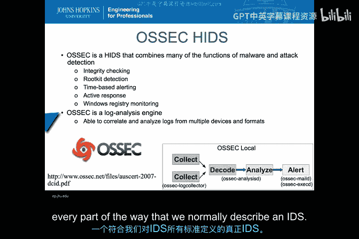

OSSEC 的工作流程包括：日志收集器、将日志解码为特定元素的解码器、综合分析来自不同收集器日志的分析器，以及通过邮件等方式发出警报的警报功能。它正是我们通常期望看到的那种入侵检测系统。

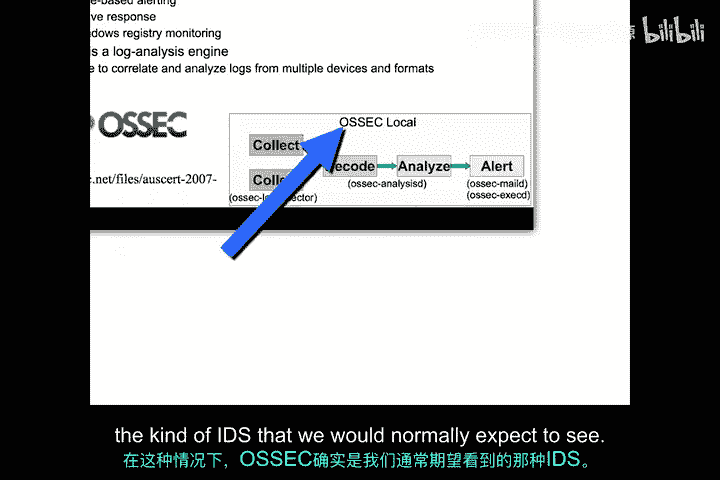

## 总结 📝

本节课中，我们一起学习了主机入侵检测中关于恶意软件检测的核心内容。我们了解到：
*   恶意软件检测分为**静态检测**（如传统防病毒扫描）和**动态检测**（观察运行行为）。
*   **动态检测**有两种主要方法：在**沙箱中观察**和在**正常环境中监控**。
*   检测技术可分为**基于特征（误用）的检测**和**基于异常的检测**，而实际产品多采用**混合系统**以取长补短。
*   我们探讨了如序列时间延迟检测器、StackGuard等具体技术实例，以及当前的研究趋势。
*   最后，我们介绍了HBSS等商业产品和OSSEC这款我们将要实践的开源HIDS工具。

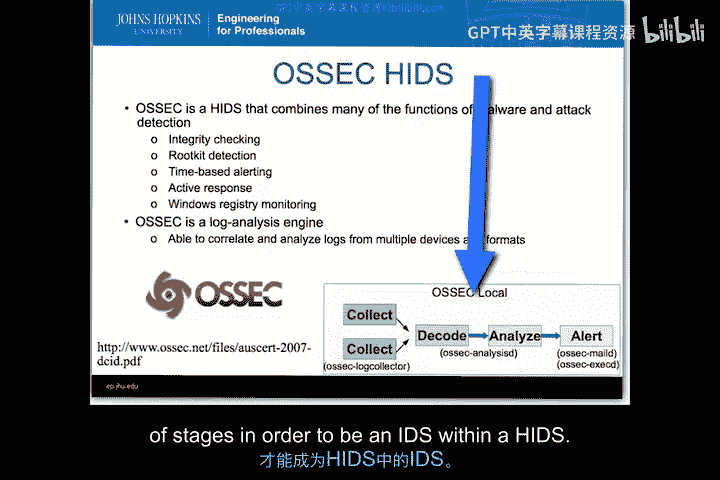

现在，你应该能够理解像Tripwire这样的基于目标的HIDS与像OSSEC这样更动态的HIDS之间的区别。尽管实现方式多种多样，但请记住，一个入侵检测系统本质上都是围绕**收集数据 -> 分析 -> 响应**这个过程来构建的。