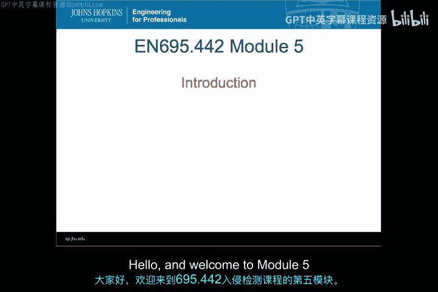
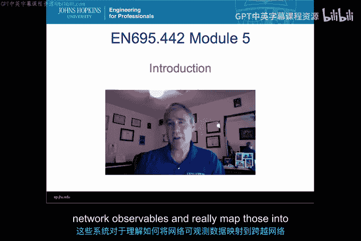
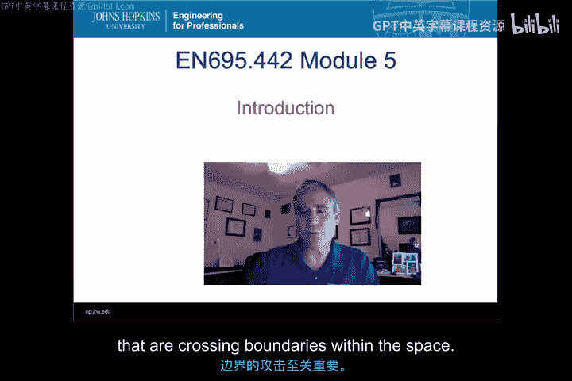
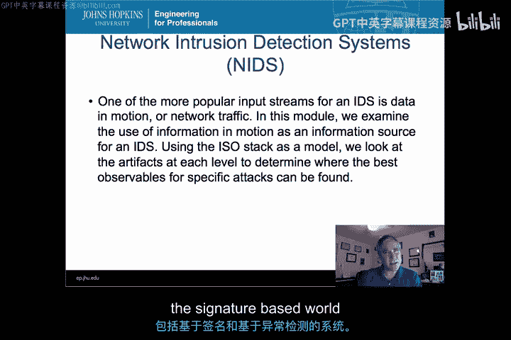
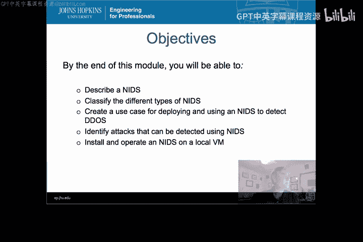

# 016：网络入侵检测与防御系统导论 🛡️



在本模块中，我们将开始学习网络入侵检测系统（NIDS）和网络入侵防御系统（NIPS）。这些系统对于理解如何将网络可观测数据映射到跨越网络边界的各类攻击至关重要。

## 概述





网络入侵检测系统是开源和商业安全领域中最常见的一类系统。它们不仅用于监控外部流量进入内部网络，也日益用于检测内部信息外泄，例如恶意软件外传数据或内部人员发送信息到外部系统。

我们将使用七层ISO模型作为框架，来梳理NIDS可观测数据的来源。我们会探讨每一层产生的数据痕迹，并介绍一些基于特征检测和异常检测的常见NIDS产品。

## 学习目标

在本模块结束时，你将能够：
*   准确描述什么是NIDS。
*   对现有的不同类型NIDS进行分类。
*   为应用NIDS开发一个实际用例，以区分DDoS攻击和突发流量。
*   识别NIDS能够检测哪些类型的攻击。
*   在已搭建的虚拟机上安装并运行你自己的NIDS。

## NIDS简介与重要性

网络入侵检测系统是目前最流行的安全监控工具之一。它们主要监控流入网络的流量，同时也越来越多地用于监控内部网络的信息外流，无论是通过恶意软件泄露，还是内部人员有意向外发送数据。

## 分析框架：ISO七层模型

为了系统地理解NIDS的可观测数据来源，我们将借助ISO七层模型。这个模型帮助我们清晰地定位网络活动中每一层产生的数据。

以下是ISO模型的七个层次及其简要说明：
1.  **物理层**：负责在物理媒介上传输原始比特流。
2.  **数据链路层**：在直接相连的节点间提供可靠的数据帧传输。
3.  **网络层**：负责在不同网络间进行数据包的路由和转发。
4.  **传输层**：提供端到端的可靠或不可靠数据传输服务。
5.  **会话层**：管理通信会话，控制对话的建立、维护和终止。
6.  **表示层**：处理数据格式转换、加密与解密。
7.  **应用层**：为应用程序提供网络服务接口。

## NIDS的工作原理与类型

NIDS通过分析网络流量来识别可疑模式或违反安全策略的行为。根据检测方法，主要分为两大类：

以下是两种主要的NIDS检测类型：
*   **基于特征的检测**：系统维护一个已知攻击模式的数据库（特征库），通过将网络流量与这些特征进行匹配来发现攻击。其核心逻辑可以简化为：
    ```python
    if network_packet matches known_attack_signature:
        generate_alert()
    ```
*   **基于异常的检测**：系统首先建立网络正常行为的基线模型。当观测到的流量显著偏离这个基线时，则触发警报。其核心思想是：
    ```
    警报条件：当前流量模式 ∉ 正常行为基线
    ```

## 总结





本节课我们一起学习了网络入侵检测系统的基础知识。我们了解了NIDS的重要性及其监控内外流量的双重角色，引入了ISO七层模型作为分析框架，并探讨了基于特征和基于异常这两种核心的检测原理。在接下来的课程中，我们将深入探讨如何具体应用这些知识来分析和应对网络威胁。