# 017：网络入侵检测系统原理 🔍

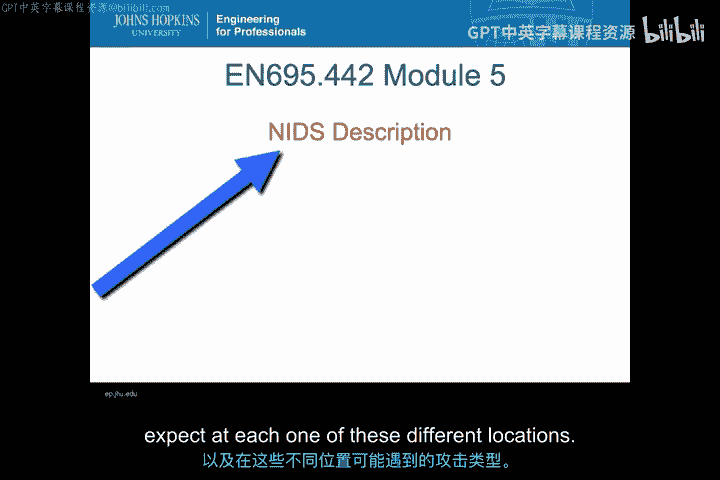

在本节课中，我们将学习网络入侵检测系统的基本原理。我们将重点探讨NIDS从何处获取信息，即在网络协议栈的各个层级中，可以观察到哪些数据，以及每个层级可能存在的攻击类型。

## 网络入侵检测系统概述

网络入侵检测系统，顾名思义，使用网络数据作为检测安全事件的观测数据源。其核心在于分析“传输中的数据”。网络入侵防御系统也使用传输中的数据，但还能对网络流量进行响应，例如阻断或修改。

NIDS之所以流行，主要原因在于网络是监控外部攻击进入组织或内部数据外泄的绝佳“咽喉点”。与之前模块讨论的HIDS相比，NIDS的部署工作量通常更小。

NIDS可以使用**基于特征的检测**或**基于异常的检测**作为其分类器，将观测数据转化为安全事件。我们将在本模块中讨论这两种类型的NIDS系统。

## NIDS的优势

使用基于网络的观测数据源有许多优势：
*   **性能成本低**：如果使用被动的网络嗅探器，不会对需要同时执行其他功能的主机造成额外负担。
*   **隐蔽性强**：NIDS通常依赖网络上的被动链路或分路器，入侵者更难发现并攻击这些系统以使其失效。
*   **干扰小**：通常与用户应用程序交互很少，不会妨碍正常业务（后续会讨论一些例外情况）。
*   **易于发现特定攻击**：尤其擅长识别跨越多台主机的聚合性攻击，以及可能根本不会到达主机的畸形数据包攻击。
*   **检测资源耗尽攻击**：是检测网络拒绝服务攻击等网络资源耗尽攻击的最佳位置。

## NIDS的观测数据源：网络协议栈

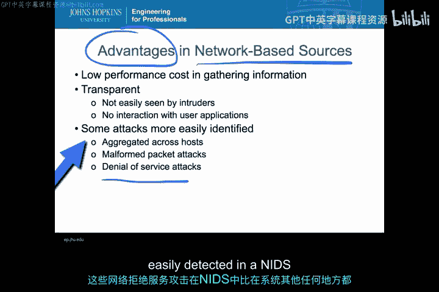

NIDS的观测数据主要来源于网络协议栈。我们将以TCP/IP协议栈为例进行讲解。协议栈的每一层都对下层的数据包进行封装，某一层的信息对上一层而言只是数据载荷。

对于NIDS而言，协议栈的每一层都至关重要。我们将分别讨论物理层、数据链路层、网络层、传输层和应用层，看看在每个层级能观察到哪些数据。

> **重要区分**：NIDS与HIDS的区别不在于IDS是否运行在主机上（它们总是运行在某种计算机上），而在于NIDS使用的信息是“传输中的数据”，即流经网络链路的数据，而不是主机上运行的进程相关的审计文件和日志文件。

## 协议栈模型：OSI vs. TCP/IP

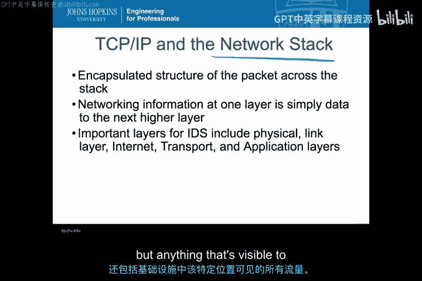

我们需要区分标准的七层OSI模型和通常实现的TCP/IP协议栈。下表列出了OSI模型的各层，这个七层模型是理解NIDS的关键。

| OSI 层 | 名称 | 主要功能/协议示例 |
| :--- | :--- | :--- |
| 7 | 应用层 | HTTP, FTP, SMTP |
| 6 | 表示层 | 数据格式转换、加密（如SSL/TLS） |
| 5 | 会话层 | 建立、管理、终止会话（如VPN） |
| 4 | 传输层 | TCP, UDP |
| 3 | 网络层 | IP, ICMP |
| 2 | 数据链路层 | Ethernet, Wi-Fi (MAC) |
| 1 | 物理层 | 电缆、光纤、无线电波 |

在实际的TCP/IP实现中，这些层级的处理方式可能因操作系统而异。例如，网络接口卡通常在数据链路层处理大量工作；网络层、传输层和会话层在TCP/IP栈中常常紧密耦合；表示层和应用层也经常混合在一起。

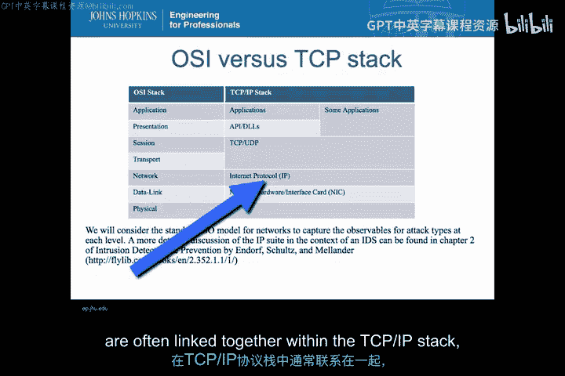

尽管如此，为了清晰地识别观测数据，我们将分别讨论每一层。但请记住，根据具体网络设备的实现，观测数据可能跨越不同的实现部分，并不像OSI模型描述的那样界限分明。

## 各层级的观测数据与攻击

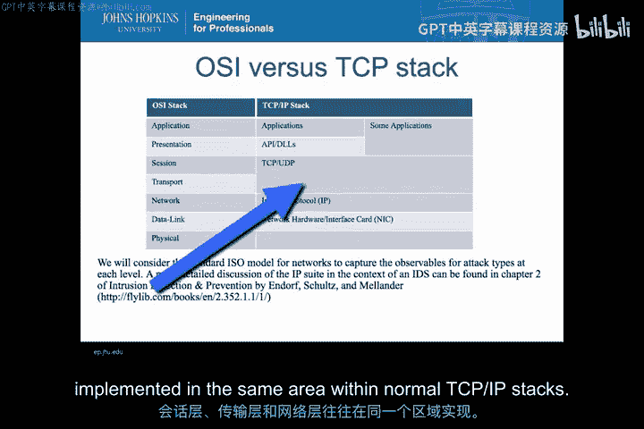

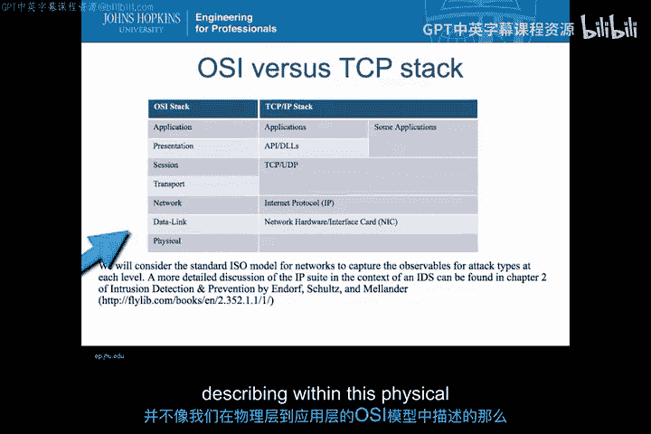

上一节我们介绍了网络协议栈的模型，本节中我们来看看每一层具体能提供哪些观测数据，以及可能存在的攻击类型。

### 物理层

物理层涉及网络连接或数据传输的物理特性，无论是光纤、同轴电缆还是无线信号。这一层处理的是模拟信号，而非数字数据包。

**可获取的观测数据**：
*   物理位置信息
*   线路中断或搭接窃听
*   环境参数（如温度、湿度）

**检测方式**：需要能采样网络环境物理特性的传感器，例如温度传感器、基于时间的传感器，或能测量线路阻抗以检测中断或搭接的设备。

**可检测的攻击**：针对物理层的攻击，例如线路搭接窃听、对空间的被动监控、切断线路、非法侵入机箱或主机内部进行物理篡改。

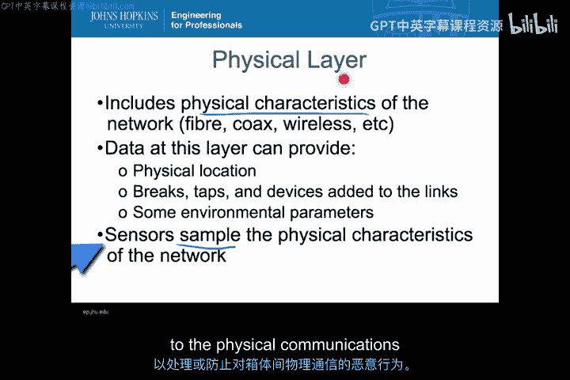

### 数据链路层

数据链路层是我们首次获得数字数据的地方。它关注点对点通信，负责比特流在物理介质上的编码。

**可获取的观测数据**：
*   介质访问控制地址
*   链路速率
*   错误校正信息
*   基本的节点标识

**检测方式**：传感器在此层查看设备间传输的低级比特流和编码。

**可检测的攻击**：各种欺骗攻击，例如将设备接入网络并欺骗交换机进行认证、在无线网络中接入恶意接入点。攻击者可能在此层进行中间人攻击或接管连接。

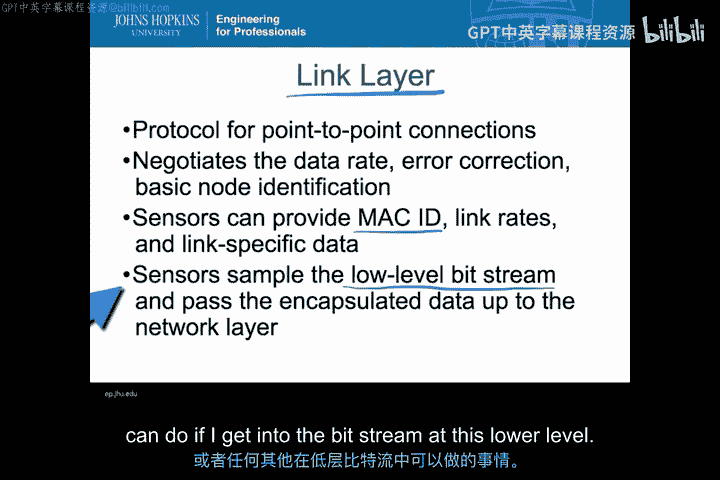

### 网络层

网络层（如IP层）负责数据包的多路复用、路由和排序，提供端到端的连接。

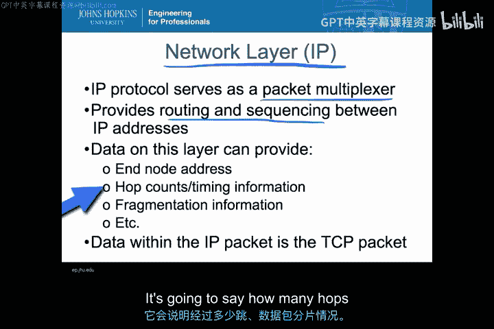

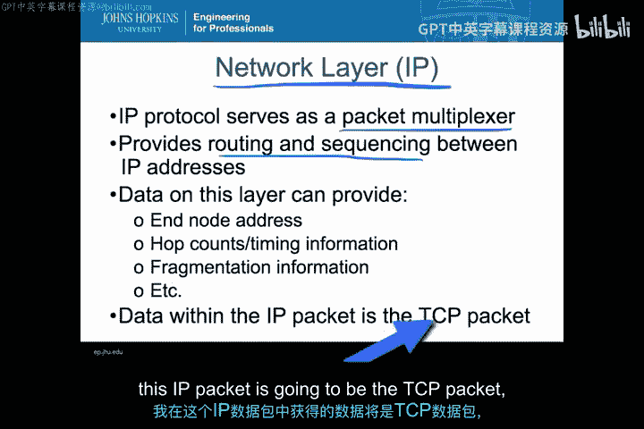

**可获取的观测数据**：
*   源IP地址和目的IP地址
*   路由度量和统计信息
*   时间戳和生存时间值

**检测方式**：分析IP数据包头部信息。

**可检测的攻击**：IP地址欺骗、利用跳数和计时信息制造路由异常、数据包分片与重组攻击等一切可以在IP头部进行的攻击。

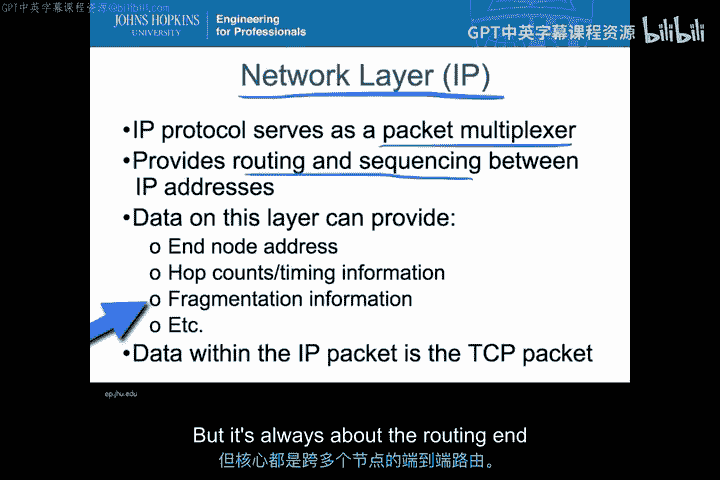

### 传输层

传输层提供端口和协议信息，首次将端到端的网络流量与特定的应用程序关联起来。

**可获取的观测数据**：
*   端口号（如 `80`, `443`, `25`）
*   协议类型（如 `TCP`, `UDP`）

> **重要提示**：端口号并不绝对指示接收方使用的应用程序。发送方可能有假设（如发往端口25的数据是邮件），但接收方可以将该端口映射到任何应用程序。发送数据通常使用随机的高位端口号，因此仅凭传输层信息很难确定发送方应用程序。

**可检测的攻击**：与端口重定向和协议滥用相关的攻击。例如，攻击者可能将发往端口80（HTTP）的流量劫持到另一个恶意应用程序，实施中间人攻击。

### 应用层、表示层和会话层

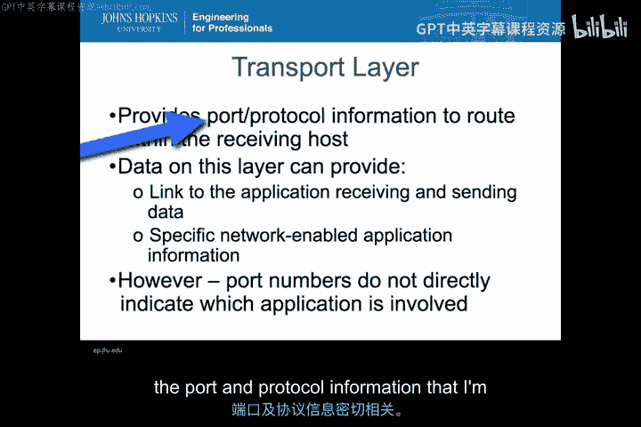

应用层是信息载荷的最终接收点，包含非常具体和详细的应用程序数据。

**可获取的观测数据**：
*   应用层协议数据（如HTTP请求头、SMTP命令）
*   实际的用户数据或命令

**关联层级**：
*   **表示层**：通常与应用层紧密关联，负责数据格式转换（如字符编码、加密），使数据适合应用程序处理。
*   **会话层**：通常处理身份验证、加密和会话管理。VPN通常在此层操作。

**检测方式**：深度解析应用层协议的内容。

**可检测的攻击**：针对特定应用协议的漏洞利用，例如SQL注入、跨站脚本、缓冲区溢出等。

## 其他网络数据源

除了协议栈各层的数据，NIDS还有另一类重要的输入：**网络日志文件**。

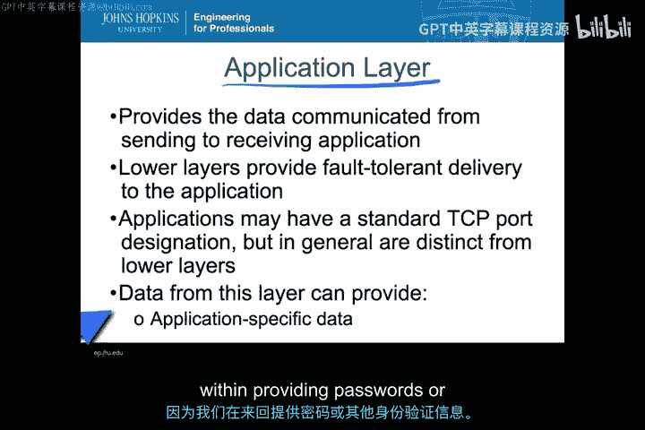

这些数据并非严格属于IP协议栈，但来自路径上的网络设备，对IDS非常有用：
*   **路由器/交换机日志**：可以指示针对网络基础设施本身的攻击。
*   **流数据**：如NetFlow，记录网络流量的统计信息。
*   **缓存文件和历史数据**：指示网络历史状态和统计变化。

近年来，像RADIUS认证日志等也被整合进NIDS系统中。

## 总结

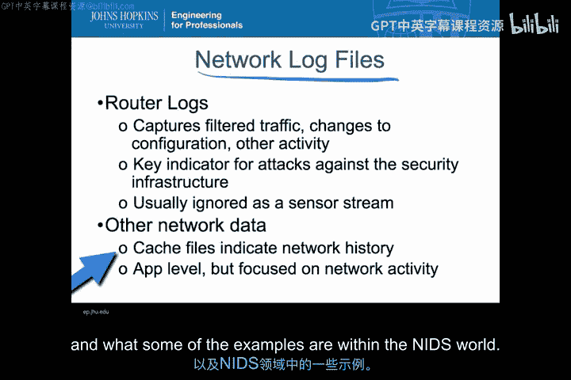

本节课中，我们一起学习了网络入侵检测系统的基本原理。我们了解到NIDS的核心是分析“传输中的数据”，并深入探讨了其观测数据的主要来源——网络协议栈的各个层级（物理层、数据链路层、网络层、传输层、应用层）。每一层都提供了独特的观测数据，并能帮助检测特定类型的攻击。此外，网络设备日志等辅助数据源也增强了NIDS的检测能力。掌握了这些基础，在接下来的课程中，我们将深入探讨NIDS如何利用这些信息来具体识别攻击，并分析实际案例。