# 018：NIDS类型与典型系统 🛡️

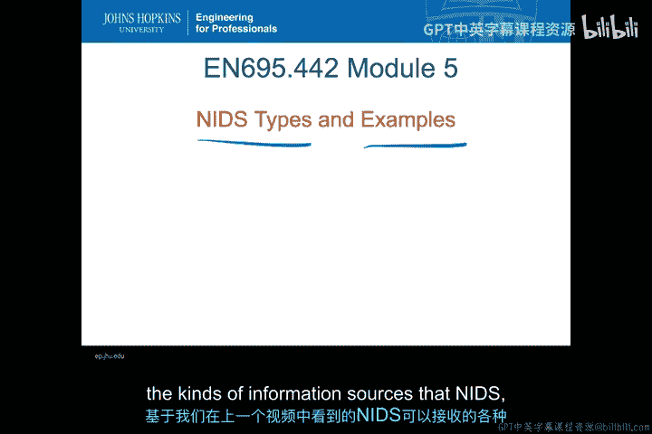

在本节课中，我们将学习网络入侵检测系统（NIDS）的不同类型及其典型代表。我们将探讨NIDS如何根据不同的网络流量特征进行分类，并了解几种主流的开源与商业NIDS系统。

## 网络流量类型与可观测数据编码 🔍

上一节我们介绍了入侵检测系统（IDS）的核心是一个对可观测数据进行分类的分类器。本节中，我们来看看在网络流量分析中，具体有哪些可观测数据需要区分。

网络流量类型主要可以分为TCP和UDP这两种主要的正常流量类型。在TCP和UDP层面之下，还需要考虑以下因素：

*   **明文与加密/隧道传输**：对于明文传输，可以进行深度包检测（DPI），查看载荷内容。对于加密或隧道传输，只有两种选择：1）仅查看头部信息；2）通过代理（如SSL代理）解密流量，以便进行检测。
*   **开放协议与专有协议**：开放协议（如HTTP、HTTPS）是公开的，易于分析。专有协议（如某些视频流协议）可能包含额外的加密层或特定的应用数据格式，使IDS难以解析其内容。
*   **端口使用方式**：
    *   **固定端口**：使用端口号来识别关联的应用程序。
    *   **混合端口**：同一应用程序可能使用多个已知端口（如Web服务使用80和443端口）。
    *   **随机端口**：需要使用载荷信息，而非端口信息，来识别攻击特征。
*   **流量分类依据**：可以根据端口、载荷特征或其他行为指标对网络流量进行分类。

所有这些因素都将帮助我们理解如何对可观测数据进行编码，以便将网络流量类型转化为分类器可以处理的形式。

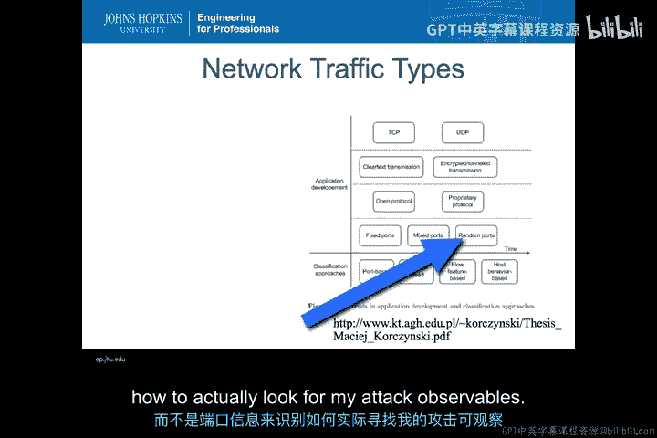

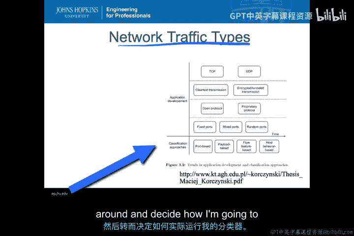

## 分类器运行方式 🧠

现在我们已经将流量编码成可以进行网络分类的形式，接下来需要决定如何运行分类器。

分类可以基于内容进行，也可以独立于内容进行。

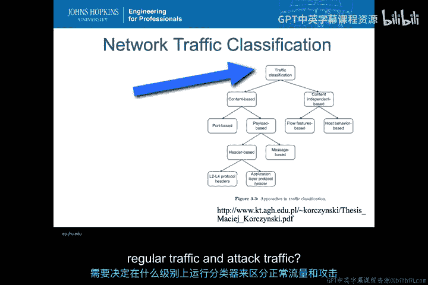

*   **基于内容的分类**：
    *   **基于端口**：严格依据端口信息来区分攻击流量和非攻击流量。
    *   **基于载荷（深度包检测）**：深入分析数据包载荷内容。这可以进一步分为：
        *   **仅查看载荷头部**：获取协议层或应用层信息。
        *   **查看整个载荷**：例如，在电子邮件或网页下载中查找恶意软件。
*   **内容无关的分类**：可以查看流特征（如NetFlow）或其他更偏向网络流量元数据的行为特征。

在以上每个领域，我们都需要决定在哪个层面进行常规流量与攻击流量的分类。

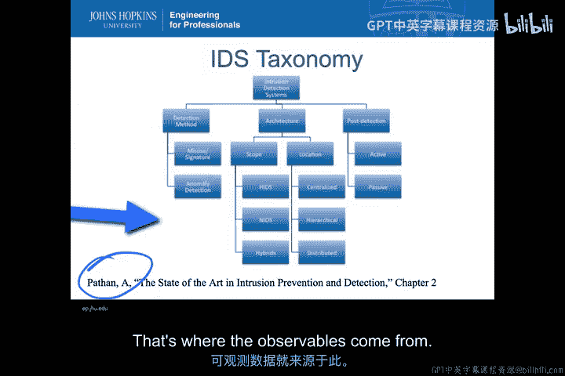

## NIDS的分类学与部署位置 📊

根据本周阅读材料《入侵防御与检测技术现状》第2章中的分类法，网络入侵检测系统（NIDS）在架构上是固定的（即其范围是网络流量），但其他方面存在多种变体。

以下是NIDS可能的不同变体：

*   **架构**：可以是集中式、分层式或分布式。
*   **检测后行为**：可以是主动的（IPS）或被动的（IDS）。
*   **检测方法**：可以是基于签名或基于异常检测。

NIDS的部署位置也直接影响其检测能力。

以下是常见的NIDS部署位置及其价值：

*   **防火墙外部**：监控所有进出流量，无论防火墙是否过滤。有助于了解被防火墙阻挡的攻击类型。
*   **DMZ（非军事区）内部**：监控流向公共服务器（如Web、邮件服务器）的允许流量。可以区分访问服务的正常流量与试图破坏DMZ内主机安全的攻击流量。
*   **内部局域网（LAN）**：监控内部网络流量。有助于检测不应存在的出站流量（如信息泄露、已感染主机外联），以及防范内部威胁（如内部主机间的攻击）。
*   **IDS管理器**：在企业基础设施中，可以将多个NIDS的警报汇总到一个安全事件管理（SIEM）系统。IDS管理器可以接收警报并向所有NIDS推送配置，实现跨系统的协调。

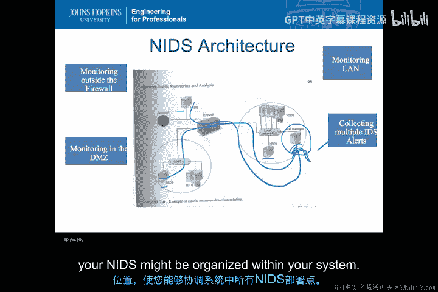

## 典型NIDS系统介绍 🖥️

接下来，我们具体看看几种典型的NIDS系统。

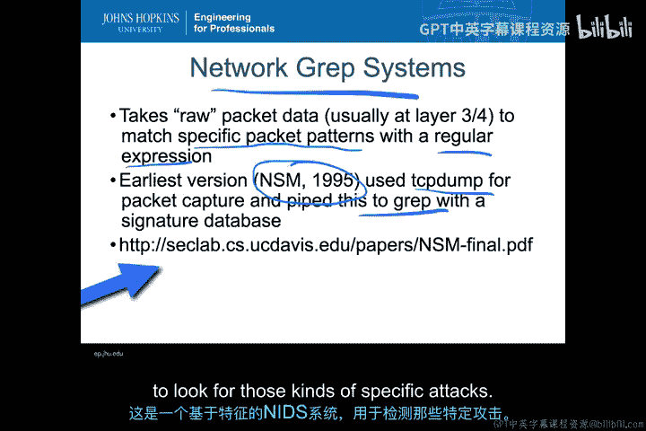

### 早期系统：网络Grep系统

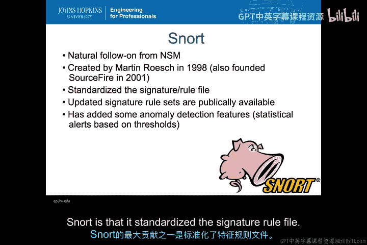

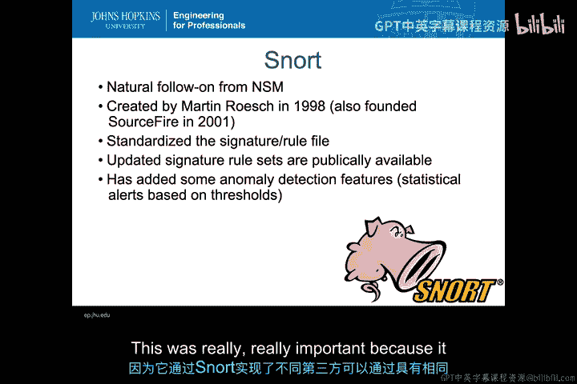

最早的IDS类型是网络Grep系统。这类系统通常在网络第3/4层获取原始数据包数据，并使用正则表达式匹配特定的数据包模式。1995年的NSM（Network Security Monitor）是早期版本之一，它将`tcpdump`的输出通过管道传递给`grep`程序，并与签名数据库进行匹配。这种基于签名的NIDS模式是Snort等系统的基础。

### Snort

Snort是NSM的自然延续，由Martin Roesch于1998年创建，他后来在2001年创立了Sourcefire公司。Snort的一个重大贡献是标准化了签名规则文件格式，这使得第三方可以为免费的Snort安装提供定制化的规则文件。

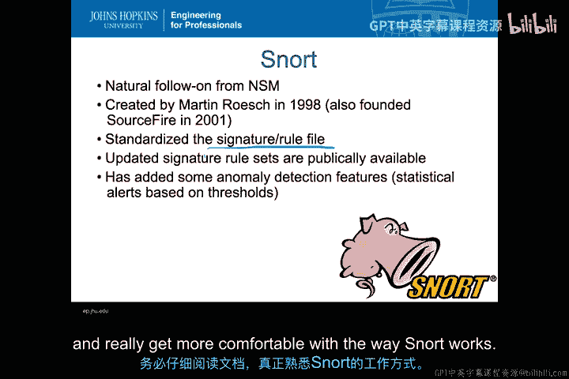

Snort（免费版）和Sourcefire（商业版）的规则集都得到了更新，不仅包含基于签名的检测，还加入了一些基于异常检测的功能，主要是基于阈值的统计警报（例如，单位时间内Web请求过多、来自某主机的流量异常）。在课程练习中，你将获得更多使用Snort及其规则文件的经验。

### 其他开源方法与框架

除了Snort，90年代中期还出现了其他一些有趣的方法。

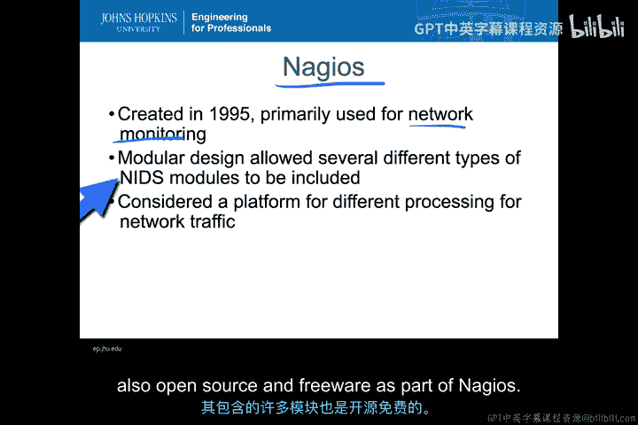

*   **Nagios（1995年创建）**：最初用于网络监控，采用框架式方法。它是一个平台，允许你以任何方式使用网络可观测数据。你可以添加专门用于NIDS的模块。Nagios至今仍非常活跃，在研究社区中常被用作新NIDS模块的原型平台。
*   **Bro（现称Zeek）**：由Vern Paxson于1996年开发，此后一直积极开发。与Nagios类似，它是一个插件模块框架，但Bro更专为入侵检测设计。其模块能很好地聚焦于检测问题。
*   **Suricata**：由开源信息安全基金会开发。它也使用类似Snort的标准签名文件，但支持更全面的基于签名和异常的检测模块。Bro和Suricata都包含在Security Onion安全发行版中。

### 商业系统：以思科为例

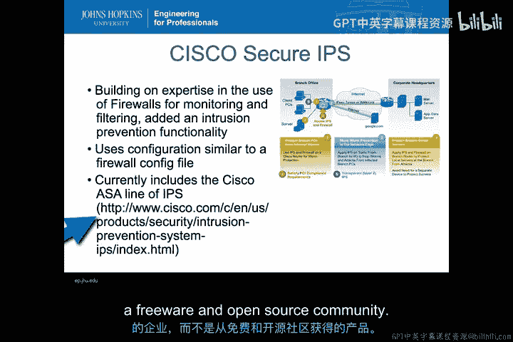

像思科这样的公司很快对不断增长的入侵检测市场产生了兴趣。凭借在防火墙监控和过滤方面的专业知识，增加入侵防御和检测功能对该领域来说是顺理成章的。

思科当前的产品线包括ASA系列的IPS产品。思科安全IPS是一个很好的例子，展示了基于路由和防火墙技术的商业IPS解决方案，如何能在高速企业级NIDS/NIPS中高效运行，为那些需要技术支持和更健壮产品的企业提供选择。

## 总结 📝

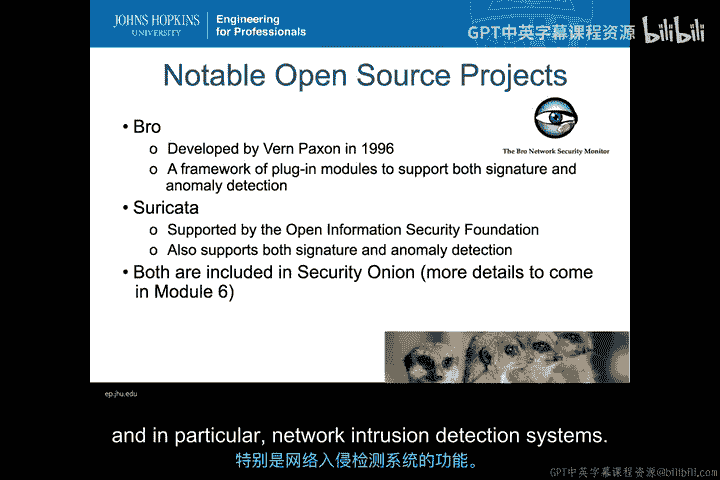

本节课中，我们一起学习了网络入侵检测系统（NIDS）的核心概念。我们探讨了NIDS如何根据网络流量类型（如TCP/UDP、明文/加密、端口使用）对可观测数据进行编码，并介绍了分类器基于内容或独立于内容的不同运行方式。我们还了解了NIDS在分类学上的不同变体（架构、检测方法等）以及部署位置（防火墙外、DMZ、内网）对其功能的影响。最后，我们回顾了几种典型的NIDS系统，包括早期的网络Grep系统、流行的开源系统Snort、Bro、Suricata和框架Nagios，以及思科为代表的商业解决方案。理解这些类型和系统是构建有效网络防御的基础。