# 020：NIDS可检测的攻击类型 🔍

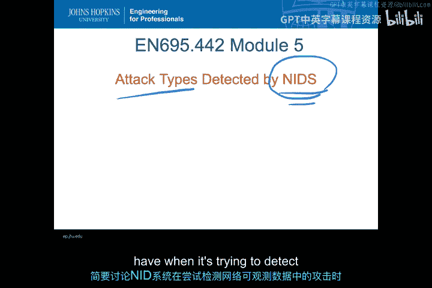

在本节课中，我们将学习网络入侵检测系统（NIDS）能够检测的常见攻击类型，并探讨NIDS在实际部署和运行中面临的主要挑战。

---

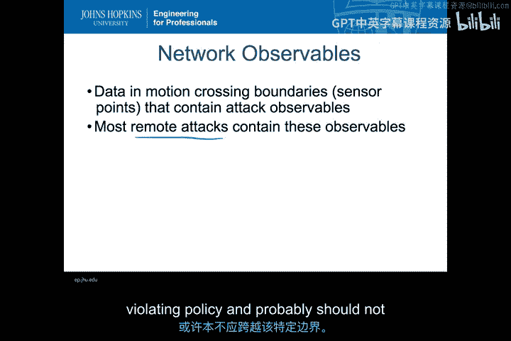

## 网络攻击与网络可观测性

上一节我们介绍了NIDS的部署位置，本节中我们来看看NIDS具体能检测哪些攻击。首先需要记住，网络可观测性关注的是**跨越边界**的、**动态传输**的数据。这些数据流经网络传感器点，其中可能包含攻击的可观测迹象。为了捕获所有目标攻击迹象，我们可能需要在网络基础设施的多个边界点部署传感器。

我们主要关注的是**远程攻击**。这类攻击的可观测迹象会随着动态数据流跨越网络边界。这包括外部攻击者入侵并违反协议，或者内部信息违反策略、跨越不应跨越的边界。

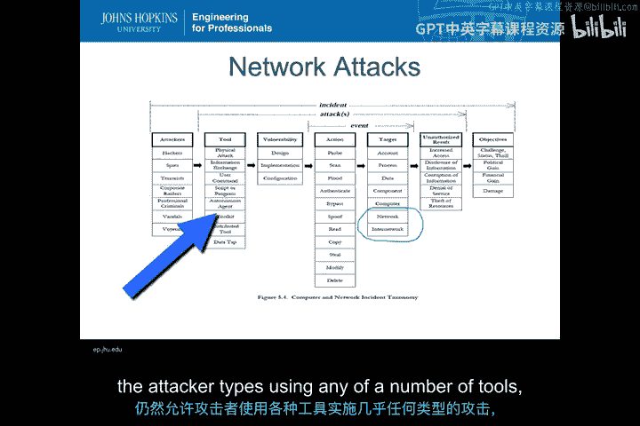

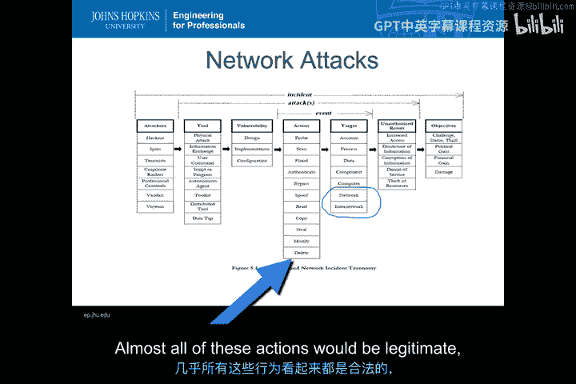

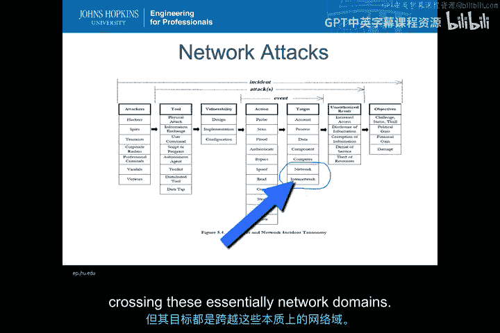

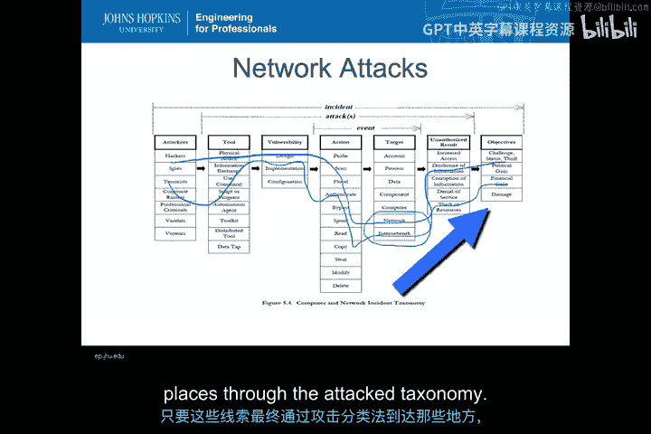

回顾我们在模块1中讨论的攻击分类法，NIDS的焦点主要在**目标环境**的网络和互联网部分。攻击者可以使用多种工具，利用各种漏洞，采取几乎任何行动，但其目标都是跨越这些网络域。未授权的结果和目标可以是任何形式。只要攻击路径最终穿过这些网络边界，NIDS就有可能检测到。

---

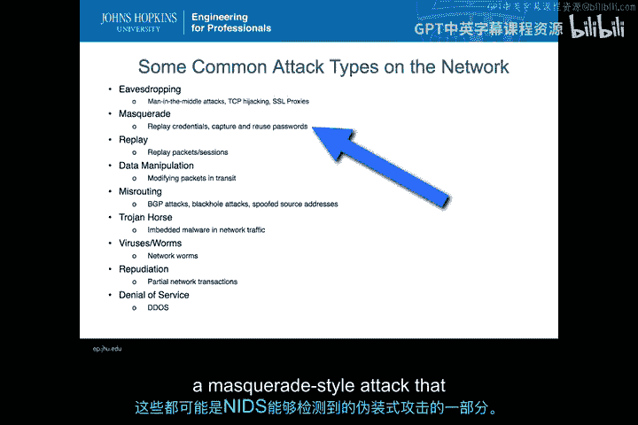

## NIDS可检测的常见攻击类型

以下是NIDS能够检测的主要攻击类别，它们几乎涵盖了我们在HIDS中讨论的所有攻击类型在网络层面的体现：

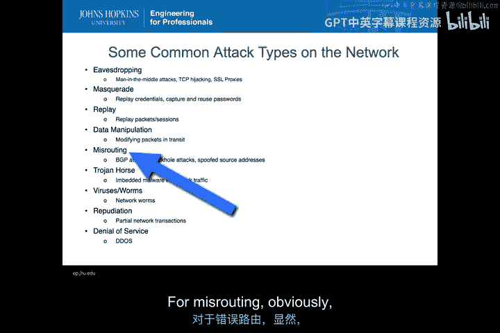

*   **窃听**：针对动态传输中数据的窃听。例如中间人攻击、TCP劫持、SSL代理等。
*   **伪装**：在网络中冒充他人或他物。这可能涉及重放凭证、捕获并重用密码，或违反OSI模型中会话层的认证或加密机制。任何此类行为都可能构成伪装攻击。
*   **重放攻击**：捕获数据包或会话，然后在稍后时间或网络的不同位置进行重放。这允许攻击者将一处被授权的活动，在另一处未授权的地方重放。
*   **数据篡改**：在传输过程中修改数据包。即捕获数据包，更改其内容，然后重新发送出去。
*   **错误路由**：这显然是面向网络的攻击。包括BGP攻击、黑洞攻击、欺骗源地址等。攻击者通过操纵第三层的路由，使数据包经过特定路径，从而更容易实施窃听或伪装。
*   **病毒与蠕虫**：通过网络链路传播的恶意代码。NIDS可以通过检查数据包**载荷**活动，或对网络流量的**报头**活动进行统计分析来发现它们。
*   **抵赖攻击**：攻击者进行某种网络交易，事后却声称该交易与特定个体无关。在网络中，常表现为发起部分交易但不完成，然而交易的效果却已产生。
*   **拒绝服务**：这是网络上最常见的大规模攻击类型之一，即DDoS或DoS攻击。

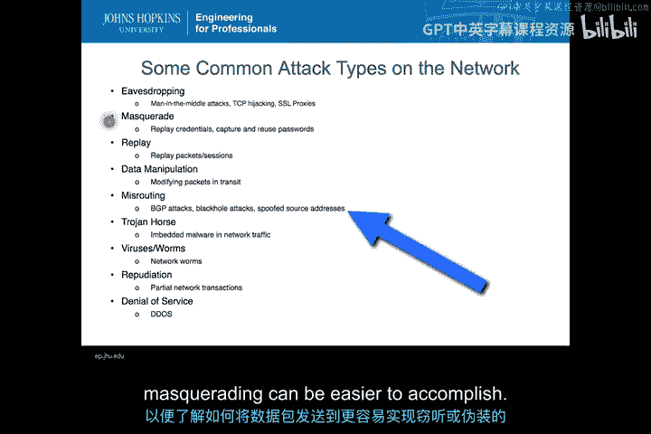

---

## NIDS面临的挑战

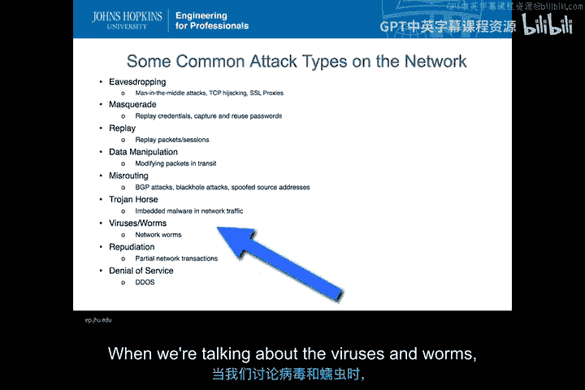

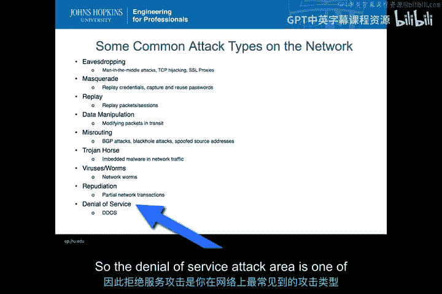

现在，让我们探讨使用网络数据源进行入侵检测时可能遇到的一些问题。我们已经讨论过拓扑和部署位置，以及加密流量，但还有其他挑战，包括时间同步、会话重组、流量体积和数据包分片。

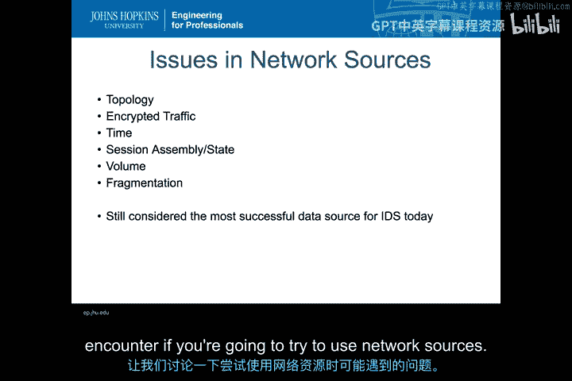

### 拓扑与传感器部署

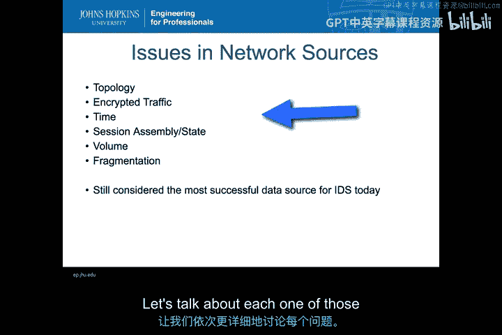

NIDS的首要挑战在于**拓扑**。为了检测攻击，必须有可观测迹象；为了获得可观测迹象，传感器必须放置在正确的位置。每个传感器只能捕获流经其所在网段的数据。虽然最常见的做法是将传感器部署在互联网网关，但这会使许多内部或后门攻击对NIDS完全不可见。

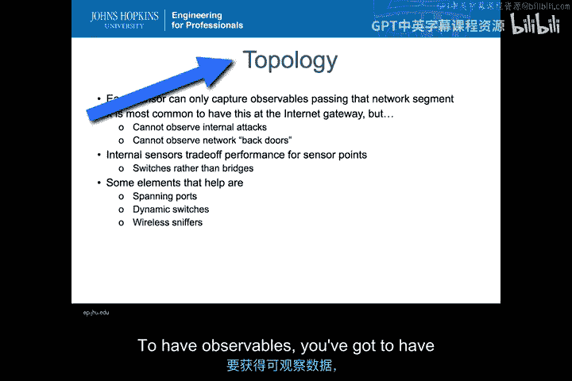

复杂的网络拓扑（如为了提高效率而设计的结构）可能会阻碍NIDS收集特定攻击所需的数据。内部传感器的部署需要在性能和覆盖范围之间权衡：有多少地方使用交换机而非网桥？内部网络有多少由完整路由器分隔的不同网段？每次跨越边界，如果希望完全覆盖该区域的威胁，就可能需要部署NIDS传感器。

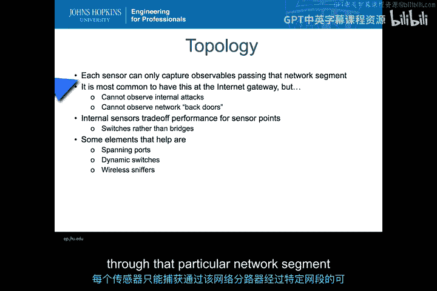

一些技术可以提供帮助，例如**生成树端口**、**动态交换机**和**无线嗅探器**。它们可以帮助构建一个独立的NIDS覆盖网络，这些NIDS系统可以相互协调，并与之前提到的SIEM系统协作，从拓扑的不同区域收集信息。但总体而言，拓扑对于NIDS来说仍然非常棘手，因为你必须识别所有边界，并据此部署传感器。

### 加密流量

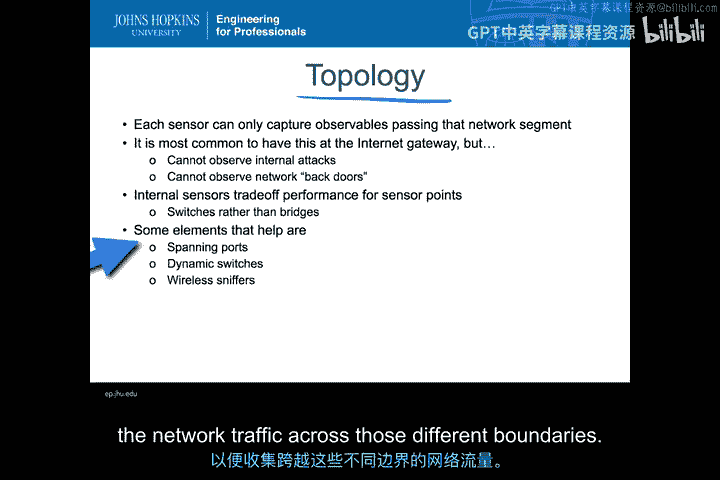

一个日益严重的问题是**加密流量**。历史上，尤其是在组织内部，网络流量大多是明文传输。因此，NIDS可以进行深度包检测、载荷检查，而无需担心加密问题。

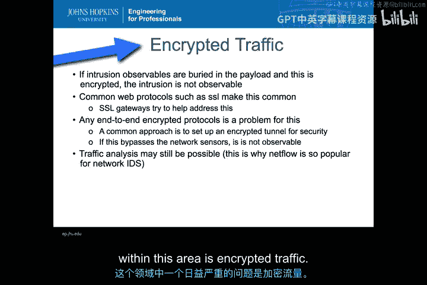

如果入侵迹象隐藏在**载荷**中，而载荷被加密，那么入侵将无法被观测到。如今，越来越多的网络协议（如**SSL/TLS**）使得加密在各类网络中无处不在。这给基于载荷的攻击检测带来了巨大困难。

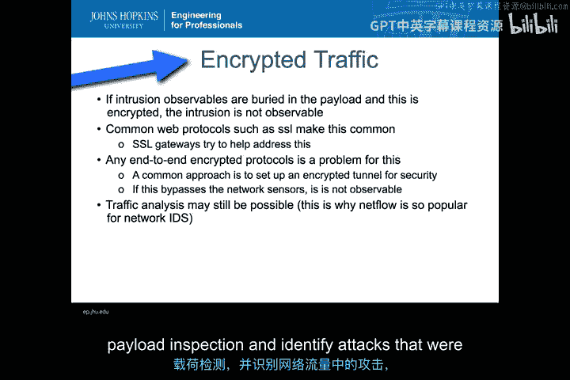

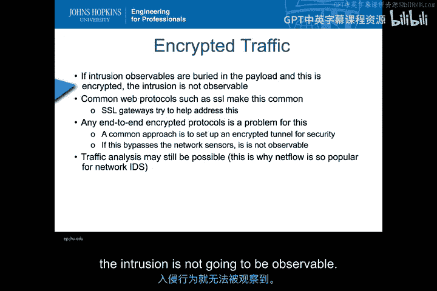

**SSL网关**作为一种代理，可以为进出组织的合法流量进行解密，供IDS和其他监控系统检查，这解决了一部分加密流量问题。但它主要针对特定的SSL流量，对于其他端到端的加密协议（如应用层到应用层的加密）则无能为力。对于这些情况，传统的网络检测只能在较低协议层（如链路层、IP层）工作，而无法检测载荷内部的攻击。这在数据库访问或任何专有协议中都会成为问题。

不过，并非所有希望都破灭了。即使载荷加密，仍然可以通过**元信息**进行大量的流量分析。这也是像**NetFlow**（我们后续会详细讨论）这类技术在网络IDS中如此受欢迎的原因之一。

### 时间同步

基于网络的IDS面临的另一个问题是**时间**。多个传感器点意味着可能有多个时钟。这些时钟可能同步，也可能不同步。为了理解流经一个网络元素的流量是否与流经另一个元素的流量相关（例如，消除重复数据以提升效率，或关联流量方向和路径），必须要有**同步的时钟**，以区分时间接近的事件和真正同时发生的事件。

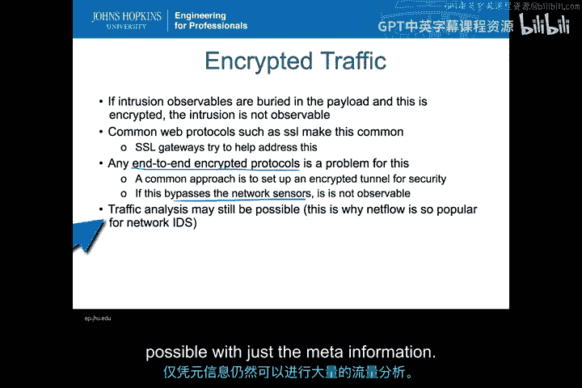

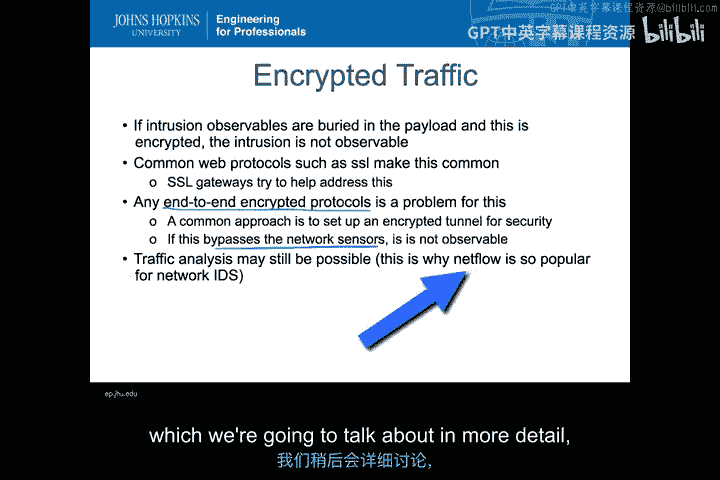

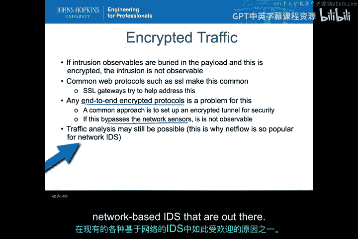

因此，时间同步对于协调多个NIDS传感器至关重要。如果只有一个NIDS，且所有事件都同步到一个主时钟，问题不大。但如果网络中有多个NIDS传感器点需要进行关联分析，那么**数据包间的时间戳**对于分析的准确性就非常重要。整个基础设施的时间必须频繁同步，并且要达到非常精细的容差。这听起来容易解决，但实际上是分布式网络IDS面临的最大问题之一。

### 会话重组

运行网络IDS的另一个难点是**会话重组**。大多数攻击并非以单个数据包的形式发生，但网络传感器一次只能看到一个数据包。因此，必须将数据包**重建**成会话，才能识别这些会话是否构成攻击。

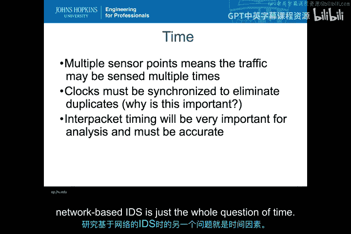

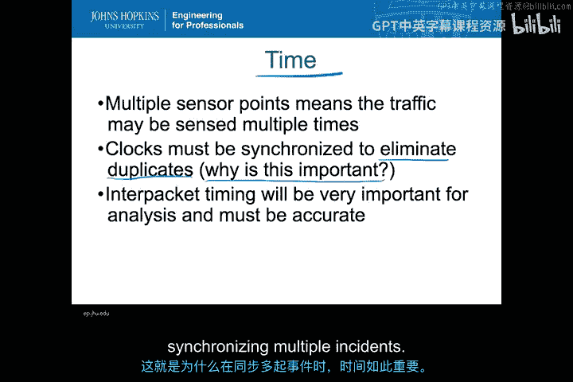

通常，IDS需要某种重建的会话来从特定数据包中识别攻击。传感器必须知道主机实际看到的内容。主机确实会将网络数据包组合成会话。因此，为了让IDS看到攻击，它必须模拟主机的行为，将数据包重新组合成会话。

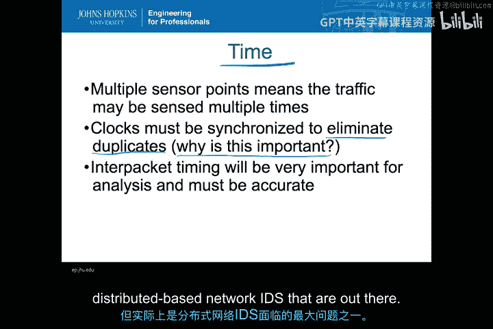

不幸的是，在数据流中间被动地进行重组会带来许多问题。会话可能因超时而中断，IDS可能丢失某些数据包，导致主机实际看到的和IDS看到的可能是两回事。因此，主机通常是进行个体检测的更好位置，而网络则是在跨越边界时进行安装和识别的更便捷位置。这是在为基础设施选择HIDS还是NIDS时必须做出的权衡之一。

### 流量体积

当然，IDS面临的另一个巨大问题是**流量体积**。问题是：你真的想分析所有流量吗？还是只想查看报头？或者只想查看像NetFlow这样的摘要信息？如果你想分析所有流量，就必须有办法存储它，必须能够以线速收集它，并且必须将所有流量送到分析引擎。在最坏的情况下，你需要复制所有流量以提供给IDS。

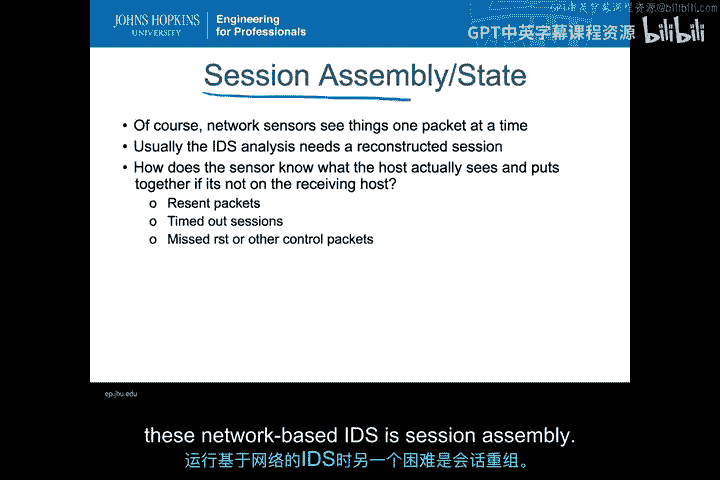

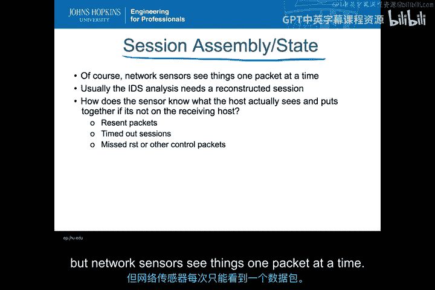

处理网络层的流量体积是NIDS面临而HIDS不那么突出的问题之一。在NIDS场景中，每次在基础设施中部署一个新的NIDS传感器，都必须将NIDS警报或原始数据移动到IDS的分析引擎部分。如何实现这一点，很大程度上取决于基础设施的细节和不同元素之间的带宽限制。

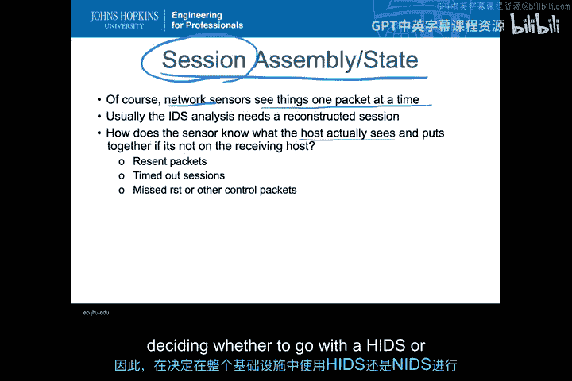

在**联邦式企业**中，这可能尤其困难。这些企业在大型、相对独立的实体之间存在低速链路，但又试图在所有联邦站点之间协调IDS。这时，必须对数据进行某种形式的**汇总**，以便在不同站点之间进行关联分析，最终确定是否能在整个联邦企业范围内识别出攻击。

### 数据包分片

对于基于网络的IDS，数据包的**分片**程度也很重要。如果一个基于网络的IDS逐包寻找模式，它需要数据包中有足够的数据来识别该模式。难点在于判断：是否需要将当前数据包与另一个数据包组合起来看？

如果数据包被分片到IDS无法在单个数据包中看到签名所需全部信息的程度，那么IDS就必须是**有状态的**。它必须收集多个数据包并重新组装它们，这类似于我们几页前提到的会话重组问题。攻击者经常利用跨越收集边界的分片来尝试绕过IDS检测或IPS过滤，使攻击到达目标端点。因此，IDS必须考虑到，当分片非常严重时（有时甚至IP报头本身也会被分片），必须进行基于状态的重组，才能生成IDS可用于识别攻击的可观测迹象。

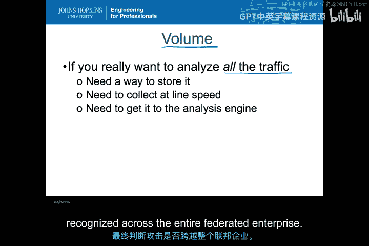

---

## 超越TCP/IP网络

最后，我们讨论的NIDS大多假设它们连接的是标准的TCP/IP网络。但需要理解，许多网络并不遵循我们讨论的ISO或TCP/IP模式。例如：蜂窝网络、Wi-Fi世界、电力网络、铁路信号系统、资金转账网络，甚至普通的电话电路，这些领域的数据传输也可能遭受攻击。

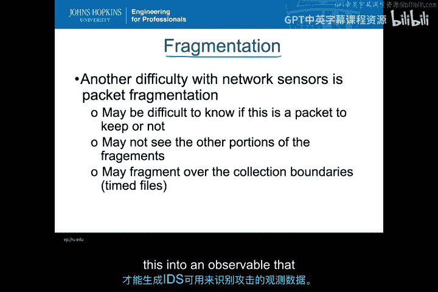

因此，重要的是要认识到，尽管我们主要讨论基于IP的网络，但这些**非IP网络**同样存在攻击可观测迹象。每一种网络都可能需要以不同的方式部署基于网络的IDS，以理解特定环境下的攻击形态。在电力领域，随着智能电网技术的发展，这一点尤为重要。人们非常担心智能电表和智能电网成为攻击端点，而攻击迹象将出现在这些运行于电力基础设施之上的网络中。能够从这些特定线路上读取可观测迹象的IDS，目前正在商业领域开发中。

在下一个模块（模块6）中，我们将更多地讨论蜂窝网络、Wi-Fi和无线空间系统。本质上，存在一个完整的**无线入侵检测系统**领域，它利用无线传输介质不仅来观测攻击，甚至可能预防攻击。

---

## 总结

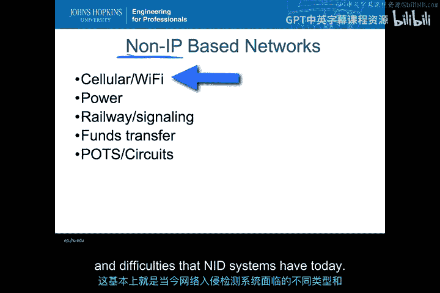

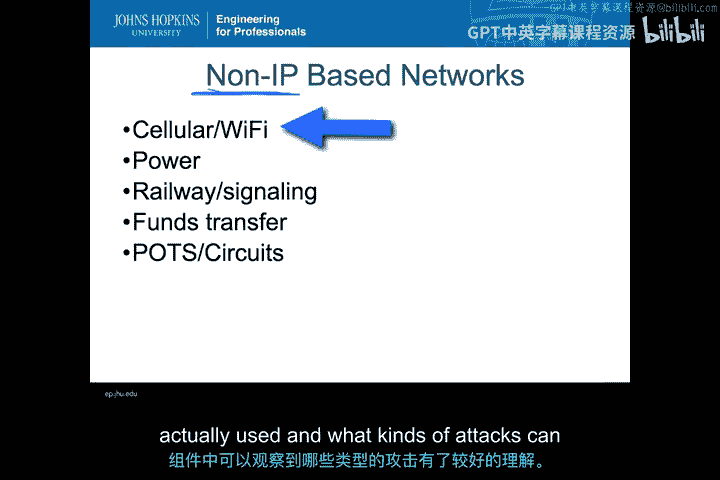

本节课中，我们一起学习了网络入侵检测系统（NIDS）能够检测的主要攻击类型，包括窃听、伪装、重放、数据篡改、错误路由、病毒蠕虫、抵赖和拒绝服务攻击。同时，我们也深入探讨了NIDS在实际部署中面临的诸多挑战：复杂的网络拓扑要求精心规划传感器位置；日益普遍的加密流量使得深度包检测变得困难；多传感器间的时间同步至关重要；从离散数据包中重组完整会话是一大难点；海量的网络流量对处理和存储构成压力；此外，数据包分片技术常被攻击者用来规避检测。最后，我们认识到NIDS的应用不仅限于传统的TCP/IP网络，在电力、无线等非IP网络中也同样重要且面临独特挑战。现在，你应该对NIDS产品的应用场景及其能够观测的攻击类型有了较好的理解。