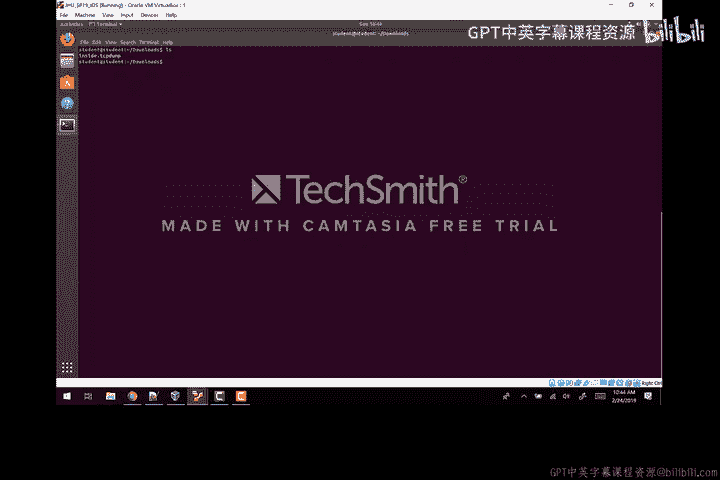
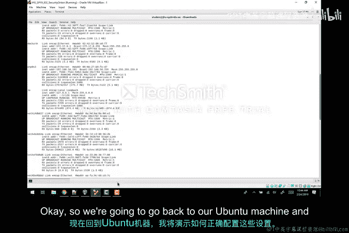
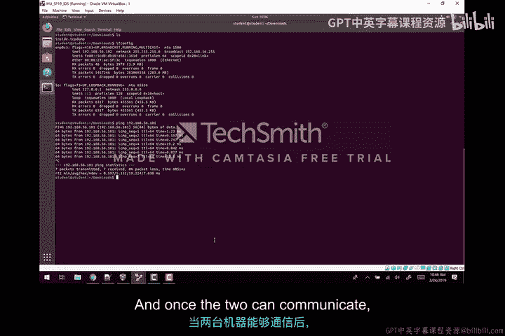
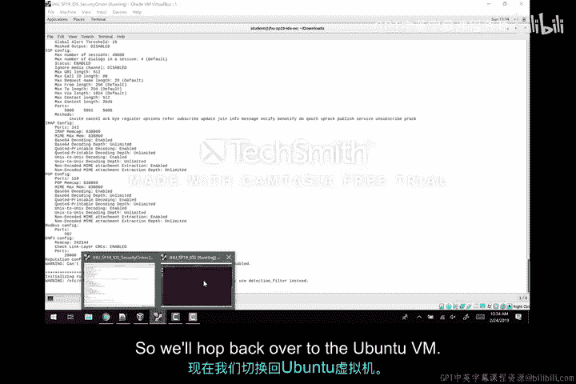
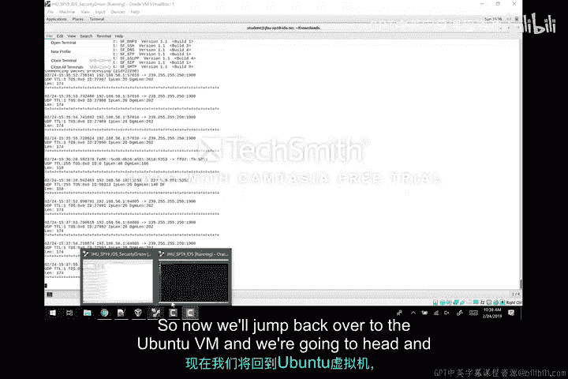
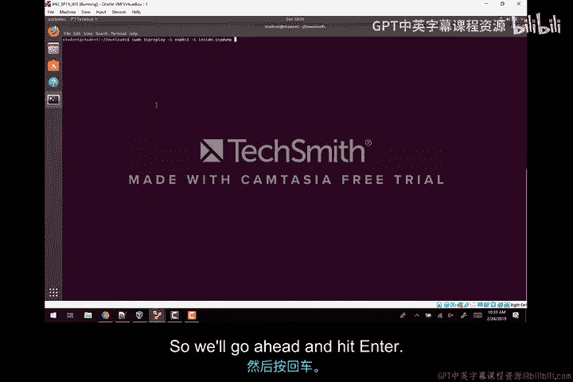
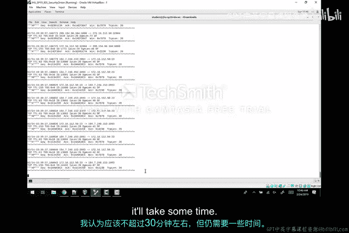
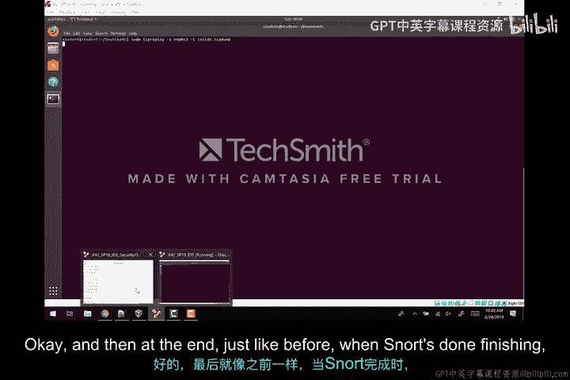
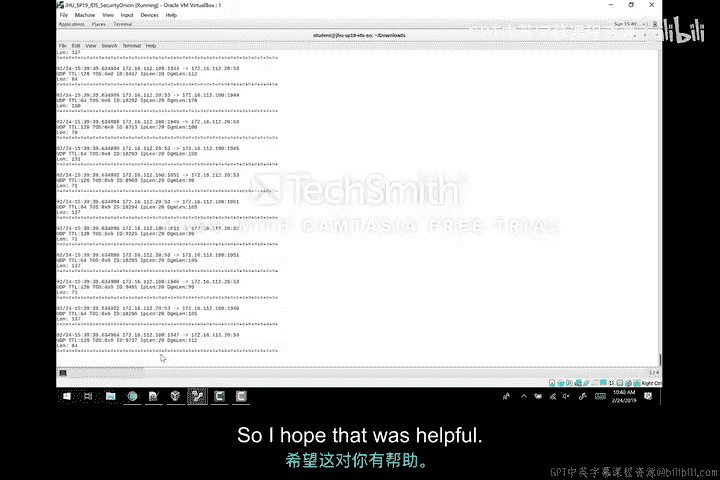

# 021：Snort进阶教程（补充资源）📡

在本教程中，我们将学习如何通过网络流式传输数据包，并使用Snort对它们进行分类。这是对之前第一个视频的补充和延续。



为了实现这个目标，我们将使用Ubuntu虚拟机，并利用TCPreplay工具将预先下载好的PCAP文件（`inside.tcpdump`）在网络中重放，以便另一台运行Snort的虚拟机（Security Onion）能够捕获并分析这些流量。

---

## 确保虚拟机网络连通性 🔗



上一节我们介绍了实验的整体目标，本节中我们来看看如何确保两台虚拟机能够相互通信。这是后续步骤的基础。

首先，在Security Onion虚拟机上，我们需要查看其网络接口的IP地址。执行命令 `ifconfig` 并找到主接口。在本例中，接口名称是 `enp0s3`（注意：在某些文档中可能称为 `eth0`，请根据实际情况替换）。

以下是具体步骤：
*   运行 `ifconfig` 命令。
*   找到 `enp0s3` 接口。
*   记录其IP地址，例如 `192.168.56.101`。

接下来，我们需要配置Ubuntu虚拟机，使其与Security Onion处于同一网络。

以下是配置Ubuntu虚拟机网络设置的步骤：
1.  进入网络连接设置。
2.  选择当前连接，点击“编辑”。
3.  切换到“IPv4设置”选项卡。
4.  将方法从“自动(DHCP)”改为“手动”。
5.  添加一个地址，例如将IP设置为 `192.168.56.102`（比Security Onion的地址大1）。
6.  设置子网掩码为 `255.255.255.0`（Class C）。
7.  点击“应用”。
8.  可以尝试断开并重新连接网络以应用新设置。



配置完成后，在Ubuntu终端再次运行 `ifconfig`，确认 `enp0s3` 接口的IP地址已变为 `192.168.56.102`。最后，使用 `ping 192.168.56.101` 命令测试连通性，如果收到回复，则表明网络配置成功。

此外，**一个关键的步骤**是确保两台虚拟机的网络适配器模式都设置为“仅主机模式”。请在VirtualBox或VMware的设置中，分别检查Security Onion和Ubuntu虚拟机的网络适配器，并确保选中“仅主机网络”。

当两台虚拟机可以互相通信后，我们就可以开始实验的核心部分了。

---

## 在Security Onion上启动Snort监听 🎧



上一节我们完成了网络配置，本节中我们来看看如何在Security Onion虚拟机上启动Snort，使其监听网络流量。

这个过程与之前从文件读取数据包类似，但这次我们将指定Snort监听的网络接口。

执行以下命令：
```bash
sudo snort -v -c /etc/snort/snort.conf -i enp0s3
```
*   `-v`：启用详细模式，以便查看数据包。
*   `-c /etc/snort/snort.conf`：指定Snort的配置文件路径。
*   `-i enp0s3`：**指定Snort监听的网络接口**，这里就是我们配置好的 `enp0s3` 接口。


运行此命令后，Snort需要一些时间来加载所有规则并启动。当看到类似“Commencing packet processing”的提示，并且显示正在监听 `enp0s3` 接口时，说明Snort已准备就绪。

---

## 使用TCPreplay重放网络流量 ⏩



在Snort准备就绪的同时，让我们切换到Ubuntu虚拟机。上一节Snort已开始监听，本节中我们来看看如何生成流量供其分析。

我们位于存放PCAP文件（`inside.tcpdump`）的目录中。我们将使用 `tcpdump` 工具来重放这个文件，模拟网络流量。

以下是使用TCPreplay重放流量的命令：
```bash
sudo tcpreplay -i enp0s3 -T --mbps=1000 inside.tcpdump
```
*   `-i enp0s3`：指定发送流量的出口网络接口。
*   `-T`：启用最高速度模式，以尽可能快的速度重放数据包，节省时间。
*   `--mbps=1000`：指定重放速率，1000 Mbps即尽可能快。
*   `inside.tcpdump`：要重放的PCAP文件名。

执行此命令后，它将在后台运行，将数据包流式传输到网络中。此时，切换回Security Onion虚拟机，你应该能看到Snort的控制台开始持续滚动显示捕获到的数据包信息。



这个过程会持续一段时间（可能长达30分钟或更久，取决于文件大小和系统性能）。请耐心等待TCPreplay完成。完成后，它会在终端输出统计信息，例如传输的数据包总数（可能约为160万个）。

**需要注意的是**，即使TCPreplay在Ubuntu端已经结束，Security Onion上的Snort可能仍会继续处理一段时间，因为它需要完成对已接收数据包的分析。

---



## 查看分析结果与总结 📊

当Snort最终处理完所有数据包后，它会停止运行并输出最终的统计信息。这与直接从文件分析时的行为一致。

在这些统计信息中，我们最需要关注的是 **“Alerts”部分**，它显示了Snort在分析流式传输的数据包时触发了多少条警报。这些警报对应着检测到的潜在网络入侵或可疑活动。

---





在本教程中，我们一起学习了如何搭建一个简单的网络流量分析环境。我们首先确保了两台虚拟机（Security Onion和Ubuntu）之间的网络连通性，然后在Security Onion上配置Snort监听指定网卡，最后在Ubuntu上使用TCPreplay工具重放PCAP文件来模拟网络流量。通过这个流程，Snort能够像在真实网络中一样捕获并分析流经的数据包，并最终输出安全警报统计，这有助于我们理解Snort在实际网络环境中的工作方式。