# 022：网络入侵检测系统（NIDS）第二部分导论

在本节课中，我们将要学习约翰霍普金斯大学《入侵检测》课程模块6的核心内容。本模块将继续深入探讨网络入侵检测系统（NIDS），涵盖异常检测与特征检测的优缺点、NetFlow流量分析、基线建立、I类与II类错误，以及无线入侵检测系统（WIDS）等关键主题。

## 课程概述与讲师介绍

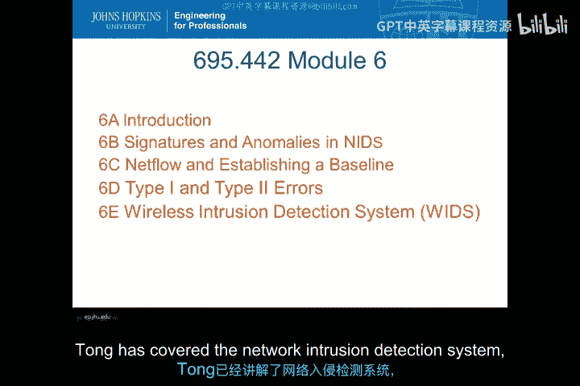

我是 Philip Qing，将为大家介绍本模块的内容。

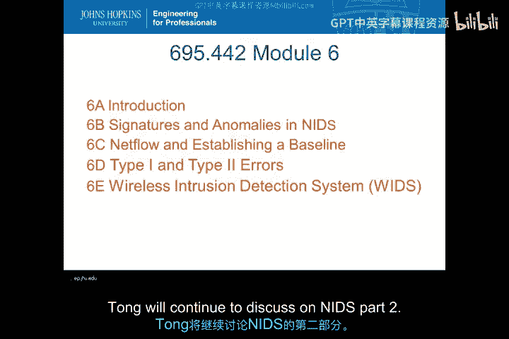

在模块5中，Tong 已经讲解了网络入侵检测系统（NIDS）的第一部分。

在本模块6中，Tong 将继续讨论 NIDS 的第二部分内容。

## 模块6核心主题

本模块将主要覆盖以下几个核心主题：

*   **特征与异常检测**：在 NIDS 中的应用。
*   **NetFlow 与基线建立**：分析网络流量并确立正常行为基准。
*   **I类与II类错误**：在入侵检测中可能出现的误报与漏报。
*   **无线入侵检测系统（WIDS）**：针对无线网络环境的检测技术。

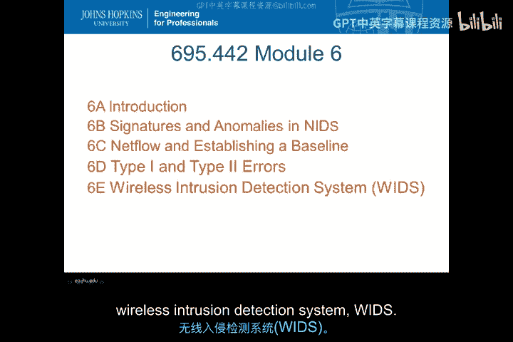

## 特征与异常检测详解

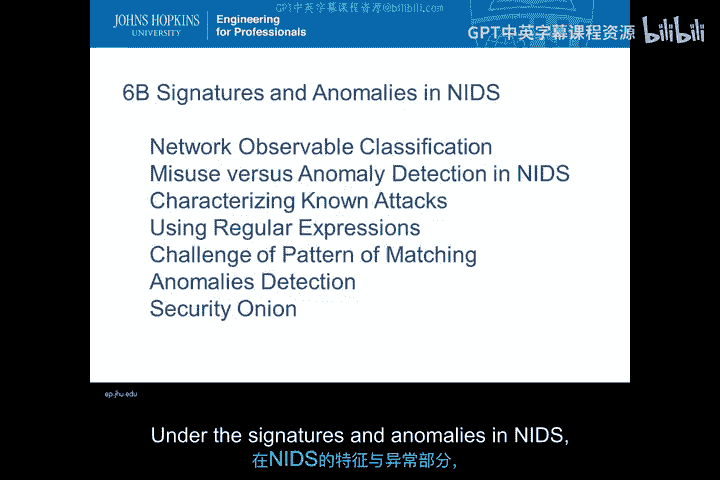

上一节我们介绍了本模块的整体框架，本节中我们来看看第一个核心部分：特征与异常检测。

在 NIDS 中，我们将讨论以下具体话题：

以下是本小节将涵盖的要点：

*   **网络可观测性分类**
*   **误用检测与异常检测在 NIDS 中的对比**
*   **使用正则表达式描述已知攻击特征**
*   **模式匹配面临的挑战**
*   **异常检测与安全洋葱平台**

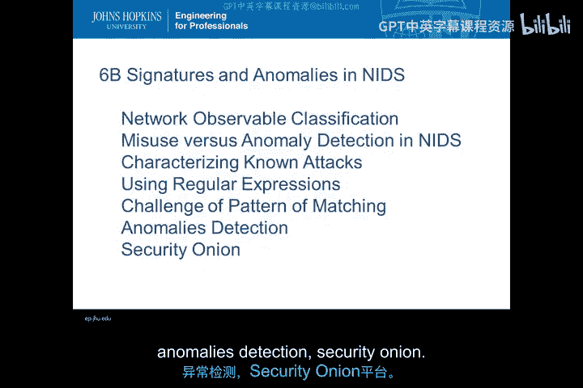

可以看到，模式匹配和正则表达式在检测异常时是紧密结合的。

请特别注意 **安全洋葱（Security Onion）** 平台。

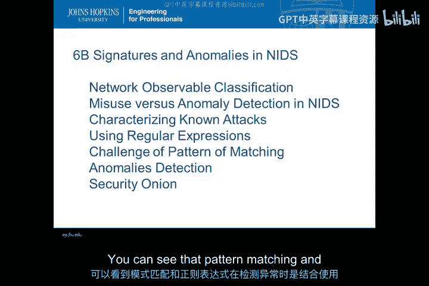

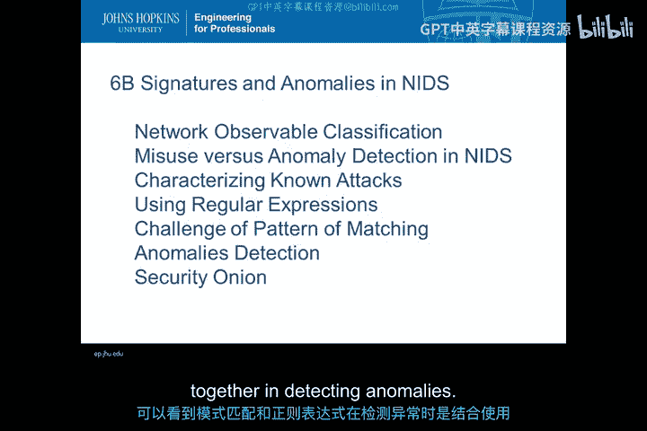

这是一个用于研究入侵检测系统（IDS）的平台。

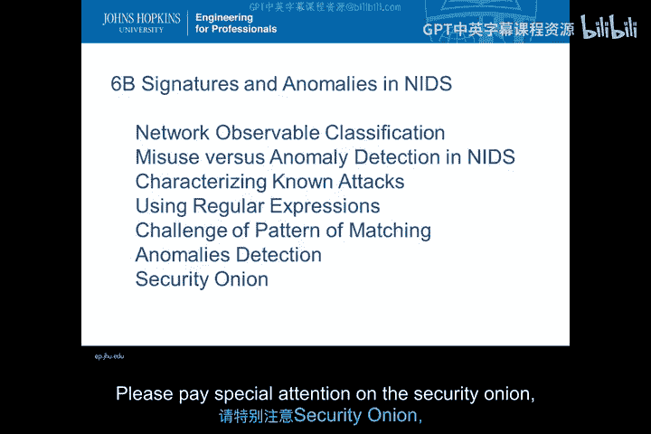

在本课程的作业中，你将需要搭建一个安全洋葱环境并使用它。

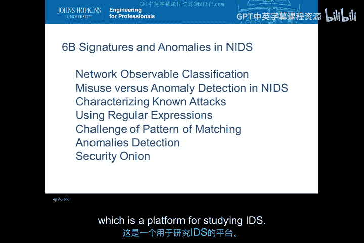

## NetFlow 与基线建立

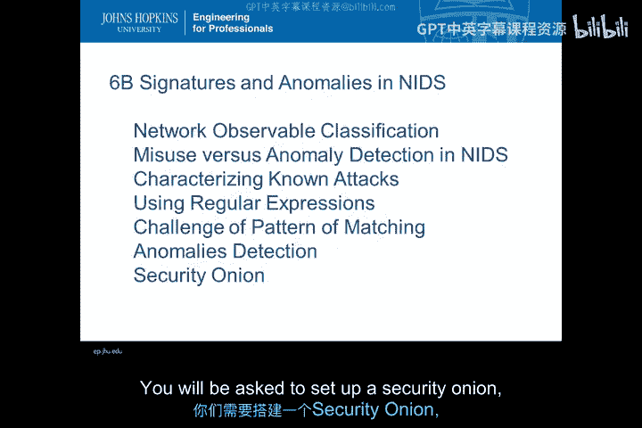

了解了特征与异常检测后，我们转向网络流量分析的基础：NetFlow 与基线建立。

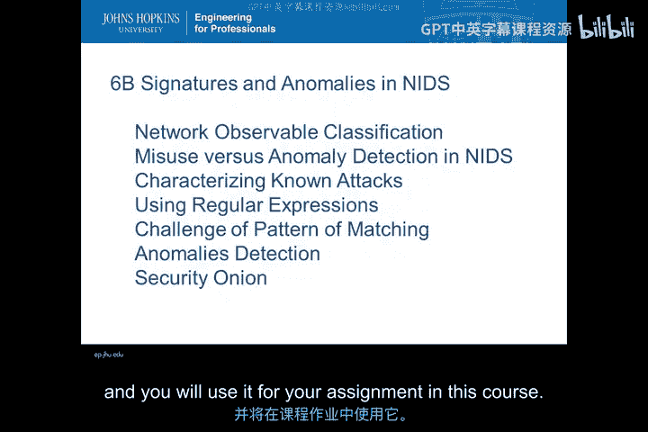

我们将讨论以下话题：

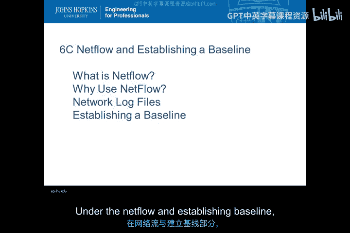

以下是本小节将涵盖的要点：

*   **什么是 NetFlow**
*   **为何使用 NetFlow**
*   **网络日志文件**
*   **如何建立一个行为基线**

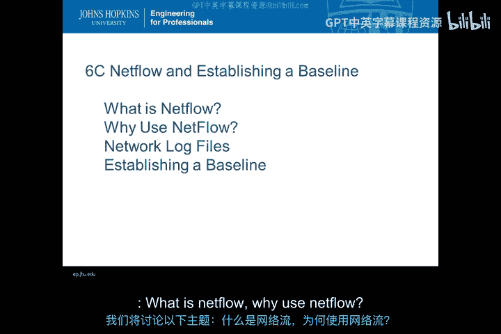

模块6的这一部分重点在于 NetFlow。

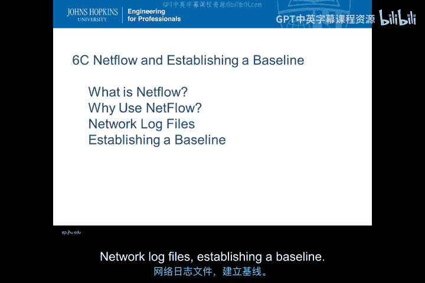

NetFlow 提供了网络流量的摘要信息，可用于发现攻击迹象。

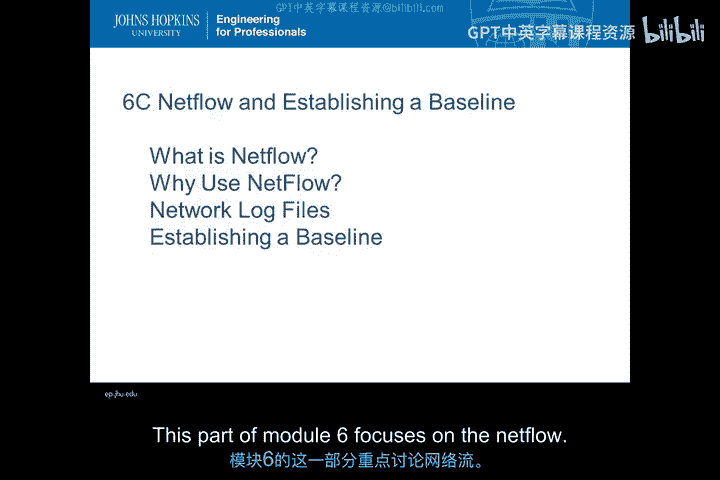

## I类与II类错误分析

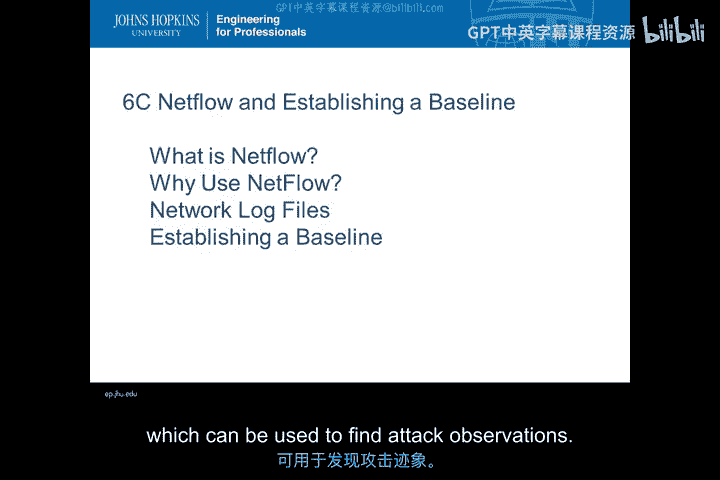

在建立了流量基线并进行分析后，我们必须认识到检测系统并非完美，总会存在误差。本节我们来探讨 NIDS 使用中的 I 类与 II 类错误。

我们将覆盖以下话题：

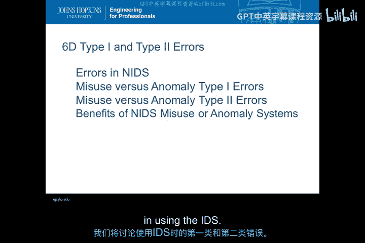

以下是本小节将涵盖的要点：

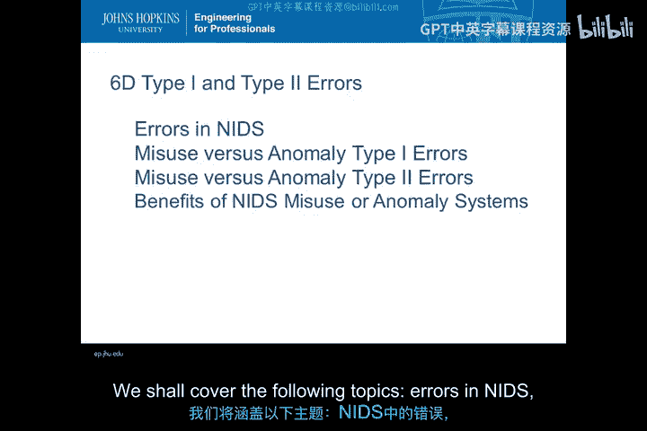

*   **NIDS 中的错误类型**
*   **误用检测与异常检测中的 I 类错误**
*   **误用检测与异常检测中的 II 类错误**
*   **NIDS 误用或异常检测系统的好处**

在使用 NIDS 时，总是存在错误。

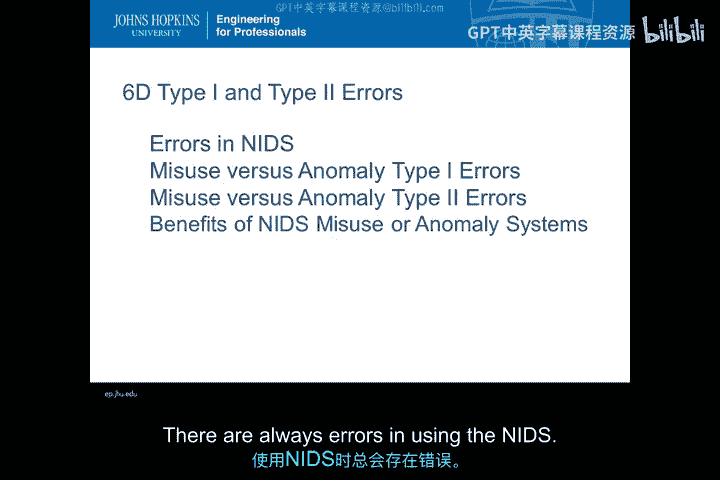

*   **I 类错误** 是指 NIDS 产生的 **误报（False Positive）**。
*   **II 类错误** 是指 NIDS 产生的 **漏报（False Negative）**。

在课程后期，我们将分析与 I 类和 II 类错误相关的内容。

## 无线入侵检测系统（WIDS）

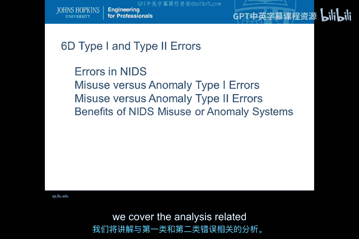

最后，我们将视野从有线网络扩展到无线环境。本节中我们来讨论无线入侵检测系统（WIDS）。

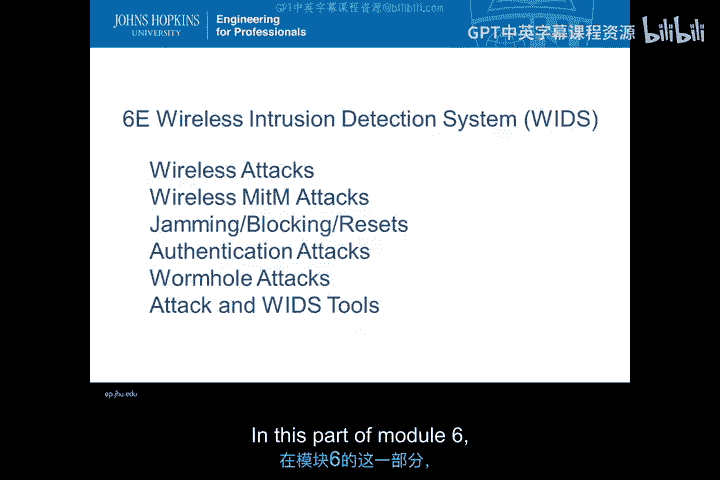

我们将覆盖以下话题：

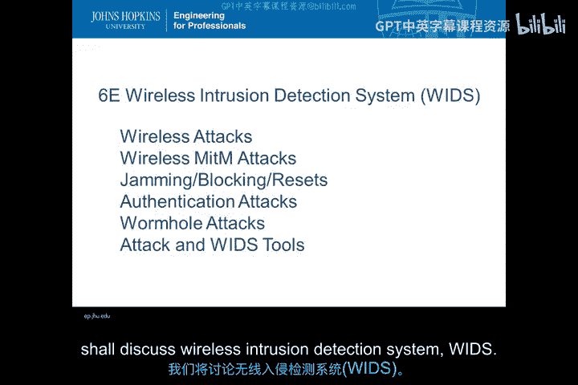

以下是本小节将涵盖的要点：

*   **无线网络攻击类型**
*   **WIDS 中间人攻击**
*   **阻塞攻击**
*   **认证攻击**
*   **虫洞攻击**
*   **攻击与 WIDS 工具**

可以看到，在模块6的这一部分，我们聚焦于新兴的威胁和攻击。

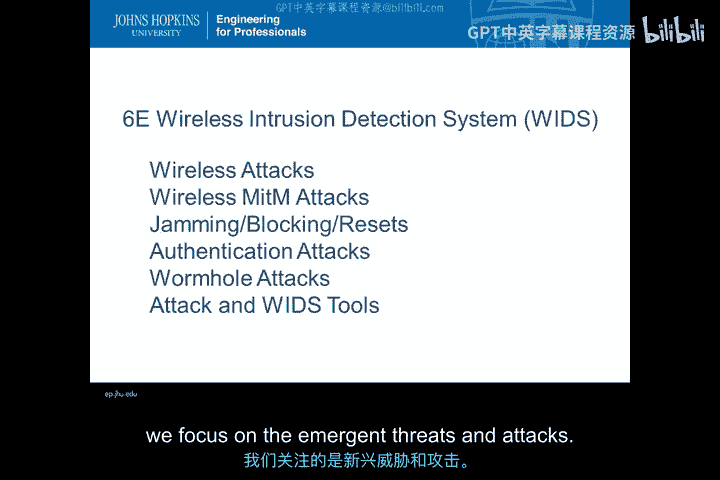

我们可以预见，在 WiFi 市场中将出现更多的安全威胁。

## 课程总结

本节课中我们一起学习了网络入侵检测系统（NIDS）第二部分的导论。我们概述了特征与异常检测的对比、NetFlow流量分析、检测错误类型以及无线环境下的入侵检测挑战。

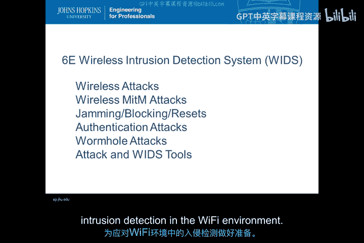

希望大家在本课程中认真学习，为应对无线网络环境中的入侵检测挑战做好准备。

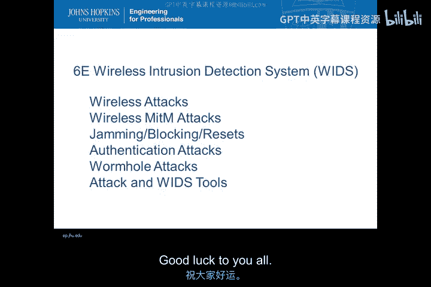

祝大家好运。