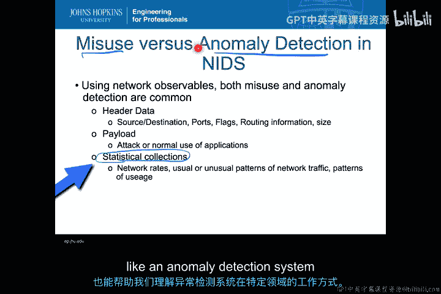
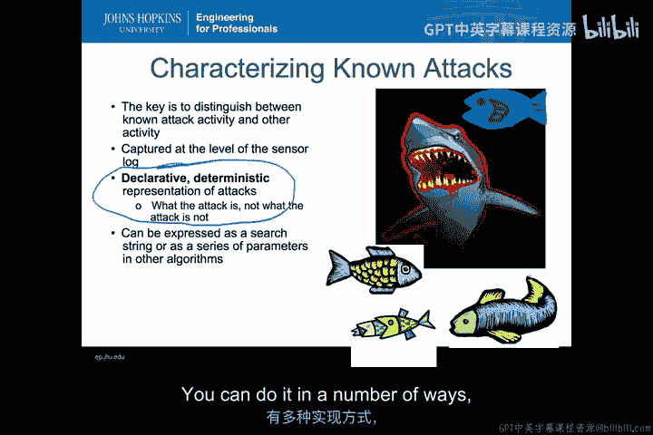
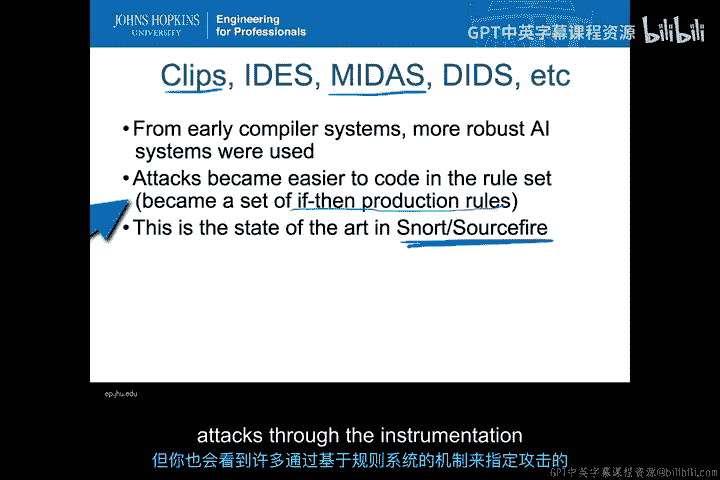
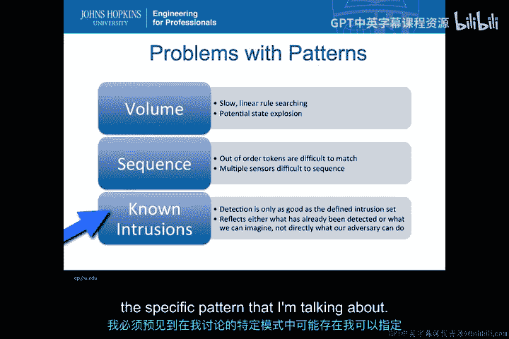
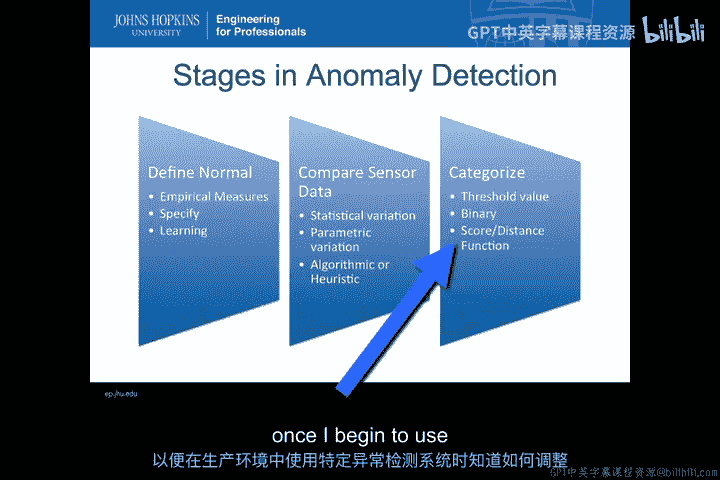
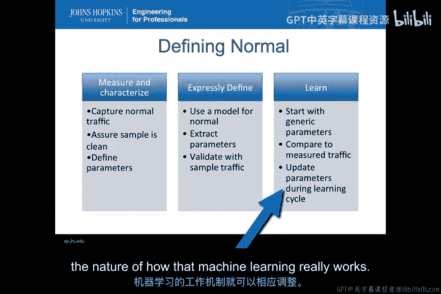
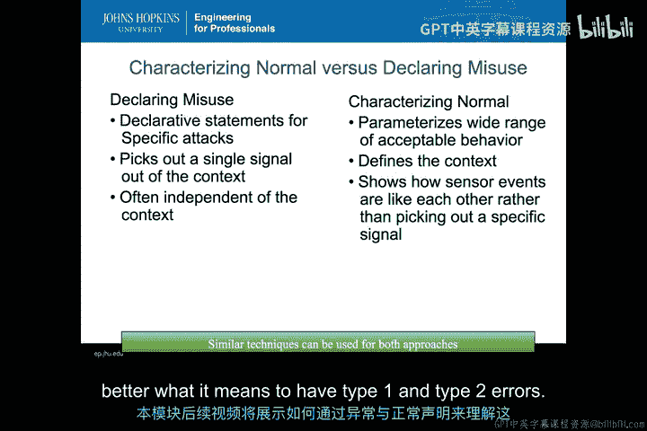
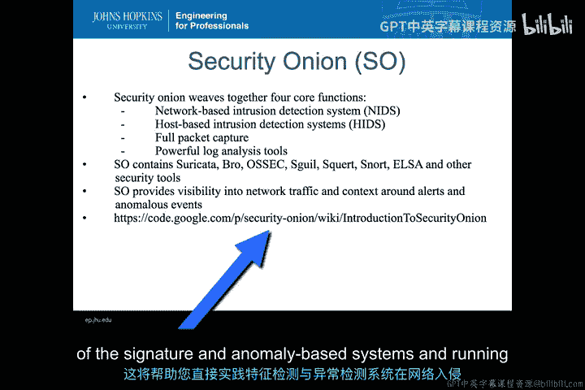

# 023：NIDS中的特征匹配与异常识别 🔍

在本节课中，我们将探讨基于特征的网络入侵检测系统与基于异常的检测系统之间的核心区别。我们将学习它们如何利用网络可观测数据来分类事件，并理解各自的运作原理、优势与挑战。

---

## 概述

网络入侵检测系统依赖于分析网络中的可观测数据。然而，在如何将这些数据分类为“正常事件”或“需要调查的安全事件”时，主要采用两种方法：**基于特征的检测**和**基于异常的检测**。本节我们将深入这两种分类机制的核心。

上一节我们介绍了网络入侵检测系统的基本概念，本节中我们来看看它是如何具体判断一个网络活动是“正常”还是“异常”的。

---

## 基于特征的检测系统 🎯

基于特征的检测系统，也称为误用检测系统，其核心思想是**定义已知的攻击行为**。系统的目标是准确区分已知的攻击活动与其他正常活动。

以下是其工作原理的关键点：

*   **特征的定义**：所有误用检测特征都必须是**声明性**和**确定性**的。这意味着特征会明确地声明“这就是攻击行为”，并且一旦匹配，就毫无疑问地判定为攻击。
*   **特征的表达**：特征可以表达为搜索字符串、一系列参数或任何能够明确描述攻击的表示形式。只要满足声明性和确定性，任何形式的表示字符串都可以。
*   **实现方式**：
    *   **正则表达式**：最直接的方式是使用正则表达式来匹配网络数据包中的特定模式。例如，在数据负载中匹配到特定的字符串序列，可能就表示一次攻击尝试。
    *   **规则系统**：为了处理更复杂的攻击场景，系统会使用基于规则的AI系统。这些规则（例如“如果-那么-否则”的生产规则）将攻击置于特定上下文中，通过组合多条规则来更精确地识别攻击。Snort规则集就是这种方式的典型代表。

然而，基于特征的检测系统也面临一些挑战：

*   **性能与扩展性**：线性匹配大量复杂特征可能导致处理速度缓慢，难以应对高流量网络。
*   **数据包乱序**：网络数据包可能不按顺序到达，这使得编写能够覆盖所有可能序列的特征变得非常复杂。
*   **检测范围局限**：系统的检测能力完全依赖于已定义的特征库。对于未编写特征的新型攻击或恶意软件变种，系统无法识别。

---

## 基于异常的检测系统 📊

与特征检测不同，基于异常的检测系统关注的是**定义正常行为**。其核心定义（引自Matt Bishop）是：异常检测分析系统的一组特征，并将其行为与一组预期值进行比较。

在网络入侵检测的语境下，系统会比较网络特征与网络预期值，以判断观测值是否“异常”。

基于异常的检测系统主要识别三种类型的异常：

1.  **点异常**：指单个事件明显偏离了正常的预期行为。例如，网络流量指标中出现一个远超正常范围的峰值。
2.  **上下文异常**：指一个事件在特定上下文（如时间）下是异常的，但在其他上下文中则正常。例如，在非工作时段出现高强度的内部网络访问。
3.  **集体异常**：指一系列事件组成的序列本身是异常的，尽管其中单个事件可能看起来正常。例如，一个特定的、不常见的网络协议请求序列。

基于异常的检测系统的输出通常是一个**分数**或一个带**置信度**的**标签**，用以表示某个事件偏离“正常”的程度，而不是简单的“是/否”二元判定。

构建一个异常检测系统通常包含三个阶段：

1.  **定义正常**：可以通过指定参数、建立模型，或使用机器学习算法在“干净”的流量数据上学习得到。
2.  **比较数据**：将实时传感器数据与定义的“正常”基准进行比较，寻找统计或参数上的偏差。
3.  **分类结果**：根据比较结果（如分数是否超过阈值）将事件分类为“正常”或“异常”，或直接输出原始分数供进一步分析。

定义“正常”是关键且具有挑战性的一步，必须确保用于定义“正常”的数据集本身不包含攻击，否则攻击也会被系统视为正常。

---

## 特征检测与异常检测的对比 ⚖️

为了更清晰地总结两者的区别：

*   **基于特征的检测**：使用声明性、确定性的规则来**精确定义已知的攻击信号**，旨在从背景噪音中将其挑选出来。它更关注“这是什么攻击”。
*   **基于异常的检测**：通过参数化来**定义广泛可接受的行为范围（即正常上下文）**，然后寻找任何落在此范围之外的活动。它更关注“这看起来与平常有何不同”。

这种根本性的区别，直接影响着系统会产生何种类型的误报和漏报，我们将在后续课程中详细探讨。

---

## 实践工具示例：Security Onion 🧅

一个集成了特征检测与异常检测的典型系统是Security Onion。它是一个功能强大的安全监控发行版，整合了以下核心功能：

*   基于网络的入侵检测系统
*   基于主机的入侵检测系统
*   全流量捕获
*   强大的日志分析工具

具体来说，它包含了Snort（特征检测）、Suricata（特征检测）、Bro/Zeek（协议分析，支持异常检测）和OSSEC（主机检测）等工具。Security Onion提供了一个统一的环境，让安全分析师能够同时获得来自多种检测方法的可见性，从而更全面地理解网络警报和异常事件的上下文。

建议初学者查阅Security Onion的文档和介绍，亲手实践这些特征与异常检测系统，是理解网络入侵检测的绝佳途径。

---

## 总结

本节课中我们一起学习了网络入侵检测系统的两种核心分类方法。**基于特征的检测**通过匹配已知攻击模式来工作，快速准确但无法应对未知威胁；**基于异常的检测**通过建立正常行为基线来发现偏差，能发现新型攻击但可能产生较多误报。理解这两种方法的原理、输出形式（确定匹配 vs. 异常分数）及其各自的优缺点，是设计和评估有效入侵检测策略的基础。现代安全系统（如Security Onion）通常结合两者，以构建更强大的防御体系。