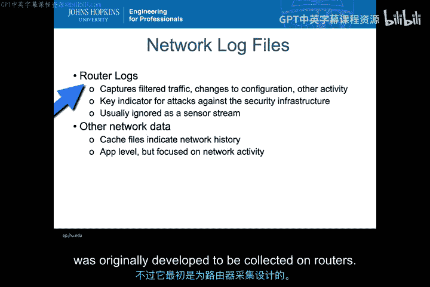
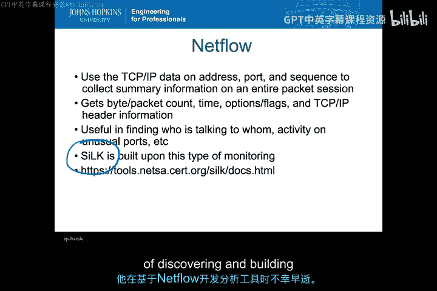
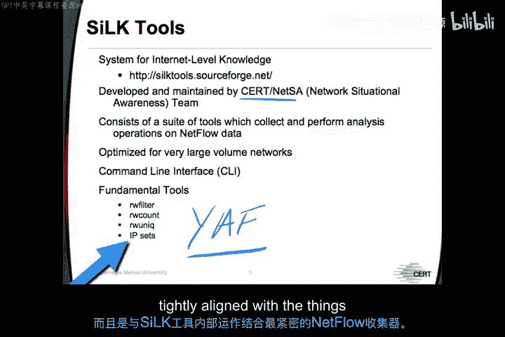
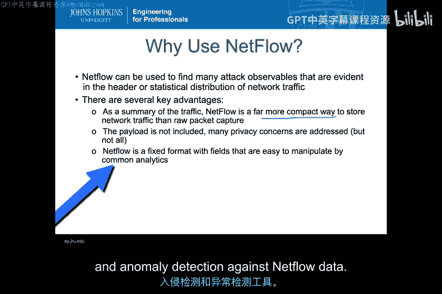
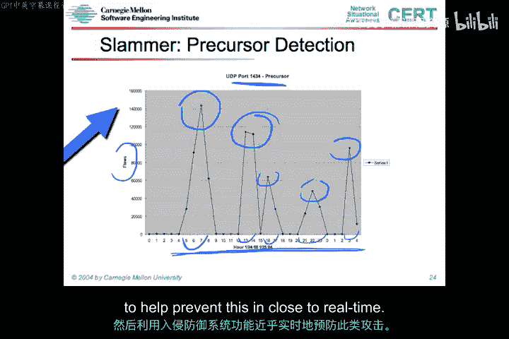
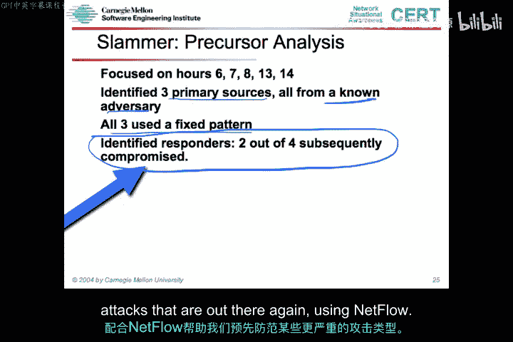
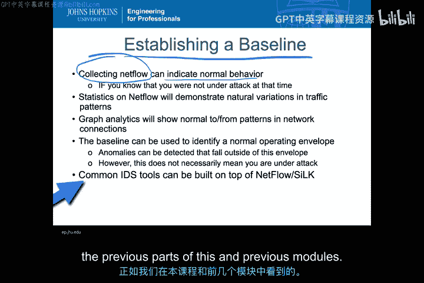

# 024：NetFlow流量分析与基线建立 📊

在本节课中，我们将要学习NetFlow这一重要的网络信息源。NetFlow是一种用于汇总网络连接流量的方法，它结构紧凑，并且包含了多种攻击的可观测指标。我们将深入探讨NetFlow传感器本身、它的用途，以及如何利用NetFlow建立活动基线，进而用于异常检测，以发现各种异常情况，特别是那些具有统计特性、能指示多种攻击类型的异常。

## 什么是NetFlow？🔍

上一节我们介绍了入侵检测系统（IDS）的输入源，其中提到了独立于OSI模型可观测指标的网络日志文件。NetFlow就属于这类日志文件。

NetFlow本质上是路由器日志，它记录了过滤后的流量、配置更改以及路由器内部的其他活动。其中一种被创建的日志文件就是NetFlow日志文件，最初是为了财务审计而开发的，目的是为了解如何按流量计费。因此，它是对流量的汇总，必要时可以回溯到计费方案。这是一种特殊类型的网络日志文件，专门指示流经路由器等网络设备的各类流量。

除了路由器，你也可以在单个主机上收集NetFlow数据，但它最初是为在路由器上收集而开发的。

NetFlow是对网络流量的**汇总**，而不是基于单个数据包。它基于**连接数据**，关注地址、端口和序列，收集整个会话的摘要信息。你可以获得数据包计数、时间、选项以及在整个TCP/IP会话中通用的各种头部信息。

那么，什么是会话？例如，当你连接到电子邮件服务发送一封邮件时，会有一个启动协议握手、数据传输和关闭序列的过程。所有这些都被汇总在一个单一的NetFlow记录中，该记录说明：从特定地址到特定地址，在这些特定端口上，发生了多大流量、持续了多长时间的通信活动。

由此可见，NetFlow非常有助于发现：
*   哪个IP地址在与哪个其他IP地址通信。
*   哪个源地址在与哪个目的地址通信。
*   由于提供了端口号，还可以了解通信涉及哪些端口。

## NetFlow分析工具：Silk 🛠️

围绕NetFlow的收集和处理，开发了许多有用的工具。这里我们将主要关注一个名为**Silk**的工具。它并非唯一存在的工具，但它是专门为网络监控和入侵检测而开发的一类工具。

Silk实际上是以NetFlow分析创始人Suresh Kondaa的名字命名的（他的邮箱是slk@cert.org）。在他不幸去世时，他正在基于NetFlow发现和构建分析工具，Silk的创建就是为了纪念他。

Silk的全称是“系统级互联网知识”（System for Internet-Level Knowledge），这是后来为Silk设定的名称。它由位于宾夕法尼亚州匹兹堡的CERT网络态势感知团队开发并维护。该团队围绕NetFlow开发了Silk工具，旨在洞察大规模互联网活动，对于理解网络蠕虫和大规模攻击非常有效。这是一种汇总数据的方式，比捕获独立数据包能处理的数据量要大得多。

Silk本身是一套工具集，而不是单一工具。这套工具集既能收集也能分析NetFlow数据。这些工具可以根据所有不同的头部信息进行分类和组织，可以在NetFlow收集的大量数据上生成图表和统计数据，并能真正为你提供图表和对基线活动的理解，这正是你想要输入到基于异常的NIDS中的信息。

这些工具针对大容量网络进行了优化，例如整个`.mil`基础设施的DISA，国土安全部在整个美国民用政府中使用它。它们并非花哨的图形界面工具，基本上是运行在Unix、Linux和各种BSD变体上的命令行界面工具。命令行界面允许数据在工具集内各个独立工具之间灵活移动。

Silk工具集的理念是在Unix系统中运行，并拥有许多小型、有组织的工具来处理数据，这些数据既可以是压缩的二进制格式，也可以是常规的NetFlow格式。

以下是其核心工具：
*   **`rwfilter`**：根据特定特征或正则表达式过滤所有NetFlow数据。
*   **`rwcount`**：对于某个范围内的所有地址或某种类型的所有端口号，仅返回包含这些特定参数的记录数量。
*   **`rwuniq`**：遍历整个数据集，显示所有唯一的源-目的IP地址、端口号组合，以隔离出那些更不寻常的条目。
*   **`rwset`**：根据NetFlow数据本身维护的各种IP地址，对所有NetFlow数据进行分类。这对于输入到各种图分析中非常有用，你可能希望在整个收集的NetFlow数据集中连接源端口和目的端口。

在基础工具中，还有一个非常重要的工具 **`yaf`**（Yet Another Flowmeter）。它实际上是另一个流收集器，是与Silk工具内部工作结合最紧密的NetFlow收集器。

## NetFlow数据详解 📄

根据《Silk分析手册》第2章的定义，网络流收集与直接数据包捕获有本质区别。它不是像TCPdump那样试图提供所有数据的直接数据包捕获，而是构建了源和目的地之间通信的摘要。摘要部分非常重要，因为它提供了一种压缩形式，同时没有丢失你希望从各个数据包的头部信息中获得的内容。

从定义中可以看到一些相关的关键字段：源和目的IP地址、源和目的端口、协议、服务类型、路由器接口等。这些属性构成了**流标签**，用于理解记录的流标签。源和目的地址、端口和协议是这些数据的关键，在NetFlow中有时被称为**五元组**。这些信息连同NetFlow数据的时间戳，将不同的流区分开来，并允许基于唯一活动或异常活动的识别进行各种处理。

网络流在大多数情况下显然覆盖多个数据包。如果只是单个数据包，那么你收集的又只是流经网络的通用数据的常规TCPdump。这些基本上都是在一个公共流标签下收集的多个数据包。流标签指的就是五元组。因此，五元组是汇总在单个记录中的所有多个数据包的公共流标签。对于持续时间很长的连接，这可以压缩成一个非常紧凑的表示形式，准确描述该流的实际情况。

关于NetFlow最重要的一点是，它**不包含数据包的有效载荷数据**。这一点很重要，因为任何仅在数据包有效载荷内部才能观察到的指标，都无法通过NetFlow IDS观察到。当你说使用NetFlow作为信息源可以检测哪些类型的攻击时，这是一个需要牢记的极其重要的点。

## 为何使用NetFlow？🤔

既然没有有效载荷数据，为什么还要使用NetFlow？如果得不到有效载荷，使用它还有什么意义？

有许多攻击的可观测指标仅体现在头部信息或网络流量的统计分布中。而这正是你从NetFlow传感器中获得的主要内容。因此，NetFlow的关键优势在于：
1.  **流量摘要**：它是对流量的汇总，远比原始网络流量本身紧凑得多。
2.  **解决部分隐私问题**：由于不包含有效载荷，解决了一些隐私顾虑。有些组织不希望存储任何收集内容中的有效载荷部分，主要是出于隐私考虑。但并非所有隐私问题都得到解决，连接元数据本身就能透露大量关于个人通信活动的信息。IP地址、源地址、目的地址通常可以指示进行活动的个人身份。因此，仅从收发地址，你就能获得大量关于个人在网络中所做事情的信息。所以，通过仅收集NetFlow，你能够限制对内容的窥探，但这并不能真正解决所有的隐私问题。
3.  **固定格式，易于操作**：正如我们之前所说，NetFlow是一种固定格式，字段易于操作，在所有网络接口和所有公开可用的工具中通用，这些工具可用于对NetFlow数据进行各种分析、入侵检测和异常检测。

## NetFlow应用实例：检测攻击与先兆 🚨

接下来，我们看看可以利用NetFlow数据做些什么。由于从NetFlow获得的数据提供了大量平均流量信息，几乎所有能用常规流量分析做的事情，都可以用NetFlow数据来完成。

例如，你可以看到正常流量处于某个较低范围，而某些流量则呈现峰值，看起来像是当前一天中可能看到的个别活动。但右边有一个有趣的流量分布，显示流量急剧上升，随后在同一时间持续涌入。平均比特数（如下方的绿线所示）升高并保持高位。这在某些DDoS攻击中非常常见。

因此，你可以看到，可以利用NetFlow这类信息轻松区分正常行为和DDoS行为。

然而，将NetFlow用于此目的的一个限制是：**将NetFlow传感器放在哪里？** 如果我将NetFlow传感器放在更上游的位置，以便聚合更多流量，那么我刚才看到的同一个攻击就可能被淹没在所有正常活动中。因此，在最初单个站点很明显的情况，当聚合到ISP基础设施的更上游时，就消失了。当然，我可能仍然可以运行额外的工具来分离出该攻击，但使用与本地理解平均行为相同的分析方法，在流量层面本身就不会那么明显。

关键在于，如果我决定在工作日期间采用平均行为，并将阈值设定在某个范围，比如在工作日阈值设在这里，在周末将阈值降低到这里，那么可以看到，这个流量并没有以任何方式超过我的阈值。因此，在这个特定水平上的阈值实际上无法识别我希望发现的（即此区域的DDoS攻击），而在前一种情况下，我可以轻松地设定一个阈值来实现这一点。

有许多很好的例子说明如何利用NetFlow数据轻松观察各种端口和流量的DDoS攻击。例如，这是产生的Slammer蠕虫流量。Slammer是在一个非常特定的时间点爆发的蠕虫之一，流量达到非常高的水平，然后很快结束。这仅从检测的角度来看是有趣的。

但利用NetFlow数据能做的，不仅仅是查看流量是否超过阈值，并以此来判断是否遭受攻击。在这种情况下，端口1434是网络流量的一个特定特征，我们可能希望回顾历史数据，看看在这个特定端口上是否存在此次攻击的先兆，这些先兆可能表明对Slammer蠕虫的测试或前期活动。

如果我们能识别出这样的先兆，那将非常重要。因为如果我们能识别先兆，就可以在此类攻击发生之前采取行动，在更高级别的ISP处进行限制或缓解，从而减轻其对实际受攻击端点的影响。那么，让我们使用NetFlow来看看这些先兆。

这里是攻击发生前的几个小时。首先注意到，这些流比上一张幻灯片中讨论的UDP端口（相同端口）的流要小得多，但这些现在是先兆。现在，我看到了这种有趣的多个峰值模式。它们都是小得多的峰值，但呈现出相似的规律，看起来像是蠕虫想要发起攻击的某种测试。

因此，如果我知道这是我所预期的蠕虫先兆的特征，我就可以对此活动发出警报，并在端口1434上出现之前那个巨大峰值之前，采取某种预防措施。这里的重要元素在于，这不是我会看到的正常流量。它本身并不危险，因为这些数字、这些水平并不高。所以这不是危险的DDoS流量。但作为先兆，它告诉我们一些可能正在发生的事情（在这个案例中是相当不寻常的端口1434），我们可能会开始认为这违反了正常流量，并且可能是更严重事件的先兆。

我们能否在ISP上游设置一个自动阻断规则，以防止我们的系统真正被拖垮？这些正是NetFlow可以真正开始建立的基线问题，你可以将其加载到IDS、基于异常的IDS中，然后利用IPS功能来近乎实时地防止此类事件。

## 先兆分析深入 🔬

在先兆分析中，我们特别关注三个主要来源，它们都来自一个已知的对手。这一点很重要，因为我们可以使用基于信誉的服务来识别已知的对手来源。

这三个主要来源都来自一个已知的对手，使用一种不寻常的固定模式。因此，这些被识别的响应者，是对我们基础设施中哪些部分会响应此类Slammer蠕虫的测试。

现在，IDS可以汇集大量信息，以便准备采取某种预防措施。我们有一个信誉服务告诉我们存在已知对手。我们有一个可以识别的固定行为模式，并且我们可以识别可能参与此次特定攻击设置的内部受害者。这些都是非常有用的模式，可以放入异常检测系统中，帮助我们提前应对一些更严重的攻击，同样，这是利用NetFlow实现的。

## 总结 📝

本节课中我们一起学习了如何利用NetFlow收集轻松建立基线，以指示正常行为。只要确保在创建正常行为基线时没有遭受攻击，你就可以利用NetFlow的这些统计数据，利用流量模式的自然变化，来寻找你想要发出警报的各类异常。

你可以利用各种图分析来展示正常的流量模式。这将帮助你更好地理解攻击先兆可能是什么样子，并识别出可以开始采取预防措施的事项，利用NetFlow数据创建网络基线。

这实际上创建了我们所谓的**正常运行范围**。检测到的异常落在此范围之外。这并不一定意味着超出范围就总是遭受攻击，也不一定意味着范围内的所有活动都不是攻击。当我们涉及到第一类和第二类错误时，你会看到基于此方法未能识别攻击的不同方式，可以轻松识别不同的错误类别。

然而，这仍然是一种优秀的方法，可以在NetFlow之上构建常见的IDS工具，或者使用Silk工具作为构建基线和警报的一种方式，这些信息可以输入到Snort规则、Suricata和Bro模块，以及其他任何支持基于统计的异常检测系统的IDS中，正如我们在本课程和之前模块的一些部分中所看到的那样。