# 025：I类与II类检测误差 🔍

在本节课中，我们将要学习网络入侵检测系统中的两类关键误差：I类误差（误报）和II类误差（漏报）。我们将探讨它们在误用检测和异常检测系统中的不同表现，并了解混合系统如何结合两者的优势。

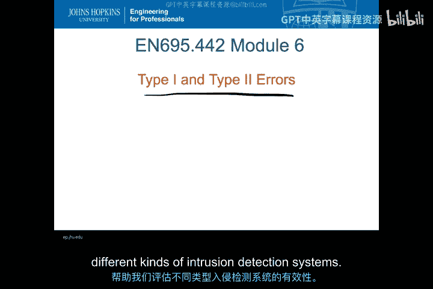

---

## 检测误差的基本概念

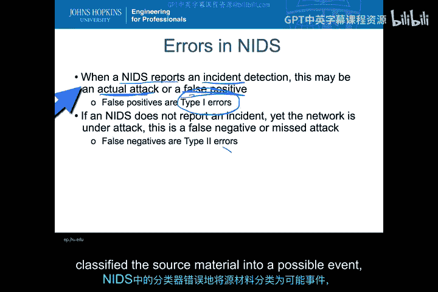

上一节我们介绍了异常检测系统的基本原理。本节中，我们来看看当检测系统做出判断时，可能出现的两种基本误差类型。

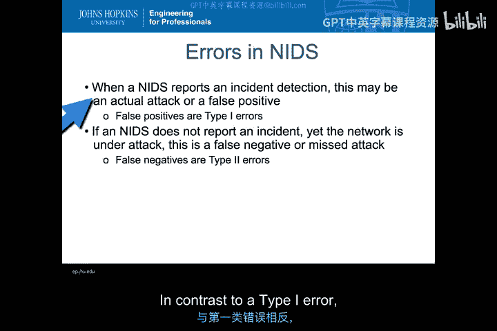

当NIDS报告一起事件时，存在两种可能的结果：
*   **实际攻击**：系统正确检测到了攻击。
*   **误报**：系统报告了一起事件，但事实上并非攻击，只是正常行为。这被称为分类器中的 **I类误差**。

当NIDS**没有**报告事件时，同样存在两种可能的结果：
*   **实际攻击**：网络实际上正在遭受攻击，但系统未能检测到。这被称为**漏报**或 **II类误差**。
*   **正常行为**：系统正确地将正常行为归类为正常。

因此，NIDS的检测结果可以归纳为以下四种情况：
1.  I类误差（误报）
2.  正确检测到攻击
3.  II类误差（漏报）
4.  正确识别正常行为

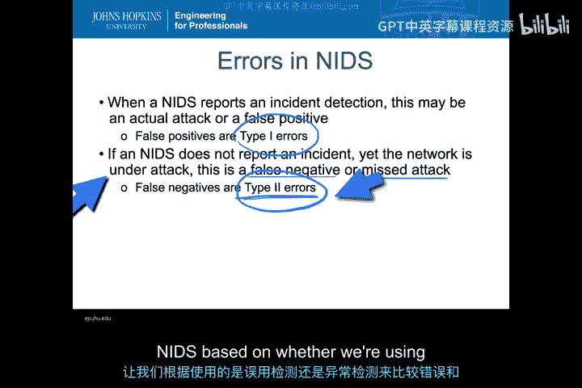

---

## 误用检测与异常检测的误差对比

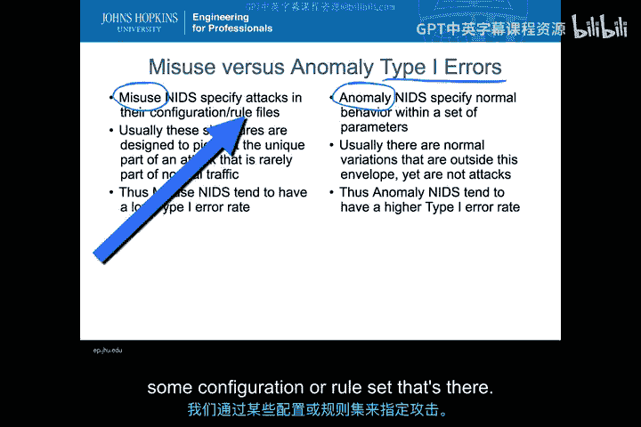

现在我们已经了解了这两类误差，接下来让我们比较一下它们在误用检测系统和异常检测系统中的不同表现。

### I类误差（误报）对比

以下是关于I类误差在两种系统中的表现：

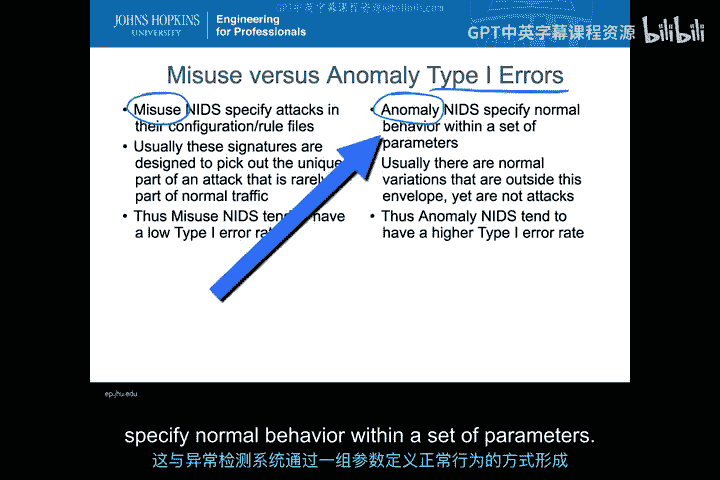

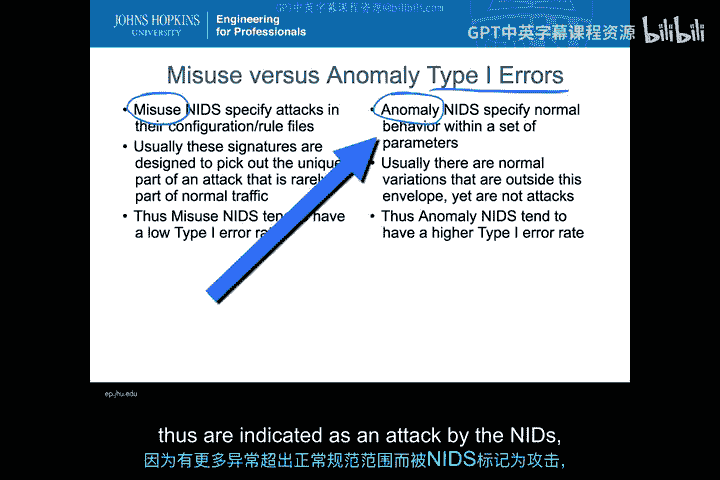

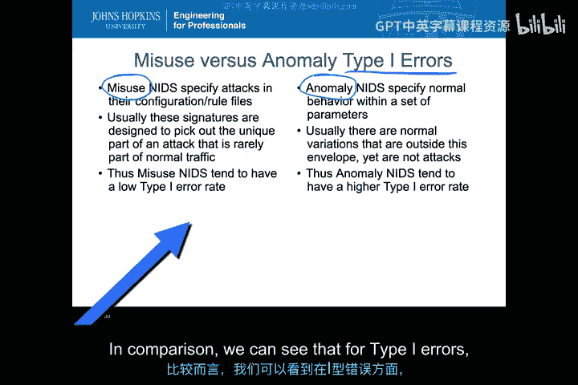

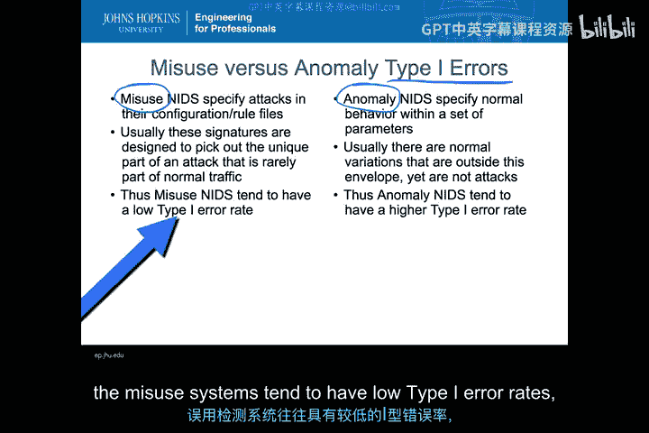

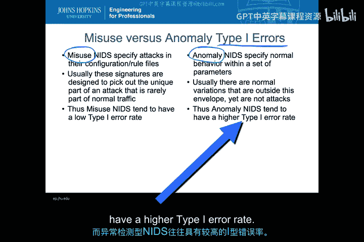

*   **误用检测系统**：这类系统通过预定义的规则或特征集来指定攻击。这些特征通常被设计为捕捉攻击中**罕见**出现在正常流量中的独特部分。因此，误用检测NIDS的 **I类误差率通常很低**，即很少在无攻击时误报。
*   **异常检测系统**：这类系统通过一组参数来定义正常行为。由于正常用户行为经常变化，许多超出“正常范围”的变异会定期发生。因此，异常检测NIDS的 **I类误差率往往较高**，会有更多误报，因为许多被标记为攻击的异常实际上并非攻击。

**总结**：在I类误差方面，误用系统通常具有较低的误差率，而异常检测系统则具有较高的误差率。

---

### II类误差（漏报）对比

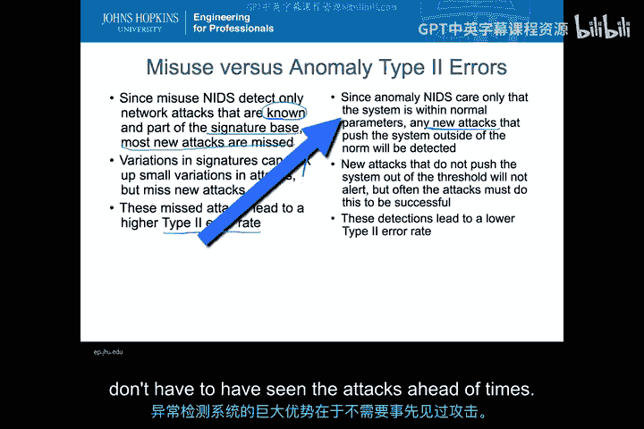

上一节我们比较了I类误差，本节中我们来看看II类误差的情况。

以下是关于II类误差在两种系统中的表现：

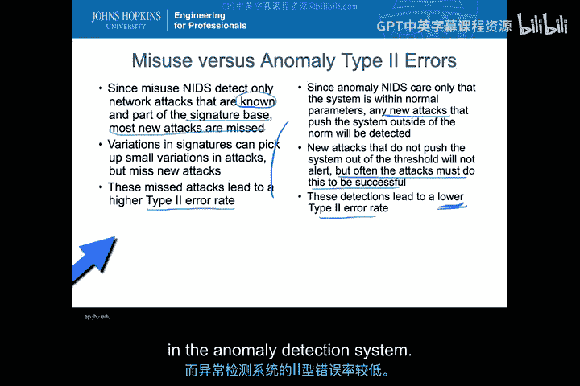

*   **误用检测系统**：这类系统只能检测已知的网络攻击。对于大多数新的攻击（如零日攻击）或特征库更新后出现的攻击变种，系统往往会**漏报**。这导致了 **较高的II类误差率**。
*   **异常检测系统**：这类系统只关心行为是否超出正常参数，不关心具体原因。因此，**无需事先了解攻击**，只要攻击行为改变了系统状态并使其偏离常态，就会被检测到。这使得异常检测系统对新型攻击的检测能力更强，从而带来 **较低的II类误差率**。

**总结**：在II类误差方面，情况正好相反：误用系统具有较高的误差率，而异常检测系统具有较低的误差率。

---

## 混合检测系统

前面的对比展示了误用和异常检测各自的优缺点。那么，如果我们将两者结合在一个系统中会怎样呢？大多数现代系统（如Snort、Bro、Suricata）都是混合了误用和异常检测的混合系统。

混合系统的误差特性更接近于异常检测系统：
*   **I类误差率仍然较高**，因为系统仍会像异常检测部分那样发出警报。
*   **II类误差率较低**，同样得益于异常检测部分的能力。

既然误差率相似，为何要使用混合系统？关键在于 **检测准确性**。
*   误用系统不仅I类误差低，而且其检测到的攻击**准确性很高**。
*   异常检测系统虽然II类误差低，但由于I类误差高，其**准确性相对较低**。
*   混合系统在保持异常检测系统低II类误差率的同时，通过误用检测部分（特征匹配）**提高了警报的准确性**。当特征匹配命中时，可以非常确定地识别出特定攻击。

因此，混合系统试图结合两种检测方式的优点，在整体上优化性能。它比纯异常检测系统能更好地检测已知攻击，同时保留了检测未知攻击的潜力。

---

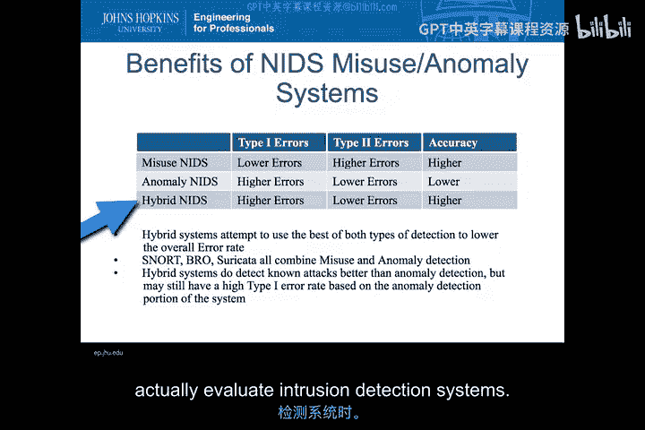

本节课中我们一起学习了入侵检测系统中的I类误差（误报）和II类误差（漏报）。我们比较了它们在误用检测和异常检测系统中的不同表现：误用检测**低误报、高漏报**；异常检测**高误报、低漏报**。最后，我们了解到混合系统通过结合两者，在保持对未知攻击检测能力的同时，提高了对已知攻击检测的准确性。我们将在后续课程中继续运用这些概念来评估入侵检测系统的效能。